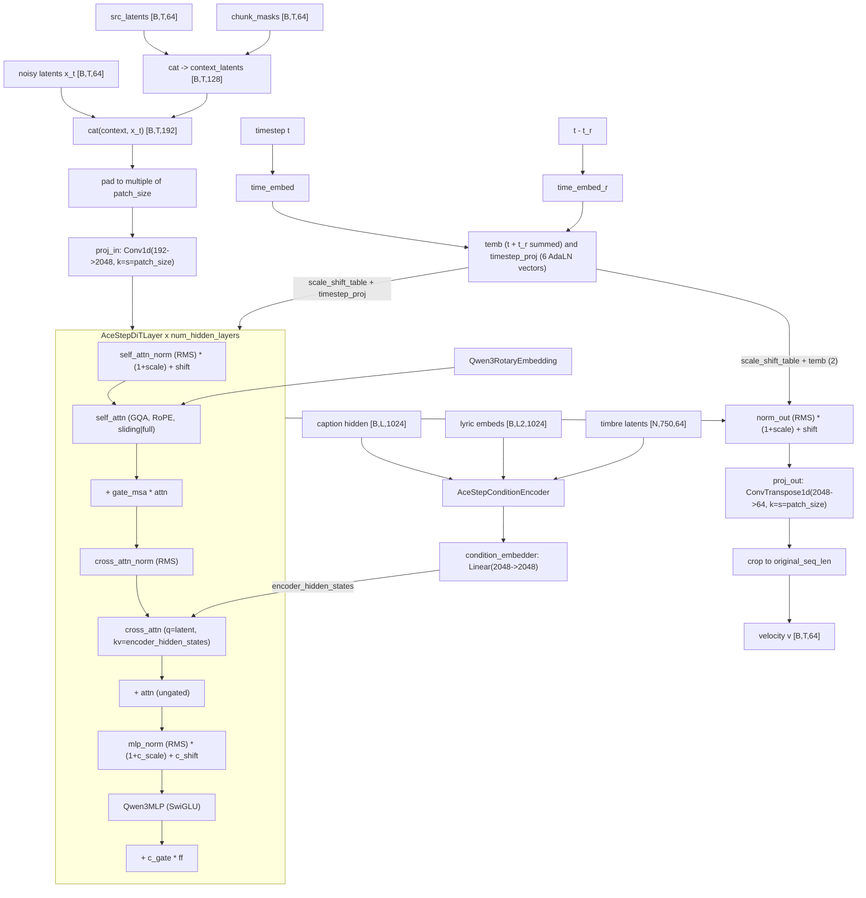

# ACE-Step 1.5 (`acestep`)

Text-and-lyrics conditioned music generation: a 2 B rectified-flow audio DiT
(`AceStepConditionGenerationModel`, vendored) over **temporal-only** latents
`[B, T, 64]` produced by an Oobleck (stable-audio) VAE at 48 kHz stereo — no
spatial axis anywhere, which is what separates it from every image/video arch in
this repo. Two further structural oddities: the denoiser's input is a
**channel-wise concatenation** of the noisy latent with a 128-channel *context*
(source latents + chunk masks), so `in_channels` is 192 for a 64-channel latent
space; and the sampling loop is **vendored model code** (`generate_audio`), not a
SushiUI sampler — the turbo checkpoint is CFG-distilled and runs one forward per
step off a discrete distilled timestep table (8 steps by default; any other
`inference_steps` value builds a schedule that is snapped onto that table).

## Components

| Role | Class | Module | Notes |
|---|---|---|---|
| Denoiser wrapper (encoder + tokenizer + DiT + null cond) | `AceStepConditionGenerationModel` | `core.models.acestep.vendor.modeling_acestep_v15_turbo` | vendored (`backend/core/models/acestep/vendor/`). Owns `.decoder`, `.encoder`, `.tokenizer`, `.detokenizer`, `null_condition_emb`, and the inference loop `generate_audio` |
| Diffusion transformer | `AceStepDiTModel` | same module | vendored. `.layers` = `num_hidden_layers` × `AceStepDiTLayer` |
| DiT block | `AceStepDiTLayer` | same module | vendored. AdaLN self-attn + plain-residual cross-attn + AdaLN MLP |
| Attention | `AceStepAttention` | same module | vendored. GQA (`num_attention_heads` / `num_key_value_heads`), q/k RMSNorm, alternating sliding/full per `config.layer_types` |
| Encoder block (lyrics / timbre / pooler / detokenizer) | `AceStepEncoderLayer` | same module | vendored. Bidirectional self-attn + `Qwen3MLP` |
| Condition encoder | `AceStepConditionEncoder` | same module | vendored. `text_projector` + `lyric_encoder` + `timbre_encoder`, packed into one sequence by `pack_sequences` |
| Lyric encoder | `AceStepLyricEncoder` | same module | vendored. `embed_tokens` is an `nn.Linear(text_hidden_dim, hidden_size)` — it consumes **pre-computed embeddings**, and `forward` asserts `input_ids is None` |
| Timbre encoder | `AceStepTimbreEncoder` | same module | vendored. `special_token` CLS-style aggregation over packed reference-audio latents; `unpack_timbre_embeddings` scatters back to batch |
| Audio tokenizer (FSQ) | `AceStepAudioTokenizer` (+ `AttentionPooler`) | same module | vendored; quantizer is `ResidualFSQ` from the third-party `vector_quantize_pytorch` (`dim=fsq_dim`, `levels=fsq_input_levels`, `num_quantizers=fsq_input_num_quantizers`). Only used for the cover / LM-hint path (`is_covers`) |
| Audio detokenizer | `AudioTokenDetokenizer` | same module | vendored. Expands each pooled token back into `pool_window_size` patches |
| Timestep embedding | `TimestepEmbedding` | same module | vendored. Sinusoidal → MLP → `time_proj` producing 6 AdaLN vectors |
| VAE | `AutoencoderOobleck` | `diffusers` | Not vendored. Built from `ACESTEP_VAE_CONFIG`; checkpoint keys remapped by `core.models.acestep.vae_convert.convert_oobleck_state_dict` |
| Text encoder | `Qwen3Model` | `transformers` | Built from `ACESTEP_TEXT_ENCODER_CONFIG` (Qwen3-Embedding-0.6B tier). Serves BOTH the caption (full forward) and the lyrics (`embed_tokens` lookup only) |
| Tokenizer | `AutoTokenizer` | `transformers` | Resolved by `_resolve_qwen3_tokenizer_source`: sibling directory probe, else `QWEN3_EMBEDDING_TOKENIZER_HUB_ID` |
| Scheduler | *(none)* | — | The timestep schedule is a table inside `AceStepConditionGenerationModel.generate_audio`; training drives `t` from `trainer.timestep_sampler` (`core.training.ops.acestep_ops.train_step`) |
| Sampler-side correction | `DCWCorrector` | `core.models.acestep.vendor.dcw_correction` | vendored; `generate_audio`'s own default is `dcw_enabled=True`, and every generation call in this repo passes `False`. Lazy `pytorch_wavelets` import via `dcw_loader`; primitives in `dcw_primitives` |
| Quantized Linear | `Int8Linear` / `Fp8Linear` | `core.models.ideogram4.vendor.{int8_linear,fp8_linear}` | Shared, not ACE-Step-specific; swapped in by `loader._swap_quantized_linears` |

## Load path

Entry: `core.models.acestep.loader.load_acestep_from_path`, wrapped by
`ModelLoader.load_acestep_from_path` (`backend/core/model_loader.py`) and
dispatched from `ModelLoader.load_from_diffusers` when
`model_type == "acestep"`.

Layout detection is `detect_acestep_layout`. It accepts exactly one tree shape,
the flat ComfyUI-style one:

```
<root>/diffusion_models/acestep_v1.5_{turbo,sft,base}.safetensors
<root>/vae/ace_1.5_vae.safetensors
<root>/text_encoders/qwen_0.6b_ace15.safetensors
```

addressed either as the root directory or as the DiT `.safetensors` itself
(the function walks up parents looking for a `diffusion_models/` sibling).
File selection inside each subdirectory is `_find_first` over
`ACESTEP_DIT_PATTERNS` / `ACESTEP_VAE_PATTERNS` / `ACESTEP_TE_PATTERNS`, falling
back to the first `*.safetensors` present. There is **no diffusers-directory
layout and no sharded layout**: a missing `vae/` or `text_encoders/` file raises
from `load_acestep_from_path`, and anything that is not this tree returns `None`
from the detector and raises `ValueError`.

Arch-type detection lives in `ModelLoader._looks_like_acestep_dir`, called from
`ModelLoader.detect_model_type`'s **directory** branch only — a bare DiT
`.safetensors` handed to `detect_model_type` is not classified as `acestep`, even
though `detect_acestep_layout` itself would accept it. The probe is: exact
filename match against `ACESTEP_DIT_PATTERNS`, plus a header-only safetensors
metadata check (`modelspec.architecture` / `model_type` == `"acestep"`) so a
locally quantized re-export under a user-chosen filename is still recognised
without loosening to a glob (which would collide with Anima's identically shaped
tree).

Per-component build:

* `_build_dit` — instantiates from `ACESTEP_DIT_CONFIG` (there is no
  `config.json` in the distribution), casts to `torch_dtype` **before** the load,
  then loads `strict=True`. Weight-only quantized flavours are handled first:
  `quantized_state_dict_report` / `scaled_quantization_report` /
  `cast_float8_tensors` / `verify_quantized_swap`
  (`core.models.common.quantized_checkpoint_guard`) around
  `_swap_quantized_linears`, which detects int8 and fp8 **independently**
  (`is_int8_state_dict` / `is_fp8_state_dict`) because the int8 export tool emits
  mixed files. A swapped model loads `strict=False` and is then re-checked for
  missing/unexpected keys.
* `_build_vae` — `AutoencoderOobleck(**ACESTEP_VAE_CONFIG)` +
  `convert_oobleck_state_dict` (stable-audio `nn.Sequential`-index names →
  diffusers names, plus `Snake1d` `alpha`/`beta` reshape `(C,)` → `(1,C,1)`),
  `strict=True`.
* `_build_text_encoder` — `Qwen3Model(Qwen3Config(**ACESTEP_TEXT_ENCODER_CONFIG))`;
  every checkpoint key must carry a `"model."` prefix, which is stripped; a key
  without it raises.

Refusals: a text-encoder tier other than 0.6 B (`text_hidden_dim=1024` is baked
into `text_projector` / `lyric_encoder.embed_tokens`, so the 1.7 B/4 B siblings
fail on shape); a scale-stripped quantized file (`scaled_quantization_report`);
a partial quantized swap (`verify_quantized_swap`); any key mismatch on any of
the three components.

All three components are left CPU-resident; the returned dict carries
`type="acestep"`, `is_audio=True`, and the geometry constants `sample_rate`,
`latent_frame_rate`, `latent_channels` from `core.models.acestep.defaults`.

## Denoiser structure



Walk-through. `AceStepConditionGenerationModel.prepare_condition` builds the two
inputs the DiT actually consumes: `encoder_hidden_states` (from
`AceStepConditionEncoder.forward`, which projects the caption with
`text_projector`, runs the lyric embeddings through `AceStepLyricEncoder`,
extracts a timbre vector per reference clip with `AceStepTimbreEncoder`, and
concatenates the three with `pack_sequences`), and `context_latents`
(`cat([src_latents, chunk_masks], -1)`; when `is_covers` is set, `src_latents` is
first replaced by the FSQ round-trip `tokenize` → `detokenize` "LM hints").
`AceStepDiTModel.forward` then concatenates the context with the noisy latent
along channels, patchifies with a strided `Conv1d`, prepends nothing (there is no
extra token — timestep conditioning is AdaLN only), runs the block stack, and
de-patchifies with a `ConvTranspose1d`. There is only ONE block type;
`use_cross_attention` defaults to `True` in `AceStepDiTLayer.__init__` and
`AceStepDiTModel.__init__` never passes `False`, so every layer has both
attentions. Cross-attention K/V may be cached across sampling steps
(`EncoderDecoderCache`) since the conditioning is step-invariant.

## Tensor contract

| Property | Value | Source symbol |
|---|---|---|
| Latent space | `[B, T, 64]`, temporal only (no H/W) | `ACESTEP_WIRING` (`latent_ndim=3`, `latent_channels=64`), `acestep_ops.vae_encode_audio` |
| Latent rate / VAE hop | 25 Hz; hop = `prod(downsampling_ratios)` = 1920 at 48 kHz | `defaults.LATENT_FRAME_RATE`, `ACESTEP_VAE_CONFIG["downsampling_ratios"]`, `ACESTEP_WIRING.vae_scale_factor` |
| Audio | 48 kHz stereo, `[-1, 1]` | `defaults.SAMPLE_RATE`, `ACESTEP_VAE_CONFIG` (`audio_channels=2`, `sampling_rate=48000`) |
| VAE scaling / shift | **none** — `vae.encode(...).latent_dist` used directly, `vae.decode(latents.transpose(1,2)).sample` on the way out; peak-normalised only when `amax > 1` | `acestep_ops.vae_encode_audio`, `AceStepMixin._generate_txt2aud_acestep`, `ACESTEP_WIRING.vae_norm="identity"` |
| Encode sampling | `.sample()` for training items; `.mode()` for the silence asset (must be deterministic) | `acestep_ops.vae_encode_audio`, `_build_silence_latent` / `AceStepMixin._acestep_ensure_silence_latent` |
| DiT token rate | latent frames ÷ `patch_size` (2) inside the transformer; not exposed at the VAE boundary | `AceStepDiTModel.__init__` (`proj_in`/`proj_out` stride), `ACESTEP_DIT_CONFIG["patch_size"]` |
| DiT input channels | 192 = 64 latent + 64 `src_latents` + 64 `chunk_masks` | `ACESTEP_DIT_CONFIG["in_channels"]`, `AceStepDiTModel.forward`, `prepare_condition` |
| Text embedding | 1024-dim, `Qwen3Model(...).last_hidden_state`, caption only | `ACESTEP_TEXT_ENCODER_CONFIG["hidden_size"]`, `ACESTEP_DIT_CONFIG["text_hidden_dim"]`, `acestep_ops.encode_prompt` |
| Lyric conditioning | same encoder, `text_encoder.embed_tokens(ids)` — embedding table only, no transformer forward | `acestep_ops._encode_lyrics`, `AceStepMixin._generate_txt2aud_acestep` |
| Timbre conditioning | reference-audio latents `[N, 750, 64]`; text2music uses VAE-encoded silence | `ACESTEP_DIT_CONFIG["timbre_fix_frame"]`, `defaults.SILENCE_LATENT_FRAMES` |
| Pooled / auxiliary cond | none — all conditioning enters as one packed cross-attention sequence | `AceStepConditionEncoder.forward` (`pack_sequences`), `ACESTEP_WIRING.te_pooled_dim=None` |
| Positional encoding | RoPE over the patch-token axis, `rope_theta=1e6`; layers alternate `sliding_attention` (window 128) / `full_attention` | `AceStepDiTModel.rotary_emb` (`Qwen3RotaryEmbedding`), `AceStepConfig.__init__` `layer_types` default, `ACESTEP_DIT_CONFIG["sliding_window"]` |
| Timestep convention | `t ∈ [0, 1]`, **1 = noise, 0 = data**; `x_t = t·noise + (1−t)·x0`; a second embedding takes `t − t_r` (both equal in this integration) | `AceStepConditionGenerationModel.forward`, `acestep_ops.train_step`, `AceStepDiTModel.forward` |
| Prediction target | velocity `v = noise − x0`; `x0 = x_t − t·v` | `AceStepConditionGenerationModel.forward` (`flow = x1 - x0`), `get_x0_from_noise`, `acestep_ops.train_step` |
| Text tokenizer limits | caption `max_length=256`, lyrics `max_length=2048` | `AceStepMixin._generate_txt2aud_acestep`, `acestep_ops.encode_prompt` / `_encode_lyrics` |

## Generation path

Backend mixin: `core.pipeline_backends.acestep.AceStepMixin`, dispatched from
`DiffusionPipelineManager.generate_txt2aud` / `generate_aud2aud` /
`generate_audoutpaint` on `self.is_acestep_model`. Three entry points:

* `_generate_txt2aud_acestep` — text-to-music.
* `_generate_aud2aud_acestep` — cover (whole-clip re-render) and repaint
  (regenerate a time range), plus the waveform splice
  `_acestep_apply_repaint_waveform_splice`.
* `_generate_audoutpaint_acestep` — temporal extend, with
  `_acestep_apply_outpaint_waveform_splice`.

All three follow the same shape: `_apply_or_clear_lora_acestep` →
`_acestep_runtime_int8` → build conditioning → stage `text_encoder` to GPU and
back → stage `dit` → call the vendored `AceStepConditionGenerationModel.
generate_audio` → stage `vae` → decode. Each stage is a `try/finally` with
`_acestep_move(..., "cpu")` + `_acestep_empty_cache()`.

The sampling loop is **inside** `generate_audio` (vendored), not in this repo's
sampler: Euler ODE by default, optional `heun` (a second corrector forward per
step) and `sde` (`get_x0_from_noise` + `renoise`), with optional velocity-norm
clamping and velocity EMA, plus repaint injection
(`_repaint_step_injection`) and boundary blending (`_repaint_boundary_blend`).

CFG shape: **one forward pass per step, no unconditional branch.** The turbo
checkpoint is CFG-distilled; `generate_audio` declares
`diffusion_guidance_scale` / `use_adg` / `cfg_interval_*` only to log that they
are no-ops, and `_generate_txt2aud_acestep` prints an override when a caller
passes anything other than `1.0`. `null_condition_emb` exists for
*training-time* condition dropout (`AceStepConditionGenerationModel.forward`),
not for inference guidance. The only case that runs a second conditioning set is
`audio_cover_strength < 1.0`, which *switches* to the non-cover conditioning at
step `int(num_steps * audio_cover_strength)` — a branch switch, not a paired
CFG batch.

Arch-specific generation stages: the one-time VAE-encoded silence asset
(`_acestep_ensure_silence_latent`, cached on `acestep_components`), the
`# Instruction / # Caption / # Metas` prompt assembly
(`_acestep_build_text_prompt`, `defaults.SFT_GEN_PROMPT`,
`DEFAULT_DIT_INSTRUCTION`) and lyric block formatting
(`_acestep_format_lyrics`), and the reference-audio normaliser
(`_acestep_normalize_stereo_48k`).

## Training path

Arch handler: `core.training.arch.acestep.AceStepArchHandler` (registered as
`"acestep"` in `core.training.arch.ARCH_REGISTRY`), delegating every method to
free functions in `core.training.ops.acestep_ops`. Wiring spec:
`core.models.components.wiring.ACESTEP_WIRING`.

Adapters (`core.training.adapters.acestep_adapter`):

* `AceStepLoRAAdapter` — default scope `DEFAULT_ACESTEP_SCOPE =
  {"attention": True, "mlp": False}`. Targets enumerated by
  `iter_acestep_lora_targets` over `transformer.decoder.layers`:
  `decoder.layers.{i}.{self_attn,cross_attn}.{q_proj,k_proj,v_proj,o_proj}`, plus
  `decoder.layers.{i}.mlp.{gate_proj,up_proj,down_proj}` when `mlp` is enabled.
  Saved in sd-scripts native form:
  `lora_unet_decoder_layers_{i}_{self_attn|cross_attn}_{q,k,v,o}_proj.lora_down.weight`
  / `.lora_up.weight` / `.alpha`, metadata `model_type="acestep"`. The generation
  loader accepts that format and, alternatively, a diffusers/PEFT layout it
  remaps (`_load_lora_acestep_diffusers_format`).
  `apply_lora_to_text_encoders` returns 0 — the Qwen3 text encoder is always
  frozen.
* `AceStepFullParameterAdapter` — trains the whole `transformer` (DiT **plus** its
  condition encoder / tokenizer / detokenizer submodules) when `train_unet`;
  text encoder and VAE stay frozen. `reject_quantized_base` is called twice
  (in `prepare_models_for_training` and again in `setup_trainable_parameters`),
  so a weight-only int8/fp8 base is refused.

Load-time behaviour (`acestep_ops.load_components`): reuses the inference loader,
freezes everything, disables the W8A8 fast paths on every module
(`disable_scaled_mm` / `disable_int8_mm` — training is dequant-only), enables
`gradient_checkpointing` through the HF toggle (blocks subclass
`GradientCheckpointingLayer`), and precomputes two caption-independent assets on
CPU: `_build_silence_latent` (`[1, 750, 64]`) and `_build_empty_lyrics`.

`acestep_ops.train_step`: builds text2music conditioning (silence timbre, silence
`src_latents`, all-ones `chunk_masks`, `is_covers=False`), calls
`dit.prepare_condition` under `no_grad`, samples `sigma` from
`trainer.timestep_sampler`, forms `x_t = (1−σ)·x0 + σ·noise`, and calls
`dit.decoder(...)` **directly** (a single forward — not the model's own
`forward()`, which would re-sample noise and apply its own CFG dropout). Loss is
MSE against `noise − latents`, with the optional reconstruction term on
`x0 = x_t − σ·v`.

Refusals / declines in the adapter and ops:

* `acestep_ops.vae_encode` raises `NotImplementedError` — there is no still-image
  path; audio items route through `vae_encode_audio`
  (`audio_loader.encode_and_cache_audio`).
* `acestep_ops.vae_decode` raises `NotImplementedError`, and
  `generate_sample` returns `None` — training-time audio preview is not wired
  into the image-only preview UI.
* `full_finetune` is *not* in `TRAINING_UNSUPPORTED`; `controlnet` and every other
  arch's ControlNet are refused by the loop over `TRAINING_DECLARED_ARCHS` in
  `api.arch_capabilities`.

## Hook points

| Hook | Status | Owner symbol |
|---|---|---|
| Attention conduit entry | **unsupported** — attention goes through transformers' `ALL_ATTENTION_FUNCTIONS` keyed by `config._attn_implementation`, never `core.attention.dispatch_attention` | `AceStepAttention.forward`; `acestep_ops.setup_attention_backend` is a documented no-op stub |
| Block swap boundary (training) | supported: `LayerOffloadConductor` over `transformer.decoder.layers` | `acestep_ops.setup_block_swap` (raises if `.decoder.layers` is absent) |
| Block swap (generation) | **unsupported** — `core.pipeline_backends.acestep` contains no `blocks_to_swap` / `enable_block_swap` path (only a docstring reference in `_acestep_runtime_int8` explaining why no offloader precheck is passed). Note there is also no `ARCH_UNSUPPORTED["acestep"]["block_swap"]` entry, so the capability table does not currently declare this | `core.pipeline_backends.acestep` (absence); `api.arch_capabilities` block-swap section (no entry) |
| FBCache indicator | **unsupported** | `api.arch_capabilities._FBCACHE_UNSUPPORTED` |
| Spectrum / output forecaster | **unsupported** | `api.arch_capabilities._SPECTRUM_UNSUPPORTED` |
| Quantized Linear swap (load time) | supported, int8 + fp8, independently detected | `loader._swap_quantized_linears` → `swap_linears_to_int8` / `swap_linears_to_fp8`; verified by `verify_quantized_swap` |
| Runtime INT8 conversion (per generation) | supported, DiT only, `unet_quantization="int8"` | `AceStepMixin._acestep_runtime_int8` → `core.vram_optimization.apply_runtime_int8_quantization`; declared by `_add_supported_values("acestep", "unet_quantization", ["int8"])` |
| Keep-hot residency | **unsupported** — not wired; every stage offloads in its `finally` | `AceStepMixin._acestep_move`; `core.keep_hot` is not imported by this backend |
| Activation offload / dispatch | **unsupported** — `LayerOffloadConductor` is constructed with `enable_activation_offload=False` | `acestep_ops.setup_block_swap` |
| Generation-time LoRA wrap | supported (persistent across generations, explicitly unloaded/reloaded per request) | `AceStepMixin._apply_or_clear_lora_acestep`, `_load_lora_acestep`, `_wrap_with_lora_acestep`, `_unload_lora_acestep`; target predicate `_is_lora_target` |
| Sampler-step correction (arch-specific) | present but disabled by this repo's calls (`dcw_enabled=False`) | `DCWCorrector` (`vendor.dcw_correction`), called inside `generate_audio` |
| Repaint / outpaint splice (arch-specific) | supported | `AceStepMixin._acestep_apply_repaint_waveform_splice`, `_acestep_apply_outpaint_waveform_splice`, `_acestep_repaint_frame_range` |

## Constraints

| Constraint | Enforced by |
|---|---|
| Timestep schedule is discrete: `shift` snaps to `{1.0, 2.0, 3.0}`, explicit `timesteps` snap to the 20-entry `VALID_TIMESTEPS` table, and any schedule is clamped to 20 entries | `AceStepConditionGenerationModel.generate_audio` (`VALID_SHIFTS`, `VALID_TIMESTEPS`, `SHIFT_TIMESTEPS`) |
| `guidance_scale` is forced to 1.0 (CFG-distilled turbo); `use_adg` / `cfg_interval_*` are no-ops | `generate_audio`'s logged parameter block; `AceStepMixin._generate_txt2aud_acestep` |
| `sampler_mode` values other than `euler` are ignored by the txt2aud path | `_generate_txt2aud_acestep` |
| Heun is incompatible with `infer_method="sde"` and falls back to Euler | `generate_audio` |
| Sequence length is padded to a multiple of `patch_size` and cropped back after `proj_out` | `AceStepDiTModel.forward` |
| Tokenizer pooling pads to a multiple of `pool_window_size` (5) using the silence latent | `AceStepConditionGenerationModel.tokenize` |
| Timbre condition is fixed at `timbre_fix_frame` = 750 latent frames (30 s @ 25 Hz) | `ACESTEP_DIT_CONFIG["timbre_fix_frame"]`, `defaults.SILENCE_LATENT_FRAMES`, `_acestep_silence_slice` |
| Latent frame count is `round(round(duration, 1) * 25)`, minimum 1 | `_generate_txt2aud_acestep` |
| Only the 0.6 B text-encoder tier loads (`text_hidden_dim=1024`) | `ACESTEP_TE_PATTERNS`, `ACESTEP_DIT_CONFIG["text_hidden_dim"]` (shape mismatch otherwise) |
| Training latents must be 3-D `[B, T, 64]` | `acestep_ops.train_step` (explicit dim and channel checks) |
| Training batches are grouped by declared clip duration, not by a bucket manager | `base_trainer`'s `acestep_audio_batches` grouping |
| Full fine-tuning refuses a weight-only quantized base | `reject_quantized_base` in `AceStepFullParameterAdapter.prepare_models_for_training` / `setup_trainable_parameters` |
| Training disables the W8A8 fast path on transformer / text encoder / VAE | `acestep_ops.load_components` (`disable_scaled_mm`, `disable_int8_mm`) |
| Runtime INT8 conversion is refused while LoRA wrappers are present, and runs after the LoRA gate but before GPU staging | `AceStepMixin._acestep_runtime_int8` |
| Image endpoints reject an ACE-Step model outright | `routes._reject_if_audio_model` |
