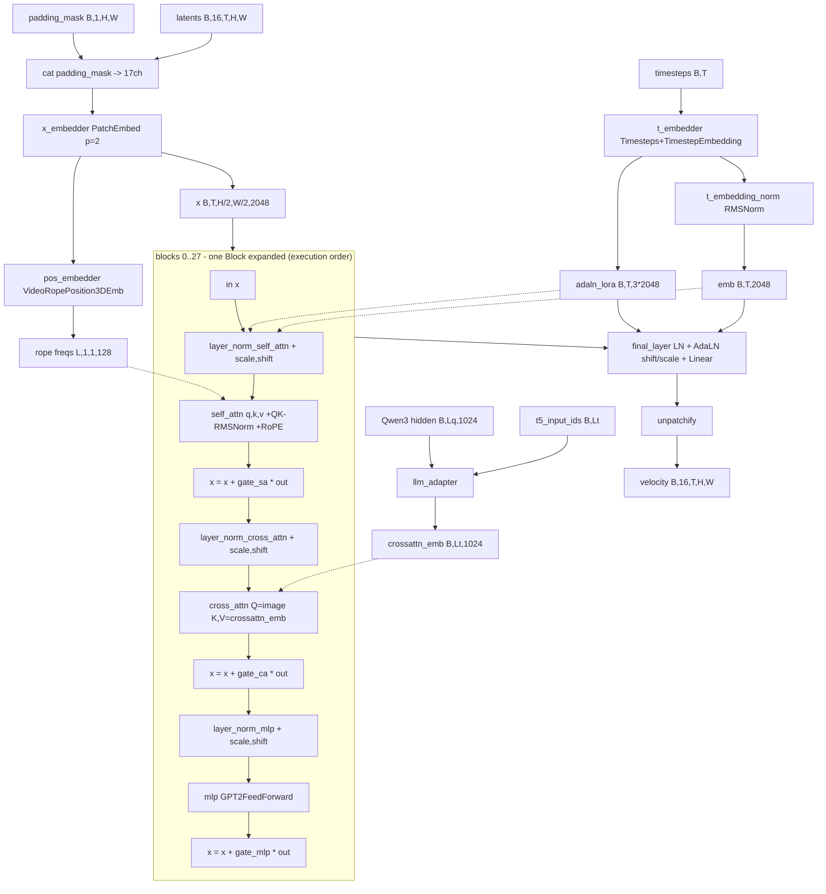

# Anima (`anima`)

Anima is a single-stream Cosmos-Predict2-style image DiT (`core.models.anima.anima_models.Anima`) with per-block AdaLN-LoRA modulation, 3D video RoPE, and separate self-attention / cross-attention sublayers. Two structural facts set it apart from the other DiTs in this repo: (1) text conditioning is not consumed directly — a 6-layer `LLMAdapter` re-projects Qwen3-0.6B hidden states into a T5-shaped 1024-d cross-attention context, driven by *T5 token ids* whose embedding table lives inside the adapter, so a T5 tokenizer is a required component while no T5 model is ever loaded; (2) the latent tensor is 5-D `(B, C, T, H, W)` throughout, with `T == 1` for images, because the block stack and RoPE are video-shaped.

## Components

| Role | Class | Module | Notes |
|---|---|---|---|
| Denoiser | `Anima` | `core.models.anima.anima_models` | vendored from kohya-ss/sd-scripts `library/anima_models.py` (Apache-2.0), package dir `backend/core/models/anima/` |
| DiT block | `Block` | `core.models.anima.anima_models` | vendored; self-attn + cross-attn + MLP, three independent AdaLN modulators |
| Attention | `Attention` | `core.models.anima.anima_models` | vendored; QK-RMSNorm, RoPE on self-attention only |
| MLP | `GPT2FeedForward` | `core.models.anima.anima_models` | vendored; GELU, `layer1`/`layer2`, no bias |
| Patch embed | `PatchEmbed` | `core.models.anima.anima_models` | vendored; `Rearrange` + one `nn.Linear`, exposed as `x_embedder.proj.1` |
| Positional embed | `VideoRopePosition3DEmb` | `core.models.anima.anima_models` | vendored; `LearnablePosEmbAxis` also exists but is only built when `extra_per_block_abs_pos_emb=True` (default `False`) |
| Timestep embed | `Timesteps` + `TimestepEmbedding` | `core.models.anima.anima_models` | vendored; `nn.Sequential` named `t_embedder`, followed by `t_embedding_norm` (`RMSNorm`) |
| Output head | `FinalLayer` | `core.models.anima.anima_models` | vendored; 2-chunk AdaLN (shift/scale, no gate) then `linear` |
| Text bridge | `LLMAdapter` | `core.models.anima.anima_models` | vendored; own `nn.Embedding`, `AdapterRotaryEmbedding`, `LLMAdapterTransformerBlock` × `num_layers` |
| Text encoder | `transformers.Qwen3ForCausalLM(...).model` (i.e. `Qwen3Model`) | built in `core.models.anima.anima_loader.load_qwen3_text_encoder` | LM head discarded; config bundled at `backend/core/models/anima/configs/qwen3_06b/config.json` |
| Tokenizer (encoder) | `transformers.AutoTokenizer` | `anima_loader.load_qwen3_text_encoder` | component-dict key `tokenizer` |
| Tokenizer (adapter target) | `transformers.T5TokenizerFast` | `anima_loader.load_t5_tokenizer` | component-dict key `t5_tokenizer`; files bundled at `backend/core/models/anima/configs/t5_old/` |
| VAE | `diffusers.AutoencoderKLQwenImage` | `anima_loader.load_qwen_image_vae` / `build_qwen_image_vae_from_embedded` | config constant `anima_loader.QWEN_IMAGE_VAE_CONFIG` |
| Scheduler | `AnimaFlowMatchScheduler` | `core.models.anima.anima_scheduler` | not a diffusers scheduler; hand-written Euler flow matching |
| Attention dispatcher | `AttentionParams`, `attention()` | `core.models.anima.anima_attention` | vendor-shaped shim that forwards to `core.attention.dispatch_attention` |

Default denoiser geometry is the dict `anima_models.ANIMA_DIT_CONFIG` (VERIFIED): `num_blocks=28`, `model_channels=2048`, `num_heads=16`, `patch_spatial=2`, `patch_temporal=1`, `in_channels=out_channels=16`, `crossattn_emb_channels=1024`, `use_adaln_lora=True`, `adaln_lora_dim=256`, `max_img_h=max_img_w=512`, `max_frames=128`, `concat_padding_mask=True`, `rope_h/w_extrapolation_ratio=4.0`, `rope_t_extrapolation_ratio=1.0`, `rope_enable_fps_modulation=False`, `use_llm_adapter=True`. `mlp_ratio` is *not* a key of that dict; the `Anima.__init__` default `4.0` applies, giving `GPT2FeedForward(2048, 8192)`. Head dim is `model_channels // num_heads == 128` (INFERRED from those two constants; computed in `Block.__init__` as `x_dim // num_heads`). `LLMAdapter` is constructed in `Anima.__init__` with literal arguments `source_dim=1024, target_dim=1024, model_dim=1024, num_layers=6, self_attn=True` (VERIFIED).

Qwen3 geometry from the bundled `configs/qwen3_06b/config.json` (VERIFIED): 28 layers, `hidden_size=1024`, 16 attention heads, 8 KV heads, `head_dim=128`, `intermediate_size=3072`, `vocab_size=151936`. `anima_loader.inspect_anima_component_candidate` enforces exactly this shape for a user-supplied text-encoder file (`model.embed_tokens.weight == [151936, 1024]` and layers `0..27`).

## Load path

Entry symbol: `core.model_loader.ModelLoader.load_anima_from_files`, which delegates to `core.models.anima.anima_loader.load_anima_components`. Detection is `ModelLoader.detect_model_type`, which calls `anima_loader.detect_anima_split_layout` (directory case), `anima_loader.is_anima_safetensors` (single file, metadata `modelspec.architecture` first then key signature), and `ModelLoader._keys_look_anima` → `anima_loader.is_anima_state_dict_keys` (shard/`net.*` case). Lens is probed *before* Anima in `detect_model_type` because both may sit under a `diffusion_models/` folder; the key sets are disjoint.

Accepted layouts:

* **Split-files directory** — `<MODEL_ROOT>/.../split_files/diffusion_models/*.safetensors` plus `split_files/text_encoders/` and `split_files/vae/`, resolved by `detect_anima_split_layout` and `_find_first` against the filename tables `QWEN3_TE_PATTERNS` / `QWEN_VAE_PATTERNS`. A bare `diffusion_models/` (no `split_files/` prefix) is also accepted.
* **Single DiT safetensors** — companions resolved by `discover_anima_components`, search order: explicit overrides → split-files layout next to the DiT → `<models_root>/text_encoders`, `<models_root>/vae`, `<models_root>/anima_components` → the DiT file's sibling directory.
* **Sharded single file** — read through `core.models.common.single_file_format.read_state_dict`, which also accepts a `<stem>.safetensors.index.json`.
* **`net.`-prefixed full-FT save** — `load_anima_dit` strips the prefix; this is what `AnimaFullParameterAdapter.save_checkpoint` writes.
* **Bundled VAE** — keys prefixed `first_stage_model.` are split off in `load_anima_components` and reattached via `build_qwen_image_vae_from_embedded` (`single_file_format.reattach_embedded_weights`).
* **Weight-only quantized DiT** — `anima_loader.anima_state_dict_is_quantized` detects int8 and fp8 independently; `_swap_quantized_linears` replaces the matching `nn.Linear`s with `Int8Linear` / `Fp8Linear` (from `core.models.ideogram4.vendor.{int8_linear,fp8_linear}`) before the `assign=True` load. A mixed int8+e4m3 file is expected and handled. Scale-less float8 files are treated as a plain dtype cast via `quantized_checkpoint_guard.cast_float8_tensors`; `scaled_quantization_report` + `verify_quantized_swap` refuse a scale-stripped or partially matched quantized file.

Refusals: `load_anima_components` raises `FileNotFoundError` when no Qwen3 text encoder can be located (it is never embedded in the DiT save), and again when no VAE is found — embedded, companion, or via the shared store (`anima_loader.resolve_qwen_image_vae_store_dir` → `core.models.common.vae_store.resolve_vae_dir("qwen_image")`). `load_t5_tokenizer` raises `FileNotFoundError` on a missing config dir and `RuntimeError` when a round-trip `encode()` fails. Missing/unexpected state-dict keys are warnings, not errors (`load_anima_dit` uses `strict=False` and filters buffers named `seq`, `dim_spatial_range`, `dim_temporal_range`, `inv_freq`).

## Denoiser structure

Walk-through. `Anima.forward` calls `_preprocess_text_embeds`, which runs `LLMAdapter` when `target_input_ids` is supplied and zeroes the rows masked out by `target_attention_mask`; the result becomes `crossattn_emb`. `forward_mini_train_dit` then runs `prepare_embedded_sequence` (resizes `padding_mask` with `torchvision.transforms.functional.resize`, concatenates it as an extra input channel when `concat_padding_mask`, applies `PatchEmbed`, and returns the RoPE frequency table from `pos_embedder`), builds `emb` / `adaln_lora` through `t_embedder` + `t_embedding_norm`, constructs `AttentionParams` via `anima_attention.AttentionParams.create_attention_params`, and calls `_stamp_style_context` before entering the block loop.

Every `Block` uses three separate AdaLN modulators — `adaln_modulation_self_attn`, `adaln_modulation_cross_attn`, `adaln_modulation_mlp` — each an `nn.Sequential(SiLU, Linear(x_dim, adaln_lora_dim), Linear(adaln_lora_dim, 3*x_dim))` under `use_adaln_lora`, whose output is summed with the shared `adaln_lora_B_T_3D` before being chunked into shift/scale/gate. There is one block type only; no double/single-stream split. Self-attention flattens the grid to `b (t h w) d` and is image-only, so RoPE applies to it and never to cross-attention (gated on `Attention.is_selfattn` inside `compute_qkv`). `FinalLayer` applies a 2-chunk (shift, scale) AdaLN and a single `Linear`, and `unpatchify` restores `B, C, T, H, W`.

`forward_mini_train_dit` contains four mutually exclusive block-loop variants, selected by attributes set from outside: `_blockskip_config` (training only, `_blockskip_forward`), `_fbcache` (inference only), the default loop with optional `_block_offloader`, and inside the default loop the training-only `_tread_config` (token routing) and `_block_skip_config` (stochastic depth).

## Tensor contract

| Property | Value | Source symbol |
|---|---|---|
| Latent space | 16 channels, 5-D `(B, 16, T, H/8, W/8)`; `T = 1` for images | `Anima.LATENT_CHANNELS`, `ANIMA_DIT_CONFIG["in_channels"]`, `anima_pipeline_ops.vae_encode_image` |
| Spatial downscale | VAE ÷8, then patchify ÷`patch_spatial` (2) → token grid = pixels/16 | `anima_loader.load_anima_components` returns `vae_scale_factor: 8`; `AnimaArchHandler.pixel_align = 16` |
| Extra denoiser input channel | `concat_padding_mask=True` makes the patch embed take 17 channels | `Anima.build_patch_embed` |
| VAE normalization | `(z - latents_mean) / latents_std`, per-channel, shaped `(1, z_dim, 1, 1, 1)`; inverted before decode | `anima_pipeline_ops._get_qwen_vae_normalization`, `vae_encode_image`, `vae_decode_latents` |
| VAE config | `base_dim=96`, `z_dim=16`, `dim_mult=[1,2,4,4]`, `num_res_blocks=2`, `temperal_downsample=[False,True,True]` | `anima_loader.QWEN_IMAGE_VAE_CONFIG` |
| Text embedding | Qwen3 `last_hidden_state`, `[B, L_qwen, 1024]`, zero-masked outside the attention mask | `anima_pipeline_ops.encode_prompt` |
| Cross-attention context dim | 1024 (`crossattn_emb_channels`), produced by `LLMAdapter.out_proj` + `norm` | `ANIMA_DIT_CONFIG`, `LLMAdapter.forward` |
| Adapter target ids | T5 token ids, default max length 512, embedded by the adapter's own `nn.Embedding(32128, 1024)` when no pretrained embedding is passed | `anima_pipeline_ops.tokenize_for_anima`, `LLMAdapter.__init__` |
| Pooled / auxiliary conditioning | none | no pooled path exists in `Anima.forward` |
| Positional encoding | 3D RoPE over (t, h, w); per-axis dims `dim_h = head_dim//6*2`, `dim_w = dim_h`, `dim_t = head_dim - 2*dim_h` → 42/42/44 at `head_dim=128` (INFERRED arithmetic from code); NTK factors from the `rope_*_extrapolation_ratio` config; rotate-half convention (`interleaved=False`) | `VideoRopePosition3DEmb.__init__`, `_rotate_half`, `apply_rotary_pos_emb` |
| FPS modulation | disabled by default (`rope_enable_fps_modulation=False`) | `ANIMA_DIT_CONFIG` |
| Timestep / sigma | sigma in `[0, 1]` passed **directly** as the timestep (not scaled by `num_train_timesteps`); sigmas descend 1 → 0; per-resolution shift from `calculate_shift_anima(latent_h*latent_w)` | `AnimaFlowMatchScheduler.set_timesteps`, `.get_timestep`, `anima_scheduler.calculate_shift_anima` |
| Noising | `x_t = (1 - σ) x_0 + σ ε` | `AnimaFlowMatchScheduler.scale_noise`, `anima_ops.train_step` |
| Prediction target | velocity `v = ε - x_0`; Euler update `x + dt·v` with `dt = σ_next - σ < 0`; clean estimate `x_0 = x_t - σ·v` | `anima_ops.train_step`, `AnimaFlowMatchScheduler.step`, `anima_pipeline_ops.sample_txt2img` |
| Inpaint mask latents | `[1, 1, 1, latent_h, latent_w]` in `[0, 1]`, white = paint | `anima_pipeline_ops.make_mask_latents` |
| Training wiring spec | `latent_channels=16`, `latent_ndim=5`, `vae_scale_factor=8`, `vae_norm="shift_scale"`, `te_seq_packing="llm"` | `core.models.components.wiring.ANIMA_WIRING` |

## Generation path

Backend mixin: `core.pipeline_backends.anima.AnimaMixin`, entry points `_generate_txt2img_anima`, `_generate_img2img_anima`, `_generate_inpaint_anima`. Sampling loops live in `core.models.anima.anima_pipeline_ops`: `sample_txt2img`, `sample_img2img`, `sample_inpaint` — hand-written Rectified-Flow Euler loops over `AnimaFlowMatchScheduler`, not a diffusers pipeline.

CFG shape: **two separate forward passes per step**, not a batched pair. `sample_txt2img` runs `cond_transformer(...)` and, when `guidance_scale > 1.0` and `uncond_embeds` is not None, `uncond_transformer(...)`; the two are combined by `anima_pipeline_ops._apply_advanced_cfg` (`v = v_uncond + cfg_now·(v_cond - v_uncond)`, optionally with CFG schedule, SNR rescale, and dynamic thresholding). Because the two passes are independent trajectories, FBCache is built as two instances (`_build_anima_fbcache`).

Additional forward passes are added by opt-in features: reference-style capture adds one forward per active step on the re-noised style reference (`_anima_style_capture` / `_anima_style_capture_multi`), and CFG-decoupled style guidance adds a fourth forward (`style_cfg.style_guidance_scale > 0`) to obtain the style-free conditional prediction.

Arch-specific generation stages, in order inside `_generate_txt2img_anima`: attention-backend selection (`_anima_set_attention_backend`), Qwen3 text encode with optional CPU offload and A1111 emphasis (`anima_pipeline_ops.encode_prompt`; `encode_prompts_batched` exists for the CPU prefetch worker), optional runtime INT8 conversion + transformer staging (`_anima_stage_transformer`), LoRA wrap, optional NAG (`_anima_build_nag_wrapper` → `core.inference.nag_anima.AnimaNAGWrapper`, which patches every block's `cross_attn.forward`), optional NegPip (auto-armed by `_anima_negpip_active`, applied via `core.inference.negpip_anima.AnimaNegPipWrapper`), the denoise loop, then VAE decode (`vae_decode_latents`). Resolution is snapped to `transformer.patch_spatial * 8` in the backend before sampling.

## Training path

Adapters: `core.training.adapters.anima_adapter.AnimaLoRAAdapter` and `AnimaFullParameterAdapter`. Arch handler: `core.training.arch.anima.AnimaArchHandler` (`name = "anima"`, `wiring = ANIMA_WIRING`, `pixel_align = 16`), which delegates every method to free functions in `core.training.ops.anima_ops` (`load_components`, `setup_block_swap`, `setup_attention_backend`, `encode_prompt`, `collate_aux`, `vae_encode`, `train_step`, `generate_sample`). `AnimaArchHandler.vae_decode` raises `NotImplementedError`.

Trainable by default:

* **LoRA** — scope dict `core.models.anima.anima_lora.DEFAULT_TRAINING_SCOPE` = `{attention: True, mlp: True, mod: False, llm_adapter: True}`. Targets are enumerated by `anima_lora.iter_anima_lora_targets`: `blocks.<N>.{self_attn,cross_attn}.{q_proj,k_proj,v_proj,output_proj}`; `blocks.<N>.mlp.{layer1,layer2}`; `blocks.<N>.adaln_modulation_{self_attn,cross_attn,mlp}.{1,2}` (off by default); `llm_adapter.blocks.<N>.{self_attn,cross_attn}.{q_proj,k_proj,v_proj,o_proj}` (note `o_proj`, not `output_proj`), `llm_adapter.blocks.<N>.mlp.{0,2}`, `llm_adapter.in_proj` (only when it is a `Linear` — at the default `model_dim == target_dim == 1024` it is `nn.Identity`, so it is never yielded), `llm_adapter.out_proj`. Wrappers are `LoRALinearLayer` from `core.training.adapters.sd15_adapter`. `anima_lora._is_lora_target` accepts `nn.Linear`, `Fp8Linear`, `Int8Linear`, and already-wrapped `LoRALinearLayer`.
* **Full FT** — `AnimaFullParameterAdapter.prepare_models_for_training` sets the whole DiT trainable when `train_unet`; the `llm_adapter` submodule is frozen when `train_llm_adapter=False`. Four optimizer groups (`base`, `attn_mlp`, `mod`, `llm_adapter`) with LR factors `anima_attn_mlp_lr_factor`, `anima_mod_lr_factor`, `anima_llm_adapter_lr_factor`.

Always frozen: the Qwen3 text encoder (`apply_lora_to_text_encoders` returns 0; `prepare_models_for_training` calls `requires_grad_(False)` + `eval()`), and the VAE.

LoRA key naming: sd-scripts native, `lora_unet_<flattened>.{lora_down.weight,lora_up.weight,alpha}`, where the flattening is `anima_lora._flatten_to_sdscripts` (canonical dotted path → underscores, with compound names such as `self_attn`, `q_proj`, `llm_adapter` pre-split so the inverse `_restore_sdscripts_dots` reproduces the path). The inference loader also accepts the interchange format `diffusion_model.<dotted>.{lora_A,lora_B}.weight` / `.alpha` (`anima_lora.INTERCHANGE_DIT_PREFIX`, `_parse_key`); `detect_lora_format` warns and picks the dominant format when both appear.

Full-FT checkpoints are written by `AnimaFullParameterAdapter.save_checkpoint` as `net.`-prefixed tensors plus optional `first_stage_model.`-prefixed VAE (`api.param_defaults.resolve_bundle_vae`), with `transformer_config` metadata serialized from `ANIMA_DIT_CONFIG`.

Refused combinations:

* Full fine-tuning on a weight-only quantized base — `base_adapter.reject_quantized_base(..., model_label="Anima")` raises `NotImplementedError`; called from both `prepare_models_for_training` and `setup_trainable_parameters`. LoRA on a quantized base is explicitly allowed.
* `fp8_base_dtype` combined with a trained DiT — `anima_ops.load_components` emits `emit_training_warning(code="fp8_base_dtype_ignored")` and leaves the base unquantized (gate: `trains_denoiser_weights(trainer)`).
* BlockSkip spans that leave no middle blocks — both adapters raise `ValueError` when `num_blocks - back - front < 1`.
* Both checkpointing offload flags at once — `cpu_offload_checkpointing` + `async_cpu_offload_checkpointing` resolves to async with a warning (`anima_ops.load_components`).
* TREAD routing with `T != 1` — disabled with a one-time warning inside `forward_mini_train_dit`; TREAD-span blocks are excluded from stochastic-depth dropout so the two compose on disjoint ranges.

## Hook points

| Hook | Owner symbol | Notes |
|---|---|---|
| Attention conduit entry | `core.models.anima.anima_attention.attention` → `core.attention.dispatch_attention` | q/k/v are BSHD; backend chosen by `anima_attention._resolve_backend` |
| Inference backend selection | `anima_attention.set_attention_backend` (module global `_attention_backend`), set by `AnimaMixin._anima_set_attention_backend` | `sage` is downgraded by the conduit; `split_attn` forces native |
| Training backend selection | `core.training.ops.anima_ops.setup_attention_backend` | writes `attn_mode` (`'torch'`/`'flash'`) on every module that has the attribute |
| Block swap (inference) | `AnimaMixin._anima_setup_block_swap` → `core.memory_management.create_block_offloader_for_model(block_list=transformer.blocks)`; consumed as `Anima._block_offloader` inside `forward_mini_train_dit` | `wait_for_block` / `submit_move_blocks_forward` fire for every block index, including dropped ones |
| Block swap (training) | `core.training.ops.anima_ops.setup_block_swap` → `core.memory_management.LayerOffloadConductor(layers=transformer.blocks)` | must run *after* LoRA wrapping (the conductor snapshots state dicts at `register_hooks()`) |
| FBCache indicator | `Anima._fbcache` / `_fbcache_step`; residual of `blocks[0]` on the image stream | supported; built by `anima_pipeline_ops._build_anima_fbcache` (two instances, cond + uncond), refused under Spectrum or block swap |
| Quantized Linear swap | `anima_loader._swap_quantized_linears` (checkpoint-time) and `AnimaMixin._anima_runtime_int8` → `core.vram_optimization.apply_runtime_int8_quantization` (in-place, one-way) | fp8 dequant-on-forward path is `core.vram_optimization._anima_quantize_fp8` |
| Keep-hot residency | `AnimaMixin._generate_txt2img_anima` via `core.keep_hot` (`is_resident`, `mark_resident`, `discard_resident`, `clear_resident`) | text encoder, transformer, and VAE are all candidates; transformer excluded under block swap or when LoRA is applied |
| Activation offload / dispatch | `core.training.base_trainer._activation_dispatch_begin` / `_activation_dispatch_end` | arch-independent (driven by the MNT loop); Anima's own `LayerOffloadConductor` is constructed with `enable_activation_offload=False` |
| Gradient-checkpoint offload | `Anima.enable_gradient_checkpointing(cpu_offload=, async_offload=)`, per-block `Block.gradient_checkpoint_mode` | modes `none` / `standard` / `cpu_offload` / `async_cpu_offload` |
| Reference-style KV injection | `Anima._style_ctx` stamped onto `block.self_attn._style_ctx` + `block_idx` by `Anima._stamp_style_context`; consumed in `Attention.forward` | self-attention only; forced to `None` when `self.training` |
| TREAD token routing | `Anima._tread_config`, helpers in `core.training.token_routing` | training-only; requires `T == 1` |
| Stochastic depth | `Anima._block_skip_config`, `core.training.block_dropout.compute_skip_mask` | training-only; inverted `1/(1-p)` residual scaling |
| DiT-BlockSkip | `Anima._blockskip_config`, `Anima._blockskip_forward` | training-only; adapters gate LoRA/params to the middle span |
| NAG wrapper | `core.inference.nag_anima.AnimaNAGWrapper` | patches every `block.cross_attn.forward` |
| NegPip wrapper | `core.inference.negpip_anima.AnimaNegPipWrapper` | signed per-token V scale on cross-attention; folds into an existing NAG patch |

## Constraints

| Constraint | Enforcing symbol |
|---|---|
| Generation width/height snapped to `patch_spatial * 8` (16 px) | `AnimaMixin._generate_txt2img_anima` (`snap = transformer.patch_spatial * 8`) |
| Training pixel alignment 16 | `AnimaArchHandler.pixel_align` |
| Patchify divisibility (`H % patch_spatial == 0`, `W % patch_spatial == 0`, `T % patch_temporal == 0`) | `PatchEmbed.forward` asserts |
| RoPE grid bound `H <= max_h`, `W <= max_w` (patched units; 256 each at the default `max_img_h/w=512`, `patch_spatial=2`) | `VideoRopePosition3DEmb.generate_embeddings` assert |
| Uniform FPS required when FPS modulation is on and `B > 1` and `T > 1` | `VideoRopePosition3DEmb.generate_embeddings` assert |
| Denoiser input must be 5-D | `PatchEmbed.forward` (`assert x.dim() == 5`) |
| Fused RoPE unsupported | `apply_rotary_pos_emb` (`assert not fused`) |
| Only `pos_emb_cls="rope3d"` builds | `Anima.build_pos_embed` raises `ValueError` otherwise |
| Sampling batch is fixed at 1 latent | `anima_pipeline_ops.sample_txt2img` allocates `(1, 16, 1, latent_h, latent_w)` |
| Quantization vocabulary is `fp8_e4m3fn` / `fp8_e5m2` only for the runtime path; `int8` is the in-place converter's value and is refused here | `core.vram_optimization._anima_quantize_fp8`, `_refuse_runtime_int8_elsewhere` |
| Runtime INT8 refuses a LoRA-wrapped module and is one-way | `core.vram_optimization.apply_runtime_int8_quantization` (`LoraWrappedError`, `runtime_quantization_persistent` warning) |
| FBCache mutually exclusive with Spectrum and with block swap | `anima_pipeline_ops._build_anima_fbcache` |
| Style transfer uses an all-ones frequency vector (no per-axis RoPE suppression) because the rotate-half layout does not match `reference_style.frequency_scale_vector` | `Attention.forward`, `AnimaMixin._anima_style_triple` (leaves `axes_dims` unset) |
| Text encoder must be a companion file; it is never embedded in a DiT save | `anima_loader.load_anima_components` `FileNotFoundError` |
| Explicit component switching (`text_encoder_path` / `vae_path` reload) is Anima-only | `core.model_loader` component-switch branch (raises `ValueError` for any other arch) |
