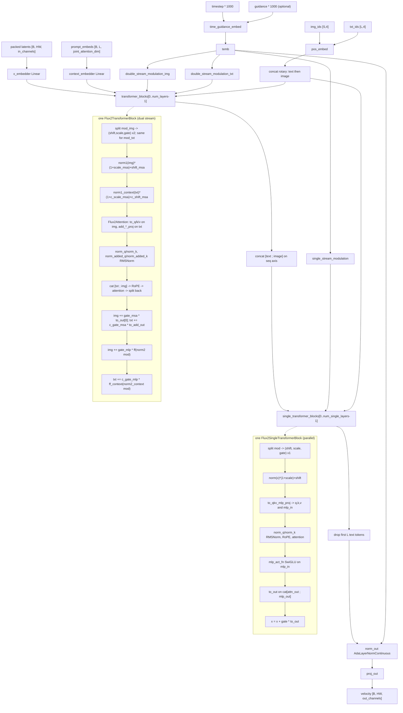

# FLUX.2 Klein (`flux2`)

Two-stage image DiT (arch key `flux2`, `ModelType` in `backend/core/model_loader.py`). The denoiser is
diffusers' own `Flux2Transformer2DModel` — **not vendored**; this repo owns only the loader, the
block-swap/FBCache wrapper, the LoRA plumbing and a config pin. Two structural traits set it apart from
the other image archs here: (1) a **dual-stream → single-stream** block layout where the single-stream
blocks are *parallel* transformer blocks with attention QKV and MLP-in fused into one `Linear`
(`to_qkv_mlp_proj`) and attention-out and MLP-out fused into another (`to_out`); and (2) modulation
parameters are computed **once per forward at model level** (`double_stream_modulation_img/txt`,
`single_stream_modulation`) and shared by every block, instead of per-block adaLN. Latents are
additionally 2×2-patchified *outside* the VAE and normalised by a `BatchNorm` that lives on the VAE.

## Components

| Role | Class | Module | Notes |
|---|---|---|---|
| Denoiser | `Flux2Transformer2DModel` | `diffusers.models.transformers.transformer_flux2` | Upstream diffusers class; instantiated directly by `ModelLoader.load_flux2_from_safetensors`. |
| Dual-stream block | `Flux2TransformerBlock` | diffusers | `norm1`/`norm1_context` (LayerNorm, no affine) + `Flux2Attention` + `norm2`/`norm2_context` + `ff`/`ff_context`. |
| Single-stream block | `Flux2SingleTransformerBlock` | diffusers | One `norm` + one `Flux2ParallelSelfAttention`; attention and MLP run in parallel on the same normalised input. |
| Joint attention | `Flux2Attention` | diffusers | `to_q/to_k/to_v`, `to_out` (`ModuleList`), plus `add_q_proj/add_k_proj/add_v_proj/to_add_out` and `norm_added_q/norm_added_k` for the text stream. |
| Parallel attention | `Flux2ParallelSelfAttention` | diffusers | `to_qkv_mlp_proj` (out dim `3*inner + 2*mlp_hidden`), `mlp_act_fn` (`Flux2SwiGLU`), `to_out` (in dim `inner + mlp_hidden`). `_supports_qkv_fusion = False`. |
| Feed-forward | `Flux2FeedForward` + `Flux2SwiGLU` | diffusers | `linear_in` → SwiGLU (halves width) → `linear_out`. |
| Modulation | `Flux2Modulation` | diffusers | `SiLU` + `Linear(dim, dim*3*mod_param_sets)`; `.split()` yields (shift, scale, gate) tuples. |
| Timestep + guidance embed | `Flux2TimestepGuidanceEmbeddings` | diffusers | `time_proj` + `timestep_embedder`, plus `guidance_embedder` **only if** `guidance_embeds` is set; the two embeddings are summed. |
| Positional | `Flux2PosEmbed` | diffusers | 4-axis RoPE returning a `(cos, sin)` pair. |
| Output head | `AdaLayerNormContinuous` (`norm_out`) + `proj_out` | diffusers | `proj_out` maps to `patch_size**2 * out_channels`. |
| Block-swap / FBCache wrapper | `Flux2BlockSwapWrapper` (+ `create_flux2_block_swap_wrapper`) | `core/models/flux2_block_swap_wrapper.py` | Re-implements the model forward so the dual and single block loops can be intercepted. Attribute access, `state_dict`, `load_state_dict` and `to()` all forward to the wrapped transformer. |
| Config pin / key transform | `FLUX2_DEFAULT_CONFIG`, `FLUX2_CONFIGS_BY_BLOCK_COUNTS`, `count_flux2_blocks`, `flux2_config_for_state_dict`, `is_flux2_bfl_key`, `flux2_bfl_to_diffusers` | `core/models/flux2/single_file.py` | Shared by the loader-adjacent tooling and the offline quantizer so they cannot drift. |
| VAE | `AutoencoderKLFlux2` | diffusers | Always resolved from the Apache-2.0 store (`core.models.common.vae_store.resolve_vae_dir("flux2")`), falling back to `black-forest-labs/FLUX.2-klein-4B` subfolder `vae`. Loaded in `float32`. Carries a `bn` (`BatchNorm`) module and `config.batch_norm_eps`. |
| Text encoder | `Qwen3ForCausalLM` | `transformers` | From `<base_repo>/text_encoder`. |
| Tokenizer | `Qwen2TokenizerFast` | `transformers` | From `<base_repo>/tokenizer`; chat template applied by the encode helpers. |
| Scheduler | `FlowMatchEulerDiscreteScheduler` | diffusers | `from_pretrained(<base_repo>, subfolder="scheduler")`. |
| Conduit attention processors | `ConduitFlux2AttnProcessor`, `ConduitFlux2ParallelSelfAttnProcessor` | `core/inference/conduit_flux2.py` | Installed by `_install_flux2_conduit_processors`. |
| NAG / NegPip / style processors and wrappers | `Flux2NAGWrapper`, `Flux2NegPipWrapper`, `Flux2NegPipNAGWrapper`, `NAGFlux2*`/`NegPipFlux2*` processors, `install_flux2_style_processors` | `core/inference/nag_flux2.py`, `negpip_flux2.py`, `style_flux2.py` | Vendored processor classes with an `_sdpa` choke point reading a per-class `_attention_backend`. |
| Quantized Linear | `Int8Linear`, `Fp8Linear` | `core/models/ideogram4/vendor/int8_linear.py`, `.../fp8_linear.py` | Vendored under the Ideogram 4 package; FLUX.2 reuses them via `ModelLoader._swap_flux2_quantized_linears`. |

`core/models/flux_vae_wrapper.py` (`FluxVAEWrapper`) is a FLUX.1-era 16-channel `AutoencoderKL` helper
and is **not** used by the FLUX.2 load path — the only constructor call is its own `get_flux_vae`
helper, which nothing calls.

## Load path

Entry: `ModelLoader.load_flux2_from_safetensors(file_path, device, torch_dtype, base_model_repo=None)`,
reached from `ModelLoader.load_from_safetensors` when `detect_model_type` returns `"flux2"`. There is no
diffusers-directory FLUX.2 loader.

Detection (`ModelLoader.detect_model_type`), in order:
1. `metadata["model_type"]` ∈ {`flux2`, `flux.2`, `flux2-klein`, `flux.2-klein`} (also via
   `_map_model_type_string` for a `<stem>.safetensors.index.json` shard index).
2. Diffusers layout: keys starting with `time_guidance_embed.` **and** `double_stream_modulation_`
   **and** `single_stream_modulation.`.
3. BFL/Comfy layout: `double_blocks.` **and** `single_blocks.` **and** any key containing `.img_attn.`.

Accepted checkpoint layouts (branched in `load_flux2_from_safetensors`):
* **BFL/Comfy** (`double_blocks.*`, `single_blocks.*`) → converted with diffusers'
  `convert_flux2_transformer_checkpoint_to_diffusers`.
* **diffusers** (no prefix) → loaded as-is.
* **sushiUI/musubi full-FT save** (`model.diffusion_model.*`) → split by
  `ModelLoader._split_flux2_sushiui_state_dict` into transformer / `first_stage_model.` VAE /
  `text_encoders.qwen3.` TE; the embedded VAE and TE are re-applied with
  `ModelLoader._reattach_embedded_weights`.

Sharded files load transparently through `core.models.common.single_file_format.read_state_dict`.

Geometry and variant: the transformer config is `transformer/config.json` snapshot-downloaded from
`base_model_repo`, which is taken from `metadata["base_model_repo"]` when present, else guessed from a
key probe for `single_blocks.47.`/`single_blocks.35.`/`single_blocks.23.` → Klein Base 4B / 9B / 4B,
else defaulting to `black-forest-labs/FLUX.2-klein-base-4B`. `core/models/flux2/single_file.py` records
that both 4B variants measured here have **20** single blocks, so that probe falls through to the
default on every FLUX.2 file this repo has seen; the 9B repo is gated and its block count is unknown
here. `is_distilled` comes from `metadata["is_distilled"]` or `model_index.json`.

The offline/config-only route uses the pin instead of the network: `flux2_config_for_state_dict`
returns `FLUX2_CONFIGS_BY_BLOCK_COUNTS[(num_layers, num_single_layers)]` and **raises `ValueError`** for
an unrecognised block-count pair rather than guessing — including a dedicated message for a
`model.diffusion_model.`-prefixed save, which that path does not read.

Quantized flavours: `scaled_quantization_report` (int8/e4m3 weights with per-row `.weight_scale`)
triggers `transformer.to(dtype)` **first**, then `ModelLoader._swap_flux2_quantized_linears`, then
`verify_quantized_swap`; the usual post-load cast is skipped so `Fp8Linear`'s `_scaled_mm` path (which
gates on the weight dtype) survives. A float8 checkpoint with no scales is treated as a plain dtype
cast and loads normally.

Refusals:
* A quantized checkpoint in the **BFL** or **sushiUI** layout raises `RuntimeError` — only the
  diffusers key layout is supported for a quantized file.
* `verify_quantized_swap` refuses when the swapped-module count disagrees with the census.
* `flux2_config_for_state_dict` refuses unpinned geometries (above).

Weight load itself is `load_state_dict(..., strict=False)`; missing/unexpected keys are printed, not
raised.

On-disk export layout: `EXPORT_LAYOUTS["flux2"]` in `core/models/common/quantized_export.py` — module
`("transformer", "")` (empty prefix, so the artifact lands in the loader's "already diffusers" branch),
`source_transform = _flux2_source_transform` (a module-scope thin wrapper that delegates to
`core.models.flux2.single_file.flux2_bfl_to_diffusers`), and **no sibling directories** (the loader
probes nothing next to the file).

## Denoiser structure

Walk-through. The image latent is already packed to `[B, H*W, C]` by the caller, so `patch_size` in the
config is `1` and `x_embedder` is a plain `Linear`. `context_embedder` projects the Qwen3 embedding
(`joint_attention_dim` wide) into `inner_dim = num_attention_heads * attention_head_dim`.
`time_guidance_embed` (`Flux2TimestepGuidanceEmbeddings`) produces one `temb` which the three
`Flux2Modulation` heads turn into all the shift/scale/gate parameters for the whole stack — the blocks
themselves own no modulation weights. `pos_embed` (`Flux2PosEmbed`) is evaluated separately on
`txt_ids` and `img_ids` and the two `(cos, sin)` pairs are concatenated **text first**, matching the
token order the attention processors build.

In `Flux2TransformerBlock` the two streams stay separate through their own norms and projections;
`Flux2AttnProcessor` concatenates `[encoder_*, *]` for q/k/v, applies RoPE to the joint sequence, runs
one attention, then splits the output back and routes it through `to_add_out` (text) and `to_out[0]`
(image). Afterwards each stream gets its own gated feed-forward (`ff` / `ff_context`).

Between the stacks the two streams are concatenated into one sequence, `[text; image]`. Each
`Flux2SingleTransformerBlock` normalises once, and `Flux2ParallelSelfAttention` computes attention and
the MLP from the **same** fused projection, concatenating the two results before the fused output
projection. After the last single block the text prefix is dropped and only the image tokens reach
`norm_out` / `proj_out`.

`Flux2BlockSwapWrapper.forward` re-implements exactly this sequence in repo code (so block-swap waits,
FBCache and NAG batch expansion can be inserted), with one difference: it concatenates
`[encoder_hidden_states, hidden_states]` itself and calls each single block with
`encoder_hidden_states=None`. When no offloader, no single-stream processors and no FBCache are
attached it takes a fast path and calls the diffusers forward unchanged.

## Tensor contract

| Aspect | Value | Source symbol |
|---|---|---|
| VAE latent channels | 32 | `FLUX2_WIRING.latent_channels` (defined in `core/models/components/wiring.py`, re-exported by `core/training/components/wiring.py`, consumed via `Flux2ArchHandler.wiring`); `AutoencoderKLFlux2` config (`vae.config.latent_channels`, printed at load) |
| Transformer input channels | `config.in_channels` = 128 in the pin (32 × 2×2 patch) | `FLUX2_DEFAULT_CONFIG["in_channels"]`; `num_channels_latents = transformer.config.in_channels // 4` in `_generate_txt2img_flux2` |
| Extra patchify | 2×2 outside the VAE: `(B,32,H,W) → (B,128,H/2,W/2)` and back | `Flux2Mixin._flux2_patchify_latents` / `._flux2_unpatchify_latents` |
| Packing | `(B,C,H,W) → (B,H*W,C)`; unpack scatters by `img_ids[:,1]`/`[:,2]` | `Flux2Mixin._flux2_pack_latents`, `._flux2_unpack_latents_with_ids`; `FLUX2_WIRING.latent_packing = "flux_pack"` (`core/models/components/wiring.py`) |
| Spatial downscale | VAE 8 × patch 2 = 16 px per token; `latent_h = 2 * (height // 16)` | `FLUX2_WIRING.vae_scale_factor = 8`; `Flux2ArchHandler.pixel_align = 16`; `_generate_txt2img_flux2` |
| VAE normalisation | **BatchNorm**, not scale/shift: encode `(x - bn.running_mean) / sqrt(bn.running_var + batch_norm_eps)`, decode inverts it — applied *after* patchify | `training/ops/flux2_ops.vae_encode`, `_generate_txt2img_flux2` decode stage; `FLUX2_WIRING.vae_norm = "batchnorm"` (`core/models/components/wiring.py`) |
| Text embedding | Qwen3 hidden states from layers **(9, 18, 27)** stacked and flattened: `(B, L, 3 * hidden)` | `Flux2Mixin._flux2_encode_prompt(hidden_states_layers=(9,18,27))`, `BaseTrainer._flux2_encode_prompt` |
| Text embedding width | `joint_attention_dim` = 7680 in the pin. **INFERRED**: that is 3 × 2560, i.e. three layers of a 2560-wide Qwen3; the real value for any given checkpoint comes from its own `transformer/config.json`, which is not in this repo. | `FLUX2_DEFAULT_CONFIG["joint_attention_dim"]` |
| Sequence length | text padded to `max_sequence_length = 512` (`padding="max_length"`) | `_flux2_encode_prompt` |
| Pooled / auxiliary cond | none — `FLUX2_WIRING.te_pooled_dim = None`, `added_cond = None`. `Flux2BlockSwapWrapper.forward` accepts a `pooled_projections` argument for signature compatibility and never uses it. | `core/models/components/wiring.py`, `Flux2BlockSwapWrapper.forward` |
| Positional encoding | 4-axis RoPE over `(T, H, W, L)`, `axes_dims_rope = [32,32,32,32]`, `rope_theta = 2000` in the pin. Text ids are `cartesian_prod(range(1), range(1), range(1), range(L))`; image ids are `cartesian_prod(range(1), range(H), range(W), range(1))`. | `FLUX2_DEFAULT_CONFIG`; `Flux2Mixin._flux2_prepare_text_ids`, `._flux2_prepare_latent_ids` |
| Reference-image positions | each Image-Edit reference gets `T = 10 * (idx + 1)`, same `(h, w)` grid, `l = 0` | `Flux2Mixin.encode_flux2_image_refs`; training equivalent in `flux2_ops.train_step` |
| Head geometry | `inner_dim = num_attention_heads * attention_head_dim` = 24 × 128 = 3072 in the pin | `Flux2Transformer2DModel.__init__`, `FLUX2_DEFAULT_CONFIG` |
| Timestep (inference) | scheduler timestep in `[0,1000]`, divided by 1000 before the call; the wrapper/model multiplies by 1000 again internally | `_generate_txt2img_flux2` (`timestep_doubled / 1000`), `Flux2BlockSwapWrapper.forward` (`ts * 1000`) |
| Timestep (training) | `t` sampled in `[0,1]`, `x_t = (1-t)·x_0 + t·noise` (t=0 clean, t=1 noise), passed unmodified | `training/ops/flux2_ops.train_step`, `base_trainer.add_noise_unified` |
| Sigma shift | empirical `mu` from image sequence length and step count, fed to `scheduler.set_timesteps(..., mu=mu)` | `Flux2Mixin._flux2_compute_empirical_mu` |
| Prediction target | flow-matching **velocity** (`noise - latents`), via the shared `get_target_unified(noise_process="flow", prediction_target="velocity")`; no sign inversion anywhere | `training/ops/flux2_ops.train_step`, `base_trainer.get_target_unified` |
| `x_0` reconstruction | `x_0 = x_t - t · v` (training reg/preview) and `x_0 = x_t - σ · v` with `σ = t/1000` (inference preview) | `flux2_ops.train_step`, `_generate_txt2img_flux2` |
| Guidance embedding | `guidance_embeds` is `False` in the pinned 4B config, in which case `Flux2TimestepGuidanceEmbeddings.guidance_embedder` is `None` and the `guidance` argument is ignored | `FLUX2_DEFAULT_CONFIG["guidance_embeds"]`, `Flux2TimestepGuidanceEmbeddings.forward` |

## Generation path

Backend mixin: `Flux2Mixin` in `core/pipeline_backends/flux2.py`. Entry points
`_generate_txt2img_flux2`, `_generate_img2img_flux2`, `_generate_inpaint_flux2`. Each contains its own
inline denoising loop over `scheduler.timesteps` — there is no shared `custom_sampling_loop` call.

Stages: keep-hot bookkeeping → LoRA gate (`_load_lora_flux2` / `_unload_lora_flux2`) →
`set_flux2_attention_backend` → `_flux2_encode_prompt` (positive, negative, and NAG-negative) →
optional Image-Edit reference encode (`encode_flux2_image_refs`) → latent prep (`_flux2_prepare_latent_ids`,
`_flux2_pack_latents`) → `_flux2_runtime_int8` → block-swap / NAG / NegPip wrapper selection → FBCache
attach → `mu` + `set_timesteps` → denoise → unpack (`_flux2_unpack_latents_with_ids`) → BatchNorm
de-normalise → `_flux2_unpatchify_latents` → `vae.decode`.

CFG shape: **one batched forward per step**, batch doubled to `[uncond, cond]`, combined as
`noise_pred_uncond + guidance_scale * (noise_pred_cond - noise_pred_uncond)`.
`do_classifier_free_guidance = guidance_scale > 1.0 and not is_distilled`. On a distilled model there is
a **single** forward with a `guidance` vector filled with `guidance_scale` instead. When NAG is active
the *text* batch grows by one row while the image batch does not: `[cfg_neg, cfg_pos, nag_neg]` with CFG,
`[pos, nag_neg]` without.

Arch-specific generation stages:
* **Image-Edit reference tokens** — `encode_flux2_image_refs` VAE-encodes up to 10 references (pixel
  budget `2024²` for one image, `1024²` otherwise; cropped to a multiple of 16), patchifies,
  BatchNorm-normalises and concatenates them onto the latent sequence with their own `ref_ids`; the
  model output is sliced back to the target length after each forward.
* **Reference-style transfer** — `_flux2_style_config(s)` / `_flux2_style_step` / `_flux2_style_step_multi`
  with `install_flux2_style_processors`; bypasses the batched-CFG fast path for its active steps.
* **Spectrum** — `core.inference.spectrum_forecaster.build_output_forecaster` skips the transformer on
  forecast steps.

## Training path

Adapters: `FLUX2LoRAAdapter` and `FLUX2FullParameterAdapter` in
`core/training/adapters/flux2_adapter.py`. Arch handler: `Flux2ArchHandler`
(`core/training/arch/flux2.py`, registered as `"flux2"` in `core.training.arch.ARCH_REGISTRY`), with
bodies in `core/training/ops/flux2_ops.py`. Prompt encoding is the one canonical method still on the
spine: `Flux2ArchHandler.encode_prompt` raises `NotImplementedError`, and
`BaseTrainer._flux2_encode_prompt` is what actually runs.

Default trainable set:
* LoRA — transformer always; Qwen3 text encoder **only** when `trainer.train_text_encoder` is set
  (`apply_lora_to_text_encoders` returns 0 otherwise).
* Full FT — transformer when `train_unet`, text encoder when `train_text_encoder`, VAE always frozen.

LoRA target modules, by owning class:
| Class | Attributes wrapped |
|---|---|
| `Flux2Attention` (dual stream) | `to_q`, `to_k`, `to_v`, `to_out[0]`, `add_q_proj`, `add_k_proj`, `add_v_proj`, `to_add_out` |
| `Flux2ParallelSelfAttention` (single stream) | `to_qkv_mlp_proj`, `to_out` (a plain `Linear`, not a `ModuleList`) |
| `Flux2FeedForward` (dual stream) | `linear_in`, `linear_out` |
| Qwen3 layer `mlp` / `self_attn` (opt-in) | `gate_proj`, `up_proj`, `down_proj`; `q_proj`, `k_proj`, `v_proj`, `o_proj` |

Wrappability is tested with `is_lora_wrappable_linear`, so `Int8Linear` / `Fp8Linear` bases are still
wrapped. Layer type is `LoRALinearLayer` from `core.adapters`.

Saved LoRA key format (`FLUX2LoRAAdapter.save_checkpoint`):
`lora_transformer_{module_path_with_dots_replaced_by_underscores}_{attr}` and
`lora_te_model_layers_{i}_{mlp|self_attn}_{attr}`, each with `.lora_down.weight`, `.lora_up.weight`
**and an `.alpha` scalar tensor**; metadata `model_type: "flux2"`. The inference loader
`Flux2Mixin._load_lora_flux2` reads exactly these keys, and additionally supports per-block strength via
`unet_layer_weights` keyed `DUAL{nn}` / `SING{nn}` (`Flux2Mixin._get_flux2_block_name`).

Full-FT save (`FLUX2FullParameterAdapter.save_checkpoint`): transformer under `model.diffusion_model.`,
VAE under `first_stage_model.` (only when `resolve_bundle_vae` says so), text encoder under
`text_encoders.qwen3.`; metadata carries `base_model_repo`, `is_distilled` and a serialised
`transformer_config`. Written through `single_file_format.save_single_file_state` (auto-shards >10 GB).

Refusals / gates:
* `reject_quantized_base(trainer.transformer, model_label="FLUX.2 Klein")` in both
  `prepare_models_for_training` and `setup_trainable_parameters`.
* `training/ops/flux2_ops.block_swap_h2d_args` raises `ValueError` unless **all three** hold:
  `block_swap_h2d_only=True`, the transformer is frozen for this run
  (`trains_denoiser_weights(trainer)` is False — LoRA, or full FT with `train_unet=False`), and
  gradient checkpointing can be enabled on the transformer (force-enabled with a warning if the config
  flag was off).
* `training/ops/flux2_ops.load_components` raises `ValueError` if the transformer lacks
  `transformer_blocks` / `single_transformer_blocks` while `blocks_to_swap > 0`.
* `ControlNetTrainer` raises `ValueError` for FLUX.2 ("ControlNet training is only supported for SD1.5
  and SDXL models").
* `disable_scaled_mm` / `disable_int8_mm` are applied to the transformer and text encoder at load, so a
  quantized base trains dequant-only.

## Hook points

| Hook | Owner symbol | Notes |
|---|---|---|
| Attention conduit entry | `_install_flux2_conduit_processors` → `ConduitFlux2AttnProcessor` / `ConduitFlux2ParallelSelfAttnProcessor` (`core/inference/conduit_flux2.py`) | Default `attention_impl="conduit"`. Installed only where the current processor is the stock `Flux2AttnProcessor` / `Flux2ParallelSelfAttnProcessor`, so reference-image KV-cache processors are not clobbered. |
| Attention backend selection (inference) | `core.pipeline_backends.flux2.set_flux2_attention_backend(transformer, backend, attention_impl)` | `attention_impl="diffusers"` drives diffusers' own registry via `transformer.set_attention_backend(to_diffusers_backend(...))` with a native fallback; `_set_flux2_nag_negpip_backend` writes the class-level `_attention_backend` on all six NAG/NegPip processor classes either way. |
| Attention backend selection (training) | `core.training.ops.flux2_ops.setup_attention_backend` | Same two impls, stamped with `AttentionMode.TRAINING` (which strips `sage`). |
| SLA | `core.attention.config._PASSTHROUGH` / `core.attention.dispatch._dispatch_passthrough` | **Unsupported for FLUX.2.** The `"sla"` string is a conduit-level passthrough with no kernel in this build (it degrades to native), and there is no FLUX.2 SLA module or `proj_l` anywhere. |
| Block swap boundary (inference) | `Flux2BlockSwapWrapper.forward` / `._flux2_single_blocks` calling `offloader.wait_for_block(idx)` and `submit_move_blocks_forward(idx)`; offloader from `core.memory_management.create_flux_block_offloader` | Single unified index space: single-block `i` is index `num_dual_blocks + i`. The active offloader is tracked as `self._flux2_active_block_offloader` and torn down in `_flux2_cleanup`. |
| Block swap boundary (training) | `flux2_ops.wire_block_swap_driver` → `trainer.flux2_transformer_wrapper = Flux2BlockSwapWrapper(...)` + `offloader.register_backward_hooks()` | `trainer.transformer` itself is **not** replaced, so optimizer / LoRA / `state_dict` still see the raw module; `flux2_ops.train_step` calls the wrapper when present. |
| Block swap architecture detect | `core.memory_management.transformer_registry.detect_transformer_architecture` → `"flux2"` | Requires both `transformer_blocks` and `single_transformer_blocks` with a `Flux`-named first block; clamps `blocks_to_swap` to `[0, dual+single-1]`. |
| FBCache indicator | `Flux2BlockSwapWrapper._fbcache` / `._fbcache_step`, built by `Flux2Mixin._flux2_build_fbcache` from `core.inference.fbcache.build_fbcache` | Indicator = image residual after `transformer_blocks[0]`; a hit skips **all** remaining dual blocks and all single blocks and reconstructs the pre-`norm_out` image tensor. A NAG/NegPip wrapper's internal `_unified` wrapper is the attach target so the NAG wrapper is preserved. |
| Quantized Linear swap (load) | `ModelLoader._swap_flux2_quantized_linears` + `verify_quantized_swap` | Cast-then-swap ordering is load-bearing (keeps `Fp8Linear`'s `_scaled_mm` path). |
| Quantized Linear swap (runtime) | `Flux2Mixin._flux2_runtime_int8` → `core.vram_optimization.apply_runtime_int8_quantization` | `unet_quantization == "int8"` only; `precheck` **raises** if a block offloader is already live. `flux2` is in `RUNTIME_INT8_ARCHS`. |
| FP8 cast path | `core.vram_optimization.move_flux2_transformer_to_gpu`, `move_flux2_text_encoder_to_gpu` | Detected per-run by scanning module weight dtypes; when float8 is found the forwards run under `torch.autocast(bfloat16)`. |
| Keep-hot residency | `core.keep_hot` (`is_resident`, `mark_resident`, `discard_resident`, `should_keep_resident`, `invalidate_if_model_changed`); teardown in `Flux2Mixin._flux2_cleanup(gen_succeeded, keep_te, keep_transformer, keep_vae)` | Transformer residency is suppressed when LoRAs or block swap are active. |
| Activation offload / dispatch | `BaseTrainer` (`activation_dispatcher`, `core.memory_management.ActivationDispatcher`, `offload_activations`) | Arch-agnostic; no FLUX.2-specific entry point. |
| Gradient checkpointing | `transformer.enable_gradient_checkpointing()` (diffusers) + `transformer._gradient_checkpointing_func`, invoked by `Flux2BlockSwapWrapper` for both loops | Force-enabled by `flux2_ops.block_swap_h2d_args` when H2D block swap is used. |
| ControlNet residuals | `controlnet_block_samples` / `controlnet_single_block_samples` arguments handled in `Flux2BlockSwapWrapper.forward` and `._flux2_single_blocks` | Inference plumbing only — ControlNet *training* is refused for this arch. |
| NAG | `Flux2NAGWrapper` / `Flux2NegPipNAGWrapper` + `NAGFlux2AttnProcessor`, `NAGFlux2ParallelSelfAttnProcessor` (`core/inference/nag_flux2.py`) | Wrappers hold the block offloader too, so NAG composes with block swap. Per-forward `encoder_hidden_states_length` / `origin_img_batch` are stamped on the single-stream processors by `Flux2BlockSwapWrapper.forward`. |
| NegPip | `Flux2NegPipWrapper` / `Flux2NegPipNAGWrapper` + `NegPipFlux2*` processors (`core/inference/negpip_flux2.py`) | Auto-activated by `Flux2Mixin._flux2_negpip_eligible`; weights built by `._build_flux2_negpip_weights`. |
| Reference-style KV injection | `core/inference/style_flux2.py` (`install_flux2_style_processors` / `restore_flux2_style_processors`), driven by `Flux2Mixin._flux2_style_step` / `._flux2_style_step_multi` | Replaces only the default processors — `Flux2AttnProcessor`/`Flux2ParallelSelfAttnProcessor` or their `ConduitFlux2*` equivalents — on both the dual and single streams; anything else (e.g. a KV-cache processor) is left alone. |
| Arch-specific wrapper | `Flux2BlockSwapWrapper` | The single re-implementation of the model forward; everything block-swap-, FBCache- and NAG-batch-related lives there. |

## Constraints

| Constraint | Enforcing symbol |
|---|---|
| Latent grid is `2 * (size // 16)`; height/width are floored to that grid | `_generate_txt2img_flux2` (`latent_height = 2 * (int(height) // (vae_scale_factor * patch_size))`) |
| Pixel alignment 16 for training canvases | `Flux2ArchHandler.pixel_align = 16`, consumed by `BaseTrainer._arch_pixel_align` / `_assert_item_pixel_align` |
| Image-Edit references: max 10, cropped to a multiple of 16, pixel budget `2024²` (1 image) / `1024²` (2+) | `Flux2Mixin.encode_flux2_image_refs` |
| Text sequence padded/truncated to 512 | `max_sequence_length = 512` in `_generate_txt2img_flux2` and `Flux2Mixin._flux2_encode_prompt` |
| Only pinned `(num_layers, num_single_layers)` geometries are accepted offline | `flux2_config_for_state_dict` raises `ValueError`; table is `FLUX2_CONFIGS_BY_BLOCK_COUNTS` (one entry: `(5, 20)`) |
| Quantized checkpoints must be in the diffusers key layout | `RuntimeError` in `load_flux2_from_safetensors` |
| Quantized swap count must match the census | `verify_quantized_swap` |
| Runtime INT8 must not run while a block offloader is live | `RuntimeError` from `_flux2_runtime_int8`'s `_refuse_if_offloader_live` |
| Training block swap requires H2D-only **and** a frozen transformer **and** gradient checkpointing | `flux2_ops.block_swap_h2d_args` (three `ValueError` gates) |
| Training block swap requires both block lists | `ValueError` in `flux2_ops.load_components` |
| `blocks_to_swap` clamped to `[0, dual+single-1]` | `create_block_offloader_for_model` |
| Full FT refuses a weight-only quantized base | `reject_quantized_base` in `FLUX2FullParameterAdapter` (both methods) |
| ControlNet training unsupported | `ControlNetTrainer` type check (`is_flux2`) |
| FBCache is mutually exclusive with Spectrum, block swap and style transfer | `Flux2Mixin._flux2_build_fbcache` + the `style_requested` gate in `_generate_txt2img_flux2` |
| Style transfer is mutually exclusive with Image-Edit `ref_images` (style wins) and with NAG/NegPip (NAG/NegPip wins) | precedence checks in `_generate_txt2img_flux2` (Stage 1.5) |
| Spectrum is disabled while style transfer is active | `_generate_txt2img_flux2` |
| `style_guidance_scale` has no effect on a distilled model | warning branch in `_generate_txt2img_flux2` (no CFG split to decouple from) |
| VAE is always loaded from the Apache-2.0 FLUX.2 store, never from the detected (possibly 9B) transformer repo | Step 4 of `load_flux2_from_safetensors` |
| torchao / tensor-subclass Linear weights are not offloaded by block swap | warning in `create_block_offloader_for_model` |
</content>
