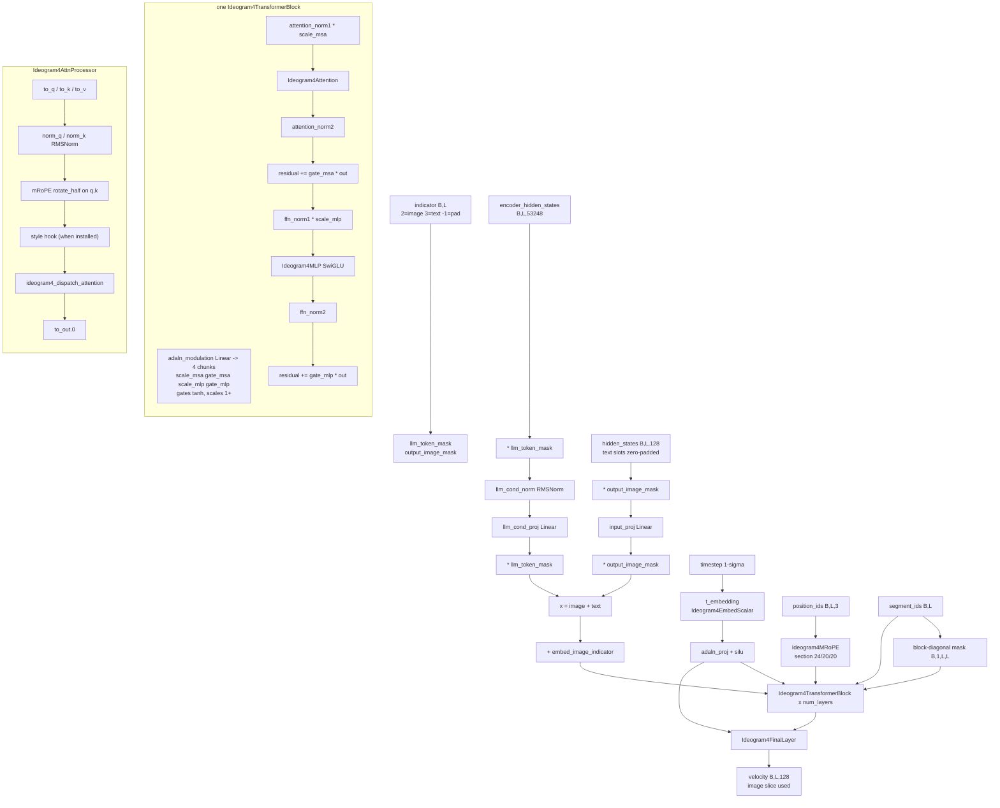

# Ideogram 4 (`ideogram4`)

Latent text-to-image flow-matching model. The denoiser is a single-stream DiT
(`Ideogram4Transformer2DModel`, vendored under `backend/core/models/ideogram4/vendor/`) that runs
ONE packed sequence containing both the text-conditioning tokens and the patchified image latents,
with per-token role indicators and a **block-diagonal segment mask** instead of cross-attention.
Two facts separate it from everything else in this repo: (1) it is the only architecture that loads
**two transformers** — a conditional `transformer` and a geometrically identical
`unconditional_transformer` — and runs asymmetric CFG across them, both required at inference;
(2) its vendored package ships the repo's weight-only quantized Linear classes (`Fp8Linear`,
`Int8Linear` and their Triton fused epilogues), which Krea 2, FLUX.2 and Anima all import from here.
Conditioning is not a text embedding but a 53248-dim concatenation of 13 tapped Qwen3-VL decoder
layers, added to the image tokens rather than attended to.

## Components

| Role | Class | Module | Notes |
|---|---|---|---|
| Denoiser (×2) | `Ideogram4Transformer2DModel` | `core/models/ideogram4/vendor/transformer.py` | **Vendored** (`core/models/ideogram4/vendor/`); `ModelMixin, ConfigMixin, AttentionMixin, PeftAdapterMixin, FromOriginalModelMixin` |
| DiT block | `Ideogram4TransformerBlock` | `core/models/ideogram4/vendor/transformer.py` | Vendored; ×`num_layers`, `@maybe_allow_in_graph` |
| Attention | `Ideogram4Attention` + `Ideogram4AttnProcessor` | `core/models/ideogram4/vendor/transformer.py` | Vendored; split Q/K/V, `diffusers.models.normalization.RMSNorm` on q/k |
| Attention dispatch | `ideogram4_dispatch_attention` | `core/models/ideogram4/vendor/transformer.py` | Vendored; native/flash-varlen/sage-downgrade |
| MLP | `Ideogram4MLP` | `core/models/ideogram4/vendor/transformer.py` | Vendored SwiGLU (`w1`, `w2`, `w3`) |
| Positional embed | `Ideogram4MRoPE` | `core/models/ideogram4/vendor/transformer.py` | Vendored; interleaved 3-axis (t,h,w) mRoPE |
| Timestep embed | `Ideogram4EmbedScalar` | `core/models/ideogram4/vendor/transformer.py` | Vendored; sinusoid over `input_range=(0.0, 1.0)` + 2-layer MLP |
| Image-role embedding | `nn.Embedding(2, hidden_size)` as `embed_image_indicator` | `Ideogram4Transformer2DModel.__init__` | Vendored |
| Text conditioning projection | `llm_cond_norm` (`RMSNorm`) + `llm_cond_proj` (`nn.Linear`) | `Ideogram4Transformer2DModel.__init__` | Vendored; `llm_features_dim` → `hidden_size` |
| Output head | `Ideogram4FinalLayer` | `core/models/ideogram4/vendor/transformer.py` | Vendored; affine-free `LayerNorm` + AdaLN scale + `linear` |
| Text encoder | `Qwen3VLModel` (`transformers.AutoModel`) | `core/models/ideogram4/vendor/text_encoder.py::load_ideogram4_text_encoder` | Not vendored; the **loader** is vendored to handle the weight-only-FP8 layout |
| Tokenizer | `transformers.AutoTokenizer` | `ideogram4_loader.load_ideogram4_components` | From `<model>/tokenizer`; sanity-encoded at load |
| VAE | `diffusers.AutoencoderKLFlux2` | `ideogram4_loader.load_ideogram4_components` | Not vendored; latent BatchNorm read via `vae.bn` |
| Scheduler | `diffusers.FlowMatchEulerDiscreteScheduler` | `ideogram4_loader.load_ideogram4_components` | Loaded from `<model>/scheduler`; sigmas are overridden per generation |
| Quantized Linear | `Fp8Linear`, `Int8Linear` | `core/models/ideogram4/vendor/{fp8_linear,int8_linear}.py` | **Vendored here**; Triton fused paths in `fp8_fused.py` / `int8_fused.py` |
| Style attention processor | `StyleIdeogram4AttnProcessor` | `core/models/ideogram4/style_ideogram4.py` | Installed on the conditional transformer only |
| NAG wrapper / processor | `Ideogram4NAGWrapper`, `Ideogram4NAGAttnProcessor` | `core/inference/nag_ideogram4.py` | |
| NegPip processor | `Ideogram4NegPipAttnProcessor` | `core/inference/negpip_ideogram4.py` | |

## Load path

Entry: `core/models/ideogram4/ideogram4_loader.py::load_ideogram4_components(model_path,
torch_dtype, load_unconditional)` and `load_ideogram4_single_file(file_path, torch_dtype,
base_dir_hint, load_unconditional)`, both reached from
`core/model_loader.py::ModelLoader.load_ideogram4_from_path`, which branches on `os.path.isfile` +
a `.safetensors` / `.safetensors.index.json` suffix.

Accepted layouts:

* **Diffusers directory** — `model_index.json`, `transformer/`, `unconditional_transformer/`,
  `text_encoder/`, `tokenizer/`, `vae/`, `scheduler/`. `_build_ideogram4_transformer` reads
  `<subfolder>/config.json` and assembles the (possibly sharded) state dict through
  `core/models/common/single_file_format.load_component_state_dict`.
* **Combined single file / shard index** — both branches in one file under
  `COND_PREFIX = "transformer."` and `UNCOND_PREFIX = "unconditional_transformer."`
  (`single_file_format.read_state_dict` + `strip_prefix`). Configs come from the metadata keys
  `transformer_config` / `unconditional_transformer_config` when present, else from the resolved
  base directory. The text encoder, tokenizer, VAE and scheduler are **always** completed from a
  base diffusers directory found by `_resolve_ideogram4_base_dir` (hint → `settings.models_dir`
  entries containing "ideogram" → up to 4 ancestors → sibling subdirectories; a directory qualifies
  when it has `transformer/config.json` and a `text_encoder/` subfolder).

Weight-layout detection, applied independently by `_build_ideogram4_transformer_from_state`:

* **Fused QKV** — `_convert_fused_qkv_to_split` / `ideogram4_fused_qkv_to_split` remap
  `layers.N.attention.qkv.{weight,weight_scale,bias}` into `to_q`/`to_k`/`to_v` (row split, exact
  for per-row scales and bias) and `layers.N.attention.o.*` into `to_out.0.*`. No-op on a
  checkpoint already in the split layout. `_FUSED_QKV_RE` / `_FUSED_O_RE` capture an optional
  wrapper prefix so the same rule works on combined-file keys.
* **nf4 (bitsandbytes)** — `is_bnb4bit_state_dict` → `swap_linears_to_bnb4bit` +
  `load_bnb4bit_state_dict`, loaded directly to CUDA.
* **Weight-only int8 / e4m3** — `_swap_ideogram4_quantized_linears` runs `swap_linears_to_int8`
  and `swap_linears_to_fp8` independently (mixed checkpoints are intentional), then
  `load_fp8_state_dict`. Guarded by `quantized_state_dict_report` /
  `scaled_quantization_report` / `verify_quantized_swap`.
* **Plain bf16** — `model.load_state_dict(state_dict)` then `.to(dtype)`.

Text encoder loading (`vendor/text_encoder.py`): `text_encoder/config.json` is inspected for
`FP8_TEXT_ENCODER_CONFIG_FLAG = "ideogram_fp8_weight_only"` and for a `quantization_config` key.
FP8 ⇒ architecture rebuilt from config under `no_init_weights` and loaded via
`swap_linears_to_fp8` + `load_fp8_state_dict(assign=True, strict=False)`; bitsandbytes ⇒
`from_pretrained` with a `device_map`; otherwise the standard `from_pretrained`.

Refusals:

* nf4 weights without CUDA — `_build_ideogram4_transformer_from_state`.
* Fused qkv whose row count is not `3 × hidden_size` implied by the config, or not divisible by 3 —
  `_convert_fused_qkv_to_split` / `ideogram4_fused_qkv_to_split`.
* A single file with no `transformer.` keys — `load_ideogram4_single_file`.
* No resolvable base directory for a single file — `_resolve_ideogram4_base_dir` raises
  `FileNotFoundError` listing every path searched.
* A tokenizer that cannot encode a probe string — `load_ideogram4_components`.
* A config flagged FP8 whose state dict holds no FP8 tensors — `load_ideogram4_text_encoder`.
* A scaled-quantized checkpoint where zero Linears were swapped — `verify_quantized_swap`.
* `in_channels` mismatch at forward time and `hidden_size % num_heads != 0` at construction —
  `Ideogram4Transformer2DModel.forward` / `Ideogram4Attention.__init__`.

Detection (`core/model_loader.py`): directory — `model_index.json._class_name ==
"Ideogram4Pipeline"`, or `transformer/config.json` with `_class_name ==
"Ideogram4Transformer2DModel"` / both `mrope_section` and `llm_features_dim`. Single file —
metadata `model_type == "ideogram4"` or `ModelLoader._keys_look_ideogram4` (both an
`unconditional_transformer.` and a `transformer.` prefix present; the unconditional prefix is
unique to this arch).

## Denoiser structure

Both loaded transformers are instances of the SAME class with the same geometry; the diagram
describes one of them.

`Ideogram4Transformer2DModel.forward` first derives `llm_token_mask` (`indicator ==
LLM_TOKEN_INDICATOR`, 3) and `output_image_mask` (`indicator == OUTPUT_IMAGE_INDICATOR`, 2), zeroes
each stream outside its own slots, projects the image tokens with `input_proj` and the text
features with `llm_cond_norm` → `llm_cond_proj`, and **adds** them into one tensor — text
conditioning enters as an additive term on disjoint sequence positions, not through cross-attention.
`embed_image_indicator` adds a learned role embedding. Timestep conditioning is a single
`adaln_input` vector shared by every block and by the final layer (`silu(adaln_proj(t_embedding(t)))`);
per block, `adaln_modulation` produces four chunks, gates passed through `tanh` and scales offset by
1.0. Note the **sandwich norm**: `attention_norm2` / `ffn_norm2` normalize the *branch output*
before the residual add. `attention_mask` is built once as `segment_ids.unsqueeze(2) ==
segment_ids.unsqueeze(1)` and reused by every block.

The block loop has three mutually exclusive variants: an FBCache path (`_fbcache` set → run
`layers[0]`, use its residual as the indicator, either reuse the cached full residual or run
`layers[1:]` and refresh), a block-swap path (`_block_offloader` → `wait_for_block` /
`submit_move_blocks_forward` around each block), and the plain loop with optional gradient
checkpointing.

`ideogram4_dispatch_attention` routes `flash` + a block-diagonal mask into
`flash_attn_varlen_func` via `_ideogram4_segment_cu_seqlens` (requires compute capability ≥ 8.0,
checked by `_ideogram4_fa_varlen_capable`), downgrades `sage` to native when `head_dim > 128`, and
otherwise calls diffusers' `dispatch_attention_fn`. This arch does **not** go through
`core.attention.dispatch_attention`; it uses the diffusers dispatcher with a backend string
translated by `core.attention.to_diffusers_backend`.

## Tensor contract

| Item | Value | Source symbol |
|---|---|---|
| Latent channels (VAE) | 32 | `core/models/components/wiring.IDEOGRAM4_WIRING.latent_channels`; read at runtime as `raw.shape[1]` in `ideogram4_pipeline_ops.vae_encode` |
| Spatial downscale | 8× | `ideogram4_resolution.VAE_SCALE_FACTOR`; `IDEOGRAM4_WIRING.vae_scale_factor` |
| Patchify | 2×2 | `ideogram4_resolution.PATCH_SIZE`; `ideogram4_pipeline_ops.vae_encode` / `vae_decode` |
| DiT token width | `in_channels = 128` = 32 × 2 × 2 | `Ideogram4Transformer2DModel.__init__` default; `ideogram4_pipeline_ops.LATENT_DIM` |
| Pixel grid alignment | 16 px, sides clamped to `[256, 2048]` | `ideogram4_resolution.GRID_ALIGN`, `MIN_SIDE`, `MAX_SIDE`, `normalize_resolution`, `align_to_grid`; `arch/ideogram4.Ideogram4ArchHandler.pixel_align` |
| Latent layout | flat token sequence `(1, grid_h*grid_w, 128)` | `ideogram4_pipeline_ops.prepare_latents`; `IDEOGRAM4_WIRING.latent_packing = "none"` |
| VAE normalization | latent **BatchNorm**: `(z - running_mean) / sqrt(running_var + batch_norm_eps)`, inverted on decode | `ideogram4_pipeline_ops._bn_stats`, `vae_encode`, `vae_decode` |
| Text embedding | 13 tapped Qwen3-VL decoder layers concatenated per token → `llm_features_dim = 53248` | `ideogram4_pipeline_ops.QWEN3_VL_ACTIVATION_LAYERS = (0,3,6,9,12,15,18,21,24,27,30,33,35)`, `encode_prompt`, `concat_layer_features`; `IDEOGRAM4_WIRING.te_out_dim = 4096` is the per-layer width |
| Pooled / auxiliary conditioning | none | no pooled path in `Ideogram4Transformer2DModel.forward`; `IDEOGRAM4_WIRING.te_pooled_dim = None`, `added_cond = None` |
| Per-token role | `SEQUENCE_PADDING_INDICATOR = -1`, `OUTPUT_IMAGE_INDICATOR = 2`, `LLM_TOKEN_INDICATOR = 3` | `core/models/ideogram4/vendor/transformer.py` |
| Packed layout | `[left-pad][text][image]`, `segment_ids = 1` over the real span and `-1` over the pad | `ideogram4_pipeline_ops._prepare_ids`, `build_training_conditioning` |
| Positional encoding | interleaved 3-axis mRoPE, `mrope_section = (24, 20, 20)`, `rope_theta = 5_000_000`; image coordinates offset by `IMAGE_POSITION_OFFSET = 65536` so they never collide with text indices | `Ideogram4MRoPE`, `Ideogram4Transformer2DModel.__init__`, `_prepare_ids` |
| Timestep convention | `sigma ∈ [0,1]`, 1 = noise; the model consumes `t = 1 - sigma` | `ideogram4_pipeline_ops._run_loop` (`t_model = 1 - t/num_train_timesteps`), `ops/ideogram4_ops.train_step`, `Ideogram4EmbedScalar(input_range=(0.0, 1.0))` |
| Schedule | logit-normal sigmas, resolution-aware mean `mu + 0.5*log(H*W / 512²)`, clamped by `logsnr_min=-15.0` / `logsnr_max=18.0`; UI defaults `mu = 0.0`, `std = 1.5` | `ideogram4_pipeline_ops.logit_normal_sigmas`, `resolution_aware_mu`, `setup_schedule`; `Ideogram4Mixin._ideogram4_common_params` |
| Prediction target | velocity with `x0 = x_t + sigma * v`; the scheduler is stepped with `-v` (diffusers sign) | `ideogram4_pipeline_ops._run_loop`; `ops/ideogram4_ops.train_step` (`v_target = x0 - noise`) |
| Noising | `x_t = (1 - sigma) * x0 + sigma * noise` | `ops/ideogram4_ops.train_step`, `denoise_loop_img2img` / `denoise_loop_inpaint` |

Attention head geometry: `num_attention_heads = 18`, `attention_head_dim = 256`, `hidden_size =
4608`, no GQA (Q, K and V are all full-width). `intermediate_size = 12288`, `adaln_dim = 512`,
`num_layers = 34`, `norm_eps = 1e-5` — all `Ideogram4Transformer2DModel.__init__` defaults, overlaid
by the checkpoint's `config.json`.

## Generation path

Backend: `core/pipeline_backends/ideogram4.py::Ideogram4Mixin`, methods
`_generate_txt2img_ideogram4`, `_generate_img2img_ideogram4`, `_generate_inpaint_ideogram4`. No
`DiffusionPipeline` object; the mixin stages components (`_ideogram4_move`,
`_ideogram4_stage_transformers`, `_ideogram4_unstage_transformers`) and drives
`core/models/ideogram4/ideogram4_pipeline_ops.py`.

Sampling loops: `denoise_loop`, `denoise_loop_img2img`, `denoise_loop_inpaint`, all funnelling into
`_run_loop`. img2img and inpaint trim both the timestep list AND the per-step guidance list at
`start_step = max(int(len * (1 - denoising_strength)), 1)`; inpaint re-pins the unmasked region to
the init latents renoised to the current sigma after every step.

CFG shape: **two forward passes per step, on two different modules**. `_dual_branch_velocity` runs
the conditional `transformer` over the full packed `[text-pad-latent][image-latent]` sequence
(`_ideogram4_cond_pass`, which slices `pos_out[:, max_text:]`) and the `unconditional_transformer`
over the image positions ONLY with zeroed text features (`neg_llm_features`, `neg_position_ids`,
`neg_segment_ids`, `neg_indicator` built in `encode_prompt`). `_blend_guidance` combines them as
`v_uncond + cfg_now * (v_cond - v_uncond)`, where `cfg_now` comes from the shared Advanced-CFG
helpers. Per-step weights come from `resolve_guidance_schedule` (a constant `guidance_scale`, or an
explicit `guidance_schedule` whose length must equal `num_inference_steps`).

Arch-specific generation stages:

* **Runtime INT8** — `_ideogram4_runtime_int8` converts **both** transformers in one
  `apply_runtime_int8_quantization_multi` call, from inside `_ideogram4_stage_transformers`, before
  the block offloaders exist and before the `.to(device)` move.
* **Spectrum forecaster** — `build_output_forecaster` in `_run_loop`; skip steps forecast `v`.
* **FBCache** — `_build_ideogram4_fbcache` creates two independent `FirstBlockCache`s (cond and
  uncond have separate trajectories), attached past any wrapper by
  `_unwrap_ideogram4_transformer`, torn down by `_cleanup_ideogram4_fbcache`.
* **Style transfer** — `install_ideogram4_style_processors` swaps the conditional transformer's
  attention processors; `_ideogram4_style_step` / `_ideogram4_style_step_multi` add one capture
  forward per active reference per step, plus one un-styled conditional forward when
  `style_guidance_scale > 0`.
* **NAG / NegPip** — `_ideogram4_wrap_nag` (`Ideogram4NAGWrapper`) and `_ideogram4_maybe_negpip`,
  both skipped for the whole generation when style transfer is active.

## Training path

Adapters: `core/training/adapters/ideogram4_adapter.py::Ideogram4LoRAAdapter` and
`Ideogram4FullParameterAdapter`. Arch handler: `core/training/arch/ideogram4.py::Ideogram4ArchHandler`
(`name = "ideogram4"`, `wiring = IDEOGRAM4_WIRING`, `pixel_align = 16`), delegating to
`core/training/ops/ideogram4_ops.py` (`load_components`, `setup_block_swap`,
`setup_attention_backend`, `encode_prompt`, `vae_encode`, `train_step`).

Trainable by default: **nothing** — `ideogram4_ops.load_components` freezes the VAE, the text
encoder, the conditional transformer and (when loaded) the unconditional transformer; LoRA layers
wrapped on top are the only trainable parameters. The unconditional transformer is loaded at all
only when `config["ideogram4_train_uncond"]` is set (`load_unconditional=…`), and then contributes
an auxiliary loss weighted by `ideogram4_uncond_loss_weight` in `train_step`.

LoRA targets — `core/models/ideogram4/ideogram4_lora.py::iter_ideogram4_lora_targets`, scope dict
`DEFAULT_SCOPE = {"attn": True, "mlp": True, "mod": False}`:

* `attn`: `layers.{N}.attention.{to_q,to_k,to_v,to_out.0}`
* `mlp`: `layers.{N}.feed_forward.{w1,w2,w3}`
* `mod`: `layers.{N}.adaln_modulation`

Key naming: `_flatten_to_sdscripts` produces `lora_unet_<flattened path>` for the conditional
branch and `lora_uncond_<flattened path>` for the unconditional branch, in the same file, with
`.lora_down.weight` / `.lora_up.weight` / `.alpha`. `_SDSCRIPTS_REVERSE_TOKENS` protects the
compound identifiers (`adaln_modulation`, `feed_forward`, `to_out`, `to_q/k/v`) from the naive
`_`↔`.` flatten. `normalise_lora_state_dict(raw, branch=…)` also accepts the interchange format
`diffusion_model.<dot path>.lora_A/lora_B/alpha` (`INTERCHANGE_DIT_PREFIX`). `_is_lora_target`
accepts `nn.Linear`, `Fp8Linear`, `Int8Linear` and an already-wrapped `LoRALinearLayer`.

Refusals / gates:

* **Full fine-tuning is not implemented.** All three `Ideogram4FullParameterAdapter` methods
  (`prepare_models_for_training`, `setup_trainable_parameters`, `save_checkpoint`) raise
  `NotImplementedError` — the shipped checkpoint stores Linear weights as non-trainable
  `Fp8Linear` buffers. Mirrored in `api/arch_capabilities` (`"ideogram4", "full_finetune"` and
  `"ideogram4", "relora"`).
* **Training-time sampling is not implemented.** `Ideogram4ArchHandler.sample` prints a warning and
  returns `None`; `Ideogram4ArchHandler.vae_decode` raises `NotImplementedError`. Mirrored in
  `arch_capabilities` (`"ideogram4", "training_samples"`).
* Text-encoder training is unavailable — `Ideogram4LoRAAdapter.apply_lora_to_text_encoders` returns
  0 and `arch_capabilities` records the reason.
* `ideogram4_ops.load_components` calls `disable_scaled_mm` / `disable_int8_mm` on the transformer,
  the unconditional transformer and the TE: a training process is dequant-only.
* `ideogram4_ops.setup_block_swap` raises when the transformer has no `.layers`.
* `train_runner` forces `training_dtype = weight_dtype = "bf16"` when the base model path contains
  `ideogram4` / `ideogram-4`.
* `setup_attention_backend` routes through `trainer._resolve_training_backend`, which refuses sage
  for training (and `head_dim = 256` excludes sage at inference anyway).

## Hook points

| Hook | Supported | Owning symbol |
|---|---|---|
| Attention conduit entry | **not the shared conduit** — diffusers dispatcher | `ideogram4_dispatch_attention` → `diffusers.models.attention_dispatch.dispatch_attention_fn`; backend string stamped by `pipeline_backends/ideogram4.set_ideogram4_attention_backend` (inference) and `ops/ideogram4_ops.setup_attention_backend` (training), translated via `core.attention.to_diffusers_backend` |
| Block swap — inference | yes (both transformers) | `Ideogram4Mixin._ideogram4_setup_block_swap` → `core.memory_management.create_block_offloader_for_model`, attached as `transformer._block_offloader`, consumed in `Ideogram4Transformer2DModel.forward` |
| Block swap — training | yes (plus a second conductor for the uncond branch) | `ops/ideogram4_ops.setup_block_swap` → `LayerOffloadConductor(layers=transformer.layers)` |
| FBCache indicator | yes | `Ideogram4Transformer2DModel.forward` `_fbcache` / `_fbcache_step` branch; built by `ideogram4_pipeline_ops._build_ideogram4_fbcache`, cleaned by `_cleanup_ideogram4_fbcache` |
| Spectrum forecaster | yes | `core.inference.spectrum_forecaster.build_output_forecaster`, called in `_run_loop` |
| Quantized Linear swap — load time | yes | `_swap_ideogram4_quantized_linears` (int8 + e4m3), `swap_linears_to_bnb4bit` (nf4), `load_fp8_state_dict` / `load_bnb4bit_state_dict` |
| Quantized Linear swap — runtime | yes (`unet_quantization="int8"` only, both transformers) | `Ideogram4Mixin._ideogram4_runtime_int8` → `core.vram_optimization.apply_runtime_int8_quantization_multi`; `_add_supported_values("ideogram4", "unet_quantization", ["int8"])` |
| W8A8 fast-path toggle | yes | `fp8_linear.set_scaled_mm_enabled` / `disable_scaled_mm`, `int8_linear.set_int8_mm_enabled` / `disable_int8_mm` |
| Quantized export | yes (the only multi-module layout) | `core/models/common/quantized_export.EXPORT_LAYOUTS["ideogram4"]` with `_ideogram4_source_transform = ideogram4_fused_qkv_to_split` and `ideogram4_export_metadata` |
| Keep-hot residency | yes (TE / both transformers as one unit / VAE) | keep-hot block inside `_generate_txt2img_ideogram4` et al. + `Ideogram4Mixin._ideogram4_cleanup`; `core/keep_hot.py` |
| Activation offload / dispatch | arch-independent, off inside the conductor | `BaseTrainer._activation_dispatch_begin` → `core.memory_management.ActivationDispatcher`; `ideogram4_ops.setup_block_swap` passes `enable_activation_offload=False` |
| Reference-style KV injection | yes (conditional branch only) | `style_ideogram4.install_ideogram4_style_processors` / `set_ideogram4_style_context` / `restore_ideogram4_style_processors`; driven by `_ideogram4_style_step` / `_ideogram4_style_step_multi` |
| Arch-specific wrapper | yes | `core/inference/nag_ideogram4.Ideogram4NAGWrapper` (peeled by `_unwrap_ideogram4_transformer` before FBCache attachment); NegPip installs processors in place (`negpip_ideogram4.set_negpip_ideogram4_processors`) |
| LoRA at inference | yes (both branches) | `Ideogram4Mixin._load_lora_ideogram4` / `_unload_lora_ideogram4` → `ideogram4_lora.apply_lora_group` / `restore_originals` |
| Gradient checkpointing | yes | `Ideogram4Transformer2DModel._supports_gradient_checkpointing`, enabled in `ideogram4_ops.load_components` |
| VAE tiling | yes | `PipelineManager._apply_vae_tiling`, called from each `_generate_*_ideogram4` |

## Constraints

| Constraint | Enforcing symbol |
|---|---|
| Sides clamped to `[256, 2048]` and snapped to a multiple of 16 | `ideogram4_resolution.normalize_resolution` / `align_to_grid` |
| `hidden_states` last dim must equal `self.in_channels` | `Ideogram4Transformer2DModel.forward` |
| `position_ids` must be `(B, L, 3)` | `Ideogram4MRoPE.forward` |
| `hidden_size % num_heads == 0` | `Ideogram4Attention.__init__` |
| `guidance_schedule` length must equal `num_inference_steps` | `ideogram4_pipeline_ops.resolve_guidance_schedule` |
| Both transformers required for asymmetric CFG; a single file lacking the uncond branch loads without it | `load_ideogram4_components(load_unconditional=…)`, `load_ideogram4_single_file`; `EXPORT_LAYOUTS["ideogram4"]` comment |
| FBCache mutually exclusive with Spectrum, block swap, and style transfer | `ideogram4_pipeline_ops._build_ideogram4_fbcache` |
| Style transfer mutually exclusive with NAG and NegPip, and forces the native attention backend | `_generate_txt2img_ideogram4` (and the img2img/inpaint equivalents) — the flash `cu_seqlens` path cannot see the appended reference-K columns |
| Runtime INT8 must run before the block offloaders are built | `Ideogram4Mixin._ideogram4_runtime_int8` raises when `_block_offloader` is already attached |
| `blocks_to_swap` clamped to `[0, num_layers - 1]` | `Ideogram4Mixin._ideogram4_stage_transformers` |
| Sage attention downgraded to native (`head_dim = 256 > 128`) | `ideogram4_dispatch_attention` |
| FlashAttention varlen requires compute capability ≥ 8.0, else exact native fallback | `_ideogram4_fa_varlen_capable`, `_ideogram4_flash_varlen` |
| nf4 weights require CUDA | `_build_ideogram4_transformer_from_state` |
| Batch size 1 at generation | `ideogram4_pipeline_ops.prepare_latents` / `vae_encode` / `vae_decode` build and assume a leading dim of 1 |
| bf16 forced for training | `train_runner` ideogram4 branch |
| Full fine-tuning and training-time sampling unavailable | `Ideogram4FullParameterAdapter`, `Ideogram4ArchHandler.sample` / `.vae_decode` |
