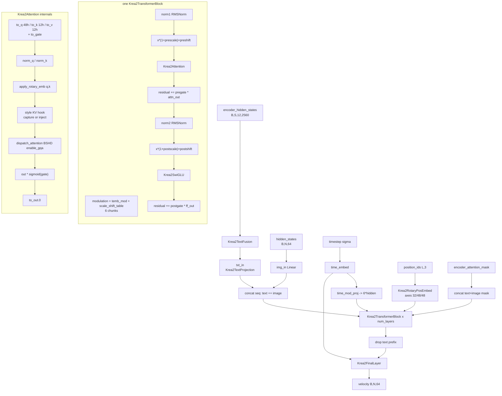

# Krea 2 (`krea2`)

Latent text-to-image flow-matching model. The denoiser is a **single-stream** MM-DiT
(`Krea2Transformer2DModel`, vendored under `backend/core/models/krea2/vendor/`): text and image
tokens are concatenated into ONE sequence and processed by one homogeneous block stack — there is
no double-stream / joint-attention split. Two facts separate it from everything else in this repo:
(1) the text conditioning arriving at the DiT is a **stack of 12 tapped Qwen3-VL hidden-state
layers**, `(B, seq, 12, 2560)`, which a *sub-transformer inside the DiT* (`Krea2TextFusion`) fuses
down to one sequence before projection; (2) attention is **grouped-query** (48 query heads / 12 KV
heads, `Krea2Attention`) with a sigmoid **output gate** (`to_gate`), and it is the arch that carries
the training-free reference-style KV-injection hook directly inside the vendored attention forward.

## Components

| Role | Class | Module | Notes |
|---|---|---|---|
| Denoiser | `Krea2Transformer2DModel` | `core/models/krea2/vendor/transformer.py` | **Vendored** (`core/models/krea2/vendor/`), diffusers-derived; `ModelMixin, ConfigMixin` |
| DiT block | `Krea2TransformerBlock` | `core/models/krea2/vendor/transformer.py` | Vendored; ×`num_layers` |
| Attention | `Krea2Attention` | `core/models/krea2/vendor/transformer.py` | Vendored; GQA + `to_gate`; owns `_style_ctx` / `block_idx` |
| Norm | `Krea2RMSNorm` | `core/models/krea2/vendor/transformer.py` | Vendored; effective scale is `weight + 1.0`, fp32 compute |
| FFN | `Krea2SwiGLU` | `core/models/krea2/vendor/transformer.py` | Vendored; `gate`/`up`/`down` |
| Text fusion sub-transformer | `Krea2TextFusion`, `Krea2TextFusionBlock` | `core/models/krea2/vendor/transformer.py` | Vendored; no RoPE, no time modulation |
| Text projection | `Krea2TextProjection` | `core/models/krea2/vendor/transformer.py` | Vendored; `norm` → `linear_1` → gelu → `linear_2` |
| Timestep embed | `Krea2TimestepEmbedding` | `core/models/krea2/vendor/transformer.py` | Vendored; cos-first sinusoid, input × 1e3 |
| Positional embed | `Krea2RotaryPosEmbed` | `core/models/krea2/vendor/transformer.py` | Vendored; 3-axis (t,h,w) via `get_1d_rotary_pos_embed` |
| Output head | `Krea2FinalLayer` | `core/models/krea2/vendor/transformer.py` | Vendored; adaptive RMSNorm + `linear` |
| Text encoder | `Qwen3VLModel` (`transformers.AutoModel`) | loaded in `core/models/krea2/krea2_loader.py::_load_qwen3vl_text_encoder` | Not vendored; FP8-capable path delegates to `core/models/ideogram4/vendor/text_encoder.load_ideogram4_text_encoder` |
| Tokenizer | `transformers.AutoTokenizer` | `krea2_loader.py::_load_tokenizer` | Falls back to `TE_HUB_ID = "Qwen/Qwen3-VL-4B-Instruct"` |
| VAE | `diffusers.AutoencoderKLQwenImage` | `krea2_loader.py::_load_qwen_image_vae` / `_build_embedded_qwen_image_vae` | Not vendored; known-good geometry in `_QWEN_IMAGE_VAE_CONFIG` |
| Scheduler | `diffusers.FlowMatchEulerDiscreteScheduler` | `krea2_loader.py::_load_scheduler` | Constructed with `base_shift=0.5, max_shift=1.15, base_image_seq_len=256, max_image_seq_len=6400, use_dynamic_shifting=True` when no `scheduler/` dir |
| Quantized Linear (optional) | `Fp8Linear`, `Int8Linear` | `core/models/ideogram4/vendor/{fp8_linear,int8_linear}.py` | Vendored under **ideogram4**; Krea 2 reuses them, it ships no quant classes of its own |

`load_krea2_components` also returns non-module entries consumed by the pipeline:
`vae_scale_factor`, `patch_size` (2), `is_distilled`, `text_encoder_select_layers`, `config`,
`vae_source`/`vae_path`.

## Load path

Entry: `core/models/krea2/krea2_loader.py::load_krea2_components(model_path, torch_dtype, te_dir,
vae_dir, load_text_encoder)`, reached from `core/model_loader.py::ModelLoader.load_krea2_from_path`.

Branch decision (`load_krea2_components`): `os.path.isfile(model_path)` and a `.safetensors` /
`.safetensors.index.json` suffix ⇒ single-file; otherwise diffusers/transformer directory.

Accepted layouts:

* **Diffusers directory** — `_build_transformer_from_dir` reads `<path>/transformer/config.json`
  (falling back to `<path>` itself as the transformer dir), overlays only keys present in
  `KREA2_DEFAULT_CONFIG`, assembles the (possibly sharded) state dict with
  `core/models/common/single_file_format.load_component_state_dict` (re-exported as
  `ideogram4_loader._load_component_state_dict`), then `normalize_state_dict` →
  `build_krea2_transformer`. `is_distilled` from `_detect_is_distilled_dir` (`model_index.json`'s
  `is_distilled`, else a `turbo`/`distill` substring in the path).
* **Transformer-only directory** — same path; the TE / VAE / tokenizer are auto-completed
  (`_resolve_te_dir`, `_resolve_vae_dir`, `_probe_sibling`, env `KREA2_TE_DIR` / `KREA2_VAE_DIR`,
  `core/models/common/vae_store.resolve_vae_dir("qwen_image")`, hub fallbacks `TE_HUB_ID` /
  `VAE_HUB_ID`).
* **Single file / shard index** — `vendor/single_file.py::load_single_file` → `read_state_dict`,
  `reject_unsupported_quant`, split of the `vae.` section (`VAE_PREFIX`), `normalize_state_dict`,
  `detect_config_and_variant`, `build_krea2_transformer`.

Key-layout normalization is one function, `vendor/single_file.py::normalize_state_dict`, handling in
order: the sushiUI split (`TRANSFORMER_PREFIX = "transformer."` / `TEXT_ENCODER_PREFIX =
"text_encoder."`), the ComfyUI prefix (`COMFY_PREFIX = "model.diffusion_model."`), the official raw
mmdit key names (`is_raw_state_dict` → `remap_raw_to_diffusers`, with `_remap_attn_leaf` /
`_remap_fusion_block_leaf`), and the per-tensor→per-row FP8 scale conversion
(`_convert_scale_weight`, `.scale_weight` → `.weight_scale`).

Quantized flavours: `build_krea2_transformer` detects INT8 and e4m3 **independently**
(`is_int8_state_dict`, `is_fp8_state_dict` — each gates on the weight dtype *and* the
`.weight_scale` sibling) and runs both swaps, because an int8 conversion emits a mixed file. The
census/verify pair is `core/models/common/quantized_checkpoint_guard.{quantized_state_dict_report,
scaled_quantization_report,verify_quantized_swap}`; a float8 file with no scales at all is treated
as a plain dtype cast and takes the unquantized branch.

Refusals:

* `reject_unsupported_quant` raises on `int8_convrot`, `mxfp8`, `nvfp4` found in the path/metadata,
  on an unreadable `*comfy_quant` marker tensor, and on a marker whose `convrot` flag is set.
* `build_krea2_transformer` raises on any unexpected key and on any missing key in the unquantized
  branch, and via `verify_quantized_swap` when the census says "scaled quantized" but zero Linears
  were swapped.
* `Krea2Transformer2DModel.__init__` raises when `sum(axes_dims_rope) != attention_head_dim` and
  when `hidden_size % num_heads != 0`.
* `_build_embedded_qwen_image_vae` → `single_file_format.reattach_embedded_weights` raises on a
  zero-match embedded VAE section.

Detection (`core/model_loader.py`): directory — `model_index.json._class_name == "Krea2Pipeline"`,
or `transformer/config.json` with `_class_name == "Krea2Transformer2DModel"` / both
`num_layerwise_text_blocks` and `axes_dims_rope`. Single file — `ModelLoader._keys_look_krea2`
(metadata `model_type == "krea2"`, or `transformer.text_fusion.*`, or `text_fusion.*` +
`time_mod_proj.*`, or `txtfusion.*` + `tmlp.*` + `first.*`, each also matched behind
`.diffusion_model.`). `ModelLoader._is_krea2_safetensors` is the tie-break that keeps a
`split_files/diffusion_models/` Krea 2 file from being claimed by Anima.

## Denoiser structure

`Krea2Transformer2DModel.forward` validates `position_ids.shape == (L, 3)`, calls
`_stamp_attention_backend()` and `_stamp_style_context(text_seq_len, image_seq_len)`, then computes
`temb = time_embed(timestep)` and `temb_mod = time_mod_proj(gelu(temb, tanh))`. Text goes through
`Krea2TextFusion` (layer axis reshaped to the batch, two `Krea2TextFusionBlock`s, a
`projector = nn.Linear(num_text_layers, 1)` collapsing the 12 tapped layers, then two refiner
blocks that DO see the text mask) and `Krea2TextProjection`. Image latents go through `img_in`, the
two are concatenated along the sequence axis, and the same `image_rotary_emb` covers the whole
concatenated sequence (text tokens sit at the origin — see `prepare_position_ids`). Each
`Krea2TransformerBlock` reads a **shared** `temb_mod` plus its own `scale_shift_table` parameter of
shape `(6, hidden_size)`; there is no per-block AdaLN projection. After the stack the text prefix is
dropped (`hidden_states[:, text_seq_len:]`) and `Krea2FinalLayer` applies `scale_shift_table`
(shape `(2, hidden_size)`) against the **unmodulated** `temb` before the output `linear`.
Gradient checkpointing wraps each block via `enable_gradient_checkpointing` /
`_gradient_checkpointing_func`.

## Tensor contract

| Item | Value | Source symbol |
|---|---|---|
| Latent channels | 16 (`z_dim`) | `krea2_loader._QWEN_IMAGE_VAE_CONFIG`; read at runtime as `vae.config.z_dim` in `krea2_pipeline_ops._vae_norm_stats` |
| Spatial downscale | VAE 8× | `krea2_loader.load_krea2_components`: `2 ** len(vae.temperal_downsample)`; `_QWEN_IMAGE_VAE_CONFIG["temperal_downsample"]` has 3 entries |
| Patchify | 2×2 | `load_krea2_components` returns `patch_size: 2`; `krea2_pipeline_ops.pack_latents` / `unpack_latents` |
| DiT token width | `in_channels = 64` = 16 × 2 × 2 | `KREA2_DEFAULT_CONFIG["in_channels"]`; `Krea2Mixin._krea2_common_params` derives `num_channels_latents = in_channels // patch_size**2` |
| Pixel grid alignment | 16 px | `pipeline_backends/krea2.GRID_ALIGN`, `_normalize_resolution`; `arch/krea2.Krea2ArchHandler.pixel_align` |
| VAE normalization | per-channel `(z - latents_mean) / latents_std`, inverse on decode | `krea2_pipeline_ops._vae_norm_stats`, `vae_encode`, `vae_decode`; `ComponentWiringSpec` `vae_norm="shift_scale"` in `core/models/components/wiring.KREA2_WIRING` |
| VAE tensor rank | 5-D `(B, C, T, H, W)`, `T = 1` | `krea2_pipeline_ops.vae_encode` / `unpack_latents` |
| Text embedding | `(B, seq, 12, 2560)` — 12 tapped layers × `text_hidden_dim` | `krea2_pipeline_ops.get_text_hidden_states`; `text_encoder_select_layers` default `[2,5,8,11,14,17,20,23,26,29,32,35]` in `load_krea2_components`; `KREA2_WIRING.te_out_dim = 2560` |
| Text template | fixed chat prefix/suffix, `PROMPT_TEMPLATE_START_IDX = 34`, `PROMPT_TEMPLATE_NUM_SUFFIX_TOKENS = 5` | `krea2_pipeline_ops.PROMPT_TEMPLATE_PREFIX` / `_SUFFIX` |
| Pooled / auxiliary conditioning | none | no pooled path in `Krea2Transformer2DModel.forward`; `KREA2_WIRING.te_pooled_dim = None`, `added_cond = None` |
| Positional encoding | 3-axis RoPE, `axes_dims_rope = (32, 48, 48)` summing to `attention_head_dim = 128`, `rope_theta = 1000.0`; text at `(0,0,0)`, image at `(0, h, w)` | `Krea2RotaryPosEmbed`, `Krea2Transformer2DModel.__init__`, `krea2_pipeline_ops.prepare_position_ids` |
| Timestep convention | `sigma ∈ [0,1]`, 1 = noise; model input is `sigma` itself (`t / num_train_timesteps`), internally scaled by 1e3 | `krea2_pipeline_ops._run_loop`, `Krea2TimestepEmbedding.forward` |
| Schedule shift | `mu = 1.15` when distilled, else `calculate_shift(image_seq_len)` over `BASE_IMAGE_SEQ_LEN=256 … MAX_IMAGE_SEQ_LEN=6400`, `BASE_SHIFT=0.5 … MAX_SHIFT=1.15` | `krea2_pipeline_ops.compute_mu`, `calculate_shift`, `_set_scheduler_timesteps` |
| Prediction target | velocity, `v = noise - x0`; `pred_x0 = x_t - sigma * v`; scheduler is stepped with `+v` | `krea2_pipeline_ops._run_loop`; `ops/krea2_ops.train_step`; `ModelLoader.detect_prediction_config`, called from `core/pipeline.py` (`noise_process="flow"`, `prediction_target="velocity"`) |
| Noising | `x_t = (1 - sigma) * x0 + sigma * eps` | `krea2_pipeline_ops.denoise_loop_img2img` / `denoise_loop_inpaint`, `ops/krea2_ops.train_step` |

Attention head geometry: 48 query heads / 12 KV heads, `head_dim = 128`, `hidden_size = 6144`
(`attention_head_dim * num_attention_heads`). Text-fusion blocks use their own head counts
(`text_num_attention_heads = text_num_key_value_heads = 20`, `text_intermediate_size = 6912`).

## Generation path

Backend: `core/pipeline_backends/krea2.py::Krea2Mixin`, methods `_generate_txt2img_krea2`,
`_generate_img2img_krea2`, `_generate_inpaint_krea2`. There is no `DiffusionPipeline` object — the
mixin stages components itself (`_krea2_move`) and drives the bare-tensor ops in
`core/models/krea2/krea2_pipeline_ops.py`.

Sampling loops: `denoise_loop` (txt2img), `denoise_loop_img2img` (SDEdit, schedule trimmed by
`start_step = max(int(len * (1 - denoising_strength)), 1)` plus `scheduler.set_begin_index`), and
`denoise_loop_inpaint` (repaint: after each step the unmasked region is re-pinned to the init
latents renoised to `sigma_next`). All three funnel into `_run_loop`.

CFG shape: **two forward passes per step** when guidance is on — one conditional
(`prompt_embeds`/`position_ids`) and one unconditional (`neg_prompt_embeds`/`neg_position_ids`) on
the SAME transformer. `_krea2_common_params` maps the UI value with `guidance = cfg_scale - 1` and
forces `guidance = 0.0` (single pass) for a distilled checkpoint; default steps 8 distilled / 28
otherwise. `_blend_guidance` rewrites the Krea combine as standard CFG with `cfg_now = 1 + guidance`
so the shared Advanced-CFG helpers (`calculate_dynamic_cfg`, `dynamic_thresholding`,
`calculate_cfg_metrics`) apply.

Arch-specific stages: `_krea2_style_configs` / `_krea2_style_triple` build the reference-style
triples (VAE-encoding the reference through `prepare_style_reference`, `axes_dims` filled from
`transformer.config.axes_dims_rope`). A style-active step costs **one extra capture forward per
reference**; with `style_guidance_scale > 0` it costs one further un-styled conditional forward
(`cond_ns`) for the CFG-decoupled rewrite in `_run_loop`.

## Training path

Adapters: `core/training/adapters/krea2_adapter.py::Krea2LoRAAdapter` and
`Krea2FullParameterAdapter`. Arch handler: `core/training/arch/krea2.py::Krea2ArchHandler`
(`name = "krea2"`, `wiring = KREA2_WIRING`, `pixel_align = 16`), delegating to
`core/training/ops/krea2_ops.py` (`load_components`, `setup_block_swap`,
`setup_attention_backend`, `encode_prompt`, `vae_encode`, `train_step`, `generate_sample`).
`Krea2ArchHandler.vae_decode` is the one canonical method left unimplemented (it raises
`NotImplementedError`); training-time samples decode inside `krea2_ops.generate_sample`.

Trainable by default: the DiT only. `krea2_ops.load_components` calls `requires_grad_(False)` on
the VAE, the text encoder and the transformer; `Krea2FullParameterAdapter.prepare_models_for_training`
re-enables the transformer when `train_unet`. The Qwen3-VL text encoder is **always frozen**.

LoRA targets — `core/models/krea2/krea2_lora.py::iter_krea2_lora_targets`, scope dict
`DEFAULT_SCOPE = {"attn": True, "mlp": True, "text_fusion": False, "proj": False}`:

* `attn`: `transformer_blocks.{N}.attn.{to_q,to_k,to_v,to_gate,to_out.0}`
* `mlp`: `transformer_blocks.{N}.ff.{gate,up,down}`
* `text_fusion`: `text_fusion.{layerwise_blocks,refiner_blocks}.{N}.attn.*` / `.ff.*` and
  `text_fusion.projector`
* `proj`: `img_in`, `time_embed.linear_{1,2}`, `time_mod_proj`, `txt_in.linear_{1,2}`,
  `final_layer.linear`

Key naming: `flatten_to_key` → `lora_unet_<module path with "." → "__">`, saved as
`.lora_down.weight` / `.lora_up.weight` / `.alpha` (`Krea2LoRAAdapter.save_checkpoint`).
`_is_target` accepts `nn.Linear`, `Fp8Linear`, `Int8Linear` and an already-wrapped
`LoRALinearLayer`. Full-FT saves a sushiUI single file via `vendor/single_file.save_single_file`
(TE never bundled; VAE only when `resolve_bundle_vae` says so).

Refusals / gates:

* `Krea2FullParameterAdapter.prepare_models_for_training` raises on `train_text_encoder=True`.
* `reject_quantized_base(trainer.transformer, model_label="Krea 2")` is called twice (prepare and
  `setup_trainable_parameters`) — full FT needs an unquantized base.
* `train_runner._is_krea2_base_model` forces `training_dtype = weight_dtype = "bf16"`.
* `krea2_ops.load_components` calls `disable_scaled_mm` / `disable_int8_mm` on the transformer and
  the TE: a training process is dequant-only.
* `krea2_ops.setup_block_swap` raises when the transformer has no `.transformer_blocks`.
* `arch_capabilities` records the TE-training refusal for `krea2`
  ("Krea2FullParameterAdapter rejects train_text_encoder outright…").

`train_step` applies a discrete flow-matching shift `sigma' = s·sigma / (1 + (s-1)·sigma)` with
`s = krea2_discrete_flow_shift` (default 2.5).

## Hook points

| Hook | Supported | Owning symbol |
|---|---|---|
| Attention conduit entry | yes | `Krea2Attention.forward` → `core.attention.dispatch_attention` (layout `BSHD`, `enable_gqa`); stamped by `Krea2Transformer2DModel._stamp_attention_backend`, set from `Krea2Mixin._krea2_apply_attention_backend` (inference) and `ops/krea2_ops.setup_attention_backend` (training) |
| Block swap — inference | **unsupported** | `arch_capabilities` `_add("krea2", "block_swap", …)`; `pipeline_backends/krea2.py` never reads `blocks_to_swap` |
| Block swap — training | yes | `ops/krea2_ops.setup_block_swap` → `core.memory_management.LayerOffloadConductor(layers=transformer.transformer_blocks)`, stored as `transformer._layer_offload_conductor` |
| FBCache indicator | **unsupported** | `api/arch_capabilities._FBCACHE_UNSUPPORTED` includes `krea2`; the vendored forward has no `_fbcache` branch |
| Spectrum forecaster | **unsupported** | `api/arch_capabilities._SPECTRUM_UNSUPPORTED` includes `krea2` |
| Quantized Linear swap — load time | yes | `vendor/single_file.build_krea2_transformer` → `swap_linears_to_int8` / `swap_linears_to_fp8` + `load_fp8_state_dict` (classes vendored under ideogram4) |
| Quantized Linear swap — runtime | yes (`unet_quantization="int8"` only) | `Krea2Mixin._krea2_runtime_int8` → `core.vram_optimization.apply_runtime_int8_quantization`; `_add_supported_values("krea2", "unet_quantization", ["int8"])` |
| Quantized export | yes | `core/models/common/quantized_export.EXPORT_LAYOUTS["krea2"]` (single module under `transformer.`, metadata from `krea2_export_metadata`) |
| Keep-hot residency | yes (TE / transformer / VAE) | `Krea2Mixin._krea2_kh_setup`, `_krea2_cleanup`; `core/keep_hot.py` (`is_resident`, `mark_resident`, `discard_resident`) |
| Activation offload / dispatch | arch-independent, off inside the conductor | `BaseTrainer._activation_dispatch_begin` → `core.memory_management.ActivationDispatcher`; `krea2_ops.setup_block_swap` passes `enable_activation_offload=False` |
| Reference-style KV injection | yes | `Krea2Attention.forward` style block + `Krea2Transformer2DModel._stamp_style_context`; contexts built in `krea2_pipeline_ops._run_loop` from `core.inference.reference_style.StyleContext` / `inject_kv` / `inject_kv_multi` |
| NAG / NegPip / ControlNet | **unsupported** | `arch_capabilities` `_add("krea2", "nag", …)`, `_add("krea2", "controlnets", …)` |
| LoRA at inference | **unsupported** | `core/models/krea2/krea2_lora.py` defines `apply_lora_group` / `restore_originals`, but no `pipeline_backends/krea2.py` path calls them — LoRA is training-side only for this arch (see the note in `Krea2Mixin._krea2_kh_setup`) |
| Gradient checkpointing | yes | `Krea2Transformer2DModel.enable_gradient_checkpointing` |
| VAE tiling | yes | `PipelineManager._apply_vae_tiling`, called from each `_generate_*_krea2` |

## Constraints

| Constraint | Enforcing symbol |
|---|---|
| Width/height rounded UP to a multiple of 16 | `pipeline_backends/krea2._normalize_resolution` (`GRID_ALIGN = 16`) |
| `sum(axes_dims_rope)` must equal `attention_head_dim` | `Krea2Transformer2DModel.__init__` |
| `hidden_size % num_heads == 0` | `Krea2Attention.__init__` |
| `position_ids` must be `(sequence_length, 3)` | `Krea2Transformer2DModel.forward` |
| Batch size 1 at generation | `krea2_pipeline_ops.prepare_latents_txt2img` / `vae_encode` / `vae_decode` build and assume a leading dim of 1 |
| bf16 forced for training | `train_runner._is_krea2_base_model` branch |
| Full FT refuses a weight-only-quantized base | `Krea2FullParameterAdapter` via `base_adapter.reject_quantized_base` |
| Full FT refuses text-encoder training | `Krea2FullParameterAdapter.prepare_models_for_training` |
| `int8_convrot` / `mxfp8` / `nvfp4` checkpoints refused | `vendor/single_file.reject_unsupported_quant` |
| Unexpected or missing transformer keys are fatal | `vendor/single_file.build_krea2_transformer` |
| Quantized checkpoint with zero swapped Linears is fatal | `quantized_checkpoint_guard.verify_quantized_swap`, called from `build_krea2_transformer` |
| Distilled checkpoint disables CFG and pins `mu = 1.15` | `Krea2Mixin._krea2_common_params`, `krea2_pipeline_ops.compute_mu` |
| Sage attention downgrades on unequal Q/KV head counts | the conduit (`core.attention`), invoked with `enable_gqa=self.num_heads != self.num_kv_heads` |
| Multi-reference style path only engages at 2+ references | `Krea2Mixin._krea2_style_configs`, `krea2_pipeline_ops._run_loop` (`len(style_refs) > 1`) |
