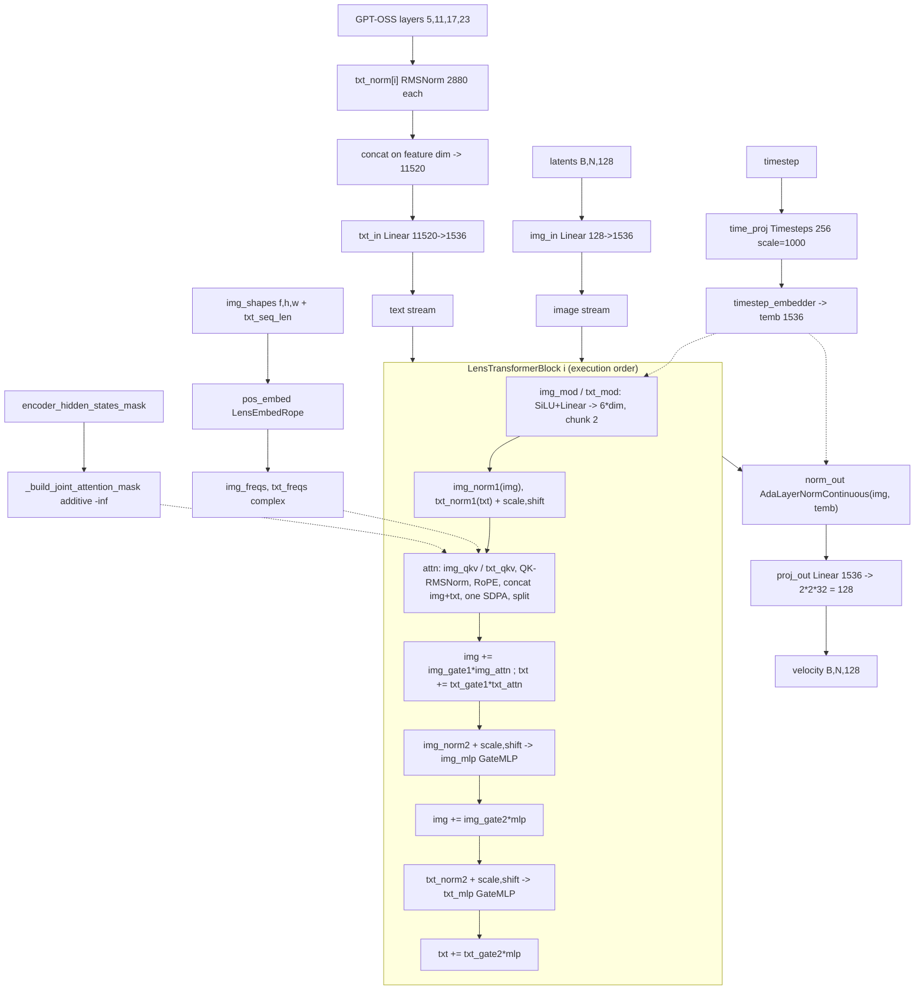

# Lens (`lens`)

Lens is a double-stream MM-DiT (`core.models.lens.vendor.transformer.LensTransformer2DModel`) with joint image+text attention, complex-valued 3-axis RoPE, and SwiGLU (`GateMLP`) feed-forwards. Two structural facts set it apart: (1) text conditioning is a **list of hidden states captured at four selected layers** of a GPT-OSS causal LM (`LensGptOssEncoder`), each RMSNorm'd separately and then concatenated on the feature axis before a single input projection — not one pooled or final-layer embedding; and (2) the DiT operates on a **flat token sequence** `(B, latent_h·latent_w, 128)` produced by a 2×2 patchify of a 32-channel FLUX.2 VAE latent, with the latent normalization carried by the VAE's own `BatchNorm` running statistics rather than a mean/std constant pair.

Vendored code lives in `backend/core/models/lens/vendor/` (upstream `https://github.com/dxqb/Lens`, MIT — see `docs/legal/THIRD_PARTY_PROVENANCE.md`). The vendor package also ships a full diffusers pipeline and a prompt reasoner; **neither is on this repo's generation path** (see *Generation path*).

## Components

| Role | Class | Module | Notes |
|---|---|---|---|
| Denoiser | `LensTransformer2DModel` | `core.models.lens.vendor.transformer` | vendored, package dir `backend/core/models/lens/vendor/`; `ModelMixin` + `ConfigMixin` + `PeftAdapterMixin` + `FromOriginalModelMixin` + `CacheMixin` |
| Block | `LensTransformerBlock` | `core.models.lens.vendor.transformer` | vendored; one block type, dual (image/text) residual streams |
| Attention | `LensJointAttention` | `core.models.lens.vendor.transformer` | vendored; fused `img_qkv` / `txt_qkv`, QK-RMSNorm on both streams, concat then one attention |
| MLP | `GateMLP` | `core.models.lens.vendor.transformer` | vendored SwiGLU (`w1`, `w2`, `w3`); `diffusers.models.attention.FeedForward` is the `gate_mlp=False` alternative |
| RoPE | `LensEmbedRope` | `core.models.lens.vendor.transformer` | vendored; complex `torch.polar` tables, per-(h,w) cache |
| Timestep embed | `LensTimestepProjEmbeddings` | `core.models.lens.vendor.transformer` | vendored wrapper over diffusers `Timesteps` + `TimestepEmbedding` |
| Output norm | `diffusers.models.normalization.AdaLayerNormContinuous` | used in `LensTransformer2DModel.__init__` as `norm_out` | not vendored |
| Text encoder | `LensGptOssEncoder` (subclass of `transformers.models.gpt_oss.modeling_gpt_oss.GptOssForCausalLM`) | `core.models.lens.vendor.text_encoder` | vendored; mxfp4-quantized weights |
| Tokenizer | `transformers.AutoTokenizer` (`PreTrainedTokenizerFast`) | loaded in `core.models.lens.lens_loader.load_lens_components` | `padding_side = "right"`, pad token defaults to eos |
| VAE | `diffusers.AutoencoderKLFlux2` | `lens_loader.load_lens_components` | model's own `vae/` subfolder, else the shared FLUX.2 store |
| Scheduler | `diffusers.FlowMatchEulerDiscreteScheduler` | `lens_loader.load_lens_components` (`from_pretrained(subfolder="scheduler")`) | driven with explicit `sigmas=` + `mu=` |
| Reasoner (vendored, unused here) | `PromptReasoner` | `core.models.lens.vendor.reasoner` | vendored; constructed only by `LensPipeline.__init__` |
| Diffusers pipeline (vendored, unused here) | `LensPipeline` | `core.models.lens.vendor.pipeline` | vendored; referenced by `ModelLoader.detect_model_type` for `model_index.json` matching only |
| Resolution buckets (vendored) | `RESOLUTION_BUCKETS`, `resolve_resolution` | `core.models.lens.vendor.resolution` | vendored; consumed only by `lens_resolution.find_nearest_bucket` and by `LensPipeline.__call__` |

Denoiser defaults are the `@register_to_config` signature of `LensTransformer2DModel.__init__` (VERIFIED, mirrored by `vendor.pipeline.DEFAULT_TRANSFORMER_CONFIG`): `patch_size=2`, `in_channels=128`, `out_channels=32`, `num_layers=48`, `attention_head_dim=64`, `num_attention_heads=24`, `inner_dim=1536`, `enc_hidden_dim=2880`, `axes_dims_rope=(8, 28, 28)`, `gate_mlp=True`, `rms_norm=True`, `multi_layer_encoder_feature=True`, `selected_layer_index=(5, 11, 17, 23)`.

Gotcha: `__init__` **recomputes** `self.inner_dim = num_attention_heads * attention_head_dim` and ignores the `inner_dim` argument. At the defaults both are 1536, but a checkpoint that changes heads or head dim silently overrides the config value.

The GPT-OSS text encoder's own geometry (layer count, hidden size, MoE shape) is not declared anywhere in this repository — it comes from the checkpoint's `text_encoder/config.json`. The only thing the repo asserts is that `enc_hidden_dim = 2880` per selected layer and that `selected_layer_index` must be in range (`LensGptOssEncoder.set_selected_layers` raises `ValueError` otherwise).

## Load path

Entry symbol: `core.model_loader.ModelLoader.load_lens_from_path`, which branches to `core.models.lens.lens_loader.load_lens_single_file` for a `.safetensors` / `.safetensors.index.json` file and to `lens_loader.load_lens_components` otherwise.

Detection, in `ModelLoader.detect_model_type`:

* Diffusers directory — `model_index.json` with `_class_name == "LensPipeline"`, else `transformer/config.json` listing `LensTransformer2DModel` in `architectures`.
* HF Hub — repo id containing `microsoft/lens` or ending in `/lens`.
* Single file / shard — metadata `model_type`/`modelspec.architecture` equal to `lens`, else the key signature `ModelLoader._keys_look_lens`: after stripping an optional `net.` prefix, both `.attn.img_qkv.weight` and `.attn.txt_qkv.weight` must be present. This probe runs **before** the Anima probe because a Lens single file can live in a `diffusion_models/` folder that Anima's split-layout probe also matches; the two key sets are disjoint.

Accepted layouts:

* **Diffusers directory or Hub id** — `load_lens_components` loads `transformer/`, `text_encoder/`, `tokenizer/`, `vae/`, `scheduler/` subfolders independently. No `LensPipeline` object is constructed.
* **`net.`-prefixed full-FT single file** (what `LensFullParameterAdapter.save_checkpoint` writes, optionally sharded) — `load_lens_single_file` reads it with `core.models.common.single_file_format.read_state_dict`, resolves a base diffusers directory via `_resolve_lens_base_dir`, loads the base components, then overrides the transformer weights with `strict=False`.
* **Bundled VAE** — `first_stage_model.`-prefixed keys are split off and reattached with `single_file_format.reattach_embedded_weights`.
* **VAE fallback chain** — model's own `vae/config.json` → `core.models.common.vae_store.resolve_vae_dir("flux2", ...)` (Apache-2.0 FLUX.2-klein-4B vae) → `model_path/vae` again.

`_resolve_lens_base_dir` search order: caller hint or `component.base_dir` / `sushi.base_model_path` metadata → `settings.models_dir` entries whose name contains `lens` → up to 4 ancestor directories of the DiT file → immediate child subdirectories of the DiT file's parent (preferring names containing `lens`). A directory qualifies when it contains `transformer/config.json`; otherwise `FileNotFoundError` listing everything searched.

Refusals:

* **Weight-only quantized single-file DiT** — `core.models.common.quantized_checkpoint_guard.refuse_quantized_state_dict(dit_sd, arch="lens", ...)`. Lens has no quantized-Linear swap, so an int8/e4m3 checkpoint would otherwise load `strict=False` into a silently wrong bf16 model. Lens appears in neither `RUNTIME_INT8_ARCHS` nor `QUANTIZED_LINEAR_ARCHS` (`core.models.common.int8_runtime_quantize`).
* **Corrupt tokenizer vocabulary** — `load_lens_components` runs a sanity `tokenizer.encode("validation", ...)` and raises `RuntimeError` on failure.

Known load-time cost, documented in the `lens_loader` module docstring: the mxfp4 text encoder allocates roughly 9.7 GB of CUDA memory through the `kernels` library during `from_pretrained`, in buffers that `named_parameters()` / `named_buffers()` do not track, so `.to("cpu")` cannot free them. `reload_lens_text_encoder` exists so the backend can drop and re-create the encoder per generation.

## Denoiser structure

Walk-through. `LensTransformer2DModel.forward` validates the text feature list (count must equal `len(selected_layer_index)`, batch and sequence length must agree across layers), builds the additive joint mask with `_build_joint_attention_mask` (image positions always unmasked, text positions from `encoder_hidden_states_mask`, `-inf` elsewhere, shape `(B, 1, 1, img_len + txt_len)`), projects the image sequence with `img_in`, calls `_stamp_style_context`, normalizes each selected text layer with its own `txt_norm[i]` and concatenates them before `txt_in`, computes `temb`, and builds `(img_freqs, txt_freqs)` from `pos_embed`.

Each `LensTransformerBlock` derives six modulation vectors per stream (`img_mod` / `txt_mod` produce `6*dim`, chunked into two triples), applies attention with pre-modulated inputs, then applies the two MLPs. `LensJointAttention.forward` unbinds the fused QKV projections, applies `norm_q`/`norm_k` to the image stream and `norm_added_q`/`norm_added_k` to the text stream, applies RoPE to both Q and K on both streams (`apply_rotary_emb_lens`), concatenates image-then-text along the sequence axis, dispatches one attention call, and splits the output back into `to_out[0]` (image) and `to_add_out` (text). There is a single block type; both streams run through all 48 blocks, and only the image stream reaches `norm_out` / `proj_out`.

## Tensor contract

| Property | Value | Source symbol |
|---|---|---|
| Latent space | `AutoencoderKLFlux2`, 32 channels at ÷8 spatial; the DiT sees a flat sequence `(B, latent_h·latent_w, 128)` at ÷16 | `lens_pipeline_ops.prepare_latents`, `vae_encode`, `LENS_WIRING` |
| Packing | `_patchify` groups 2×2 spatial into channels (32→128 at ÷16) so the 128-channel BatchNorm stats apply, then `_unpatchify` undoes it exactly; the transformer token is formed separately by `rearrange("b c (h p1) (w p2) -> b (h w) (c p1 p2)", p1=2, p2=2)` — same `(c, p1, p2)` channel order, flattened to a sequence instead of a 2-D grid | `lens_pipeline_ops._patchify`, `_unpatchify`, `vae_encode`, `vae_decode` |
| VAE normalization | latent BatchNorm: `(x - bn.running_mean) / sqrt(bn.running_var + vae.config.batch_norm_eps)`; inverse before decode. Read live from `vae.bn` on every call so it stays correct under CPU offload | `lens_pipeline_ops._bn_normalize`, `_bn_denormalize` |
| VAE latent sample | `latent_dist.mode()` (not `.sample()`) on the encode path | `lens_pipeline_ops.vae_encode` |
| Text embedding | list of 4 tensors `[B, S_txt, 2880]`, hidden states at layers `(5, 11, 17, 23)` of the GPT-OSS encoder | `LensGptOssEncoder.forward`, `LensTransformer2DModel.selected_layer_index` |
| Text prefix trim | the first `DEFAULT_TXT_OFFSET = 97` tokens (the rendered chat template's prefix) are dropped from both the features and the mask; if the sequence is shorter, zero-length features are returned | `lens_pipeline_ops.DEFAULT_TXT_OFFSET`, `_get_text_embeddings` |
| Chat template | fixed system string `_CHAT_SYSTEM` + user prompt + an assistant turn with `thinking = _CHAT_ASSISTANT_THINKING`, truncated at `<\|return\|>` | `lens_pipeline_ops._build_chat_inputs` |
| Pooled / auxiliary conditioning | none | no pooled path in `LensTransformer2DModel.forward` |
| Positional encoding | complex RoPE over 3 axes (frame, height, width) with `axes_dims_rope=(8, 28, 28)` summing to `attention_head_dim=64`; `theta=10000`; `scale_rope=True` centers h/w around 0 by splicing negative and positive frequency ranges; text frequencies are taken from `pos_freqs[max_vid_index : max_vid_index + txt_len]` so text sits after the image in the same index space | `LensEmbedRope.__init__`, `_compute_video_freqs`, `forward` |
| Timestep (inference) | scheduler timesteps are `sigma·1000`; the loop passes `timestep / 1000`, so the module receives sigma in `[0, 1]` and `Timesteps(..., scale=1000)` rescales internally | `lens_pipeline_ops.denoise_loop`, `LensTimestepProjEmbeddings` |
| Timestep (training) | `train_step` passes `sigma · 1000` directly, without the `/1000` the inference loop applies — the two paths therefore feed the module values that differ by 1000× | `core.training.ops.lens_ops.train_step` |
| Sigma schedule | `numpy.linspace(1.0, 1/num_steps, num_steps)`, with dynamic shift `mu = compute_empirical_mu(seq_len, num_steps)` fed to `scheduler.set_timesteps(sigmas=..., mu=mu)` | `lens_pipeline_ops.compute_empirical_mu`, `denoise_loop` |
| Noising | `x_t = (1 - σ) x_0 + σ ε` | `lens_ops.train_step` |
| Prediction target | velocity `v = ε - x_0`; clean estimate `x_0 = x_t - σ·v`; the Euler step is delegated to `FlowMatchEulerDiscreteScheduler.step` | `lens_ops.train_step`, `lens_pipeline_ops.denoise_loop` |
| Inpaint mask latents | `(1, latent_h·latent_w, 1)` float, `1.0` = inpaint | `lens_pipeline_ops.prepare_mask_latent` |
| Training wiring spec | `latent_channels=32`, `latent_ndim=4`, `vae_scale_factor=8`, `vae_norm="shift_scale"`, `te_seq_packing="raw"` | `core.models.components.wiring.LENS_WIRING` |

## Generation path

Backend mixin: `core.pipeline_backends.lens.LensMixin`, entry points `_generate_txt2img_lens`, `_generate_img2img_lens`, `_generate_inpaint_lens`. Sampling loops are `core.models.lens.lens_pipeline_ops.denoise_loop`, `denoise_loop_img2img`, `denoise_loop_inpaint`.

CFG shape: **one batched forward per step**. The loop builds `hidden_states = latents.repeat(2, 1, 1)` and `timestep = t.expand(2)`, with the text features already concatenated as `[cond, uncond]` on the batch axis by `lens_pipeline_ops.encode_prompt`. The single output is `chunk(2)`-ed and combined by `_apply_advanced_cfg_lens`: standard blend `comb = uncond + cfg·(cond - uncond)` followed by a Lens-specific per-token **norm rescale** `noise_pred = comb · (‖cond‖ / ‖comb‖)` over the last dim, then optional CFG schedule / SNR rescale / dynamic thresholding. With NAG active the batch becomes 3 — `core.inference.nag_lens.LensNAGWrapper` expands the image batch to `[cond, uncond, cond]` to match the 3-row text batch built by `build_nag_text_batch`, then slices the output back to 2.

Arch-specific generation stages, in order inside `_generate_txt2img_lens`: lazy text-encoder reload (`_reload_lens_text_encoder`) because the encoder is set to `None` after every generation to release its mxfp4 CUDA buffers; resolution alignment via `core.models.lens.lens_resolution.align_to_grid` (multiples of 16); text encode; **unconditional free of the text encoder** (`lens_components["text_encoder"] = None` + `gc.collect()` + `empty_cache()`); latent prep; optional style-reference VAE round trip; transformer staging; LoRA; attention-backend stamping; denoise; VAE decode. The `finally` block frees the text encoder again on both the success and exception paths.

**Reasoner and resolution-bucket stage.** The vendored `LensPipeline.__call__` has a two-part front end — `resolve_resolution(base_resolution, aspect_ratio)` picking one of 18 buckets, then `refine_prompt(prompts, enable_reasoner=...)` rewriting the prompt through `PromptReasoner` (local GPT-OSS `generate()` with the `SYSTEM_PROMPT` rewriter, or any OpenAI-compatible chat endpoint, with the API taking precedence whenever `openai_api_key` and `openai_model` are set) — before the refined text reaches `_get_text_embeddings`. **This repo never instantiates `LensPipeline`**: `lens_loader.load_lens_components` builds the five components individually and `LensMixin` drives `lens_pipeline_ops` directly, so neither stage runs on the generation path. `PromptReasoner` is only constructed by `LensPipeline.__init__`, and `resolve_resolution` is only called by `LensPipeline.__call__`. What the backend does use from the resolution module is `RESOLUTION_BUCKETS`, imported by `lens_resolution.find_nearest_bucket` — itself unused by the generation path, which calls `align_to_grid` instead. `PromptReasoner`'s local backend drives the same `LensGptOssEncoder` object through its inherited `generate`, so it needs the text encoder resident — which the generation path frees before denoising.

## Training path

Adapters: `core.training.adapters.lens_adapter.LensLoRAAdapter` and `LensFullParameterAdapter`. Arch handler: `core.training.arch.lens.LensArchHandler` (`name = "lens"`, `wiring = LENS_WIRING`, `pixel_align = 16`), delegating to `core.training.ops.lens_ops` (`load_components`, `setup_block_swap`, `setup_attention_backend`, `encode_prompt`, `vae_encode`, `train_step`, `generate_sample`). `LensArchHandler.vae_decode` raises `NotImplementedError`.

Trainable by default:

* **LoRA** — scope dict `core.models.lens.lens_lora.DEFAULT_SCOPE` = `{img_attn: True, txt_attn: True, img_mlp: True, txt_mlp: True, mod: False}`, parsed from a CSV by `lens_lora.parse_scope_csv` (which builds from an all-false dict so a scope can narrow, and falls back to `DEFAULT_SCOPE` when nothing is recognised). Targets from `lens_lora.iter_lens_lora_targets`: `transformer_blocks.<N>.attn.img_qkv`, `.attn.to_out.0`, `.attn.txt_qkv`, `.attn.to_add_out`, `.img_mlp.{w1,w2,w3}`, `.txt_mlp.{w1,w2,w3}`, and (off by default) `.img_mod.1` / `.txt_mod.1`. Wrappers are `LoRALinearLayer` from `core.training.adapters.sd15_adapter`; the target predicate accepts only `nn.Linear` and `LoRALinearLayer` (there are no quantized Linears in a Lens model — the loader refuses them).
* **Full FT** — `LensFullParameterAdapter.prepare_models_for_training` sets the whole DiT trainable when `train_unet`. Three optimizer groups named `img_stream` (`.attn.img_qkv`, `.attn.to_out`, `.img_mlp.`), `txt_stream` (`.attn.txt_qkv`, `.attn.to_add_out`, `.txt_mlp.`), and `other`, with LR factors `lens_img_lr_factor` / `lens_txt_lr_factor`.

Always frozen: the GPT-OSS text encoder (`apply_lora_to_text_encoders` returns 0; `prepare_models_for_training` calls `requires_grad_(False)` + `eval()`) and the `AutoencoderKLFlux2` VAE.

LoRA key naming: sd-scripts native, `lora_unet_<flattened>.{lora_down.weight,lora_up.weight,alpha}` via `lens_lora._flatten_to_sdscripts`; the loader also parses the interchange format under `lens_lora.INTERCHANGE_DIT_PREFIX` (`diffusion_model.<dotted>.{lora_A,lora_B}.weight`). Full-FT checkpoints are `net.`-prefixed with optional `first_stage_model.`-prefixed VAE, and carry `component.base_dir` metadata so the single-file loader can find the companion text encoder / tokenizer / scheduler.

Training prompt encoding is a slice of the inference path: `lens_ops.encode_prompt` calls `lens_pipeline_ops.encode_prompt` with an empty negative and keeps row 0 of the `[cond, uncond]` batch, returning a stacked `[1, num_layers, L, D]` tensor plus a `[L]` mask so the loop can `torch.cat(dim=0)` into `[B, num_layers, L, D]`; `train_step` splits that back into a per-layer list.

Refused combinations:

* Full fine-tuning on a weight-only quantized base — `base_adapter.reject_quantized_base(..., model_label="Lens")` raises `NotImplementedError`, called from both `prepare_models_for_training` and `setup_trainable_parameters`.
* `fp8_base_dtype` while the transformer itself is trained — `lens_ops.load_components` emits `emit_training_warning(code="fp8_base_dtype_ignored")` and leaves the base unquantized (gate `trains_denoiser_weights(trainer)`).
* Both checkpoint-offload flags at once — async wins with a warning (`lens_ops.load_components`).
* Non-square latents without explicit geometry — `lens_ops.train_step` raises `ValueError` when `latent_h`/`latent_w` are omitted and `N` is not a perfect square, and when `latent_h · latent_w != N`.
* Block swap without a `transformer_blocks` attribute — `lens_ops.setup_block_swap` raises `ValueError`.

## Hook points

| Hook | Owner symbol | Notes |
|---|---|---|
| Attention conduit entry | `LensJointAttention.forward` → `core.attention.dispatch_attention` (layout `BHSD`) | the joint additive mask is always present, so the conduit downgrades mask-incapable kernels (flash/sage) to native |
| Inference backend selection | `LensMixin._lens_set_attention_backend` | class-name scan setting `_attention_backend` on every `LensJointAttention` |
| Training backend selection | `core.training.ops.lens_ops.setup_attention_backend` | sets `_attention_backend` and a transitional `_use_flash_attn` flag |
| Block swap (inference) | `LensMixin._lens_setup_block_swap` → `core.memory_management.create_block_offloader_for_model(block_list=transformer.transformer_blocks)`; consumed as `LensTransformer2DModel._block_offloader` | aux (non-block) children are moved to GPU explicitly |
| Block swap (training) | `lens_ops.setup_block_swap` → `core.memory_management.LayerOffloadConductor(layers=transformer.transformer_blocks)` | runs after adapter setup; `enable_activation_offload=False` |
| FBCache indicator | `LensTransformer2DModel._fbcache` / `_fbcache_step`; indicator is the image-stream residual of `transformer_blocks[0]`, cached object is the `(text_residual, image_residual)` tuple | supported; one instance (single batched forward), built by `lens_pipeline_ops._build_lens_fbcache` |
| Quantized Linear swap | **unsupported** — Lens is in neither `RUNTIME_INT8_ARCHS` nor `QUANTIZED_LINEAR_ARCHS`; a quantized single-file DiT is refused by `quantized_checkpoint_guard.refuse_quantized_state_dict` | the only quantization available is the runtime fp8 dequant-on-forward patch `core.vram_optimization._anima_quantize_fp8`, invoked by `move_lens_transformer_to_gpu`; that helper refuses `int8` |
| Keep-hot residency | `LensMixin._lens_kh_setup` / `_lens_kh_teardown` via `core.keep_hot` | transformer and VAE only; the text encoder is **never** a candidate because it is freed every generation |
| Activation offload / dispatch | `core.training.base_trainer._activation_dispatch_begin` / `_activation_dispatch_end` | arch-independent, driven by the MNT loop |
| Gradient-checkpoint offload | `LensTransformer2DModel.enable_gradient_checkpointing(cpu_offload=, async_offload=)`, per-block `LensTransformerBlock.gradient_checkpoint_mode` | modes `none` / `standard` / `cpu_offload` / `async_cpu_offload` |
| Reference-style KV injection | `LensTransformer2DModel._style_ctx` stamped onto `block.attn._style_ctx` + `block_idx` by `_stamp_style_context`; consumed in `LensJointAttention.forward` | injection happens after QK-norm and RoPE but before the img/txt concat; the joint mask is padded for appended ref columns |
| NAG wrapper | `core.inference.nag_lens.LensNAGWrapper`; per-module `_nag_enabled`, `_nag_scale`, `_nag_tau`, `_nag_alpha` | applied in attention-output space on the image tokens |
| NegPip | `core.inference.negpip_lens.install_negpip` / `scale_text_value`; per-module `_negpip_enabled`, `_negpip_weights` | scales `txt_v` pre-transpose; Q/K untouched |
| Text-encoder lifecycle | `LensMixin._reload_lens_text_encoder` → `lens_loader.reload_lens_text_encoder` | arch-specific: drop-and-reload replaces an offload, to release untracked mxfp4 CUDA buffers |
| TREAD / stochastic depth / DiT-BlockSkip | **unsupported** — no `_tread_config`, `_block_skip_config`, or `_blockskip_config` path exists in `LensTransformer2DModel.forward` | contrast with `core.models.anima.anima_models.Anima`, which implements all three |
| Reasoner stage | `core.models.lens.vendor.reasoner.PromptReasoner`, reachable only via `LensPipeline.refine_prompt` | **not wired** into `LensMixin`; see *Generation path* |

## Constraints

| Constraint | Enforcing symbol |
|---|---|
| Width and height aligned to multiples of 16 (VAE ÷8 × patch 2) | `core.models.lens.lens_resolution.align_to_grid`, called by `LensMixin._generate_txt2img_lens`; the vendored `LensPipeline.check_inputs` raises `ValueError` on the same divisibility |
| Training pixel alignment 16 | `LensArchHandler.pixel_align` |
| Text feature list length must equal `len(selected_layer_index)` when `multi_layer_encoder_feature=True`; a single tensor is required when it is `False` | `LensTransformer2DModel.forward` `ValueError`s |
| All text feature layers must share batch size and sequence length | `LensTransformer2DModel.forward` `ValueError`s |
| `encoder_hidden_states_mask` must be exactly `(B, text_seq_len)` | `LensTransformer2DModel.forward` `ValueError` |
| Attention mask must be `(B, 1, 1, key_len)` where `key_len` is the post-injection key length | `LensJointAttention.forward` `ValueError` |
| RoPE tables must cover the sequence: `img_freqs.shape[0] >= seq_img`, `txt_freqs.shape[0] >= seq_txt` | `LensJointAttention.forward` `ValueError`s |
| RoPE index tables are 4096 entries per axis, built once in `LensEmbedRope.__init__`; text frequencies start at `max_vid_index`, so `max_vid_index + txt_len` must stay within the table | `LensEmbedRope.__init__` (`torch.arange(4096)`), `LensEmbedRope.forward` |
| Exactly one video shape per call | `LensEmbedRope.forward` (`assert len(video_fhw) == 1`) |
| Each RoPE axis dim must be even and the axis dims must sum to `attention_head_dim` | `LensEmbedRope._rope_params` (`assert dim % 2 == 0`); the sum is implied by `apply_rotary_emb_lens` |
| `selected_layer_index` must be non-empty, unique, and within the encoder's layer count | `LensGptOssEncoder.set_selected_layers` `ValueError`s |
| `encode_layers` requires `set_selected_layers` first | `LensGptOssEncoder.encode_layers` `RuntimeError` |
| Positive and negative text features must agree in layer count, batch size, and mask lengths before padding | `LensPipeline._align_text_features` `ValueError`s (the backend's `lens_pipeline_ops._align_text_features` pads without those checks) |
| Quantized base refused for loading and for full FT | `quantized_checkpoint_guard.refuse_quantized_state_dict`; `base_adapter.reject_quantized_base` |
| FBCache mutually exclusive with Spectrum, block swap, and reference-style transfer | `lens_pipeline_ops._build_lens_fbcache` |
| Reference-style transfer disables NAG and NegPip for the whole generation | `lens_pipeline_ops.denoise_loop` (sets `nag_params = negpip_params = None` with a printed notice) |
| Denoise batch is fixed: 2 rows for CFG, 3 with NAG | `lens_pipeline_ops.denoise_loop` (`latents.repeat(2, 1, 1)`), `nag_lens.LensNAGWrapper.forward` |
