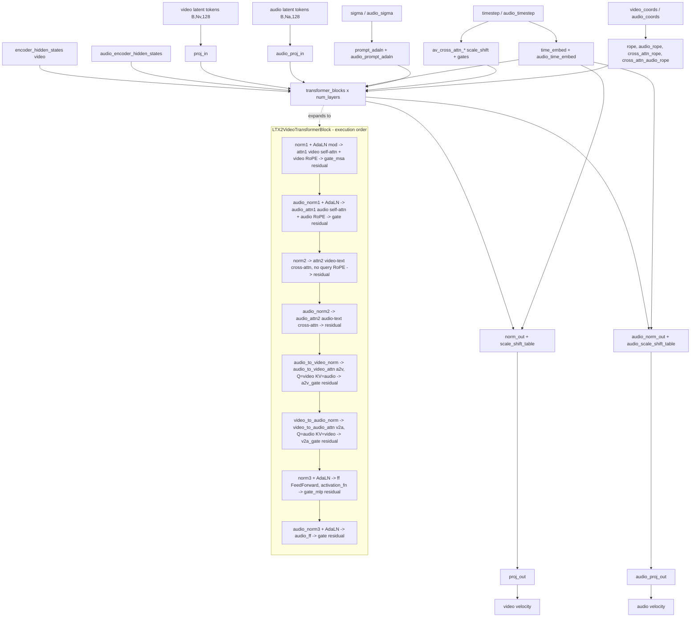

# LTX-2.3 (`ltx2`)

Joint **video + audio** MM-DiT (`LTX2VideoTransformer3DModel`), rectified-flow / velocity
prediction, conditioned by a Gemma-3 multimodal LLM through a learned connector stack.
Two structural facts separate it from every other arch in this repo: (1) the whole model
stack — transformer, both VAEs, connectors, vocoder, pipelines — already exists in the
pinned venv `diffusers`, so `backend/core/models/ltx2/` vendors **nothing** and only
re-exports (`backend/core/models/ltx2/__init__.py`); (2) every transformer block carries
**two parallel residual streams** (video and audio) plus two cross-modal attentions
(a2v / v2a) between them, and both streams survive to two separate output heads. All
SushiUI extension points (block swap, FBCache, Spectrum, TREAD, BlockSkip, KV-injection
style transfer) hang off `Ltx2BlockLoopWrapper` in
`backend/core/models/ltx2_block_loop_wrapper.py`, which re-owns only the block loop and
calls the inner diffusers model's own submodules for every other stage.

## Components

| Role | Class | Module | Notes |
|---|---|---|---|
| Denoiser | `LTX2VideoTransformer3DModel` | `diffusers.models.transformers.transformer_ltx2` | Not vendored. Re-exported by `core.models.ltx2.__init__`. |
| Block-loop wrapper | `Ltx2BlockLoopWrapper` | `core.models.ltx2_block_loop_wrapper` | SushiUI-owned; wraps the transformer, re-owns stage 5 only. |
| Transformer block | `LTX2VideoTransformerBlock` | `diffusers…transformer_ltx2` | Dual-stream (video + audio) with a2v/v2a cross-attention. |
| Attention module | `LTX2Attention` (+ `LTX2AudioVideoAttnProcessor`, `LTX2PerturbedAttnProcessor`) | `diffusers…transformer_ltx2` | diffusers' own dispatch — **not** SushiUI's attention conduit. |
| RoPE | `LTX2AudioVideoRotaryPosEmbed` | `diffusers…transformer_ltx2` | Four instances: `rope`, `audio_rope`, `cross_attn_rope`, `cross_attn_audio_rope`. |
| Timestep / modulation | `LTX2AdaLayerNormSingle` | `diffusers…transformer_ltx2` | `time_embed`, `audio_time_embed`, `av_cross_attn_*`, `prompt_adaln`, `audio_prompt_adaln`. |
| Video VAE | `AutoencoderKLLTX2Video` | `diffusers.models.autoencoders.autoencoder_kl_ltx2` | Re-exported by `core.models.ltx2`. |
| Audio VAE | `AutoencoderKLLTX2Audio` | `diffusers.models.autoencoders.autoencoder_kl_ltx2_audio` | Separate autoencoder for the audio stream. |
| Vocoder | `LTX2VocoderWithBWE` (`LTX2Vocoder`) | `diffusers.pipelines.ltx2.vocoder` | Audio-latent → waveform; `vocoder.config.output_sampling_rate` read in `_generate_txt2vid_ltx2`. |
| Text encoder | `Gemma3ForConditionalGeneration` | `transformers` | Frozen everywhere; loaded via `model_index.json`. |
| Tokenizer | `GemmaTokenizerFast` | `transformers` | |
| Text connectors | `LTX2TextConnectors` | `diffusers.pipelines.ltx2.connectors` | Consumes the packed per-layer TE hidden states (`text_proj_in_factor` = num TE layers + 1) and emits the video/audio conditioning. |
| Scheduler | `FlowMatchEulerDiscreteScheduler` | `diffusers` | |
| Base pipeline | `LTX2Pipeline` | `diffusers.pipelines.ltx2.pipeline_ltx2` | txt2vid. |
| I2V pipeline | `LTX2ImageToVideoPipeline` | `diffusers.pipelines.ltx2.pipeline_ltx2_image2video` | Built from shared modules by `LTX2Mixin._ensure_ltx2_i2v_pipeline`. |
| Condition pipeline | `LTX2ConditionPipeline` + `LTX2VideoCondition` | `diffusers.pipelines.ltx2.pipeline_ltx2_condition` | Built by `_ensure_ltx2_condition_pipeline`; drives temporal outpaint. |
| Quantized Linear | `Int8Linear` / `Fp8Linear` | `core.models.ideogram4.vendor.int8_linear` / `.fp8_linear` | Swapped in by `core.models.ltx2.loader._swap_ltx2_quantized_linears`. |

Nothing in this architecture is vendored: `core/models/ltx2/__init__.py` documents that
the whole LTX-2 stack resolves out of the pinned venv diffusers and that
`LTX2TextConnectors` / `LTX2VocoderWithBWE` resolve through the `"ltx2"` library tag in
`model_index.json`.

## Load path

Entry: `core.models.ltx2.loader.load_ltx2_from_diffusers`, reached from
`ModelLoader.load_ltx2_from_path` (`backend/core/model_loader.py`), which
`ModelLoader.load_model` dispatches to on `model_type == "ltx2"`.

Detection (`ModelLoader.detect_model_type`): **diffusers directory only** — a
`model_index.json` whose `_class_name` is `"LTX2Pipeline"`. There is no single-file
probe and no key-name signature for this arch.

Accepted layouts:

* **Diffusers directory** (`<MODEL_ROOT>/model_index.json` + component subfolders). This
  is the only top-level layout. `LTX2Pipeline.from_pretrained(path, torch_dtype=bf16)`
  resolves every component.
* **Weight-only *scaled* quantized `transformer/` component** — int8 and/or `e4m3` codes
  with per-row `.weight_scale` siblings. Detected **from safetensors headers only** (no
  tensor bytes) by `_quantization_census` → `quantized_state_dict_report` →
  `scaled_quantization_report`. When that reports scaled quantization, the transformer is
  rebuilt here (`accelerate.init_empty_weights` + `LTX2VideoTransformer3DModel.from_config`
  + `_swap_ltx2_quantized_linears` + `load_state_dict(assign=True)`) and handed to
  `from_pretrained` as a pre-built component override.
* **Sharded or single-file component weights** inside `transformer/`: `_transformer_shards`
  accepts `diffusion_pytorch_model.safetensors[.index.json]`, `model.safetensors[...]`, or
  — when neither basename matches — the *single* `.safetensors`/`.index.json` present in
  the directory. It returns the one `source` path the census read, so the census and the
  load can never disagree about which shard set they mean.
* **Plain float8 cast with no scales** takes the untouched diffusers path;
  `scaled_quantization_report` returns `None` and prints why.

Refusals:

* A quantized `transformer/` with no `config.json` and no `transformer_config` metadata
  blob → `FileNotFoundError` from `_transformer_config`. There is deliberately no
  compiled-in geometry default.
* Missing keys after `load_state_dict(assign=True)` on the rebuilt model → `RuntimeError`
  (they would remain meta tensors and detonate at the first forward). A second sweep over
  `named_parameters()`/`named_buffers()` raises on any stranded meta tensor.
* Swap-count disagreement between the header census and
  `_swap_ltx2_quantized_linears` → `verify_quantized_swap` raises.
* Comfy-declared quantization formats this loader cannot install → refused inside
  `quantized_state_dict_report` (the `.comfy_quant` markers are read for real so the
  refusal can name the declared format).

Post-load, `load_ltx2_from_diffusers` moves `text_encoder`, `connectors`, `transformer`,
`vae`, `audio_vae`, `vocoder` to CPU and returns a component dict with
`vae_scale_factor_spatial`, `vae_scale_factor_temporal`, `latent_channels` (read back from
`transformer.config.vae_scale_factors` / `.in_channels` where present) and `is_video: True`.
`text_encoder_quantization` is declared unsupported for `ltx2` in
`backend/api/arch_capabilities.py`; only the `transformer` component is ever quantized.

## Denoiser structure



**Geometry.** `LTX2VideoTransformer3DModel.__init__` declares defaults `num_layers=48`,
`num_attention_heads=32`, `attention_head_dim=128` (→ `inner_dim = 4096`),
`audio_num_attention_heads=32`, `audio_attention_head_dim=64` (→ `audio_inner_dim = 2048`),
`in_channels = out_channels = 128`, `audio_in_channels = audio_out_channels = 128`,
`patch_size = patch_size_t = 1`, `cross_attention_dim=4096`,
`audio_cross_attention_dim=2048`, `caption_channels=3840`, `rope_theta=10000.0`,
`timestep_scale_multiplier = cross_attn_timestep_scale_multiplier = 1000`,
`qk_norm="rms_norm_across_heads"`, `activation_fn="gelu-approximate"`,
`vae_scale_factors=(8, 32, 32)`. These are **class defaults**; the loader builds a
quantized transformer from `<MODEL_ROOT>/transformer/config.json` (or the artifact's
`transformer_config` metadata) and `from_pretrained` reads the same file otherwise, so the
per-checkpoint values are only knowable from a checkpoint, which is not in this repo.
`core.models.ltx2.loader`'s own docstring records the released DiT as 18.98 G of 2-D
tensors and the Gemma-3 encoder as 48 `language_model.*` layers plus a vision tower.

There is exactly **one** block type. `LTX2VideoTransformerBlock.__init__` builds six
`LTX2Attention` modules (`attn1`, `audio_attn1`, `attn2`, `audio_attn2`,
`audio_to_video_attn`, `video_to_audio_attn`), two
`FeedForward`s, eight `RMSNorm`s and the per-layer modulation parameters
`scale_shift_table` / `audio_scale_shift_table` (`9` rows when
`video_cross_attn_adaln` / `audio_cross_attn_adaln`, else `6`), plus
`video_a2v_cross_attn_scale_shift_table` / `audio_a2v_cross_attn_scale_shift_table`
(5 rows: 4 scale/shift + 1 gate). `get_mod_params` unbinds the per-row modulation from
`scale_shift_table[None,None] + temb.reshape(...)`.

The a2v / v2a sublayers (B5 / B6 above) run only when `use_a2v_cross_attention` /
`use_v2a_cross_attention` are set; `Ltx2BlockLoopWrapper` passes
`not isolate_modalities` for both, and `ltx2_ops.train_step` sets
`isolate_modalities=True`, so **cross-modal attention is off during training**.

`Ltx2BlockLoopWrapper._custom_forward` replicates stages 1–4 and 6 by calling the inner
model's submodules (`t.rope`, `t.proj_in`, `t.time_embed`, `t.av_cross_attn_*`,
`t.prompt_adaln`, `t.caption_projection` when `config.use_prompt_embeddings`) and owns
only the `for block_idx, block in enumerate(t.transformer_blocks)` loop.
`_finish_stage6` is the shared output tail used by both the normal loop and
`_blockskip_forward`. `_assert_diffusers_pin` checks `_REQUIRED_SUBMODULES` /
`_REQUIRED_PARAMS` at construction so a diffusers rename fails loudly at load time.

## Tensor contract

| Property | Value | Source symbol |
|---|---|---|
| Video latent | 5-D `[B, 128, T_lat, H/32, W/32]`; packed to `[B, T*H*W, 128]` tokens (patch 1, patch_t 1) | `ltx2_ops._pack_latents`; `LTX2_WIRING` (`latent_channels=128`, `latent_ndim=5`) |
| Spatial / temporal downscale | 32× spatial, 8× temporal | `LTX2VideoTransformer3DModel.__init__` default `vae_scale_factors=(8, 32, 32)`; loader fallbacks `vae_scale_factor_spatial=32`, `vae_scale_factor_temporal=8` |
| VAE normalization | `(x - latents_mean) * scaling_factor / latents_std` on encode | `ltx2_ops._normalize_ltx_latents` (mirrors `LTX2Pipeline._normalize_latents`); `vae.latents_mean` / `vae.latents_std` / `vae.config.scaling_factor` |
| Audio latent | `[B, L_audio, audio_in_channels]` token rows | `LTX2VideoTransformer3DModel.__init__` `audio_in_channels=128`; `ltx2_ops._DEFAULT_AUDIO_IN_CHANNELS` |
| Audio latent rate | `audio_sampling_rate / audio_hop_length / audio_vae_temporal_compression_ratio`, fallback 18.75 /s | `ltx2_ops._resolve_audio_latents_per_second`, `_DEFAULT_AUDIO_LATENTS_PER_SECOND` |
| Text embedding | 3840 is `caption_channels`, the Gemma-3 per-layer feature width the connector consumes — **not** what the DiT receives. What reaches `encoder_hidden_states` is post-connector and per-modality: video `cross_attention_dim` 4096, audio `audio_cross_attention_dim` 2048 (LTX-2.3's `per_modality_projections` branch projects to `video_hidden_dim` / `audio_hidden_dim`; on LTX-2.0 the shared 3840 output is projected by the DiT's own `caption_projection`) | `LTX2_WIRING.te_out_dim=3840`; `LTX2TextConnectors.__init__` (`caption_channels=3840`, `video_hidden_dim=4096`, `audio_hidden_dim=2048`) and `.forward`; `LTX2VideoTransformer3DModel.__init__` `cross_attention_dim` / `audio_cross_attention_dim` |
| TE packing | `te_seq_packing="llm"`; the connector consumes **all** TE layers (`text_proj_in_factor = num_layers + 1`) | `LTX2_WIRING`; `LTX2TextConnectors.__init__` |
| Caption projection | LTX-2.0 only (`config.use_prompt_embeddings`); LTX-2.3 projects inside the connector and the `caption_projection` submodules are absent | `LTX2VideoTransformer3DModel.__init__`; `_REQUIRED_SUBMODULES` comment in `ltx2_block_loop_wrapper` |
| Pooled / auxiliary cond | none; conditioning is `temb`/`temb_audio` (AdaLN) + `av_cross_attn_*` scale/shift/gates + `temb_prompt` when `prompt_modulation` | `LTX2AdaLayerNormSingle`; `LTX2VideoTransformer3DModel.__init__` (`prompt_modulation = cross_attn_mod or audio_cross_attn_mod`) |
| Positional encoding | RoPE over 3 axes `(frame, height, width)` for video and 1 temporal axis for audio; `rope_type` default `"interleaved"` (`[B,N,D]`), `"split"` gives `[B,H,N,D//2]` | `LTX2AudioVideoRotaryPosEmbed`; `_gather_video_rope` handles both shapes |
| Video coords | `[B, 3, N, 2]`, axis-1 index 0 is temporal; the transformer divides it by a **scalar** `fps` | `LTX2AudioVideoRotaryPosEmbed.prepare_video_coords`; `ltx2_ops.train_step` builds coords at `fps=1.0` then divides axis 0 by the per-sample fps |
| Timestep convention | `timestep = sigma * 1000` (`timestep_scale_multiplier=1000`); the pipeline passes `sigma=timestep` (raw scheduler timestep) | `ltx2_ops.train_step`; `Ltx2BlockLoopWrapper._style_capture_ref` divides by 1000 to recover flow sigma |
| Forward process | `x_t = (1 - sigma) * x0 + sigma * noise`; sigma decreases toward 0 | `ltx2_ops.train_step` |
| Prediction target | velocity `v = noise - x0`; `x0 = x_t - sigma * v` | `ltx2_ops.train_step`; `LTX2Pipeline.convert_velocity_to_x0` (`sample - v * sigmas[i]`) |
| Model output | `AudioVisualModelOutput(sample=..., audio_sample=...)` or the 2-tuple | `diffusers…transformer_ltx2.AudioVisualModelOutput` |

`ComponentWiringSpec` (`core.models.components.wiring`) is declared by its own module
docstring as **pure spec data carrying no behavior**; the authoritative normalization is
`ltx2_ops._normalize_ltx_latents`.

## Generation path

Backend mixin: `LTX2Mixin` (`backend/core/pipeline_backends/ltx2.py`), mixed into
`DiffusionPipelineManager` (`backend/core/pipeline.py`).

| Route | Entry | Pipeline driven |
|---|---|---|
| txt2vid | `_generate_txt2vid_ltx2` | `LTX2Pipeline.__call__` |
| img2vid | `_generate_img2vid_ltx2` | `LTX2ImageToVideoPipeline` (`_ensure_ltx2_i2v_pipeline`) |
| video outpaint | `_generate_vidoutpaint_ltx2` | `LTX2ConditionPipeline` + `LTX2VideoCondition` (`_ensure_ltx2_condition_pipeline`) |

The sampling loop is **diffusers'** — SushiUI does not own a denoise loop for this arch.
Per-step hooks are attached through `callback_on_step_end`, which advances
`_fbcache_step`, `_spectrum_step`, `_style_step_idx` on the wrapper and reports progress.
Output is `output_type="np"`, batch index 0, scaled to `uint8 [T,H,W,3]`; audio is
`audio[0]` on CPU with the rate read from `pipeline.vocoder.config.output_sampling_rate`.

**CFG shape.** `LTX2Pipeline.do_classifier_free_guidance` is
`guidance_scale > 1.0 or audio_guidance_scale > 1.0`. When on, the pipeline concatenates
`[negative, positive]` on the batch axis and runs **one** transformer forward per step on
the doubled batch. It then converts *each* half to x0 (`convert_velocity_to_x0`) and uses
a delta form: `video_cfg_delta = (guidance_scale - 1) * (cond - uncond)`, and the same
with `audio_guidance_scale` for the audio stream — i.e. video and audio have separate
guidance scales. Spatio-temporal guidance (`stg_scale`) adds further forward passes in
diffusers but SushiUI never sets it (`do_spatio_temporal_guidance` is always false; the
wrapper's style path documents that).

Arch-specific generation stages, all opt-in and all owned by `LTX2Mixin`:

* `_ltx2_runtime_int8` — one-time in-place INT8 conversion of the DiT, called at the top
  of all three generate paths, **before** `_ensure_ltx2_swap_and_offload`.
* `_ensure_ltx2_offload` — `enable_model_cpu_offload` in `"normal"` or `"block_swap"`
  mode; block-swap mode drops `"transformer"` from the instance's
  `model_cpu_offload_seq` and adds it to `_exclude_from_cpu_offload`. Also calls
  `vae.enable_tiling()` unconditionally.
* `_ensure_ltx2_block_swap_wrapper` / `_ensure_ltx2_swap_and_offload` — wrap/unwrap
  ordering (offload first when enabling, unwrap first when disabling).
* `_ltx2_build_fbcache`, `_ltx2_build_spectrum`, `_ltx2_resolve_style` /
  `_ltx2_style_configs`.

## Training path

Arch handler: `Ltx2ArchHandler` (`backend/core/training/arch/ltx2.py`), registered as
`"ltx2"` in `ARCH_REGISTRY` (`core/training/arch/__init__.py`). Math lives in
`backend/core/training/ops/ltx2_ops.py`. Adapters:
`Ltx2LoRAAdapter` and `Ltx2FullParameterAdapter`
(`backend/core/training/adapters/ltx2_adapter.py`).

`ltx2_ops.load_components` reuses the inference loader, then:

* forces **bf16** for `weight_dtype` / `training_dtype` / `vae_dtype` when they are fp16
  (fp16 overflows to NaN) and disables the `GradScaler`;
* calls `disable_scaled_mm` / `disable_int8_mm` on transformer, text encoder and
  connectors — a training process is dequant-only;
* freezes `vae`, `text_encoder`, `connectors`, `audio_vae`, `transformer` (LoRA is added
  afterwards by the adapter);
* optionally FP8-quantizes the frozen base via `core.vram_optimization._anima_quantize_fp8`
  when `fp8_base_dtype` is set **and** the DiT is not itself trained.

Trainable by default:

* **LoRA** — `DEFAULT_LTX2_SCOPE = {"attention": True, "ff": False, "audio": False,
  "av_cross": False}`, i.e. only the **video** self/cross attention.
* **Full fine-tune** — `Ltx2FullParameterAdapter.prepare_models_for_training` sets
  `transformer.requires_grad_(True)` when `train_unet`; Gemma-3, connectors and both VAEs
  stay frozen. `reject_quantized_base` refuses a quantized base, twice (in
  `prepare_models_for_training` and again in `setup_trainable_parameters`).

LoRA targets (`iter_ltx2_lora_targets`), walking `transformer.transformer_blocks`:

```
transformer_blocks.{i}.{attn1|attn2}.{to_q,to_k,to_v,to_out.0}          # scope attention
transformer_blocks.{i}.{audio_attn1|audio_attn2}.{...}                  # scope audio
transformer_blocks.{i}.{audio_to_video_attn|video_to_audio_attn}.{...}  # scope av_cross
transformer_blocks.{i}.ff.<named_modules Linear>                        # scope ff
```

Key format: sd-scripts native — `lora_unet_<dotted path with '.' -> '_'>` with
`.lora_down.weight` / `.lora_up.weight` / `.alpha`; metadata `model_type="ltx2"`,
`modelspec.architecture="ltx2"`. Target selection uses `is_lora_wrappable_linear`, not
`isinstance(nn.Linear)`, so `Int8Linear`/`Fp8Linear` are not silently skipped. Full-FT
checkpoints are saved with a `net.` prefix on every DiT key.

Train step (`ltx2_ops.train_step`): video-only. It packs `x_t`, feeds a **no-grad dummy
noise** audio tensor (`randn`, length = clip duration × audio-latents/s), sets
`isolate_modalities=True` (a2v/v2a off), `audio_timestep = audio_sigma = 1000` and
discards the audio prediction. Loss is `MSE(v_pred_video, pack(noise - latents))` plus an
optional `reconstruction_loss_weight * MSE(x_t - sigma*v, x0)`.

Refusals / structural constraints in the training adapter and ops:

* `Ltx2FullParameterAdapter` refuses a weight-only quantized base (`reject_quantized_base`).
* `fp8_base_dtype` combined with a trained DiT emits `fp8_base_dtype_ignored` and is dropped.
* TREAD and DiT-BlockSkip are mutually exclusive (`Ltx2BlockLoopWrapper.attach_tread` /
  `.attach_blockskip` assert each other out); BlockSkip additionally requires
  `blocks_to_swap == 0` (enforced in `base_trainer`, asserted in `_custom_forward`).
* `Ltx2ArchHandler.vae_decode` raises `NotImplementedError` — sampling reuses
  `LTX2Pipeline` directly (`ltx2_ops.generate_sample`).

## Hook points

| Hook | Supported | Owner symbol |
|---|---|---|
| Attention conduit entry | **Unsupported** | Attention runs through diffusers' own dispatcher; `ltx2_ops.setup_attention_backend` is a no-op stub and `arch_capabilities` declares `attention_type` unsupported for `ltx2`. |
| Block swap boundary (generation) | Yes | `Ltx2BlockLoopWrapper._custom_forward` (`offloader.wait_for_block` / `submit_move_blocks_forward`); offloader built in `LTX2Mixin._ensure_ltx2_block_swap_wrapper` via `core.memory_management.TransformerBlockOffloader` with `h2d_only=True`, `supports_backward=False`, `use_pinned_memory=False`. |
| Block swap boundary (training) | Yes | `ltx2_ops.setup_block_swap` → `core.memory_management.LayerOffloadConductor` over `transformer.transformer_blocks`. |
| FBCache indicator | Yes | `Ltx2BlockLoopWrapper.attach_fbcache`; indicator = the **video** stream residual after block 0; the cached object is the `(video_residual, audio_residual)` tuple. Built by `LTX2Mixin._ltx2_build_fbcache`. Inference-only; mutually exclusive with Spectrum, Block Swap and style. |
| Spectrum output forecasting | Yes | `Ltx2BlockLoopWrapper.attach_spectrum` (two forecasters, identical config); skips the entire forward on a non-anchor step. Built by `_ltx2_build_spectrum`. |
| Quantized Linear swap (load) | Yes | `core.models.ltx2.loader._swap_ltx2_quantized_linears` + `verify_quantized_swap`. |
| Quantized Linear swap (runtime) | Yes, `int8` only | `LTX2Mixin._ltx2_runtime_int8` → `vram_optimization.apply_runtime_int8_quantization`; `arch_capabilities` declares `ARCH_SUPPORTED_VALUES["ltx2"]["unet_quantization"] = ["int8"]`. Text encoder quantization unsupported. |
| Keep-hot residency | **Unsupported** | `core/keep_hot.py` is not imported by `pipeline_backends/ltx2.py`; residency is owned by diffusers' `enable_model_cpu_offload`. |
| Activation offload / dispatch | Training only, opt-in | `BaseTrainer._activation_dispatch_begin` + `core.memory_management.ActivationDispatcher`; `_actdispatch_latent_key` folds the 5-D clip length `T` into the bucket key. `LayerOffloadConductor` is built with `enable_activation_offload=False` in `ltx2_ops.setup_block_swap`. |
| TREAD token routing (training) | Yes | `Ltx2BlockLoopWrapper.attach_tread`; gather/scatter via `core.training.token_routing.select_kept_indices` / `gather_tokens` / `scatter_tokens`; only the **video** stream is routed and only `video_rotary_emb` is gathered (`_gather_video_rope`). |
| DiT-BlockSkip (training) | Yes | `Ltx2BlockLoopWrapper.attach_blockskip` → `_blockskip_forward` (no-grad delta capture over the skipped front/back spans of **both** streams, gradient pass over the middle blocks). |
| Reference-style KV injection | Yes | `Ltx2BlockLoopWrapper.attach_style` + `core.inference.style_ltx2.install_ltx2_style_processors` / `set_ltx2_style_context` / `restore_ltx2_style_processors`; scope is video `attn1` only. Multi-ref via `_style_refs` + `core.inference.reference_style.inject_kv_multi`. CFG-decoupled style guidance is the lambda rewrite in `_custom_forward`. |
| Arch-specific wrapper | `Ltx2BlockLoopWrapper` | Installed for generation by `_ensure_ltx2_block_swap_wrapper`, for training by `ltx2_ops.setup_wrapper` (only when TREAD or BlockSkip is configured). |
| ControlNet / NAG / advanced CFG | **Unsupported** | Declared in `backend/api/arch_capabilities.py` for `ltx2`. |
| Generation-time LoRA | **Unsupported** | `arch_capabilities`: `_add("ltx2", "lora", ...)` — no generation-path LoRA loader exists for this arch. |
| VAE override / VAE tiling parameter | **Unsupported** | `arch_capabilities`: the backend enables tiling unconditionally in `_ensure_ltx2_offload` and never reads `vae_tiling`. |
| Block-swap sub-knobs (`h2d_only`, pinned memory, ring size) | **Unsupported** | Hardcoded in `_ensure_ltx2_block_swap_wrapper`; declared unsupported in `arch_capabilities`. |

## Constraints

| Constraint | Value | Enforcing symbol |
|---|---|---|
| Clip length grid | `8k + 1` frames | `LTX2_TEMPORAL` (`frame_multiple=8`, `frame_offset=1`) in `core/models/components/wiring.py` |
| Latent frames | `(T - 1) // 8 + 1` | `LTX2_TEMPORAL.latent_frames` |
| Off-grid length | **400, never snapped** | `LTX2_TEMPORAL.snap_invalid_length=False`; `api.generation_utils.validate_video_geometry` |
| Frame bounds | `min_frames=1`, `max_frames=None`, `min_decodable_frames=1`, `trained_max_frames=None`; suggested floor 9 | `LTX2_TEMPORAL` |
| Frame rate | not fixed — the clip's own fps is preserved and fed to RoPE per sample | `LTX2_TEMPORAL.fps_fixed=None`; `ltx2_ops.train_step` per-sample `fps_ps` |
| Spatial alignment | both axes multiple of 32; no canvas envelope | `Ltx2ArchHandler.pixel_align = 32`; `LTX2_TEMPORAL.pixel_align=32`, `max_pixel_hw=None` |
| Minimum inference steps | 1 (N steps = N model evaluations) | `LTX2_TEMPORAL` step-count fields (defaults, measured against `FlowMatchEulerDiscreteScheduler`) |
| dtype | bf16 required for training; fp16 is overridden and the GradScaler disabled | `ltx2_ops.load_components` |
| Training batch fps | a batch may mix fps; `fps` must be a `[B]` tensor, a scalar, or `None` | `ltx2_ops.train_step` (raises on a length mismatch) |
| FBCache ⟂ Spectrum | mutually exclusive | asserted in `Ltx2BlockLoopWrapper.attach_fbcache` / `attach_spectrum` and in `forward` |
| Style ⟂ FBCache / Spectrum / Block Swap | mutually exclusive; the caller forces `blocks_to_swap = 0` | asserted in `Ltx2BlockLoopWrapper.attach_style`; resolved in `LTX2Mixin._ltx2_resolve_style` |
| TREAD ⟂ BlockSkip; BlockSkip ⟂ Block Swap | mutually exclusive | `attach_tread` / `attach_blockskip` asserts; `base_trainer` enforces `blocks_to_swap == 0` for BlockSkip |
| FBCache / Spectrum / style / TREAD / BlockSkip mode gates | inference-only vs training-only | `assert not torch.is_grad_enabled()` in `forward` / `_custom_forward`; TREAD & BlockSkip gate on `self.training and torch.is_grad_enabled()` |
| INT8 conversion ordering | must run before the block offloader exists | `LTX2Mixin._ltx2_runtime_int8` `precheck` → `RuntimeError` |
| Diffusers submodule pin | fixed set of inner submodule/parameter names | `Ltx2BlockLoopWrapper._assert_diffusers_pin` (`_REQUIRED_SUBMODULES`, `_REQUIRED_PARAMS`) |
