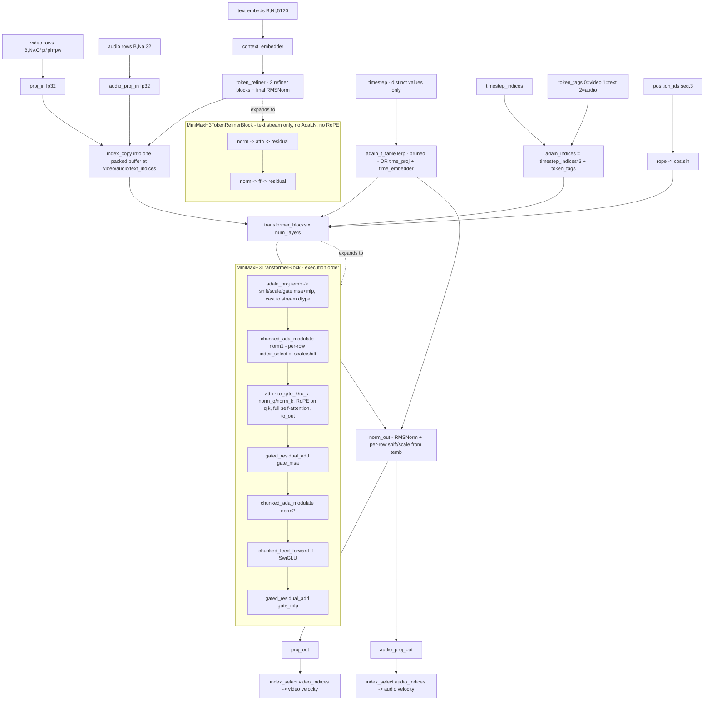

# MiniMax-H3 (`minimax_h3`)

Joint **video + audio** DiT (`MiniMaxH3Transformer3DModel`, vendored), flow matching with
a **reversed velocity sign** (`x0 = x_t + sigma * v`). Two structural facts set it apart
from every other architecture here: (1) it is a **single stream with no cross-attention at
all** — one packed 1-D sequence of `[text | conditioning | audio | video]` rows scattered
in with `index_copy`, run through 50 identical blocks under full self-attention, then split
back out with `index_select`; modality-specific behaviour comes only from the input patch
projections, a per-row AdaLN modality tag and two output heads. (2) It is **guidance-distilled**:
one forward per step, no unconditional branch, no `guidance_scale`. Sampling is not a
diffusers pipeline — MiniMax ships only a Modular pipeline, so the denoise loop lives in
`backend/core/models/minimax_h3/h3_pipeline_ops.py`.

## Components

| Role | Class | Module | Notes |
|---|---|---|---|
| Denoiser | `MiniMaxH3Transformer3DModel` | `core.models.minimax_h3.vendor.transformer_minimax_h3` | **Vendored** (`backend/core/models/minimax_h3/vendor/`) from the diffusers `minimax-h3` branch; modified — see the file header. |
| Block-loop wrapper | `MiniMaxH3BlockLoopWrapper` | `core.models.minimax_h3_block_loop_wrapper` | SushiUI-owned; re-owns only the block loop + stages the token refiner under block swap. |
| Transformer block | `MiniMaxH3TransformerBlock` | vendored `transformer_minimax_h3` | `norm1`/`attn`/`norm2`/`ff`/`adaln_proj`. |
| Attention | `MiniMaxH3Attention` + `MiniMaxH3AttnProcessor` | vendored `transformer_minimax_h3` | Routed through SushiUI's unified conduit (`core.attention.dispatch_attention`, `layout="BSHD"`). |
| Text-stream refiner | `MiniMaxH3TokenRefiner` / `MiniMaxH3TokenRefinerBlock` | vendored `transformer_minimax_h3` | 2 layers by default; runs once per forward on the text rows. |
| RoPE | `MiniMaxH3RotaryPosEmbed` | vendored `transformer_minimax_h3` | 3-axis `(t, h, w)` over the packed sequence. |
| AdaLN modulation | `MiniMaxH3AdaLayerNormModulation`, `MiniMaxH3AdaLayerNormOut`, `sample_adaln_curve` | vendored `transformer_minimax_h3` | `sample_adaln_curve` + `adaln_t_table` is the SushiUI-added "pruned" variant. |
| Video VAE | `AutoencoderKLMiniMaxH3` | `core.models.minimax_h3.vendor.autoencoder_kl_minimax_h3` | **Vendored**. Conv encoder + 36-layer **ViT** decoder. |
| Audio VAE | `AutoencoderKLMiniMaxH3Audio` | `core.models.minimax_h3.vendor.autoencoder_kl_minimax_h3_audio` | **Vendored**. Mono; stereo is carried as two batch items. |
| Image VAE (optional) | `AutoencoderKLMiniMaxH3` | same vendored class | Optional community T=1 checkpoint; `None` when absent. Selected by `pipeline_backends.minimax_h3.select_minimax_h3_decode_vae`. |
| Scheduler ×2 | `MiniMaxH3Scheduler` | `core.models.minimax_h3.vendor.scheduling_minimax_h3` | **Vendored**. One instance per modality (`scheduler`, `audio_scheduler`). |
| Text encoder | `Qwen3VLForConditionalGeneration` | `transformers` | Truncated to 50 decoder layers, full 27-block vision tower; **never moved to GPU** (streamed off the mmap). |
| Tokenizer / processor | Qwen3-VL tokenizer + processor | `transformers` | Loaded from the config-only tree by `loader._load_tokenizer_and_processor`. |
| TE projection (optional) | resolved dict | `core.models.minimax_h3.te_projection` | Only for a converted stand-in encoder; refused unless a projection trained for that exact `(width, tap)` pair resolves. |
| Quantized Linear | `Fp8Linear`, `Int8Linear`, `ConvRotInt8Linear`, `Nvfp4Linear`, `Int8Embedding`, `GGUF` readers | `core.models.ideogram4.vendor.{fp8,int8}_linear`, `core.models.common.{convrot_int8_linear,nvfp4_linear,int8_embedding}` | Swapped in by `loader._swap_minimax_h3_quantized_linears` and the TE builders. |
| Reference bank | `MiniMaxH3Reference` + helpers | `core.models.minimax_h3.h3_references` | `ref2va` media validation / normalization / encoding / presentation. |
| Hybrid DiT | `MiniMaxH3HybridPreflight` + reader | `core.models.minimax_h3.hybrid_spec`, `.hybrid_reader` | Merges a `ref2va` overlay's per-block AdaLN projections onto an `fl2va` base. |

## Load path

Entry: `core.models.minimax_h3.loader.load_minimax_h3_from_path`, reached from
`ModelLoader.load_minimax_h3_from_path` (`backend/core/model_loader.py`).

Detection: `ModelLoader._looks_like_minimax_h3`, delegating the signature to
`loader.is_minimax_h3_safetensors` → `loader.keys_look_minimax_h3` (requires a
`token_refiner.` key **and** at least one key from `_MINIMAX_H3_ONLY_KEYS`). Three accepted
spellings, all header/JSON-only:

* a directory whose `model_index.json` declares `MINIMAX_H3_PIPELINE_CLASS`
  (`"MiniMaxH3ModularPipeline"`);
* the ComfyUI-style flat tree — `<MODEL_ROOT>/diffusion_models/` holding a DiT whose key
  names match, beside `vae/`, `text_encoders/` and the config-only `official/`;
* a single DiT `.safetensors` anywhere under a `diffusion_models/` parent.

`loader.detect_minimax_h3_layout` resolves
`{dit, vae, audio_vae, image_vae, text_encoder, official, root, variant, text_encoder_reason}`.
A bare `official/` resolves **upward** to its weight-bearing parent. `variant` is the
`fl2va` / `ref2va` partition read off the DiT filename. File selection order is
`MINIMAX_H3_DIT_PATTERNS`, `MINIMAX_H3_VIDEO_VAE_PATTERNS`,
`MINIMAX_H3_AUDIO_VAE_PATTERNS`, `MINIMAX_H3_IMAGE_VAE_PATTERNS`, `MINIMAX_H3_TE_PATTERNS`,
each with a glob fallback (`_find_first`).

Transformer geometry is **synthesized from the checkpoint header**
(`_synthesize_transformer_config`), not from `official/transformer/config.json`: the
released files are the "pruned" / AdaLN-curve variant carrying `adaln_t_table` and no
`time_embedder.*`, while the shipped config describes the full-modulation variant.
`_map_dit_state_dict` + `_rename_dit_key` do the key rewrite; `_DIT_ADALN_KEYS` upcasts the
AdaLN projections; `_DIT_DROPPED_KEYS` drops `rope.inv_freq` (computed, not loaded).

Accepted quantized flavours (DiT): scaled `fp8_e4m3fn` with per-tensor scalar
`weight_scale` (broadcast by `_broadcast_scale`), scaled int8, packed `asym_w4a8_int8`
(`_w4a8_layers_from_metadata`), and released `int8_tensorwise` ConvRot. Text encoder:
`bf16`, released `int8_tensorwise` ConvRot, released `nvfp4` AWQ (with
`.pre_quant_scale` on `o_proj`/`down_proj` and an `int8_tensorwise` `embed_tokens`), plus
GGUF via `te_gguf_native` / `te_gguf_convert`. `MINIMAX_H3_TE_LOADABLE_QUANT_FORMATS`
gates the header-only loadability predicate `_te_capability_accept`.

Refusals:

* Missing `dit` / `vae` / `audio_vae` (and `text_encoder` unless `load_text_encoder=False`)
  → `ValueError` naming the expected filenames.
* No config-only tree, or a tree missing `vae/config.json`, `audio_vae/config.json`,
  `text_encoder/config.json` → `FileNotFoundError`, raised **up front** before 21 GB of DiT
  is mapped.
* Both VAEs go through `quantized_checkpoint_guard.refuse_quantized_state_dict` — they have
  no swap path, so a quantized VAE file is refused rather than cast.
* Any quantization declaration outside the exact accepted contracts (validated by
  `_supported_h3_nvfp4_marker`, `_supported_h3_int8_embedding_marker`, `_guard_component_file`)
  is refused. `_assert_guard_reached` pins that the guard actually ran.
* Swap-count disagreement vs the header census → `verify_quantized_swap` raises.
* A hybrid preflight whose `base_dit_path` does not resolve to the same file as
  `model_path` → `ValueError`.
* A `.gguf` text encoder is reachable **only** as an explicit `te_override`; a converted
  stand-in encoder is never auto-selected and is refused without a matching projection.
* `pipeline_backends.minimax_h3.MiniMaxH3Mixin._minimax_h3_move` raises if anyone calls
  `.to()` on the text encoder — that detaches all 902 tensors from the file mapping.

Every component stays CPU-resident after load; the returned dict carries the geometry
constants, the fp32 `latents_mean`/`latents_std` from the configs, `pixel_mean`/`pixel_std`,
and `vae_tiling_policy` (a copy of `MINIMAX_H3_VAE_TILING_POLICY`).

## Denoiser structure



**Geometry.** `MiniMaxH3Transformer3DModel.__init__` declares defaults
`num_attention_heads=56`, `attention_head_dim=128`, `hidden_size=5376`, `num_layers=50`,
`num_refiner_layers=2`, `ffn_dim=14336`, `in_channels=24`, `audio_in_channels=32`,
`patch_size=(1,2,2)`, `text_dim=5120`, `freq_dim=256`, `time_embed_hidden_dim=5376`,
`time_embed_dim=2688`, `rope_freq_dim=16`, `rope_theta=10000.0`. Note
`num_attention_heads * attention_head_dim` (7168) is deliberately **larger** than
`hidden_size`. For the released "pruned" files these are not the numbers actually used:
`loader._synthesize_transformer_config` derives the geometry from the checkpoint header
instead, and the pruned variant replaces the timestep MLP with an `adaln_t_table` buffer
(the loader docstring records the released shape as `[1025, 8]`, i.e. `time_embed_dim = 8`
against a 1025-row grid). Exact per-checkpoint values are only knowable from a checkpoint,
which is not in this repo.

Two block types: the `MiniMaxH3TransformerBlock`s over the packed sequence, and the
2-layer `MiniMaxH3TokenRefinerBlock` stack that pre-processes only the projected text
stream (no modulation, no rotary embedding, its own `final_norm`).

Every block shares one `adaln_proj` between `norm1` and `norm2` and across all three
modalities; it emits `(num_timesteps * 3, hidden_size)` rows, addressed per sequence row by
`adaln_indices = timestep_indices * MINIMAX_H3_MODALITY_NUM + token_tags`
(`MINIMAX_H3_MODALITY_NUM = 3`). SushiUI's chunked forms
(`core.models.minimax_h3.adaln_chunking.chunked_ada_modulate` / `gated_residual_add` /
`chunked_norm_out` / `chunked_norm_out_proj_fused`, `.ff_chunking.chunked_feed_forward`,
`.rope_inplace.apply_rotary_emb`) chunk over the sequence axis and fall back to the exact
stock expression under autograd or for short sequences. `gated_residual_add` mutates its
residual **in place** at inference — the aliasing hazard that forces
`MiniMaxH3BlockLoopWrapper._custom_forward` to clone `original_hidden_states` when FBCache
is attached.

Both output heads run over **every** row and the modality rows are selected afterwards.
`fuse_output_proj` (opt-in, **not bit-exact**) folds `proj_out`/`audio_proj_out` into the
norm-out chunk loop via `chunked_norm_out_proj_fused`.

`MiniMaxH3BlockLoopWrapper._custom_forward` replicates the stock stages by calling the
inner model's submodules — including `t._stamp_attention_backend()`, whose omission would
strand the conduit backend from a previous generation.

## Tensor contract

| Property | Value | Source symbol |
|---|---|---|
| Video latent | 5-D `[B, 24, T_lat, H/16, W/16]`, patchified `(1, 2, 2)` to `[B, T*H'/2*W'/2, 24*4]` rows, frame-major | `MINIMAX_H3_LATENT_CHANNELS = 24`; `h3_pipeline_ops.patchify_video_latents`; `MiniMaxH3Transformer3DModel.__init__` `patch_size=(1,2,2)` |
| VAE compression | 16× spatial, 4× temporal (VAE's own); the DiT sees 32× spatially because of its own 2×2 patchify | `MINIMAX_H3_VAE_SPATIAL_COMPRESSION`, `MINIMAX_H3_VAE_TEMPORAL_COMPRESSION`; `MINIMAX_H3_WIRING.vae_scale_factor=16` |
| Latent frames | `1` at `T==1`, else `ceil(T/17)*5 - 3` | `loader.minimax_h3_latent_frames`; `MINIMAX_H3_TEMPORAL.latent_frames` |
| VAE normalization | `(x - latents_mean) / latents_std`, fp32 vectors from the **config**, not the fp16 tensors | `minimax_h3_ops._normalize_video_latents`; `components["latents_mean"/"latents_std"]`; `MINIMAX_H3_WIRING.vae_norm="shift_scale"` |
| Pixel convention | **ImageNet-normalised RGB over `[0, 1]`**, not `[-1, 1]` | `MINIMAX_H3_PIXEL_MEAN = (0.485, 0.456, 0.406)`, `MINIMAX_H3_PIXEL_STD = (0.229, 0.224, 0.225)` |
| Audio latent | 32 ch, 32 kHz, 40 latents/s, **stereo carried channel-major** as `[2*T_aud, 32]` rows | `MINIMAX_H3_AUDIO_LATENT_CHANNELS = 32`, `MINIMAX_H3_AUDIO_SAMPLE_RATE = 32000`, `MINIMAX_H3_AUDIO_LATENT_RATE = 40.0`, `h3_pipeline_ops.AUDIO_CHANNELS = 2`, `.unpack_audio_rows` |
| Audio latent count | `round(T / fps * latents_per_second)` | `h3_pipeline_ops.audio_latent_frames` |
| Text embedding | 5120-dim, the **unnormalised** hidden state after Qwen3-VL decoder layer 50 | `h3_pipeline_ops.TEXT_ENCODER_LAYER = 50`; `MINIMAX_H3_WIRING.te_out_dim=5120`; `MiniMaxH3Transformer3DModel.__init__` `text_dim=5120` |
| Pooled / auxiliary cond | none — conditioning is the packed text rows plus the per-`(timestep, modality)` AdaLN table | `MINIMAX_H3_WIRING.te_pooled_dim=None`; `MiniMaxH3AdaLayerNormModulation` |
| Positional encoding | 3-axis RoPE over `(t, h, w)`; one shared `inv_freq` of `rope_freq_dim` frequencies per axis, concatenated to `3*rope_freq_dim` then doubled → `2*3*rope_freq_dim` rotated channels | `MiniMaxH3RotaryPosEmbed` |
| Rotary grid | spatial grids scaled by `ROPE_SPATIAL_SCALE = 32.0`; temporal spans `ROPE_FRAME_RESCALE (5/3) * ROPE_FRAMES_PER_LATENT (1,4,4,4,4)`; audio shares the video clock (1 unit per latent) and is pinned to the two extremes of its block's width grid, with no height coordinate | `h3_pipeline_ops._spatial_position_grid`, `_temporal_position_grid`, `_fill_audio_positions` |
| Timestep convention | continuous `t` in `[0, 1]`, **unscaled**, `t = 1` is clean; forward process `x_t = t*x0 + (1-t)*noise` | `MiniMaxH3Scheduler.scale_noise`; `MiniMaxH3Transformer3DModel` docstring (`freq_dim`) |
| Per-row timesteps | one forward serves several noise levels: `timestep` holds the distinct values, `timestep_indices` maps each sequence row to one | `h3_pipeline_ops.build_row_timesteps` |
| Sigma schedules | **two**: video `SHIFT_VIDEO = 12.0`, audio `SHIFT_AUDIO = 3.0`; `sigma' = s*sigma / (1 + (s-1)*sigma)` over `linspace(1, 0, N)` with duplicate collapse | `h3_pipeline_ops.SHIFT_VIDEO/SHIFT_AUDIO`; `MiniMaxH3Scheduler.set_timesteps`, `.set_shift` |
| Prediction target | velocity with the **reversed** sign: `v = x0 - eps`, so `x0 = x_t + sigma * v` | `MiniMaxH3Scheduler` docstring; `minimax_h3_ops.train_step` (`target_a = x0_a - eps_a`) |
| Pinned conditioning `t` | visual anchors `VISUAL_COND_TIMESTEP = 0.999`, audio references `AUDIO_COND_TIMESTEP = 1.0` | `h3_pipeline_ops` |
| Conditioning encode seed | fixed `KEYFRAME_ENCODE_SEED = 42`, independent of the request seed | `h3_pipeline_ops` |
| Mixed precision | `proj_in`, `audio_proj_in`, `time_embedder`, `proj_out`, `audio_proj_out`, `rope` stay fp32; the block stack is bf16 | `MiniMaxH3Transformer3DModel._keep_in_fp32_modules` |
| Model output | `MiniMaxH3TransformerOutput(sample=..., audio_sample=...)` or the 2-tuple | vendored `transformer_minimax_h3` |

## Generation path

Backend mixin: `MiniMaxH3Mixin` (`backend/core/pipeline_backends/minimax_h3.py`).
There is **one** generation function, `_generate_minimax_h3`; the route entries
(`_generate_txt2vid_minimax_h3`, `_generate_img2vid_minimax_h3`,
`_generate_ref2vid_minimax_h3`, `_generate_vidoutpaint_minimax_h3`,
`_generate_vidinpaint_minimax_h3`) differ only in which presentation the conditioner reads,
what is VAE-encoded as conditioning, and which layout builder runs.

Sampling loop: `h3_pipeline_ops.denoise` — SushiUI-owned. It sets both schedulers' shifts
and timesteps, pins `begin_index=0` on both, and steps **both** once per iteration (video
rows on the video sigma grid, audio rows on the audio grid). Conditioning rows are never
written; only the generated slice is.

**CFG shape: none.** The checkpoint is guidance-distilled — one forward per step, no
unconditional branch, no negative prompt. `arch_capabilities` declares `cfg`,
`negative_prompt`, `advanced_cfg` and `nag` unsupported for `minimax_h3`; both keys are
accepted and warned on a non-default value.

Step-count contract: `num_inference_steps` counts **sigma grid points including the
terminal 0**, so it drives `N - 1` model evaluations; `MINIMAX_H3_TEMPORAL` sets
`min_inference_steps=2`, `steps_are_sigma_grid_points=True`.

Arch-specific generation stages:

* **Strictly sequential offload.** No two components fit together. `_minimax_h3_move`
  stages one component at a time; `_minimax_h3_assert_components_off_cuda` refuses a phase
  transition while an inactive component is still resident. The text encoder is *never*
  moved — `h3_pipeline_ops.encode_prompt` builds each decoder layer's fp32 GPU parameters
  from the memory-mapped CPU tensors and calls it through `torch.func.functional_call`.
* **Packed-layout assembly.** `h3_pipeline_ops.build_packed_layout` (t2va / fl2va / ia2v /
  temporal inpaint) and `build_ref2va_packed_layout` (references, optionally with a
  frame-level pin). Row order is `[text | conditions | audio | video]`, audio rows are
  channel-major, and pinning works by **permuting** an index block so a prefix count
  addresses an arbitrary index set (`video_row_permutation`/`video_row_order`,
  `audio_row_permutation`/`audio_row_order`).
* **Noise draw order is load-bearing**: `h3_pipeline_ops.draw_noise` — one draw per visual
  condition in packed order, then the video noise as a 5-D latent, then the audio noise
  **directly in row layout**. Pinned content is substituted *after* the draw so the free
  rows see the same noise as an unpinned run at the same seed.
* **Reference bank** (`ref2va` only): `h3_references` validates, normalizes, VAE-encodes and
  builds the tokenized presentation (`build_ref2va_presentation`) with one vision block per
  image and per merged frame pair of a video.
* **Decode**: `h3_pipeline_ops.decode_video` / `decode_audio` / `trim_audio_to_video`;
  the decode VAE is chosen by `select_minimax_h3_decode_vae` (the optional image VAE at
  `latent_frames == 1`).
* **Generation-time LoRA**: `_load_lora_minimax_h3` / `_unload_lora_minimax_h3` →
  `core.models.minimax_h3.minimax_h3_lora` (ComfyUI/interchange key layout only:
  qkv block-diagonal split, `fc1` SwiGLU half swap, `alpha/rank * strength` scale).

## Training path

Arch handler: `MiniMaxH3ArchHandler` (`backend/core/training/arch/minimax_h3.py`),
registered as `"minimax_h3"` in `ARCH_REGISTRY`. Math: `backend/core/training/ops/minimax_h3_ops.py`.
Adapter: `MiniMaxH3LoRAAdapter` (`backend/core/training/adapters/minimax_h3_adapter.py`).

**LoRA only.** Full fine-tuning is refused in three layers: this adapter module ships no
`FullParameterAdapter` class, `full_parameter_trainer._create_adapter` raises, and
`api.arch_capabilities.TRAINING_UNSUPPORTED` declares it (served by
`GET /schema/arch-capabilities`).

Trainable by default — `DEFAULT_MINIMAX_H3_SCOPE = {"attention": True, "ff": True}`, i.e.
both groups across all 50 blocks:

```
transformer_blocks.{i}.attn.{to_q,to_k,to_v,to_out.0}
transformer_blocks.{i}.ff.{net.0.proj,net.2}
```

Key format: sd-scripts native — `lora_unet_<dotted path with '.' -> '_'>` +
`.lora_down.weight` / `.lora_up.weight` / `.alpha`; metadata `model_type="minimax_h3"`,
`modelspec.architecture="minimax_h3"`. `iter_minimax_h3_lora_targets` uses
`is_lora_wrappable_linear` (the released base is weight-only FP8, so the targets are
`Fp8Linear`, not `nn.Linear`), and the layer class is `MiniMaxH3LoRALinearLayer`, which
keeps fp32 masters and casts per call because **the training forward runs without
`torch.autocast`** — the vendored transformer owns its own mixed-precision policy.

Permanently excluded (design decisions, stated in the adapter docstring): `proj_in` /
`audio_proj_in` / `proj_out` / `audio_proj_out` (the modality I/O heads), the
`token_refiner`, and AdaLN (a frozen lookup table plus a projection in the pruned variant).
The Qwen3-VL conditioner and both autoencoders are frozen — the encoder cannot be
unfrozen at all, since it is read layer-by-layer off a memory-mapped file.

Train step (`minimax_h3_ops.train_step`): both modalities are trained. **One** uniform
`u` is drawn per step and both schedules derive from it (`_shift_sigma(u, SHIFT_VIDEO)` /
`(u, SHIFT_AUDIO)`), mirroring inference. Forward process `x_t = (1-sigma)*x0 + sigma*eps`,
targets `v = x0 - eps` for both streams, per-modality MSE each averaged over
tokens/channels/samples *before* weighting, combined as
`video_loss + audio_loss_weight * audio_loss`. Samples with no audio track get pure noise
rows and are excluded by `audio_mask`. Per-modality breakdown is emitted through
`trainer.log_extra_metric` (`h3_video_loss`, `h3_audio_loss`, `h3_audio_present`).

Refusals / structural constraints in training:

* **Mixed caption lengths in a batch** → `ValueError`. The packed sequence takes no
  attention mask, so a padded text row is a real attended row. Refused at config time in
  `load_components` and again as a backstop in `train_step`.
* **One timestep vector per batch** — `timestep_indices` is `(seq_len,)` with no batch
  axis, so per-sample sigmas cannot be expressed.
* `reconstruction_loss_weight` is **not applied**; a one-time note is printed
  (`_warned_h3_recon_loss`).
* A non-uniform configured timestep distribution composes with (does not replace) the two
  shifts; announced once per run by `_warn_if_shifted_sampler`.
* `MiniMaxH3ArchHandler.vae_decode` raises `NotImplementedError` — decoding belongs to the
  generation path.
* Clip-cache keys carry the pinned tiling policy (`minimax_h3_vae_tiling_token`) and the
  audio preprocessing token (`MINIMAX_H3_AUDIO_PREP_VERSION`), so a latent cached under one
  policy can never be served to a run under another.

## Hook points

| Hook | Supported | Owner symbol |
|---|---|---|
| Attention conduit entry | Yes | `MiniMaxH3AttnProcessor.__call__` → `core.attention.dispatch_attention` (`layout="BSHD"`); backend stamped by `MiniMaxH3Transformer3DModel._stamp_attention_backend`, mode derived from `torch.is_grad_enabled()`. Generation selects it via `MiniMaxH3Mixin._minimax_h3_apply_attention_backend`; training via `minimax_h3_ops.setup_attention_backend`. |
| Block swap boundary (generation) | Yes | `MiniMaxH3BlockLoopWrapper._custom_forward` (`offloader.wait_for_block` / `submit_move_blocks_forward`); offloader built **per generation** by `_ensure_minimax_h3_swap_and_offload` (`TransformerBlockOffloader`, `h2d_only=False`, `use_pinned_memory=False`, `supports_backward=False`) and torn down by `_unstage_minimax_h3_transformer`. |
| Block swap boundary (training) | Yes | `minimax_h3_ops.setup_block_swap` → `LayerOffloadConductor` over `transformer.transformer_blocks`. |
| Token-refiner staging | Yes (block-swap only) | `_custom_forward` moves `t.token_refiner` on/off `device` around its single call; `_ensure_minimax_h3_swap_and_offload` deliberately excludes it from the non-block `.to(device)` loop. |
| FBCache indicator | Yes | `MiniMaxH3BlockLoopWrapper.attach_fbcache(fbcache, rows_per_frame, condition_video_rows)`; indicator = block-0 residual restricted to **generated video rows**, with a per-frame `guard_indicator`; the cached object is the whole packed-state residual. Built in `h3_pipeline_ops.denoise`. |
| Spectrum output forecasting | Yes | `h3_pipeline_ops.denoise` builds paired video/audio forecasters via `core.inference.spectrum_forecaster.build_output_forecaster`. |
| Quantized Linear swap (load) | Yes | `loader._swap_minimax_h3_quantized_linears` + `verify_quantized_swap`; `loader._dit_quantization_policy` then pins **every** `Fp8Linear` to the dequant path with `disable_scaled_mm`. |
| Quantized Linear swap (runtime) | **Unsupported** | `arch_capabilities`: the released DiT already ships weight-only FP8, so there is no unquantized transformer to convert. `quantized_gemm_mode` is accepted but always resolves to dequant (`ARCH_QUANT_POLICY["minimax_h3"]`). |
| Keep-hot residency | **Unsupported** | `core/keep_hot.py` is not wired into `pipeline_backends/minimax_h3.py`; the components are far too large to co-reside. |
| Activation offload / dispatch | Training only, opt-in | `BaseTrainer._activation_dispatch_begin` + `ActivationDispatcher`; `_actdispatch_latent_key` folds the 5-D clip length into the bucket key. `LayerOffloadConductor` is built with `enable_activation_offload=False`. |
| Output-head fusion | Yes (opt-in, **not bit-exact**) | `MiniMaxH3Transformer3DModel.fuse_output_proj` set from `params["fuse_output_proj"]` in `_ensure_minimax_h3_swap_and_offload`; implemented by `adaln_chunking.chunked_norm_out_proj_fused`; honored at both call sites. |
| Block-skip ablation | Yes (debug, inference-only) | `MiniMaxH3BlockLoopWrapper.attach_block_skip`, from `params["_minimax_h3_debug_skip_blocks"]`. |
| Residual probe | Yes (debug, inference-only) | `MiniMaxH3BlockLoopWrapper.attach_residual_probe` + `MiniMaxH3Mixin._minimax_h3_build_residual_recorder`; step index stamped by `h3_pipeline_ops.denoise.call_transformer`. |
| Hybrid DiT overlay | Yes | `core.models.minimax_h3.hybrid_spec` (preflight/selector/digest) + `.hybrid_reader.open_dit_reader` (passive dispatcher; `_map_dit_state_dict` and the marker reader both go through it). |
| Text-encoder substitution | Yes | `loader.build_minimax_h3_text_encoder_bundle`; `loader.load_minimax_h3_from_path`'s `te_override` / `te_projection_override`, fed from `POST /models/load`'s `text_encoder_file` / `clip_projection_file` form fields; agreement measured once per pairing by `te_agreement.maybe_measure_substitution`. |
| Generation-time LoRA | Yes | `core.models.minimax_h3.minimax_h3_lora`; `MiniMaxH3Mixin._load_lora_minimax_h3` / `_unload_lora_minimax_h3`. Forward-time addition only, never a weight merge. |
| Arch-specific wrapper | `MiniMaxH3BlockLoopWrapper` | Built per generation in `_ensure_minimax_h3_swap_and_offload`; forced on even at `blocks_to_swap == 0` when FBCache / block-skip / residual-probe is requested. |
| Reference-style transfer / ControlNet / VAE override / VAE tiling knob / `attention_impl` / `cpu_text_encoding` / text-encoder quantization | **Unsupported** | Declared in `backend/api/arch_capabilities.py` for `minimax_h3`. |

## Constraints

| Constraint | Value | Enforcing symbol |
|---|---|---|
| Clip length grid | `17n + 5` frames | `MINIMAX_H3_TEMPORAL` (`frame_multiple=17`, `frame_offset=5`) |
| Off-grid length | **snapped UP** with a warning, not refused | `MINIMAX_H3_TEMPORAL.snap_invalid_length=True`; `api.generation_utils.validate_video_geometry` |
| Frame bounds | `min_frames=124`, `max_frames=None`, `min_decodable_frames=22`, `trained_max_frames=362` (advisory — a longer request is accepted and warned) | `MINIMAX_H3_TEMPORAL` |
| Single-frame exemption | `num_frames = 1` is a still-image special case exempt from the grid | `MINIMAX_H3_TEMPORAL.allows_single_frame=True`; `AutoencoderKLMiniMaxH3._decode`'s lone-latent-frame branch |
| Decode floor | the multi-chunk decode needs ≥ 7 latent frames ⇒ 22 pixel frames; `T = 5` is on the grid but undecodable | `loader.minimax_h3_latent_frames` docstring; `MINIMAX_H3_TEMPORAL.min_decodable_frames=22`, `latent_chunk_pattern=(1,4,4,4,4)` |
| Frame rate | **fixed 24 fps**, forced with a warning | `MINIMAX_H3_TEMPORAL.fps_fixed=24.0`; `MINIMAX_H3_FPS` |
| Spatial alignment / envelope | multiple of 32 (16× VAE × 2×2 patchify); `max_pixel_hw=(768, 1344)` orientation-agnostic | `MiniMaxH3ArchHandler.pixel_align = 32`; `MINIMAX_H3_TEMPORAL.max_pixel_hw` |
| Minimum inference steps | 2 (steps are sigma grid points) | `MINIMAX_H3_TEMPORAL.min_inference_steps`, `.steps_are_sigma_grid_points` |
| VAE tiling policy | **pinned**, not a memory knob — flipping it changes the output | `MINIMAX_H3_VAE_TILING_POLICY`; `arch_capabilities` declares `vae_tiling` unsupported |
| Reference limits (`ref2va`) | ≤ 9 images, ≤ 3 videos, ≤ 3 audios, ≤ 12 total; reference video ≥ 22 frames, snapped down onto the `17n+5` grid; canvas multiple 32, short edge 768, ≤ 768×1344 px, aspect in `[1/4, 4]`; reference images at short edge 2048; conditioner samples reference video at 2 fps | `h3_references.MAX_REFERENCE_*`, `MIN_REFERENCE_VIDEO_FRAMES`, `CANVAS_*`, `REFERENCE_IMAGE_SHORT_EDGE`, `MIN/MAX_ASPECT_RATIO`, `REFERENCE_VIDEO_SAMPLE_FPS`, `validate_references`, `snap_reference_video_frames` |
| `ref2va` partition gate | references require the `ref2va` checkpoint; running them on `fl2va` is refused | `_generate_minimax_h3` (`components["variant"]` check) |
| Mutually exclusive conditioning | pinned video frames ⟂ pinned video row indices; video pins ⟂ keyframes; row-level pins ⟂ references; frame-level pin + references only for `label == "vid_inpaint"` on `ref2va`; `input_audio` ⟂ references except for `vid_inpaint`; `pinned_audio_latents` requires `input_audio`; `pin_target_audio` ⟂ `pinned_audio_latents` | `_generate_minimax_h3`; `h3_pipeline_ops.build_packed_layout` |
| Block-swap clamp | `blocks_to_swap >= num_blocks` is clamped to `num_blocks - 1` | `_ensure_minimax_h3_swap_and_offload` |
| FBCache ⟂ Spectrum ⟂ Block Swap | Spectrum takes precedence over FBCache; both are disabled under block swap | `h3_pipeline_ops.denoise` |
| FBCache / block-skip / residual probe | inference-only | `MiniMaxH3BlockLoopWrapper._custom_forward` raises under `torch.is_grad_enabled()` |
| Text-encoder movement | `.to()` on the text encoder is refused outright | `MiniMaxH3Mixin._minimax_h3_move` |
| Concurrent file mappings | one TE mapping and one DiT mapping at a time; the hybrid path holds base + overlay open together (a third concurrent mapping is unmeasured on Windows) | `loader` module docstring item 7; `hybrid_reader` module docstring |
| Training batch size | effectively 1 unless every caption tokenizes to the same length | `minimax_h3_ops.load_components` (config-time refusal) + `train_step` backstop |
| Full fine-tuning | refused | `full_parameter_trainer._create_adapter`; absent `FullParameterAdapter` in `adapters/minimax_h3_adapter.py`; `arch_capabilities.TRAINING_UNSUPPORTED` |
