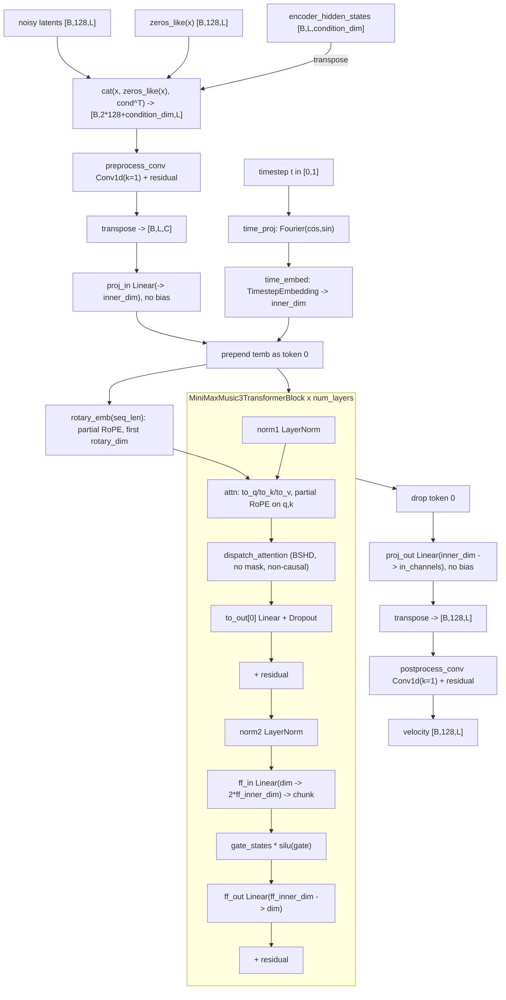
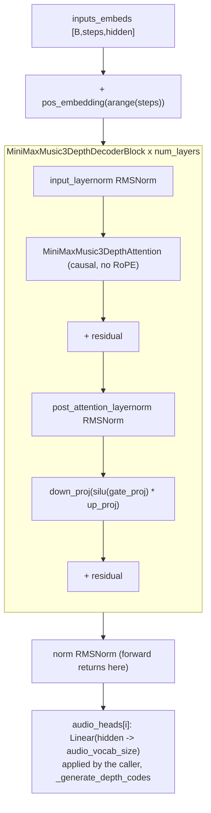

# MiniMax Music 3 (`minimax_music3`)

Caption- and lyrics-conditioned music generation built from **two stacked
generative stages**, which is what makes it structurally unlike every other arch
here: an autoregressive stage (an 8 B `Qwen3ForCausalLM` plus a small RVQ *depth*
decoder) samples discrete audio codes frame by frame and emits per-frame hidden
states, and only then a 1-D flow-matching DiT
(`MiniMaxMusic3Transformer1DModel`, vendored) denoises 128-channel audio latents
*conditioned on those hidden states*. There is no separate text encoder — the
prompt is tokenized and consumed by the AR stage's own LM — and the "VAE" half is
**decode-only**: `MiniMaxMusic3Vocoder` upsamples latents to 44.1 kHz stereo, and
no matching encoder is part of the released component set, which is why every
capability that would need audio→codes (cover, audio reference conditioning,
AR-stage training) is refused. It is also **not trainable** in this repo.

## Components

| Role | Class | Module | Notes |
|---|---|---|---|
| Orchestrating pipeline | `MiniMaxMusic3Pipeline` | `core.models.minimax_music3.pipeline` | Plain-class port of the upstream diffusers-PR modular blocks; owns `encode_text` / `generate_ar` / `prepare_chunks` / `denoise_chunks` / `decode` / `decode_range` / `recover_frame_hiddens` / `generate` |
| Autoregressive language model | `Qwen3ForCausalLM` (via `AutoModelForCausalLM`) | `transformers` | Not vendored. Built by `loader._build_language_model` from `official/language_model` |
| Tokenizer | `AutoTokenizer` | `transformers` | From `official/tokenizer` (`loader._load_tokenizer`) |
| Vocabulary indirection | `Music3VocabView` → `FullVocabView` / `PrunedVocabView` | `core.models.minimax_music3.vocab_view` | Chosen once by `resolve_vocab_view(language_model)` from the loaded module's own shape (`hasattr(..., "lm_head_pruned")`). Owns `embed_text` / `embed_semantic_code` / `audio_logits` / `mask_logits` / `decode_sample` |
| RVQ depth decoder (local AR model) | `MiniMaxMusic3RVQDepthDecoder` (+ `MiniMaxMusic3DepthDecoderBlock`, `MiniMaxMusic3DepthAttention`, `MiniMaxMusic3DepthAttnProcessor`) | `core.models.minimax_music3.vendor.minimax_music3_rvq_depth_decoder` | vendored (`backend/core/models/minimax_music3/vendor/`). Predicts residual codebooks c1..c7 per frame and owns their embedding table |
| Condition encoder | `MiniMaxMusic3ConditionEncoder` | `core.models.minimax_music3.vendor.condition_embedder_minimax_music3` | vendored. Softmax-weighted layer mix + `Conv1d(k=3)` + nearest-neighbour resample onto the latent timeline. Loaded at `float32` |
| Flow-matching denoiser | `MiniMaxMusic3Transformer1DModel` | `core.models.minimax_music3.vendor.transformer_minimax_music3` | vendored |
| Denoiser block / attention | `MiniMaxMusic3TransformerBlock`, `MiniMaxMusic3Attention`, `MiniMaxMusic3AttnProcessor` | same module | vendored. Full self-attention over one packed 1-D sequence, no cross-attention, no mask |
| Time embedding | `MiniMaxMusic3FourierEmbedding` + diffusers `TimestepEmbedding` | same module | vendored wrapper; the Fourier projection is a trained weight |
| Positional | `MiniMaxMusic3RotaryEmbedding` + `_apply_partial_rotary_emb` | same module | vendored. **Partial** RoPE — only the leading `rotary_dim` of each head rotates |
| Vocoder (decode-only) | `MiniMaxMusic3Vocoder` (+ `MiniMaxMusic3VocoderBlock`, `MiniMaxMusic3VocoderResidualUnit`, `MiniMaxMusic3Snake1d`) | `core.models.minimax_music3.vendor.minimax_music3_vocoder` | vendored, DAC-style. Loaded at `float32` |
| Scheduler | `FlowMatchEulerDiscreteScheduler` | `diffusers` | From `official/scheduler` (`loader._load_scheduler`) |
| Checkpoint remaps | `flat_remap`, `pruned_text_encoder_remap`, `pruned_text_encoder_q8_0_remap`, `convrot_remap` | `core.models.minimax_music3.*` | Flat/ComfyUI repack, pruned-vocabulary text encoder, Q8_0 GGUF, INT8 ConvRot |
| Quantized Linear | `ConvRotInt8Linear`, `GGUFQ8_0Linear` | `core.models.common.convrot_int8_linear`, `core.models.common.gguf_q8_0_linear` | Shared, not arch-specific |
| GGUF reader | `core.models.common.gguf_container` | shared | Native GGUF v3 reader; no `gguf` pip dependency |
| Per-generation state sidecar | `MiniMaxMusic3FrameCodes` | `core.models.minimax_music3.frame_codes` | `<base>.mm3frames.json`, `int16` on disk, read back as `int64`; identity-checked by `.matches` |

## Load path

Entry: `core.models.minimax_music3.loader.load_minimax_music3_from_path`, wrapped
by `ModelLoader.load_minimax_music3_from_path` and dispatched from
`ModelLoader.load_from_diffusers` (directory) or
`ModelLoader.load_from_safetensors` (flat DiT file, safetensors or GGUF).
Layout detection is `detect_minimax_music3_layout`; arch-type detection is
`ModelLoader._looks_like_minimax_music3`, called from both the directory and the
single-file branch of `ModelLoader.detect_model_type`.

Accepted spellings (all header-only to detect):

* **MiniMax's `official/` tree** — a directory whose `modular_model_index.json`
  declares `MINIMAX_MUSIC3_PIPELINE_CLASS` (`"MiniMaxMusic3ModularPipeline"`);
  detected by `_is_music3_official_dir`. Note the filename differs from
  MiniMax-H3's `model_index.json`, so the two probes are disjoint by
  construction.
* **A root holding `official/`** (the flat ComfyUI repack —
  `diffusion_models/` + `text_encoders/` + `vae/` — may sit beside it, but the
  directory branch requires only `official/`); `_resolve_official_dir`
  searches `_OFFICIAL_DIR_NAMES`.
* **A flat DiT `.safetensors`** identified by tensor-name signature
  (`keys_look_like_flat_minimax_music3_dit` / `is_minimax_music3_safetensors`:
  `diffusion_transformer.*` + `cond_layer_logits` + `latent_conditioners.*`);
  the walk-up finds the root and its sibling `official/`.
* **A flat DiT `.gguf`** — same tensor signature plus
  `general.architecture == "minimax_music3"` (`is_minimax_music3_gguf_dit`,
  `GGUF_ARCHITECTURE_METADATA_KEY`).

**Every component's CONFIG always comes from `official/`.** Naming a flat/GGUF
DiT selects only the *weights* for `transformer` + `condition_encoder`
(`build_transformer_and_condition_encoder_from_flat_dit` /
`..._from_gguf_dit`); everything else still loads from `official/`. A lone flat
DiT with no reachable `official/` raises `NotImplementedError`.

The text encoder can be overridden per load by `text_encoder_file` (the analogue
of MiniMax-H3's `te_override`, plumbed through `POST /models/load`). The file is
classified by content, not filename, by
`detect_minimax_music3_text_encoder_source` and dispatched through
`_TEXT_ENCODER_BUILDERS` /
`build_language_model_and_depth_decoder_from_text_encoder_file` to one of four
builders: non-pruned flat safetensors, pruned flat safetensors, pruned GGUF
dense, pruned GGUF Q8_0. Each returns the language model **and** the RVQ depth
decoder together (the checkpoint merges them), so `official/rvq_depth_decoder`'s
weights are skipped in that case.

Component construction: `_build_diffusers_component` uses
`accelerate.init_empty_weights()` + `cls.from_config(config)` +
`load_state_dict(..., strict=True, assign=True)`, casting **per key** and only
floating tensors; `_stranded_meta_tensors` then asserts nothing is left on
`meta`. `_build_module_from_remapped_state_dict` is the same shape for remapped
sources and additionally performs the ConvRot Linear swap when
`convrot_layer_configs` is non-empty.

Refusals:

* `MiniMaxMusic3TextEncoderRefusal` / `_header_looks_quantized` /
  `refuse_quantized_state_dict` — any quantization semantic other than the one
  validated ConvRot contract or the supported GGUF types, refused header-only.
* Q8_0 (or any unmaterializable GGML type) in a **DiT** GGUF — refused
  header-only.
* `flat_remap.PrunedTextEncoderNotSupported` — handing a pruned file to the
  non-pruned builder.
* `_read_component_config` — a `config.json` whose `_class_name` does not match
  the expected vendored class.
* `_assert_language_model_rope_theta` / the pre-load JSON gate in
  `_build_language_model` — `config.rope_parameters["rope_theta"]` must equal
  `EXPECTED_LANGUAGE_MODEL_ROPE_THETA` within `_ROPE_THETA_TOLERANCE`.
* A missing weight/config slot — every gap is listed at once before anything is
  built.
* `text_encoder_file` together with `load_language_model=False`.
* `official/qwen_7B/` is a permanent exclusion (`_QWEN_7B_EXCLUDED_SUBDIR`);
  no path is ever constructed through it.

Load order is deliberate: the language model (largest) is built first, then the
transformer — documented in `load_minimax_music3_from_path` as a Windows
storage-access-violation avoidance, mirroring `minimax_h3.loader`.

## Denoiser structure

Flow-matching stage (`MiniMaxMusic3Transformer1DModel.forward`):

Autoregressive stage's own block type
(`MiniMaxMusic3RVQDepthDecoder.forward`, a second, causal stack):

Walk-through. The DiT's conditioning does **not** enter through cross-attention —
`MiniMaxMusic3AttnProcessor` is pure self-attention with no `encoder_hidden_states`
argument. Instead `forward` concatenates `[latent | zeros | condition]` along the
CHANNEL axis before `proj_in`, so conditioning is fused at the input projection;
the `zeros_like(hidden_states)` slot is a fixed structural placeholder. The
timestep enters as one extra sequence token that is discarded after the block
stack (`hidden_states[:, 1:]`). Both `preprocess_conv` and `postprocess_conv` are
kernel-1 `Conv1d`s wrapped in residual adds. The AR side runs
`_generate_depth_codes` per frame: the LM's `last_hidden` and each sampled code
are pushed through `rvq_depth_decoder.projection`, appended to a growing depth
sequence, re-run through the causal stack, and read out by
`audio_heads[i]`; the concatenated per-step hidden states plus the LM's own
`last_hidden` become the `frame_hiddens` the condition encoder consumes.

## Tensor contract

All numbers below are the **vendored class defaults** (`@register_to_config`
signatures). The loader builds every component with `cls.from_config(config)`
reading `official/<subdir>/config.json`, which is not part of this repository —
so the checkpoint's actual values are not knowable from code here.

| Property | Value | Source symbol |
|---|---|---|
| Latent space | `[B, in_channels=128, L]`, 1-D (no spatial axis) | `MiniMaxMusic3Transformer1DModel.__init__`, `MINIMAX_MUSIC3_WIRING` (`latent_ndim=3`, `latent_channels=128`) |
| Channel folding | 128 channels = two folded 64-channel mono streams: `latents.reshape(B*2, latent_channels//2, L)` on decode, `waveform.reshape(B, 2, -1)` on output | `MiniMaxMusic3Vocoder.forward` |
| VAE / vocoder | **decode-only**; upsampling ratios `(8, 8, 4, 2)` → 512×; output `tanh`, stereo `[-1, 1]` | `MiniMaxMusic3Vocoder.__init__/.forward`, `MINIMAX_MUSIC3_WIRING.vae_scale_factor=512` |
| Scaling / shift convention | **none** — latents go into the vocoder unnormalised, output is `float().clamp(-1, 1)` | `MiniMaxMusic3Pipeline.decode`, `MINIMAX_MUSIC3_WIRING.vae_norm="identity"` |
| Sample rate | `vocoder.config.sampling_rate` (class default 44100), fallback `FALLBACK_SAMPLING_RATE` | `MiniMaxMusic3Pipeline.sampling_rate`, `defaults.FALLBACK_SAMPLING_RATE` |
| AR frame rate | `condition_encoder.config.input_sampling_rate / input_hop_length` (class defaults 24000 / 960 = 25.0), fallback `FALLBACK_FRAME_RATE` | `MiniMaxMusic3Pipeline.frame_rate`, `loader`'s `frame_rate` key |
| Latent hop / rate | `condition_encoder.config.output_hop_length` (class default 512) against `output_sampling_rate` 44100 → latent rate 44100/512 | `MiniMaxMusic3Pipeline.latent_hop_length`, `MiniMaxMusic3ConditionEncoder.forward`'s `latent_length` formula |
| Conditioning input | `frame_hiddens [B, frames, num_condition_layers * condition_hidden_dim]` (class defaults 8 × 4096) | `MiniMaxMusic3ConditionEncoder.forward` |
| Conditioning output | `[B, latent_length, out_dim]` (class default 2048), softmax-mixed over layers, scaled by `layer_scale`, `Conv1d(k=3)`, nearest-resampled | `MiniMaxMusic3ConditionEncoder.forward`; `MINIMAX_MUSIC3_WIRING.te_out_dim=2048` |
| Text embedding | none separate — prompt tokens are embedded by the LM through `Music3VocabView.embed_text` | `vocab_view.FullVocabView` / `PrunedVocabView`; `MINIMAX_MUSIC3_WIRING.te_seq_packing="llm"` |
| Pooled / auxiliary cond | none | `MINIMAX_MUSIC3_WIRING.te_pooled_dim=None` |
| Audio code vocabulary | semantic `SEMANTIC_VOCAB_SIZE=16384` at row `code + AUDIO_CODE_OFFSET` (full-vocab layout); residual `audio_vocab_size` (class default 1024) × `num_codebooks - 1`; `AUDIO_END_TOKEN_ID`, `AUDIO_CFG_TOKEN_ID` | `defaults`, `vocab_view`, `MiniMaxMusic3RVQDepthDecoder.__init__` |
| Positional encoding (DiT) | **partial** RoPE: only the first `rotary_dim` (class default 32) of each `attention_head_dim` (64) rotates; `theta` class default 10000, applied over the token axis *including* the prepended timestep token | `MiniMaxMusic3RotaryEmbedding`, `_apply_partial_rotary_emb`, `MiniMaxMusic3AttnProcessor.__call__` |
| Positional encoding (depth decoder) | learned `pos_embedding` over the depth-step axis, `max_position_embeddings` class default 16; no RoPE | `MiniMaxMusic3RVQDepthDecoder.__init__/.forward` |
| Timestep convention | `t ∈ [0, 1]`; the vendored docstring states 0 = pure noise, 1 = data. Sampling uses `sigmas = np.linspace(1.0, 1.0/steps, steps)` fed to `scheduler.set_timesteps(sigmas=...)` | `MiniMaxMusic3Transformer1DModel.forward` docstring, `MiniMaxMusic3Pipeline.denoise_chunks` |
| Prediction target | velocity; the integrator is `scheduler.step(velocity, t, latents)` | `MiniMaxMusic3Pipeline.denoise_chunks` |
| Scheduler config | `official/scheduler/scheduler_config.json` — **not in this repo**; only the class (`FlowMatchEulerDiscreteScheduler`) and the sigma array above are knowable from code | `loader._load_scheduler` |

## Generation path

Backend mixin: `core.pipeline_backends.minimax_music3.MiniMaxMusic3Mixin`,
dispatched from `DiffusionPipelineManager.generate_txt2aud` /
`generate_aud2aud` / audio-outpaint on `self.is_minimax_music3_model`:

* `_generate_txt2aud_minimax_music3` → `MiniMaxMusic3Txt2AudResult`
* `_generate_audoutpaint_minimax_music3` (extend forward) →
  `MiniMaxMusic3ExtendResult`
* `_generate_aud2aud_minimax_music3` (repaint only) →
  `MiniMaxMusic3RepaintResult`, sub-dispatched to
  `_minimax_music3_repaint_regenerate` / `_minimax_music3_repaint_rerender`

The sampling loop lives in `MiniMaxMusic3Pipeline` (this repo's own port of the
upstream modular blocks), driven stage by stage by the mixin under a
**three-phase staged offload**, each in a `try/finally` through
`_minimax_music3_move` / `_minimax_music3_empty_cache`:

1. `language_model` + `rvq_depth_decoder` → GPU; `encode_text` + `generate_ar`;
   → CPU. The mixin asserts co-residency itself, because
   `generate_ar`'s own guard only inspects `accelerate` `_hf_hook`s, which manual
   staging does not create.
2. `transformer` + `condition_encoder` → GPU; `denoise_chunks`; → CPU
   (`frame_hiddens` is pushed to CPU in between).
3. `vocoder` → GPU; `decode`; → CPU.

CFG shape — **two independent CFGs, no negative prompt**:

* AR stage: **one** forward per LM step over a batch of 2 rows. `encode_text`
  returns `[2, seq]` where row 1 is the same prompt with interior tokens replaced
  by `AUDIO_CFG_TOKEN_ID`; `generate_ar` computes
  `guided = uncond + (cond - uncond) * AR_CFG_SCALE` (fixed 1.5), masks to the
  top-`AR_CFG_TOP_K` (50) entries of the *conditional* row, re-masks through
  `vocab_view.mask_logits`, and samples with `_sample_top_k`. The same paired-row
  arithmetic runs per residual codebook inside `_generate_depth_codes`.
* Flow stage: **two separate transformer forwards per scheduler step** —
  `cond_pred` with the condition and `uncond_pred` with `zeros_like(condition)` —
  combined as `uncond + flow_guidance_scale * (cond - uncond)`.

Arch-specific stages: windowed chunk denoising (`prepare_chunks` +
`denoise_chunks`, `CHUNK_FRAMES` 200 / `CHUNK_HOP` 100, with an overlap blend
that copies the previous chunk's condition and re-noises the overlap region per
step, then hard-restores `previous_latent` over the overlap); chunk-edge cropping
on decode (`CROP_LEFT_LATENT` / `CROP_RIGHT_LATENT`, generalised by
`decode_range` for windows in the middle of a song); the frame-code sidecar
(`core.models.minimax_music3.frame_codes`) plus teacher-forced AR resume
(`generate_ar`'s `resume_frame_codes` / `resume_prefix_codes`, chunked at
`AR_RESUME_REPLAY_CHUNK_FRAMES`) and deterministic `recover_frame_hiddens` for
re-render; and a combined two-stage progress series
(`compute_progress_budget` / `combined_progress` / `PROGRESS_TOTAL_UNITS`).

## Training path

**Not trainable.** There is no training adapter and no arch handler:

* No `minimax_music3` entry in `core.training.arch.ARCH_REGISTRY`, and the
  module-level `_EXPECTED_ARCH_KEYS` assertion in
  `backend/core/training/arch/__init__.py` pins the registry to the 13 archs that
  do have handlers.
* No `arch/minimax_music3.py`, no `adapters/minimax_music3_adapter.py`, no
  `ops/minimax_music3_ops.py`.
* `api.arch_capabilities.TRAINING_DECLARED_ARCHS` does not list it, and the
  assertion `set(TRAINING_UNSUPPORTED) <= TRAINING_DECLARED_ARCHS` at the bottom
  of that module means a per-method refusal string **cannot** be declared for it
  there.

Consequently there is no explicit refusal symbol to point at: it is a structural
absence, not a guard. `BaseTrainer._load_model_components` sets no
`is_minimax_music3` flag and its dispatch chain has no branch for it, so a run
queued against this model falls into the terminal `else` →
`core.training.ops.sd_sdxl_ops.load_components`, and
`core.training.arch.resolve_arch_name` returns `"sd15"`. The failure therefore
surfaces inside the SD1.5 loader rather than as a capability-table message.

The two reasons the model itself blocks training, as recorded in code comments
and the capability table: the RVQ tokenizer's **encoder** (audio → semantic
codes) is not published in this release, so AR-stage supervision cannot be
constructed (`_add("minimax_music3", "audio_reference_conditioning", ...)` in
`api.arch_capabilities`, and the refusal text in
`_generate_aud2aud_minimax_music3`); and the Flow-VAE encoder half is likewise
absent from the released component set, so flow-stage latents cannot be produced
from audio (`MiniMaxMusic3Vocoder` is decode-only).

## Hook points

| Hook | Status | Owner symbol |
|---|---|---|
| Attention conduit entry | Present in code, but **never selected**: `MiniMaxMusic3Transformer1DModel._stamp_attention_backend` and `_stamp_depth_decoder_attention_backend` read `self._attn_backend`, and nothing outside the vendored modules ever assigns it — so it resolves to the `"native"` default on every forward | `_stamp_attention_backend`, `_stamp_depth_decoder_attention_backend`, `MiniMaxMusic3AttnProcessor.__call__` / `MiniMaxMusic3DepthAttnProcessor.__call__` → `core.attention.dispatch_attention` |
| Attention mode | Derived per forward from `torch.is_grad_enabled()` (`AttentionMode.TRAINING` / `INFERENCE`), not configured | `_stamp_attention_backend` |
| Block swap boundary | **unsupported** — the backend never reads `blocks_to_swap` / `enable_block_swap` | declared by `_add("minimax_music3", "block_swap", ...)` in `api.arch_capabilities` |
| FBCache indicator | **unsupported** | `api.arch_capabilities._FBCACHE_UNSUPPORTED` |
| Spectrum / output forecaster | **unsupported** | `api.arch_capabilities._SPECTRUM_UNSUPPORTED` |
| Quantized Linear swap | supported at **load time only**: ConvRot INT8 for the flat DiT and the pruned text encoder, packed Q8_0 for the pruned GGUF text encoder. No per-generation converter — `unet_quantization` is declared unsupported | `loader._int8_convrot_source_layers` + `convrot_remap` → `ConvRotInt8Linear`; `pruned_text_encoder_q8_0_remap` → `GGUFQ8_0Linear`; `_add("minimax_music3", "unet_quantization", ...)` |
| Keep-hot residency | **unsupported** — not wired; documented as a scope decision in the backend's module docstring ("Staged offload"), naming the language model as the obvious candidate | `core.pipeline_backends.minimax_music3` module docstring; `core.keep_hot` is not imported there |
| Activation offload / dispatch | **unsupported** — no `LayerOffloadConductor` and no activation dispatcher on this arch | absence in `core.pipeline_backends.minimax_music3` |
| Component staging (arch-specific) | supported, three phases, `allow_partial_failure=False` on every →GPU move and `True` only in cleanup, recording `self._minimax_music3_stranded` | `MiniMaxMusic3Mixin._minimax_music3_move` |
| Execution-device resolution | offload-hook aware: group-offload onload device → `accelerate` hook device → parameter device; separate resolution for the AR and flow stages | `MiniMaxMusic3Pipeline.execution_device`, `.flow_execution_device`, `._group_onload_or_hook_device` |
| Cancellation | between AR frames, between AR replay chunks, between flow chunks/steps, and per decode chunk | `core.inference.cancellation.raise_if_cancelled` calls in `MiniMaxMusic3Pipeline` |
| Progress | two independent counters folded into one `(step, total)` series | `compute_progress_budget`, `combined_progress`, `PROGRESS_TOTAL_UNITS` |
| Text-encoder override | supported per load, content-detected | `detect_minimax_music3_text_encoder_source`, `_TEXT_ENCODER_BUILDERS`, `build_language_model_and_depth_decoder_from_text_encoder_file` |
| Generation-time LoRA | **unsupported** — `params["loras"]` is never read | `_add("minimax_music3", "lora", ...)` in `api.arch_capabilities` |

## Constraints

| Constraint | Enforced by |
|---|---|
| `prompt` and `lyrics` must both be non-empty strings | `MiniMaxMusic3Pipeline.encode_text`; re-checked before staging in `_generate_txt2aud_minimax_music3` |
| Assembled prompt ≤ `MAX_PROMPT_TOKENS` (5,000) | `MiniMaxMusic3Pipeline.encode_text` |
| Generated frames ≤ `MAX_AUDIO_FRAMES` (9,000); `max_frames = min(int(duration * frame_rate), MAX_AUDIO_FRAMES)` | `MiniMaxMusic3Pipeline.generate_ar`, mirrored in `_generate_txt2aud_minimax_music3` |
| `audio_duration` is an upper bound only — the LM may emit end-of-audio earlier | `generate_ar` (`decode_sample` → `is_end_of_audio` break) |
| `audio_duration` > 0 and long enough for ≥ 1 frame | `_generate_txt2aud_minimax_music3` |
| `audio_duration`, `num_inference_steps`, `flow_guidance_scale` are **required** with no in-code default (they live in `backend/api/param_defaults.py`) | `MiniMaxMusic3Pipeline.denoise_chunks` / `.generate` signatures; `_generate_txt2aud_minimax_music3`'s required-key loop |
| Chunk geometry is fixed: 200-frame windows, 100-frame hop, `OVERLAP_LATENT_LENGTH` 172, decode crops `CROP_LEFT_LATENT` 86 / `CROP_RIGHT_LATENT` 258 | `defaults`, `MiniMaxMusic3Pipeline.prepare_chunks` / `.denoise_chunks` / `.decode` |
| AR sampling recipe is fixed, not user-exposed: `AR_CFG_SCALE` 1.5, `AR_CFG_TOP_K` 50, `AR_SAMPLING_TOP_K` 50 | `defaults`, `generate_ar`, `_generate_depth_codes` |
| Language model and RVQ depth decoder must be co-resident for the AR stage | `generate_ar`'s hook-based guard **and** the explicit device comparison in `_generate_txt2aud_minimax_music3` |
| `language_model` `rope_theta` must be 1e6 (checked before the ~17 GiB load and again after) | `_build_language_model`, `_assert_language_model_rope_theta` |
| `condition_encoder` and `vocoder` are pinned to `float32` regardless of `torch_dtype`; `frame_hiddens` is cast to the condition encoder's dtype on the way in | `load_minimax_music3_from_path`, `MiniMaxMusic3Pipeline.denoise_chunks` |
| Output is always stereo | `MiniMaxMusic3Vocoder.forward`'s unconditional `reshape(batch, 2, -1)`; extend's channel check uses `_MINIMAX_MUSIC3_EXPECTED_CHANNELS` |
| `aud2aud` accepts only `mode="repaint"`; `"cover"` is refused (no published RVQ encoder), and mid-span infill with a preserved tail is refused by name | `_generate_aud2aud_minimax_music3` |
| Extend is forward-only | `_generate_audoutpaint_minimax_music3`; declared as `("extend_forward",)` in `api.arch_capabilities` |
| Frame-code sidecars carry `FRAME_CODES_FORMAT_VERSION` and an identity check; unrecognised versions are refused | `core.models.minimax_music3.frame_codes` (`MiniMaxMusic3FrameCodes.matches`, `read_frame_codes_sidecar`) |
| Seeds do not reproduce the same song across `FullVocabView` and `PrunedVocabView` | documented in `core.models.minimax_music3.vocab_view` (`PrunedVocabView`) |
| Image endpoints reject a MiniMax Music 3 model outright | `routes._reject_if_audio_model` |
