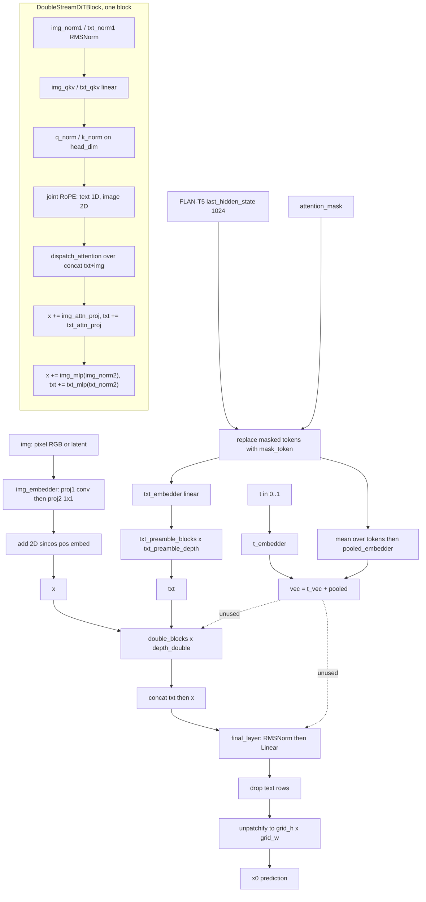

# MiniT2I (`minit2i`)

Text-to-image flow-matching model whose denoiser is a **double-stream MM-DiT**
(`MMJiT`, vendored under `backend/core/models/minit2i/vendor/`) driven by a frozen
**FLAN-T5-Large** encoder. Two facts separate it from everything else in this repo: (1) the
default checkpoints are **pixel-space** — `in_channels = 3`, `patch_size = 16`, no VAE, the
denoiser output IS the RGB image (`MMJiTConfig.vae_type == "none"`); the same class also runs
as a **latent** variant (`vae_type` `"sdxl"`/`"flux1"`, `patch_size = 2`) selected purely by the
checkpoint's I/O layer shapes. (2) The model predicts **x0** (`MMJiTConfig.prediction == "x"`),
not velocity or epsilon; velocity is derived by the caller
(`DiffusionModel.pred_velocity`). Two published sizes exist, `b16` and `l16`
(`vendor/single_file.py::KNOWN_VARIANTS`), and they are separate models, not checkpoints of one
model.

## Components

| Role | Class | Module | Notes |
|---|---|---|---|
| Denoiser wrapper | `MiniT2IMMJiTModel` | `core/models/minit2i/vendor/transformer.py` | **Vendored** (`core/models/minit2i/vendor/`); `ModelMixin, ConfigMixin`; `state_dict` keys are `model.net.*` |
| Denoiser holder | `DiffusionModel` | `core/models/minit2i/vendor/mmjit.py` | Vendored; owns `.net` (`MMJiT`) and `pred_velocity` |
| Denoiser body | `MMJiT` | `core/models/minit2i/vendor/mmjit.py` | Vendored; owns `double_blocks`, `txt_preamble_blocks`, embedders, `final_layer` |
| Joint block | `DoubleStreamDiTBlock` | `core/models/minit2i/vendor/mmjit.py` | Vendored; ×`depth_double`; separate image/text weights, one joint attention |
| Text preamble block | `PlainTextTransformerBlock` | `core/models/minit2i/vendor/mmjit.py` | Vendored; ×`txt_preamble_depth` (default 2); text-only self-attention |
| Attention primitive | `mem_efficient_sdpa` | `core/models/minit2i/vendor/mmjit.py` | Vendored; zero-pads `head_dim` to a multiple of 8, then calls `core.attention.dispatch_attention` |
| Norm | `RMSNorm` | `core/models/minit2i/vendor/mmjit.py` | Vendored; plain `weight` scale |
| FFN | `SwiGLUMlp` | `core/models/minit2i/vendor/mmjit.py` | Vendored; `w1`/`w2`/`w3`, hidden rounded up to a multiple of 8 |
| Patch embed | `BottleneckPatchEmbed` | `core/models/minit2i/vendor/mmjit.py` | Vendored; `proj1` Conv2d(in→`pca_channels`, k=stride=`patch_size`) then `proj2` 1×1 Conv2d(`pca_channels`→`hidden_size`) |
| Timestep embed | `TimestepEmbedder` | `core/models/minit2i/vendor/mmjit.py` | Vendored; cos-then-sin sinusoid (256) → 2-layer MLP → `cond_vec_size` |
| Text projection | `MMJiT.txt_embedder` (`nn.Linear`) | `core/models/minit2i/vendor/mmjit.py` | `txt_input_size`(1024) → `txt_hidden_size`, `bias=False` |
| Pooled projection | `MMJiT.pooled_embedder` (`nn.Linear`) | `core/models/minit2i/vendor/mmjit.py` | `txt_input_size` → `cond_vec_size`, `bias=False` |
| Uncond text token | `MMJiT.mask_token` (`nn.Parameter`) | `core/models/minit2i/vendor/mmjit.py` | `[1, 1, txt_input_size]`; substituted where `attn_mask <= 0.5` |
| Positional embed | `MultiModalRotaryEmbeddingFast` (`TextRotaryEmbedding1D` + `VisionRotaryEmbeddingFast`) | `core/models/minit2i/vendor/mmjit.py` | Vendored; `rotate_half` layout; joint sequence |
| Absolute pos embed | `get_2d_sincos_pos_embed` | `core/models/minit2i/vendor/mmjit.py` | Vendored; added to image tokens only |
| Output head | `FinalLayer` | `core/models/minit2i/vendor/mmjit.py` | Vendored; `RMSNorm` → `Linear(hidden_size, patch*patch*out_channels)` |
| Scheduler | `MiniT2IFlowMatchScheduler` | `core/models/minit2i/vendor/transformer.py` | Vendored; `SchedulerMixin, ConfigMixin`; lognorm train-t sampler + `linspace` inference grid |
| Text encoder | `transformers.T5EncoderModel` | loaded in `core/models/minit2i/minit2i_loader.py::_load_flan_t5` | Not vendored; FLAN-T5-Large, frozen at inference |
| Tokenizer | `transformers.AutoTokenizer` | `minit2i_loader.py::_load_flan_t5` | Same location as the encoder |
| VAE (latent variants only) | `diffusers.AutoencoderKL` | `core/models/components/vae_registry.py::load_minit2i_vae` (re-exported by `core/models/minit2i/minit2i_vae.py`) | `None` for pixel-space checkpoints; `VAE_REGISTRY` maps `sdxl`→4ch, `flux1`→16ch |

`load_minit2i_components` also returns non-module entries the pipeline consumes: `variant`,
`vae_type`, `vae_scale_factor` (`VAE_SCALE_FACTOR = 8`), `vae_source`, `vae_path`.

## Load path

Entry: `core/models/minit2i/minit2i_loader.py::load_minit2i_components(model_path, torch_dtype,
flan_t5_path, text_encoder_dtype, vae_dtype, vae_local_dir, scratch_init_from,
scratch_inherit_final_layer)`, reached from `core/model_loader.py::ModelLoader.load_minit2i_from_path`
(both the single-file and the directory dispatch arms call it).

Branch decision inside `load_minit2i_components`, in order:

1. **From-scratch sentinel** — `is_scratch_spec(model_path)` (`SCRATCH_PREFIX =
   "scratch:minit2i:"`). `parse_scratch_spec` yields `(variant, vae_type)`; `build_scratch_minit2i`
   constructs a randomly initialised `MiniT2IMMJiTModel` in memory. `scratch_init_from` optionally
   inherits compatible weights via `_load_source_minit2i_state_dict` +
   `_inherit_minit2i_weights` (name+shape match ⇒ full copy; `img_embedder.proj1` with an unchanged
   patch but a different channel count ⇒ `_channel_partial_copy`; `final_layer.linear` never
   inherited unless `inherit_final_layer=True`).
2. **Single file / shard index** — `os.path.isfile` and a `.safetensors` /
   `.safetensors.index.json` suffix ⇒ `vendor/single_file.py::load_single_file`.
3. **Directory** — otherwise. If `<path>/transformer` is absent, `resolve_minit2i_model_dir`
   resolves the path to exactly one variant dir (`_is_minit2i_variant_dir` checks
   `transformer/config.json` for `_class_name == "MiniT2IMMJiTModel"` or the
   `depth_double` + `pca_channels` key pair; `find_minit2i_variant_dirs` walks up to 2 levels).
   Then `MiniT2IMMJiTModel.from_pretrained(<dir>/transformer)` and, when present,
   `MiniT2IFlowMatchScheduler.from_pretrained(<dir>/scheduler)`.

Single-file layout (`vendor/single_file.py`): `TRANSFORMER_PREFIX = "transformer."`,
`TEXT_ENCODER_PREFIX = "text_encoder."`, `VAE_PREFIX` (from
`core/models/common/single_file_format.py`). Geometry comes from the `mmjit_config` metadata
when present, otherwise from `detect_variant_from_state_dict`, which reads `hidden_size` off
`model.net.double_blocks.0.img_qkv.weight.shape[1]`, counts `double_blocks.N` for `depth_double`,
and reads `in_channels`/`patch_size` off `model.net.img_embedder.proj1.weight`
(`{3: "none", 4: "sdxl", 16: "flux1"}`). `save_single_file` is the writer, sharding above
`DEFAULT_MAX_SHARD_BYTES`.

FLAN-T5 resolution (`_resolve_flan_t5`): explicit path → sibling/ancestor probe (up to 5 levels,
names `flan-t5-large`, `flan-t5`, `flan_t5_large`, `text_encoder`, validated by
`_looks_like_flan_t5`) → hub id `google/flan-t5-large`. A single-file with embedded
`text_encoder.*` weights builds the arch from the resolved config and loads them
(`strict=False`).

Detection (`core/model_loader.py`): the `scratch:minit2i:` prefix, a shard index whose
`weight_map` has `transformer.model.net.` / `model.net.double_blocks.` keys, a `.safetensors`
whose metadata `model_type` is `minit2i` or which carries those key prefixes, a
`transformer/config.json` carrying the MiniT2I markers, or a directory that
`ModelLoader._dir_contains_minit2i` finds a variant under.

Refusals:

* `load_single_file` calls
  `core/models/common/quantized_checkpoint_guard.refuse_quantized_state_dict(arch="minit2i")`
  **before** shape-based variant detection — MiniT2I reads no quantized checkpoint.
* `load_single_file` raises on any missing or unexpected transformer key after the
  `strict=False` load.
* `detect_variant_from_state_dict` raises when `(hidden_size, depth_double)` matches no
  `KNOWN_VARIANTS` entry.
* `resolve_minit2i_model_dir` raises when a path contains zero or more than one variant dir.
* `build_scratch_minit2i` raises on an unknown `variant` or `vae_type`.

## Denoiser structure

Walk-through. `MMJiT.forward(img, t, context, attn_mask)` is the whole denoiser.
`BottleneckPatchEmbed` patchifies to `[B, gh*gw, hidden_size]` and returns `(gh, gw)`;
`get_2d_sincos_pos_embed` adds a row-major 2D sincos embedding. Text arrives as FLAN-T5
`last_hidden_state`; rows whose `attn_mask <= 0.5` are replaced by the learned `mask_token`
(this is how the CFG uncond branch is expressed — see `_predict_x0_cfg`), then projected by
`txt_embedder` and refined by `txt_preamble_blocks` (`PlainTextTransformerBlock`: RMSNorm → qkv →
per-head q/k RMSNorm → 1D text RoPE → attention → `attn_proj` residual → SwiGLU residual).
`depth_double` `DoubleStreamDiTBlock`s then run: each keeps separate image and text
projections/MLPs but computes ONE attention over the concatenated `[txt, img]` sequence, with
`MultiModalRotaryEmbeddingFast` applying 1D RoPE to the text span and 2D `(h, w)` RoPE to the
image span. `FinalLayer` runs over the concatenated `[txt, x]` sequence and the text rows are
discarded before `MMJiT.unpatchify`.

`vec` (timestep embedding + projected mean-pooled text) is computed in `MMJiT.forward` and passed
to every block and to `FinalLayer`, but **neither `DoubleStreamDiTBlock.forward` nor
`FinalLayer.forward` reads it** — the vendored blocks carry no adaLN modulation. VERIFIED by
reading both forwards; there is no other consumer of `vec` in `mmjit.py`.

`MMJiT` has no separate single-stream stack: `double_blocks` is the only heavy block type,
`txt_preamble_blocks` is the small text-only prelude.

## Tensor contract

| Property | Value | Source symbol |
|---|---|---|
| Data space (default) | pixel RGB, `in_channels = 3`, no VAE | `MMJiTConfig.vae_type == "none"`, `MINIT2I_WIRING.latent_channels == 0` (`core/models/components/wiring.py`) |
| Data space (latent variants) | VAE latent, `in_channels = vae_latent_channels(vae_type)` — `sdxl` 4, `flux1` 16 | `VAE_REGISTRY` (`core/models/components/vae_registry.py`), `build_scratch_minit2i` |
| Patchify unit | 16 (pixel) / 2 (latent) | `build_scratch_minit2i`, `MMJiTConfig.patch_size`, `minit2i_pipeline_ops.GRID_ALIGN = 16` |
| VAE spatial downscale | 8 (latent variants only) | `VAE_SCALE_FACTOR = 8` (`vae_registry.py`) |
| VAE scaling convention | `(sample - shift_factor) * scaling_factor`; inverse on decode | `normalize_latent` / `denormalize_latent` (`vae_registry.py`) |
| Pixel normalization | `[-1, 1]`, `arr/127.5 - 1` | `minit2i_pipeline_ops.image_to_tensor` / `tensor_to_image` |
| Text embedding | FLAN-T5-Large `last_hidden_state`, `[B, prompt_length, 1024]`, padded to `max_length` | `minit2i_pipeline_ops.encode_prompt`, `MMJiTConfig.txt_input_size = 1024`, `prompt_length = 256`, `MINIT2I_WIRING.te_out_dim = 1024` |
| Pooled / auxiliary cond | `context.mean(dim=1)` → `pooled_embedder`, summed with the timestep embedding into `vec` — **not consumed downstream** | `MMJiT.forward` |
| Uncond expression | text rows replaced by `mask_token` where the mask is 0 | `MMJiT.forward`, `_predict_x0_cfg`, training `minit2i_label_drop_rate` |
| Positional encoding | image: 2D sincos absolute (row-major `h*gw + w`) **plus** 2D RoPE in-block; text: 1D RoPE. `rotate_half` layout, `theta = 10000` | `get_2d_sincos_pos_embed`, `VisionRotaryEmbeddingFast`, `TextRotaryEmbedding1D`, `rotate_half` |
| RoPE axes | image `h` and `w` split the head dim in half each (`dim = head_dim // 2`, `arange(0, dim, 2)`); text uses the full head dim | `VisionRotaryEmbeddingFast.__init__/forward`, `TextRotaryEmbedding1D.forward` |
| Timestep convention | `t ∈ (0, 1)` with **`t = 1` data, `t = 0` noise**; inference grid `linspace(0, 1, steps+1)`, integrated forward | `MiniT2IFlowMatchScheduler.get_inference_timesteps`, `minit2i_pipeline_ops.denoise_loop` |
| Forward noising | `x_t = image*t + noise*(1-t)`, `noise = randn * noise_scale` (2.0 pixel / 1.0 latent) | `prepare_noise`, `minit2i_ops.train_step`, `MMJiTConfig.noise_scale` |
| Training-t sampler (vendored) | lognorm: `sigmoid(randn * 0.8 + (-0.8))`, clamped to `[1e-5, 1-1e-5]` | `MiniT2IFlowMatchScheduler.sample_train_timesteps` |
| Prediction target | **x0 (sample)**; velocity derived as `(x0 - x) / clamp(1-t, min=0.05)` | `MMJiTConfig.prediction = "x"`, `DiffusionModel.pred_velocity`, `ModelLoader.detect_prediction_config` (`"flow"` / `"sample"`) |
| Variant geometry | `b16`: hidden 768, depth 17, heads 12, head_dim 64, mlp_ratio 2.666…; `l16`: hidden 1248, depth 23, heads 24, head_dim 52, mlp_ratio 2.705… | `vendor/single_file.py::KNOWN_VARIANTS`; runtime detection `minit2i_loader._detect_variant_name` |
| Other config defaults | `image_size` 512, `pca_channels` 128, `txt_preamble_depth` 2, `n_T` 100, `cfg_interval` `(0.0, 1.0)`, `cfg_channels` 3, `llm` `google/flan-t5-large` | `MMJiTConfig`, `MiniT2IMMJiTModel.__init__` |

## Generation path

Backend: `core/pipeline_backends/minit2i.py::MiniT2IMixin`, over
`PipelineManager.minit2i_components` (`core/pipeline.py` registers the slot as
`("minit2i_components", "MiniT2I", "is_minit2i_model")`). Three entry points:
`_generate_txt2img_minit2i`, `_generate_img2img_minit2i`, `_generate_inpaint_minit2i`. Image
outpaint has no MiniT2I-specific code — `PipelineManager.generate_outpaint` builds a
16-aligned canvas and delegates to the shared `generate_inpaint`.

Sampling loops live in `core/models/minit2i/minit2i_pipeline_ops.py`: `denoise_loop` (txt2img,
starts from `prepare_noise`), `denoise_loop_img2img` (SDEdit: `start_idx` from
`t_start = 1 - denoising_strength`, `x = init*t + noise*(1-t)`), `denoise_loop_inpaint` (RePaint:
same start, plus a per-step pin `x = mask*x + (1-mask)*(init*t1 + fixed_noise*(1-t1))`). All three
funnel into `_euler_run`, which integrates `v = (pred_x0 - x) / clamp(1-t0, min=0.05)`,
`x += v * (t1 - t0)`.

CFG shape (`_predict_x0_cfg`): **one batched forward per step** with the cond and uncond rows
concatenated on the batch axis (`torch.cat([x, x])`, `[text, u_text]`, `[mask, u_mask]`), blended
as `uncond + (cond - uncond) * cfg_scale`. The uncond branch is the negative prompt when supplied,
otherwise the same text with a zeroed mask (⇒ `mask_token` rows). CFG is skipped entirely when
`cfg_scale == 1.0` or `t` falls outside `cfg_interval`.

Style-transfer steps replace that batched pass with separate forwards
(`_predict_x0_style_step`, `_predict_x0_style_step_multi`): a capture forward on the reference
re-noised to this step's `t`, then a cond forward with injection, then a style-disarmed uncond
forward, plus one extra style-disarmed cond forward when
`style_cfg.style_guidance_scale > 0`.

Arch-specific generation stages: prompt encode + text-encoder offload (`_minit2i_encode`),
transformer staging with optional block swap (`_minit2i_stage_transformer`), decode
(`_minit2i_decode` — `tensor_to_image` for pixel checkpoints, `vae_decode_latent` for latent
ones).

## Training path

Adapters: `core/training/adapters/minit2i_adapter.py::MiniT2ILoRAAdapter` and
`MiniT2IFullParameterAdapter`. Arch handler:
`core/training/arch/minit2i.py::MiniT2IArchHandler` (`name = "minit2i"`,
`wiring = MINIT2I_WIRING`, `pixel_align = 16`), registered in
`core/training/arch/__init__.py::ARCH_REGISTRY`. Every handler method delegates to
`core/training/ops/minit2i_ops.py` (`load_components`, `setup_block_swap`,
`setup_attention_backend`, `encode_prompt`, `vae_encode`, `train_step`, `generate_sample`);
`vae_decode` raises `NotImplementedError`.

Default trainable set. `minit2i_ops.load_components` freezes both the transformer and FLAN-T5
(`requires_grad_(False)`) and leaves the transformer in `train()` mode for the whole run (MM-JiT
gates gradient checkpointing on `self.training`). Adapters then unfreeze:

* LoRA — transformer targets only by default; FLAN-T5 LoRA is injected only when
  `train_text_encoder` is set (`apply_lora_to_text_encoders`).
* Full parameter — `MiniT2IFullParameterAdapter.prepare_models_for_training` unfreezes the whole
  transformer when `train_unet` is set, and FLAN-T5 only when `train_text_encoder` is set.
* REPA projector, when `repa_enable` — appended last as its own param group in both adapters.

LoRA targets (`core/models/minit2i/minit2i_lora.py::iter_minit2i_lora_targets`,
scopes in `DEFAULT_SCOPE = {"attn": True, "mlp": True, "txt_embed": True}`):

* `attn` — `double_blocks.N.{img_qkv, txt_qkv, img_attn_proj, txt_attn_proj}` and
  `txt_preamble_blocks.N.{qkv, attn_proj}`
* `mlp` — `{img_mlp, txt_mlp, mlp}.{w1, w2, w3}` in both block lists
* `txt_embed` — `model.net.txt_embedder`, `model.net.pooled_embedder`

Text-encoder targets (`iter_minit2i_te_lora_targets`, `TE_DEFAULT_SCOPE = {"attn": True,
"ff": True}`): `encoder.block.N.layer.0.SelfAttention.{q,k,v,o}` and
`encoder.block.N.layer.1.DenseReluDense.{wi, wi_0, wi_1, wo}`.

Key naming: sd-scripts style with a reversible `.` ↔ `__` encoding — `flatten_to_key` emits
`lora_unet_<module path with "." replaced by "__">`, `flatten_to_te_key` emits `lora_te_<...>`
(`TE_KEY_PREFIX`). Saved suffixes are `.lora_down.weight`, `.lora_up.weight`, `.alpha`
(`MiniT2ILoRAAdapter.save_checkpoint`). On load, `normalise_lora_state_dict` namespaces TE
entries with `TE_NAMESPACE = "te::"`. Full-parameter saves go through
`vendor/single_file.py::save_single_file` with `variant` metadata, optionally bundling the trained
FLAN-T5 and (latent variants only) the VAE.

Training step (`minit2i_ops.train_step`): flow noising in the model's own convention, MSE on
**velocity** (`v_pred = (x0_pred - x_t)/clamp(1-t, 0.05)` against `(images - x_t)/…`), with an
unweighted x0 reconstruction MSE reported for monitoring only. CFG label drop
(`minit2i_label_drop_rate`, default 0.1) zeroes the attention mask for the dropped rows, which is
the same `mask_token` uncond inference uses. `vae_encode` short-circuits: for pixel-space the
"latent" IS the `[-1, 1]` RGB tensor.

Refusals: `MiniT2IFullParameterAdapter` calls
`base_adapter.reject_quantized_base(trainer.transformer, model_label="MiniT2I")` twice (in
`prepare_models_for_training` and again in `setup_trainable_parameters`) so a quantized base can
never silently produce a truncated parameter list.

## Hook points

| Hook | Owner symbol | Notes |
|---|---|---|
| Attention conduit entry | `vendor/mmjit.py::mem_efficient_sdpa` → `core.attention.dispatch_attention` | Backend read from the per-block `_attn_backend`; `MMJiT.forward` fans `net._attn_backend` out to `txt_preamble_blocks` and `double_blocks` each call and derives `_attn_mode` from `torch.is_grad_enabled()` |
| Attention backend stamping | inference `MiniT2IMixin._minit2i_apply_attention_backend`; training `minit2i_ops.setup_attention_backend` | Both stamp the wrapper AND `transformer.model.net`; the net-level attr is the one the forward reads |
| Block swap boundary (inference) | `MiniT2IMixin._minit2i_setup_block_swap` → `net._block_offloader`, consumed in `MMJiT.forward` via `wait_for_block` / `submit_move_blocks_forward` | Only `double_blocks` stream; every other module is moved to GPU first. Teardown: `_minit2i_unstage_transformer` |
| Block swap boundary (training) | `minit2i_ops.setup_block_swap` → `LayerOffloadConductor(layers=transformer.model.net.double_blocks)` | Installed after adapter setup; `trainer.transformer._layer_offload_conductor` |
| FBCache indicator | `net._fbcache` / `net._fbcache_step`, built by `minit2i_pipeline_ops._build_minit2i_fbcache`, consumed in `MMJiT.forward` | Indicator is the **image-stream residual of `double_blocks[0]`**; the cache stores the `(x, txt)` residual pair. Torn down by `_cleanup_minit2i_fbcache` |
| Spectrum forecaster | `core.inference.spectrum_forecaster.build_output_forecaster` called in `_euler_run` | Anchor/forecast on the predicted x0 |
| Quantized Linear swap | **Unsupported.** `load_single_file` calls `refuse_quantized_state_dict`; `api/arch_capabilities.py` declares `unet_quantization` unsupported for `minit2i` | No `Int8Linear`/`Fp8Linear` path exists for this arch |
| Keep-hot residency | `MiniT2IMixin._minit2i_kh_setup` over `core/keep_hot.py` | TE and transformer both gated off when any LoRA is requested (LoRA is applied in place); transformer additionally gated off under block swap; VAE only exists for latent variants |
| Activation offload / dispatch | Generic: `BaseTrainer._activation_dispatch_begin` / `ActivationDispatcher` | No MiniT2I-specific wiring; gated by `activation_dispatch_enable` |
| REPA tap | `net._repa_tap_depth` (0-based block index) → `net._repa_tap_out`, read in `minit2i_ops.train_step` | Captures the image hidden state after that double block; grad-connected and gradient-checkpoint safe |
| Style transfer wrapper | `core/inference/style_minit2i.py::install_minit2i_style_blocks` / `restore_minit2i_style_blocks` / `set_minit2i_style_context` | Monkey-patches `DoubleStreamDiTBlock.forward`; installed once per `_euler_run` |
| NAG wrapper | `core/inference/nag_minit2i.py::MiniT2INAGWrapper`, installed by `_minit2i_nag_wrap` | Also patches `DoubleStreamDiTBlock.forward` |
| NegPip wrapper | `core/inference/negpip_minit2i.py::MiniT2INegPipWrapper`, installed by `_minit2i_negpip_wrap` | Auto-activates on a negative emphasis weight; signed V scaling; also patches the block forward |
| VAE tiling | `PipelineManager._apply_vae_tiling`, called from `_minit2i_decode` | Latent variants only; on a pixel checkpoint the request emits `minit2i_vae_tiling_no_vae` |

## Constraints

| Constraint | Enforced by |
|---|---|
| Generation width/height snapped to a multiple of 16 | `minit2i_pipeline_ops.align_to_grid` (`GRID_ALIGN = 16`) via `normalize_resolution`, called from `_minit2i_common_params` |
| Training image alignment 16 | `MiniT2IArchHandler.pixel_align = 16` |
| Image token count must equal `grid_h * grid_w` | `VisionRotaryEmbeddingFast.forward` raises otherwise |
| `head_dim` zero-padded to a multiple of 8, with the ORIGINAL-`D` scale passed explicitly | `mem_efficient_sdpa` — l16's `head_dim = 52` pads to 56; passing the padded dim's default scale would change the softmax temperature |
| `blocks_to_swap` clamped to `len(double_blocks) - 1` | `_minit2i_stage_transformer`, `_minit2i_kh_setup` |
| FBCache mutually exclusive with Spectrum, block swap and style transfer | `_build_minit2i_fbcache` (returns `None` and logs for each) |
| Style transfer mutually exclusive with NAG and NegPip | `_generate_{txt2img,img2img,inpaint}_minit2i` skip the NAG/NegPip wrap when `style_active` — all three patch the same `DoubleStreamDiTBlock.forward` |
| Quantized checkpoints refused | `refuse_quantized_state_dict` in `load_single_file`; `reject_quantized_base` in `MiniT2IFullParameterAdapter` |
| Unknown variant geometry refused | `detect_variant_from_state_dict` |
| Ambiguous model directory refused | `resolve_minit2i_model_dir` (multiple variants ⇒ `ValueError` listing them) |
| Weight inheritance requires an unchanged patch size for channel surgery | `_channel_partial_copy` returns `None` when `src_patch != tgt_patch` (pixel ↔ latent) |
| Inference dtype | `bfloat16` hard-coded in all three `_generate_*_minit2i` entry points |
| `unet_quantization`, `vae_override`, `text_encoder_quantization`, `cpu_text_encoding`, `attention_impl` unsupported | `api/arch_capabilities.py` `_add("minit2i", …)` entries |
