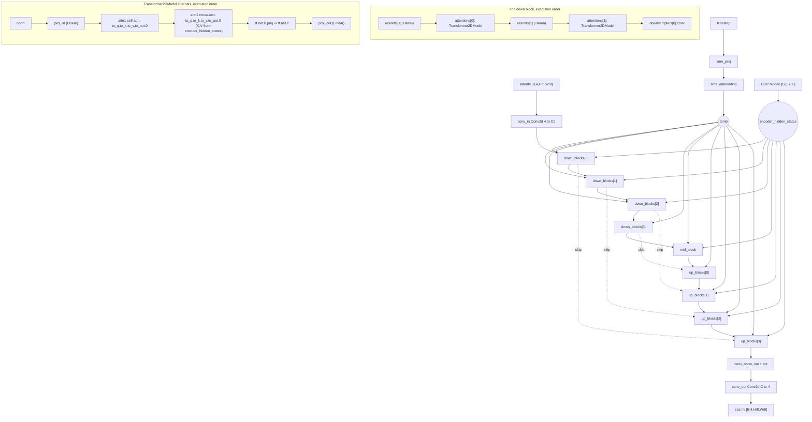

# Stable Diffusion 1.5 (`sd15`)

Latent text-to-image diffusion, still-image modality. The denoiser is a diffusers
`UNet2DConditionModel` (convolutional U-Net with interleaved `Transformer2DModel`
attention stacks), not a DiT — the only other U-Net arch in this repo is `sdxl`.
Two structural facts separate `sd15` from everything else here: it has a **single**
CLIP text encoder and therefore **no pooled embedding and no `added_cond_kwargs`**
(`SD15_WIRING.te_pooled_dim is None`, `SD15_WIRING.added_cond is None` in
`core.models.components.wiring`), and it is the **fallback arch** — every
`ModelLoader.detect_model_type` path that matches nothing else returns `"sd15"`.
It has no package under `backend/core/models/` and no file under
`backend/core/pipeline_backends/`: components are diffusers classes and generation
lives in the base `core.pipeline.DiffusionPipelineManager` path.

## Components

| Role | Class | Module | Notes |
|---|---|---|---|
| Denoiser | `UNet2DConditionModel` | diffusers (imported in `core.training.ops.sd_sdxl_ops`, `core.models.sdxl_custom_arch`) | Not vendored. Attribute surface the repo relies on: `conv_in`, `conv_out`, `down_blocks`, `mid_block`, `up_blocks`, `attn_processors`, `config.in_channels/out_channels`. |
| Text encoder | `CLIPTextModel` | transformers (imported in `core.training.ops.sd_sdxl_ops`) | Single encoder. Training taps `text_encoder(input_ids)[0]` (final hidden state) in `sd_sdxl_ops.encode_prompt_simple`; the SDXL penultimate-layer rule does **not** apply here. |
| Tokenizer | `CLIPTokenizer` | transformers (same import site) | `tokenizer.model_max_length` drives padding; the chunking path (`sd_sdxl_ops.encode_prompt_chunked`) splits at 75 tokens. |
| VAE | `AutoencoderKL` | diffusers | 4-channel latents. Registry row `core.models.common.vae_store.VAE_REGISTRY["sd15"]`: `latent_channels=4`, `default_repo="stabilityai/sd-vae-ft-mse-original"`, `scaling_factor=0.18215`, `shift_factor=None`. |
| VAE (external fallback) | `AutoencoderKL.from_pretrained("stabilityai/sd-vae-ft-mse-original")` | `ModelLoader.reconstruct_sd_sdxl_pipeline` | Loaded only when `ModelLoader.has_embedded_vae` says the single file carries no `first_stage_model.*` / `vae.*` encoder-decoder keys. |
| Inference pipeline | `StableDiffusionPipeline` / `StableDiffusionImg2ImgPipeline` / `StableDiffusionInpaintPipeline` | diffusers, held by `core.pipeline.DiffusionPipelineManager` | Three pipeline slots: `txt2img_pipeline`, `img2img_pipeline`, `inpaint_pipeline`. |
| Scheduler (inference) | resolved by `core.inference.schedulers.get_scheduler` | `core.pipeline` `_generate_txt2img_sd` | Selected per request from `params["sampler"]` + `params["schedule_type"]`. |
| Scheduler (training) | `DDPMScheduler` | `core.training.ops.sd_sdxl_ops.load_components` | Single-file path constructs it explicitly: `beta_start=0.00085`, `beta_end=0.012`, `beta_schedule="scaled_linear"`, `num_train_timesteps=1000`, `clip_sample=False`, `prediction_type="epsilon"`. Diffusers-directory path uses `DDPMScheduler.from_pretrained(subfolder="scheduler")`. |
| Scheduler (sampling during training) | `trainer.original_scheduler` | `sd_sdxl_ops.load_components` | For in-training sample generation only. The single-file path keeps the loaded pipeline's own scheduler (`temp_pipeline.scheduler`); only the diffusers-directory path builds an `EulerDiscreteScheduler.from_pretrained(subfolder="scheduler")`. |
| Optional reference-image tower | `SigLIP2VisionEncoderWrapper` | `core.vision_encoder`, wired by `DiffusionPipelineManager.load_vision_encoder` / `_apply_vision_encoder` | Not part of the checkpoint. When a `vision_encoder_path` is selected, its tokens are **appended along the sequence axis** to the CLIP embeddings. |
| ControlNet (generation) | `ControlNetModel` | diffusers, applied by `DiffusionPipelineManager._apply_controlnets` | Optional, per generation. |
| ControlNet (training) | `ControlNetModel` or `LLLiteModule` | `core.training.lllite_module`, driven by `core.training.adapters.controlnet_sd15_adapter.ControlNetSD15Adapter` | See **Training path**. |

No component of `sd15` is vendored in this repository.

## Load path

Entry: `ModelLoader.load_model(source_type, source, ...)` in
`backend/core/model_loader.py`, which fans out to
`ModelLoader.load_from_safetensors`, `ModelLoader.load_from_diffusers`, or
`ModelLoader.load_from_huggingface`.

Type detection is `ModelLoader.detect_model_type`. `sd15` is reached in four ways:

1. Explicit metadata — `ModelLoader._map_model_type_string` maps
   `sd15 | sd-1.5 | sd_1.5 | stable-diffusion | stable_diffusion | sd` to `"sd15"`.
   Read from a safetensors `__metadata__["model_type"]`, or from the `metadata`
   block of a `<stem>.safetensors.index.json` shard index.
2. Key signature + size — a single file with `model.diffusion_model.*` keys
   (`has_unet_keys`) and a file size **≤ 6 GB** returns `"sd15"`; **> 6 GB**
   returns `"sdxl"`. This size test is the only thing separating the two on a
   bare CompVis checkpoint.
3. Diffusers directory — `model_index.json` whose `_class_name` does **not**
   contain `"XL"` falls through to the `sd15` branch of `load_from_diffusers`.
4. Fallback — the final `return "sd15"` of `detect_model_type`, and the
   shard-index branch's own `return "sd15"` when no key signature matched.

Accepted layouts:

| Layout | Builder | Notes |
|---|---|---|
| Single `.safetensors` (CompVis/LDM keys) | `ModelLoader.reconstruct_sd_sdxl_pipeline` → `StableDiffusionPipeline.from_single_file` | fp16 attempt, then a fp32 retry on exception. |
| Single file **without** embedded VAE | same, plus an external `AutoencoderKL` | Gate: `ModelLoader.has_embedded_vae`. |
| Diffusers directory | `StableDiffusionPipeline.from_pretrained` | `load_from_diffusers`. |
| HuggingFace repo id | `StableDiffusionPipeline.from_pretrained(repo_id)` | `load_from_huggingface`; the `sdxl` branch is taken instead when `"xl"`/`"sdxl"` appears in the repo id. |
| sushiUI shard index (`*.safetensors.index.json`) | routed by `detect_model_type` metadata/key probe | Reaches `sd15` only via metadata or the fallback return. |

Refusals reaching this arch (all raise before any weights load):

* `ModelLoader._refuse_load_time_te_choice` — `text_encoder_file` and
  `clip_projection_file` are refused on `sd15` (implemented for `minimax_h3` /
  `minimax_music3` only).
* `ModelLoader._refuse_hybrid_on_other_arch` — a `MiniMaxH3HybridPreflight`
  raises `MiniMaxH3HybridRefusal("hybrid_wrong_architecture", ...)`.
* `ModelLoader.load_model` — `text_encoder_path` / `vae_path` kwargs raise
  `ValueError` unless the model detects as `anima`.

Post-load, `ModelLoader.detect_prediction_config` decides the objective from
`modelspec.noise_process` / `modelspec.prediction_type` metadata, then a `v_pred`
state-dict key, then legacy metadata; `detect_v_prediction` wraps it and
`_configure_v_prediction_scheduler` rewrites the scheduler when the answer is
`velocity`. Components are moved to device individually (text encoder → U-Net →
VAE), and a missing `pipeline.vae` after the move raises `RuntimeError`.

The SushiUI custom-arch metadata block (`sushi.vae_type`, `sushi.in_channels`,
`sushi.te_type`) is read **only when `model_type == "sdxl"`** in
`reconstruct_sd_sdxl_pipeline`. `sd15` therefore always loads standard 4-channel
CLIP-conditioned components.

## Denoiser structure

Prose. The denoiser is diffusers' `UNet2DConditionModel`; this repo never
subclasses it. Three sub-structures are load-bearing for the code here:

* **Channel-facing convs.** `unet.conv_in` and `unet.conv_out` are the only
  latent-channel-dependent modules — this is stated and exploited by
  `core.models.sdxl_custom_arch.resize_unet_in_out`, and their CompVis key names
  are pinned in `core.models.sdxl_custom_arch._LDM_CONV_KEYS`
  (`model.diffusion_model.input_blocks.0.0.*`, `model.diffusion_model.out.2.*`).
  The helper is SDXL-gated at every call site, but it is arch-neutral code.
* **Block containers.** `unet.down_blocks` (a list — `FBCacheBlockController`
  reads `len(unet.down_blocks)` and indexes `down_blocks[idx].resnets` and
  `.downsamplers`), `unet.mid_block`, and `unet.up_blocks`. `down_blocks[0]` is
  the highest-resolution stage; which stages carry attention is a checkpoint
  config fact, not a repo fact (see the note under the diagram). The
  shallow/deep split used by FBCache and Spectrum is defined on this list, not on
  a config field.
* **Attention stacks.** `Transformer2DModel` is the block class both LoRA
  adapters match on by `__class__.__name__`
  (`SD15LoRAAdapter.apply_lora_to_unet`). Inside it, every `Linear` is a LoRA
  target: `proj_in`, `attn1.{to_q,to_k,to_v,to_out.0}`,
  `attn2.{to_q,to_k,to_v,to_out.0}`, `ff.net.0.proj`, `ff.net.2`, `proj_out`.
  Self-attention processors are named `...attn1.processor` — the suffix
  `core.inference.attention_processors.ensure_style_block_indices` filters on.

Node names in the diagram that this repository does **not** reference —
`time_proj`, `time_embedding`, `conv_norm_out` and the output activation — are
diffusers-internal `UNet2DConditionModel` members shown for orientation. The repo
touches only `conv_in`, `conv_out`, `down_blocks`, `mid_block`, `up_blocks`,
`attn_processors` and `config.in_channels/out_channels`.

Block **counts** (4 down / 4 up), per-stage channel widths, `attention_head_dim`,
and which stages carry attention come from the checkpoint's `unet/config.json`
(or the CompVis config that `from_single_file` infers). They are **not** written
anywhere in this repository and must be read from the checkpoint: the 4+4 shape
and the attention placement drawn above are the standard SD1.5 configuration,
NOT a repo-sourced fact. In particular
`state_dict_converter._unet_conversion_map_layer` is **not** a source for it —
that map is built `for _i in range(3)` and the module docstring states it is
based on `convert_diffusers_to_original_sdxl.py`, i.e. it describes SDXL's 3+3
layout, not SD1.5's.

## Tensor contract

| Property | Value | Source symbol |
|---|---|---|
| Latent space | 4-channel 2-D latents, `[B, 4, H/8, W/8]` | `SD15_WIRING.latent_channels = 4`, `.latent_ndim = 4`, `.latent_packing = "none"` (`core.models.components.wiring`) |
| Spatial downscale | 8 | `SD15_WIRING.vae_scale_factor = 8`; `core.models.components.vae_registry.VAE_SCALE_FACTOR = 8` |
| Latent normalisation | `(sample - shift) * scale`, inverse `latent / scale + shift` | `core.models.components.vae_registry.normalize_latent` / `denormalize_latent`, reading `_scale_shift(vae)` = `vae.config.scaling_factor` and `vae.config.shift_factor`. Called on the training encode path via `sd_sdxl_ops.vae_encode`. |
| Canonical scaling factor | `0.18215`, no shift | `core.models.common.vae_store.VAE_REGISTRY["sd15"]["scaling_factor"]` / `["shift_factor"] = None`. The same value is `LDM_SINGLE_FILE_DEFAULT_SCALING_FACTOR`, i.e. diffusers' single-file fallback — for `sd15` the fallback happens to be correct. |
| Text embedding | one stream, `[B, L, 768]` | `SD15_WIRING.te_out_dim = 768`, `.te_seq_packing = "clip77"`. VERIFIED as the wiring constant; the runtime width is whatever the checkpoint's `CLIPTextModel` config says. |
| Text tap layer | final hidden state, `text_encoder(input_ids)[0]` | `sd_sdxl_ops.encode_prompt_simple` (the `else` branch) |
| Pooled / auxiliary conditioning | **none** | `SD15_WIRING.te_pooled_dim = None`, `SD15_WIRING.added_cond = None`. `sd_sdxl_ops.train_step` builds `added_cond_kwargs` only under `if trainer.is_sdxl and pooled_embeddings is not None`; `custom_sampling.custom_sampling_loop` builds it only under `if is_sdxl`. |
| Sequence extension (optional) | `[B, 77, D]` → `[B, 77 + 1 + 256*N, D]` when a SigLIP2 vision encoder is attached | `DiffusionPipelineManager._apply_vision_encoder` docstring and `torch.cat(..., dim=1)` |
| Positional encoding | none in the denoiser: convolutional U-Net, no RoPE and no learned image position table. Text-side positions are CLIP's own learned absolute embedding. | Absence of any RoPE symbol on this path; contrast `core.models.rope_improved` used by DiT archs |
| Timestep convention | discrete integers, DDPM direction `t=999` noisy → `t=0` clean; sampled `torch.randint(0, num_train_timesteps)` or, with a timestep sampler, `((1.0 - t_continuous) * num_train_timesteps).long()` clamped | `sd_sdxl_ops.train_step` (the `noise_process == "ddpm"` branch and its inline convention comment) |
| Noise process | `"ddpm"` (default when `trainer.noise_process` is unset); `"flow"` is reachable through the same unified helpers | `sd_sdxl_ops.train_step` → `core.training.base_trainer.add_noise_unified` |
| Prediction target | `"epsilon"` by default; `"velocity"` and `"sample"` supported | `sd_sdxl_ops.train_step` → `base_trainer.get_target_unified`. Load-side detection: `ModelLoader.detect_prediction_config`, whose non-flow default family for `sd15` is `"ddpm"`. |
| Save-side objective record | `modelspec.architecture = "stable-diffusion-v1"`, plus `modelspec.noise_process` / `modelspec.prediction_type` when not `"auto"` | `core.training.adapters.sd15_adapter.sd15_modelspec_metadata` |
| Pixel alignment for training | multiple of 8 | `ArchHandler.pixel_align = 8` (`core.training.arch.base_arch`); `SD15ArchHandler` does not override it |
| Temporal contract | none — still image | `ArchHandler.temporal = None`, not overridden by `SD15ArchHandler` |

## Generation path

There is **no** `core/pipeline_backends/sd15.py`. `sd15` is served by the base
manager methods on `core.pipeline.DiffusionPipelineManager`:

| Route | Public method | Body |
|---|---|---|
| txt2img | `generate_txt2img` | `_generate_txt2img_sd` |
| img2img | `generate_img2img` | `_generate_img2img_sd` |
| inpaint | `generate_inpaint` | `_generate_inpaint_sd` |

The public method owns the offload-on-failure contract; the `_..._sd` body does
the work. Each body drives one of the three loops in
`core.inference.custom_sampling`: `custom_sampling_loop`,
`custom_img2img_sampling_loop`, `custom_inpaint_sampling_loop`. Diffusers'
own `__call__` is not used for the denoise.

Stage order inside `_generate_txt2img_sd`: keep-hot bookkeeping → VAE tiling
toggle (`_apply_vae_tiling`) → extension hooks → scheduler selection
(`core.inference.schedulers.get_scheduler`) → prompt-editing parse
(`PromptEditingProcessor`) → text encoders to GPU
(`core.vram_optimization.move_text_encoders_to_gpu`) → encode
(`_encode_prompt_with_weights`) → optional vision-encoder token append → optional
ControlNet (`_apply_controlnets`) → attention-processor install (when
`attention_type != "normal"`) → optional style-transfer context
(`custom_sampling.build_style_transfer_all`, which force-installs the processor
afterwards if it was not installed above) → `custom_sampling_loop` (denoise **and** VAE decode are fused in this loop, timed
as one `"denoise"` phase).

Prompt encoding branches in `_encode_prompt_with_weights`:
`_custom_te_encode` when `pipeline._sushi_te` is present (SDXL-only in practice),
else `_encode_prompt_chunked` above 75 tokens, else
`_encode_prompt_nobos_single_chunk` under NoBOS mode, else a single
`pipeline.encode_prompt` call with BOS/EOS stripped and A1111 emphasis applied by
`core.prompts.prompt_parser.apply_emphasis_to_embeds`.

CFG shape, decided per step in `custom_sampling_loop`:

* `do_classifier_free_guidance = abs(cfg - 1.0) > 1e-5 or nag_active or negpip_active`.
* Standard: **one** forward on a batch-2 input —
  `latent_model_input = torch.cat([latents] * 2)` and
  `prompt_embeds_input = torch.cat([negative, positive])`. Row 0 is
  unconditional, row 1 is conditional.
* `cfg == 1.0` (and no NAG/NegPip): batch-1, conditional only — the
  unconditional branch is not computed at all.
* NAG active: latents stay batch-2 but `encoder_hidden_states` is batch-3,
  `[cfg_negative, cfg_positive, nag_negative]`, zero-padded to a common length.
* Style transfer active (`style_active` / `style_refs_active`): batch-1 latent,
  **two** separate U-Net calls so reference K/V injection is confined to the
  conditional pass.

Post-CFG stages, all in `custom_sampling.py` and all applicable to `sd15`:
`rescale_noise_cfg` (auto-enabled at `guidance_rescale=0.7` when the scheduler
reports `prediction_type == "v_prediction"`), `calculate_dynamic_cfg`,
`dynamic_thresholding`, `calculate_cfg_metrics`, `inloop_hard_flatten_step`.

## Training path

| Piece | Symbol |
|---|---|
| Arch handler | `core.training.arch.sd15.SD15ArchHandler` (`name = "sd15"`, `wiring = SD15_WIRING`), registered as `ARCH_REGISTRY["sd15"]` in `core.training.arch.__init__` |
| Handler selection | `core.training.arch.resolve_arch_name` — `"sd15"` is the terminal `return`, i.e. the fallback when no `is_<arch>` flag is set |
| Component load | `core.training.ops.sd_sdxl_ops.load_components` (shared with `sdxl`; it is what **sets** `trainer.is_sdxl`) |
| Encode / VAE / step / sample | `sd_sdxl_ops.encode_prompt_simple`, `encode_prompt_chunked`, `vae_encode`, `train_step`; sampling routes back through `trainer.generate_sample` |
| LoRA adapter | `core.training.adapters.sd15_adapter.SD15LoRAAdapter` |
| Full fine-tune adapter | `core.training.adapters.sd15_adapter.SD15FullParameterAdapter` |
| LoRA layer | `core.adapters.layers.LoRALinearLayer` (shared by every adapter and by the generation-side apply paths) |
| ControlNet adapter | `core.training.adapters.controlnet_sd15_adapter.ControlNetSD15Adapter`, selected by `core.training.controlnet_trainer.ControlNetTrainer._create_adapter` (`if self.is_sdxl: ... else: ControlNetSD15Adapter`) |

**Trainable by default.** Full fine-tune
(`SD15FullParameterAdapter.prepare_models_for_training`): U-Net when
`trainer.train_unet`; `text_encoder` when `trainer.train_text_encoder`, otherwise
explicitly `requires_grad_(False)` + `eval()`; VAE always frozen. Parameter
groups carry per-component LRs `trainer.unet_lr` and
`trainer.text_encoder_1_lr`.

**LoRA targets.** `SD15LoRAAdapter.apply_lora_to_unet` walks
`unet.named_modules()`, keeps every module whose class name is
`"Transformer2DModel"`, and wraps **every** child whose class name is `"Linear"`
— attention projections, `proj_in`/`proj_out`, and both feed-forward Linears.
`apply_lora_to_text_encoders` wraps only `layer.mlp.fc1` and `layer.mlp.fc2` for
every layer of `text_encoder.text_model.encoder.layers`.

**Key naming.**

* U-Net: `f"lora_unet_{block_name}_{child_name}".replace(".", "_")`.
* Text encoder: `f"lora_te1_text_model_encoder_layers_{idx}_mlp_fc1"` /
  `..._mlp_fc2` (sd-scripts compatible).
* On disk (`SD15LoRAAdapter.save_checkpoint`): `{lora_name}.lora_down.weight`,
  `{lora_name}.lora_up.weight`, `{lora_name}.alpha`. Metadata: `lora_rank`,
  `lora_alpha`, `step`, `epoch`.
* Parameter-group routing keys off the `lora_unet_` / `lora_te1_` prefixes in
  `setup_trainable_parameters`.

**Full-FT save layout** (`SD15FullParameterAdapter.save_checkpoint`), all through
`core.training.adapters.state_dict_converter`:
`model.diffusion_model.*` from `convert_unet_state_dict_to_original`,
`first_stage_model.*` from `convert_vae_state_dict_to_original` (gated on
`api.param_defaults.resolve_bundle_vae(..., "sd15")`, whose per-arch default is
`True`), `cond_stage_model.transformer.*` from
`convert_openai_text_enc_to_original`. Metadata carries `model_type="sd15"`,
`component.vae.embedded`, and `sd15_modelspec_metadata`.

**Refusals / unsupported combinations.**

* `reject_quantized_base(trainer.unet, model_label="SD1.5")` raises
  `NotImplementedError` for full fine-tuning on a weight-only quantized base.
  Called from **both** `prepare_models_for_training` and
  `setup_trainable_parameters`. LoRA is deliberately still allowed.
* `SD15ArchHandler.vae_decode` raises `NotImplementedError` — the decode path is
  not routed through the handler.
* Block swap: `SD15ArchHandler.setup_block_swap` is a documented no-op; declared
  unsupported in `api.arch_capabilities` with the reason *"the SD1.5 U-Net
  training path has no block-swap consumer … its VRAM story is the sequential
  text-encoder/U-Net/VAE component offload"*. Fused optimizer groups are
  consequently unreachable too (`num_optimizer_groups` is only read under
  `blocks_to_swap > 0`).
* Custom VAE / custom TE swap (`sdxl_vae_type`, `sdxl_te_type`) is gated on
  `if trainer.is_sdxl` in `sd_sdxl_ops.load_components` — not available here.
* ControlNet: `ControlNetSD15Adapter.create_controlnet` accepts
  `controlnet_type` in `{"standard", "lllite"}` and raises `ValueError` on
  anything else; the same guard repeats in `setup_trainable_parameters`,
  `save_checkpoint`, `load_checkpoint`, and `controlnet_forward`. Standard mode
  builds `ControlNetModel.from_unet(unet, load_weights_from_unet=<init_from_unet>,
  conditioning_channels=self.conditioning_channels)`; the SD1.5 forward passes no
  `added_cond_kwargs`. `ControlNetTrainer` freezes U-Net, VAE and text encoders.

## Hook points

| Hook | Owner symbol | Status |
|---|---|---|
| Attention conduit entry | `core.inference.attention_processors.set_attention_processor(unet, backend, mode)` installing `UnifiedAttnProcessor` on every `unet.attn_processors` entry | Supported. Inference: `DiffusionPipelineManager._generate_*_sd` swaps it in when `attention_type != "normal"`, or force-installs it when style transfer is active. Training: `sd_sdxl_ops.setup_attention_backend`, `attention_impl == "conduit"` branch, `mode=AttentionMode.TRAINING`; the `"diffusers"` branch calls `unet.set_attention_backend(to_diffusers_backend(b))` instead. |
| Attention backend capability gate | `core.attention.registry` (`allowed_head_dims={64,96,128}` for `sage`, `{64,128}` for `tq`, `max_head_dim=256` for `flash`) evaluated by `core.attention.config` | Supported mechanism. Whether a given SD1.5 checkpoint's head dim passes is decided by its own `attention_head_dim` config, which is not in this repository. |
| Block swap boundary | — | **Unsupported.** Generation: declared in `api.arch_capabilities` (`_add("sd15", "block_swap", ...)`) — `core.pipeline` / `core.vram_optimization` never read `blocks_to_swap` or `enable_block_swap`. Training: `SD15ArchHandler.setup_block_swap` returns `None`. |
| Component offload (the substitute for block swap) | `core.vram_optimization.move_text_encoders_to_gpu/cpu`, `move_unet_to_gpu/cpu`, `move_vae_to_gpu/cpu`; state printed by `log_device_status` | Supported. This is the whole VRAM story for this arch. |
| FBCache indicator | `core.inference.fbcache_unet.FBCacheBlockController` / `build_unet_fbcache_controller`, constructed from all three `custom_sampling` loops | Supported. Indicator block is `down_blocks[branch]` with `branch = max(1, min(cache_branch, n_down - 1))`; the reused region is `down_blocks[branch+1:]` plus `mid_block`. Params: `fbcache_enable`, `fbcache_threshold`, `fbcache_warmup_steps`, `fbcache_cache_branch`. |
| Spectrum (SFF) block cache | `core.inference.spectrum_unet.SpectrumBlockController` + `core.inference.spectrum_forecaster.SpectrumForecaster`, wired from the same three loops | Supported. Wraps the same deep region (`down_blocks[cache_branch:]` + `mid_block`). |
| Quantized `Linear` swap | `core.vram_optimization._quantize_unet`, reached from `move_unet_to_gpu(pipeline, quantization, use_torch_compile)` | Supported for `fp8_e4m3fn` / `fp8_e5m2` only, via a whole-module `deepcopy().to(dtype=fp8)` — not a per-`Linear` swap. Original kept at `pipeline._original_unet`; quantized copies cached in `pipeline._quantized_unet_cache`. Runtime int8 is refused here by `_refuse_runtime_int8_elsewhere` (DiT-only). Unsupported types fall back to full precision with a `quantization_fallback` warning. |
| Keep-hot residency | `core.keep_hot` (`compute_model_key`, `should_keep_resident`, `is_resident`, `mark_resident`, `clear_resident`, `invalidate_if_model_changed`), called from `_generate_txt2img_sd` / `_generate_img2img_sd` / `_generate_inpaint_sd` | Supported. Text encoder, U-Net and VAE are individually eligible; the U-Net is gated off whenever any LoRA is applied, and the text encoder off under `cpu_text_encoding`. |
| Activation offload / dispatch | `core.memory_management.ActivationDispatcher`, owned by `core.training.base_trainer` (`self.activation_dispatcher`) | Arch-neutral: the dispatcher lives on the trainer spine, not in `sd15`-specific code, and has no `sd15` branch. |
| Style-transfer KV injection | `core.inference.reference_style` (`StyleTransferConfig`, `StyleContext`, `inject_kv`) reached through `UnifiedAttnProcessor`; block indices assigned by `attention_processors.ensure_style_block_indices` (self-attention `attn1` only), context stamped by `set_style_context` | Supported. |
| Regional prompt (attention method) | `core.inference.attention_processors.RegionalPromptContext` | Supported — cross-attention token append + spatial log bias inside the same processor. |
| Reference-image tokens | `DiffusionPipelineManager._apply_vision_encoder` | Supported, optional; requires a separately loaded SigLIP2 encoder. |
| Arch-specific wrapper | `core.models.components.vae_wrapper.SDXLVAEWrapper` (re-exported by `core.models.sdxl_vae_wrapper`) | Recognised but not built for `sd15`: `sd_sdxl_ops.vae_encode` unwraps `trainer.vae.vae` when the VAE happens to be an `SDXLVAEWrapper`, otherwise uses the `AutoencoderKL` directly. The wrapper's own config is 4-channel / `scaling_factor=0.13025`, i.e. the **SDXL** VAE, so it is not the `sd15` component. |
| Custom-arch conv resize / TE bridge | `core.models.sdxl_custom_arch.resize_unet_in_out`, `core.models.components.bridge_adapter.SDXLTEAdapters`, `core.models.components.te_registry.load_sdxl_te` | **Unsupported on `sd15`** — every call site is inside an `if trainer.is_sdxl` / `if model_type == "sdxl"` guard. |

## Constraints

| Constraint | Enforcing symbol |
|---|---|
| Latent grid: width/height must be a multiple of 8 (VAE downscale) | `ArchHandler.pixel_align = 8`, not overridden by `SD15ArchHandler` |
| Latent channels fixed at 4 unless `conv_in`/`conv_out` are resized, and the resize path is SDXL-gated | `SD15_WIRING.latent_channels = 4`; `core.models.sdxl_custom_arch.resize_unet_in_out` call sites |
| Detection ceiling: a `model.diffusion_model.*` single file larger than 6 GB is classified `sdxl`, not `sd15` | `ModelLoader.detect_model_type` (`file_size > 6` branch) |
| Chunked prompts split at 75 tokens, optionally capped by `max_prompt_chunks`; three join modes `a1111` / `sd_scripts` / `nobos` | `sd_sdxl_ops.encode_prompt_chunked`; inference twin `DiffusionPipelineManager._encode_prompt_chunked` |
| Full fine-tuning refused on a weight-only quantized base | `core.training.adapters.base_adapter.reject_quantized_base`, called twice in `SD15FullParameterAdapter` |
| Runtime int8 quantization refused (DiT-only) | `core.vram_optimization._refuse_runtime_int8_elsewhere`, called at the top of `move_unet_to_gpu` |
| U-Net quantization limited to `fp8_e4m3fn` / `fp8_e5m2`; anything else degrades to full precision with a warning | `core.vram_optimization._quantize_unet` |
| FP8 requires `torch.float8_e4m3fn` to exist (PyTorch ≥ 2.1.0) | `_quantize_unet` `hasattr(torch, 'float8_e4m3fn')` check |
| Block swap and fused optimizer groups are unavailable | `SD15ArchHandler.setup_block_swap` (no-op) + the `api.arch_capabilities` declarations for `block_swap` and `num_optimizer_groups` |
| `text_encoder_quantization`, `attention_impl`, `text_encoder_file`, `clip_projection_file`, and MiniMax-H3 hybrids are all refused or ignored | `api.arch_capabilities` `_add("sd15", ...)` rows; `ModelLoader._refuse_load_time_te_choice`; `ModelLoader._refuse_hybrid_on_other_arch` |
| ControlNet training type restricted to `standard` / `lllite` | `ControlNetSD15Adapter.create_controlnet` and its four sibling dispatch guards |
| CFG short-circuits to a conditional-only forward at `cfg == 1.0` (unless NAG or NegPip is active) | `custom_sampling.custom_sampling_loop`, `do_classifier_free_guidance` expression |
| A pipeline whose `vae` is `None` after device placement is a hard load failure | `ModelLoader.load_from_safetensors` / `load_from_diffusers` (`raise RuntimeError("VAE is missing after loading model")`) |
