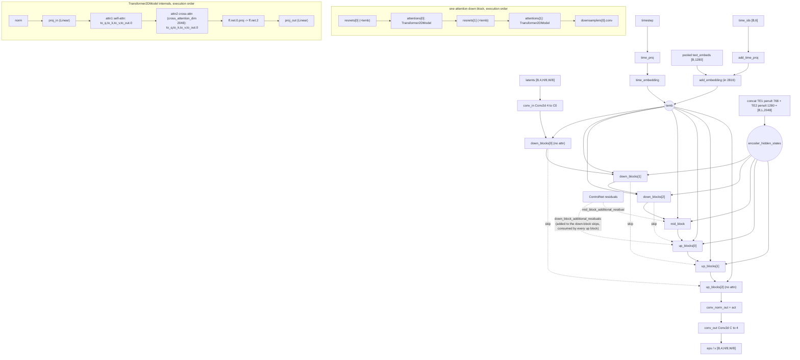

# Stable Diffusion XL (`sdxl`)

Latent text-to-image diffusion, still-image modality, sharing the diffusers
`UNet2DConditionModel` backbone with `sd15`. Two structural facts separate it from
every other arch in this repo: **dual text encoders** whose penultimate hidden
states are concatenated on the feature axis to a 2048-wide `encoder_hidden_states`
while the second encoder's projection output supplies a 1280-wide **pooled**
vector, and a **micro-conditioning** path — that pooled vector plus a 6-element
`time_ids` (`original_size`, `crop_top_left`, `target_size`) enter the U-Net's
`add_embedding` through `added_cond_kwargs`, not through cross-attention. `sdxl`
is also the only arch here with a SushiUI **custom-architecture** escape hatch:
`sushi.vae_type` / `sushi.te_type` metadata can swap the VAE (resizing
`conv_in`/`conv_out`) and replace CLIP with a bridged alternative encoder. It has
no package under `backend/core/models/` and no file under
`backend/core/pipeline_backends/`; generation lives in the base
`core.pipeline.DiffusionPipelineManager` path.

## Components

| Role | Class | Module | Notes |
|---|---|---|---|
| Denoiser | `UNet2DConditionModel` | diffusers (imported in `core.training.ops.sd_sdxl_ops`, `core.models.sdxl_custom_arch`) | Not vendored. `core.models.sdxl_custom_arch` states the fixed interface: `cross_attention_dim=2048`, `add_embedding` input 2816. |
| Text encoder 1 | `CLIPTextModel` | transformers (imported in `sd_sdxl_ops`) | CLIP ViT-L. Tapped at `hidden_states[-2]` (penultimate). |
| Text encoder 2 | `CLIPTextModelWithProjection` | transformers (same import site) | OpenCLIP ViT-bigG. Tapped at `hidden_states[-2]` for the sequence **and** `encoder_output_2[0]` for the pooled vector. |
| Tokenizer 1 / 2 | `CLIPTokenizer` ×2 | transformers | `tokenizer` and `tokenizer_2`. Chunking measures length with `tokenizer_2` (`sd_sdxl_ops.encode_prompt_chunked`, `trainer.tokenizer_2 if trainer.is_sdxl`). |
| VAE | `AutoencoderKL` | diffusers | 4-channel latents. Registry row `core.models.common.vae_store.VAE_REGISTRY["sdxl"]`: `latent_channels=4`, `default_repo="madebyollin/sdxl-vae-fp16-fix"`, `scaling_factor=0.13025`, `shift_factor=None`. |
| VAE wrapper (optional) | `SDXLVAEWrapper` / `get_sdxl_vae` | `core.models.components.vae_wrapper`, re-exported by `core.models.sdxl_vae_wrapper` | Holds an `AutoencoderKL` at `.vae`; embedded config `latent_channels=4`, `scaling_factor=0.13025`, `block_out_channels=[128,256,512,512]`. `sd_sdxl_ops.vae_encode` unwraps `.vae` when it sees one. |
| Custom VAE (opt-in) | `AutoencoderKL` from `core.models.components.vae_registry.VAE_REGISTRY` | `core.models.sdxl_custom_arch.load_alt_vae` | Registry rows `"sdxl"` (`channels=4`) and `"flux1"` (`channels=16`); that table carries repo/subfolder/channels/preview only. Scale and shift are read from the loaded VAE's own config at runtime (`vae_registry._scale_shift`); the canonical FLUX.1 values `scaling_factor=0.3611` / `shift_factor=0.1159` are written in `core.models.common.vae_store.VAE_REGISTRY["flux1"]`. |
| Custom text encoder (opt-in) | SigLIP2 text tower / `T5EncoderModel` / Qwen3 `AutoModel` | `core.models.components.te_registry.load_sdxl_te`, re-exported by `core.models.sdxl_te_registry` | `TE_REGISTRY` keys: `siglip2_text` → `google/siglip2-so400m-patch16-512`; `flan_t5` → `google/flan-t5-large`; `qwen3` → `Qwen/Qwen3.5-0.8B`. |
| TE bridge adapters (opt-in) | `SDXLTEAdapters` | `core.models.components.bridge_adapter`, re-exported by `core.models.sdxl_te_adapter` | Two `_MLP`s (`Linear → SiLU → Linear`): `hidden: D_te → 2048`, `pooled: D_te → 1280`. Submodule names are frozen because they produce the `sushi.te_adapter.*` checkpoint keys. |
| Inference pipeline | `StableDiffusionXLPipeline` / `StableDiffusionXLImg2ImgPipeline` / `StableDiffusionXLInpaintPipeline` | diffusers, held by `DiffusionPipelineManager` | Three slots: `txt2img_pipeline`, `img2img_pipeline`, `inpaint_pipeline`. |
| Scheduler (inference) | resolved by `core.inference.schedulers.get_scheduler` | `core.pipeline._generate_txt2img_sd` | Per-request from `sampler` + `schedule_type`. |
| Scheduler (training) | `DDPMScheduler` | `sd_sdxl_ops.load_components` | Single-file path: `beta_start=0.00085`, `beta_end=0.012`, `beta_schedule="scaled_linear"`, `num_train_timesteps=1000`, `clip_sample=False`, `prediction_type="epsilon"`. Diffusers-directory path: `DDPMScheduler.from_pretrained(subfolder="scheduler")`. |
| Scheduler (in-training sampling) | `trainer.original_scheduler` | `sd_sdxl_ops.load_components` | Single-file path keeps the loaded pipeline's own scheduler (`temp_pipeline.scheduler`); only the diffusers-directory path builds `EulerDiscreteScheduler.from_pretrained(subfolder="scheduler")`. |
| Optional reference-image tower | `SigLIP2VisionEncoderWrapper` | `core.vision_encoder`, wired by `DiffusionPipelineManager.load_vision_encoder` / `_apply_vision_encoder` | Tokens appended on the sequence axis. |
| ControlNet (generation) | `ControlNetModel` | diffusers, via `DiffusionPipelineManager._apply_controlnets` | The SDXL branch forwards `added_cond_kwargs` into the ControlNet. |
| ControlNet (training) | `ControlNetModel` or `LLLiteModule` | `core.training.lllite_module`, driven by `core.training.adapters.controlnet_sdxl_adapter.ControlNetSDXLAdapter` | |

No component of `sdxl` is vendored in this repository.

## Load path

Entry: `ModelLoader.load_model` in `backend/core/model_loader.py`, fanning out to
`load_from_safetensors`, `load_from_diffusers`, or `load_from_huggingface`.

`ModelLoader.detect_model_type` returns `"sdxl"` from:

1. Metadata — `_map_model_type_string` maps
   `sdxl | sd-xl | stable-diffusion-xl | stable_diffusion_xl`; read from a
   safetensors `__metadata__["model_type"]` or a shard index's `metadata` block.
2. Diffusers directory — `model_index.json` whose `_class_name` contains `"XL"`.
3. Key signature + size — a single file with `model.diffusion_model.*` keys and a
   file size **> 6 GB**. A final size-only fallback repeats the same test when the
   key probe was inconclusive.
4. HuggingFace — `load_from_huggingface` takes the SDXL branch when `"xl"` or
   `"sdxl"` appears in the repo id.

Accepted layouts:

| Layout | Builder | Notes |
|---|---|---|
| Single `.safetensors` | `ModelLoader.reconstruct_sd_sdxl_pipeline` → `StableDiffusionXLPipeline.from_single_file` | fp16 attempt then fp32 retry. |
| Single file without embedded VAE | same, plus `AutoencoderKL.from_pretrained("madebyollin/sdxl-vae-fp16-fix")` | Gate: `ModelLoader.has_embedded_vae`. |
| SushiUI custom-arch single file | same, plus conv resize + component reconstruction | See below. |
| Diffusers directory | `StableDiffusionXLPipeline.from_pretrained` | `load_from_diffusers`. |
| HuggingFace repo id | `StableDiffusionXLPipeline.from_pretrained` | `load_from_huggingface`. |

**Custom-architecture reconstruction** (`reconstruct_sd_sdxl_pipeline`, guarded by
`if model_type == "sdxl"`) reads the safetensors metadata block:

* `sushi.vae_type` not in `{"", "none", "sdxl"}` → `custom_vae_type`, with
  `sushi.in_channels` → `custom_in_channels`. The registry VAE is loaded via
  `core.models.sdxl_custom_arch.load_alt_vae`, `from_single_file` is given
  `num_in_channels=` **and** `out_channels=` (both are required — `num_in_channels`
  alone leaves `conv_out` at the SDXL default), then
  `sdxl_custom_arch.resize_unet_in_out` fixes the shapes and
  `sdxl_custom_arch.load_custom_convs_from_single_file` copies the trained convs
  directly out of the file using `_LDM_CONV_KEYS`.
* `sushi.te_type` not in `{"", "none", "clip"}` → `custom_te` dict
  (`te_type`, `sushi.te_hidden_layer` default `-2`, `sushi.te_max_len` default
  `256`, `sushi.te_dim`, `sushi.te_embedded`). `load_sdxl_te` rebuilds the encoder,
  `SDXLTEAdapters(dim)` is loaded from `sushi.te_adapter.*` keys, and the encoder
  body is loaded from `sushi.te_encoder.*` when `te_embedded == "1"`. The result is
  attached as `pipeline._sushi_te`, `_sushi_te_tokenizer`, `_sushi_te_adapters`,
  `_sushi_te_max_len`, `_sushi_te_hidden_layer`, `_sushi_te_dim`,
  `_sushi_te_embedded`.

Every load also sets `pipeline._sushi_vae_source` (custom registry name, external
repo id, or `"embedded (checkpoint)"`) and `pipeline._sushi_arch`, the summary dict
resume paths read to rebuild trainer state.

Refusals: `ModelLoader._refuse_load_time_te_choice` (rejects `text_encoder_file` /
`clip_projection_file`), `ModelLoader._refuse_hybrid_on_other_arch` (rejects a
MiniMax-H3 hybrid), and `load_model`'s `ValueError` on `text_encoder_path` /
`vae_path` for anything that is not `anima`. Objective detection is
`ModelLoader.detect_prediction_config` / `detect_v_prediction`, applied by
`_configure_v_prediction_scheduler`. A `None` `pipeline.vae` after device placement
raises `RuntimeError`.

## Denoiser structure

Prose. The backbone is diffusers' `UNet2DConditionModel`, unmodified except for
the optional `conv_in`/`conv_out` resize. What makes it SDXL rather than SD1.5 is
entirely on the conditioning side:

* **Cross-attention width 2048.** `core.models.sdxl_custom_arch`'s module
  docstring pins `cross_attention_dim=2048` as fixed — this is why a swapped text
  encoder needs `SDXLTEAdapters.hidden` to project to exactly 2048 rather than
  changing the body.
* **`add_embedding` input 2816.** Same docstring. That is the pooled 1280 plus the
  projected `time_ids`; the concatenation and projection happen inside diffusers'
  `UNet2DConditionModel`, which this repo passes
  `added_cond_kwargs={"text_embeds": ..., "time_ids": ...}` — see
  `sd_sdxl_ops.train_step` and `custom_sampling.custom_sampling_loop`. Nothing in
  this repository re-implements that fusion.
* **Latent-facing convs.** `unet.conv_in` / `unet.conv_out` are the *only*
  latent-channel-dependent modules, which is the stated premise of
  `sdxl_custom_arch.resize_unet_in_out`: resizing them migrates SDXL to a 16-channel
  VAE with the transformer body inherited unchanged (channel-partial weight copy,
  `register_to_config(in_channels=..., out_channels=...)` to keep downstream
  latent-shape checks consistent).
* **Attention stacks.** `SDXLLoRAAdapter.apply_lora_to_unet` matches on
  `__class__.__name__ == "Transformer2DModel"` and wraps every child `Linear`
  inside. Its docstring enumerates the block set as
  `down_blocks.1.attentions.{0,1}`, `down_blocks.2.attentions.{0,1}`,
  `mid_block.attentions.0`, `up_blocks.0.attentions.{0,1,2}`,
  `up_blocks.1.attentions.{0,1,2}` — 11 blocks. That enumeration is a docstring
  claim; the code counts by iteration and asserts nothing.
* **Block containers.** `unet.down_blocks` / `unet.mid_block` / `unet.up_blocks`
  are the lists FBCache and Spectrum index into
  (`FBCacheBlockController.__init__` reads `len(unet.down_blocks)` and
  `down_blocks[idx].resnets` / `.downsamplers`).

Node names in the diagram that this repository does **not** reference —
`time_proj`, `time_embedding`, `add_time_proj`, `conv_norm_out` and the output
activation — are diffusers-internal `UNet2DConditionModel` members shown for
orientation. The repo touches only `conv_in`, `conv_out`, `down_blocks`,
`mid_block`, `up_blocks`, `attn_processors` and `config.in_channels/out_channels`,
plus the `added_cond_kwargs` keyword that feeds `add_embedding`.

Per-stage channel widths, `transformer_layers_per_block`, `attention_head_dim`,
and the exact number of down/up stages come from the checkpoint's
`unet/config.json` (or the CompVis config `from_single_file` infers). They are not
written in this repository. The 3+3 stage shape drawn above is INFERRED from the
adapter docstring's block enumeration, not read from a config symbol.

## Tensor contract

| Property | Value | Source symbol |
|---|---|---|
| Latent space | 4-channel 2-D latents, `[B, 4, H/8, W/8]` | `SDXL_WIRING.latent_channels = 4`, `.latent_ndim = 4`, `.latent_packing = "none"` (`core.models.components.wiring`) |
| Latent space (custom arch) | whatever `VAE_REGISTRY[vae_type]["channels"]` says — `"flux1"` is 16 | `core.models.components.vae_registry.vae_latent_channels`, applied by `sdxl_custom_arch.resize_unet_in_out`; recorded at runtime as `trainer.vae_latent_channels = vae.config.latent_channels` |
| Spatial downscale | 8 | `SDXL_WIRING.vae_scale_factor = 8`; `vae_registry.VAE_SCALE_FACTOR = 8` |
| Latent normalisation | `(sample - shift) * scale`; inverse `latent / scale + shift` | `vae_registry.normalize_latent` / `denormalize_latent` over `_scale_shift(vae)`. Applied on the training encode path by `sd_sdxl_ops.vae_encode` — its comment notes standard SDXL has `shift == 0`, so this is identical to a bare `* scaling_factor`. |
| Canonical scaling factor | `0.13025`, no shift | `core.models.common.vae_store.VAE_REGISTRY["sdxl"]`. `vae_store` explicitly warns that `AutoencoderKL.from_single_file` cannot distinguish an SDXL VAE from an SD1.5 one and falls back to `LDM_SINGLE_FILE_DEFAULT_SCALING_FACTOR = 0.18215`, a 1.40× error. |
| Text embedding | `[B, L, 2048]` = `cat([TE1 hidden_states[-2] (768), TE2 hidden_states[-2] (1280)], dim=-1)` | `sd_sdxl_ops.encode_prompt_simple` (`torch.cat([text_embeddings_1, text_embeddings_2], dim=-1)`); widths from `SDXL_WIRING.te_out_dim = 2048` |
| Text tap layer | **penultimate** for both encoders — `hidden_states[-2]`, not the final layer | `sd_sdxl_ops.encode_prompt_simple` (comment: "matches diffusers' `StableDiffusionXLPipeline.encode_prompt()`"); mirrored in `encode_prompt_chunked` |
| Pooled conditioning | `[B, 1280]` = `encoder_output_2[0]`, the projection output of TE2 | `sd_sdxl_ops.encode_prompt_simple`; `SDXL_WIRING.te_pooled_dim = 1280` |
| Auxiliary conditioning | `time_ids` `[B, 6]` = `[orig_h, orig_w, crop_top, crop_left, target_h, target_w]` | `SDXL_WIRING.added_cond = "sdxl_time_ids"`. Training: `sd_sdxl_ops.train_step` uses the dataset-supplied `ctx.time_ids` when present, else falls back to `[latent_h*8, latent_w*8, 0, 0, latent_h*8, latent_w*8]` repeated over the batch. Inference: `custom_sampling.custom_sampling_loop` builds `original_size + crops_coords_top_left + target_size` with `crops_coords_top_left = (0, 0)`, `target_size = (height, width)`, and `original_size` from `custom_sampling._resolve_sdxl_original_size` (explicit `original_size_w`/`original_size_h` win; else output size × `original_size_scale`). |
| Conditioning entry point | `added_cond_kwargs = {"text_embeds": ..., "time_ids": ...}` passed as a U-Net kwarg | `sd_sdxl_ops.train_step`; `custom_sampling.custom_sampling_loop`; ControlNet twin in `ControlNetSDXLAdapter._standard_forward` |
| Custom-TE contract | any encoder's `(hidden[B,L,D_te], pooled[B,D_te])` bridged to `(enc[B,L,2048], pooled[B,1280])` | `core.models.components.bridge_adapter.SDXLTEAdapters(in_dim, hidden_out=2048, pooled_out=1280)`; hidden = `encode_text`'s chosen layer (default `-2`), pooled = attention-masked mean of `last_hidden_state` |
| Sequence extension (optional) | `[B, 77, D]` → `[B, 77 + 1 + 256*N, D]` with a SigLIP2 vision encoder | `DiffusionPipelineManager._apply_vision_encoder` |
| Positional encoding | none in the denoiser — convolutional U-Net, no RoPE, no image position table. Spatial "position" is carried by `time_ids` micro-conditioning only. Text positions are CLIP's learned absolute embedding; `te_registry._extend_position_embeddings` interpolates a swapped encoder's table up to `max_len` when it has one (T5 and Qwen3 skip it — relative bias / RoPE). | absence of RoPE symbols on this path; `core.models.components.te_registry._extend_position_embeddings` |
| Timestep convention | discrete integers, DDPM direction `t=999` noisy → `t=0` clean | `sd_sdxl_ops.train_step`, `noise_process == "ddpm"` branch |
| Noise process | `"ddpm"` default; `"flow"` reachable through the same helpers | `sd_sdxl_ops.train_step` → `base_trainer.add_noise_unified` |
| Prediction target | `"epsilon"` default; `"velocity"`, `"sample"` supported | `base_trainer.get_target_unified`; load-side `ModelLoader.detect_prediction_config` (family default `"ddpm"` for `sdxl`) |
| Save-side objective record | `modelspec.architecture = "stable-diffusion-xl-v1-base"`, or `"sdxl-custom"` when a custom VAE/TE is present; plus `modelspec.noise_process` / `modelspec.prediction_type` when not `"auto"`, and `sushi.vae_type` / `sushi.in_channels` / `sushi.te_*` | `core.training.adapters.sdxl_adapter.sushi_modelspec_metadata` |
| Pixel alignment for training | multiple of 8 | `ArchHandler.pixel_align = 8`, not overridden by `SDXLArchHandler` |
| Temporal contract | none — still image | `ArchHandler.temporal = None`, not overridden |

## Generation path

There is **no** `core/pipeline_backends/sdxl.py`. `sdxl` is served by the base
`core.pipeline.DiffusionPipelineManager`:

| Route | Public method | Body |
|---|---|---|
| txt2img | `generate_txt2img` | `_generate_txt2img_sd` |
| img2img | `generate_img2img` | `_generate_img2img_sd` |
| inpaint | `generate_inpaint` | `_generate_inpaint_sd` |

SDXL is distinguished at runtime by
`is_sdxl = isinstance(self.txt2img_pipeline, StableDiffusionXLPipeline)` in the
generation bodies, and by `hasattr(pipeline, 'text_encoder_2') and
pipeline.text_encoder_2 is not None` in the encode helpers (the latter survives
ControlNet pipeline substitution, which the isinstance test does not).

Each body drives one loop in `core.inference.custom_sampling`:
`custom_sampling_loop`, `custom_img2img_sampling_loop`, or
`custom_inpaint_sampling_loop`. Diffusers' `__call__` is not used for the denoise.

Arch-specific generation stages:

* **Micro-conditioning assembly**, per step, inside `custom_sampling_loop`'s
  `if is_sdxl:` block — `add_time_ids` is built, then duplicated
  (`torch.cat([add_time_ids] * 2, dim=0)`) whenever CFG or NAG is active so it
  matches the batch-2 latent, and `add_text_embeds` becomes
  `cat([negative_pooled, pooled])`. Note the deliberate asymmetry: `time_ids` and
  `text_embeds` stay batch-2 even under NAG, where only
  `encoder_hidden_states` grows to batch-3.
* **Per-row slicing for split forwards** — `_slice_added_cond_kwargs(row)` (defined
  locally in the style-transfer branches) extracts row 0 for the unconditional pass
  and row 1 for the conditional pass when the U-Net is called twice instead of on a
  batch-2 input.
* **Custom-TE encode** — `DiffusionPipelineManager._custom_te_encode`, taken when
  `pipeline._sushi_te` is present. It bypasses CLIP, emphasis weighting and
  chunking, calling `te_registry.encode_text` at fixed `max_len` and then the
  bridge adapters, returning the SDXL 4-tuple directly.
* **ControlNet** — `_apply_controlnets(..., is_sdxl)`; inside the loop,
  `controlnet_kwargs["added_cond_kwargs"] = added_cond_kwargs` is set under
  `if is_sdxl and added_cond_kwargs`.

Normal encode path (`_encode_prompt_with_weights`): custom TE → chunked above 75
tokens → NoBOS single chunk → plain `pipeline.encode_prompt` with BOS/EOS stripped
and emphasis applied. `pooled_prompt_embeds = embeds[2] if is_sdxl else None` at
every branch.

CFG shape in `custom_sampling_loop` (identical machinery to `sd15`; SDXL only adds
the `added_cond_kwargs` rows):

* `do_classifier_free_guidance = abs(cfg - 1.0) > 1e-5 or nag_active or negpip_active`.
* Standard: **one** forward, batch-2 —
  `torch.cat([latents] * 2)` against `torch.cat([negative, positive])`.
* `cfg == 1.0`: batch-1 conditional only; `added_cond_kwargs` uses the single-row
  `add_text_embeds = current_pooled_prompt_embeds`.
* NAG: latents batch-2, `encoder_hidden_states` batch-3
  `[cfg_neg, cfg_pos, nag_neg]` zero-padded to a common length; `time_ids` and
  `text_embeds` stay batch-2.
* Style transfer: batch-1 latent, **two** separate U-Net calls with per-row
  `added_cond_kwargs`.

Post-CFG: `rescale_noise_cfg` (auto `guidance_rescale=0.7` when the scheduler
reports `prediction_type == "v_prediction"`), `calculate_dynamic_cfg`,
`dynamic_thresholding`, `calculate_cfg_metrics`, `inloop_hard_flatten_step`.

## Training path

| Piece | Symbol |
|---|---|
| Arch handler | `core.training.arch.sdxl.SDXLArchHandler` (`name = "sdxl"`, `wiring = SDXL_WIRING`), registered as `ARCH_REGISTRY["sdxl"]` |
| Handler selection | `core.training.arch.resolve_arch_name` — `if getattr(trainer, "is_sdxl", False): return "sdxl"`, immediately before the `sd15` fallback |
| Component load | `core.training.ops.sd_sdxl_ops.load_components` (shared with `sd15`; it **sets** `trainer.is_sdxl`, which is why the load-time dispatcher cannot route through `trainer.arch`) |
| Encode / VAE / step / sample | `sd_sdxl_ops.encode_prompt_simple`, `encode_prompt_chunked`, `encode_prompt_custom_te`, `vae_encode`, `train_step`; sampling routes back through `trainer.generate_sample` |
| LoRA adapter | `core.training.adapters.sdxl_adapter.SDXLLoRAAdapter` |
| Full fine-tune adapter | `core.training.adapters.sdxl_adapter.SDXLFullParameterAdapter` |
| LoRA layer | `core.training.adapters.sd15_adapter.LoRALinearLayer` (imported by `sdxl_adapter`) |
| ControlNet adapter | `core.training.adapters.controlnet_sdxl_adapter.ControlNetSDXLAdapter`, selected by `ControlNetTrainer._create_adapter` |

**Trainable by default.** `SDXLFullParameterAdapter.prepare_models_for_training`:
U-Net when `trainer.train_unet`; both text encoders when
`trainer.train_text_encoder` **and** no custom TE is configured — when
`sdxl_te_type` is set, CLIP is force-frozen regardless of the flag because the
encode path no longer routes through it; VAE always frozen. Parameter groups:
`unet_lr`, `text_encoder_1_lr`, `text_encoder_2_lr`, plus (custom-TE only) the
bridge adapters at `resolve_component_lr(trainer, "text_encoder_lr", "unet_lr")`
and, when `sdxl_te_train_encoder`, the encoder body at
`resolve_component_lr(trainer, "text_encoder_1_lr", "text_encoder_lr", "unet_lr")`.
The bridge adapters are **always** trainable when a custom TE is present.

**LoRA targets.** `SDXLLoRAAdapter.apply_lora_to_unet` wraps every `Linear` inside
every `Transformer2DModel` (attention projections, `proj_in`/`proj_out`, both
feed-forward Linears). `apply_lora_to_text_encoders` wraps `layer.mlp.fc1` and
`layer.mlp.fc2` for every layer of **both**
`text_encoder.text_model.encoder.layers` and
`text_encoder_2.text_model.encoder.layers`. Note the TE branches construct
`LoRALinearLayer` **without** passing `self.lora_dtype`, so those layers take the
constructor default `torch.float32` while U-Net LoRA layers take the configured
dtype.

**Key naming.**

* U-Net: `f"lora_unet_{block_name}_{child_name}".replace(".", "_")`.
* TE1: `f"lora_te1_text_model_encoder_layers_{idx}_mlp_fc{1|2}"`.
* TE2: `f"lora_te2_text_model_encoder_layers_{idx}_mlp_fc{1|2}"`.
* On disk (`SDXLLoRAAdapter.save_checkpoint`): `{lora_name}.lora_down.weight`,
  `{lora_name}.lora_up.weight`, `{lora_name}.alpha`; metadata `lora_rank`,
  `lora_alpha`, `step`, `epoch`, `model_type="sdxl"`, plus
  `sushi_modelspec_metadata`.
* Parameter-group routing keys off the `lora_unet_` / `lora_te1_` / `lora_te2_`
  prefixes.

**Full-FT save layout** (`SDXLFullParameterAdapter.save_checkpoint`):
`model.diffusion_model.*` (`convert_unet_state_dict_to_original`),
`first_stage_model.*` (`convert_vae_state_dict_to_original`, gated on
`resolve_bundle_vae(..., "sdxl")` — per-arch default `True` — **and** on the VAE
not being custom), `conditioner.embedders.0.transformer.*`
(`convert_openai_text_enc_to_original`),
`conditioner.embedders.1.model.*` (`convert_openclip_text_enc_to_original`, with
`text_projection.weight` renamed to `text_projection` and transposed),
`sushi.te_adapter.*` (always, when a custom TE is present) and
`sushi.te_encoder.*` (only when `sdxl_te_train_encoder`).

**Refusals / unsupported combinations.**

* **Custom arch requires full fine-tune.** `sd_sdxl_ops.load_components` raises
  `ValueError` when `sdxl_vae_type` or `sdxl_te_type` is set and
  `core.training.ops.training_method.is_full_finetune(trainer)` is false —
  LoRA cannot train the resized convs or the bridge adapters, and the LoRA save
  path would silently drop them.
* **Custom VAE is never embedded** in a full-FT checkpoint; it is referenced by
  `sushi.vae_type` metadata and reloaded on load, because
  `convert_vae_state_dict_to_original` assumes the 4-channel SDXL VAE structure.
* **Custom TE suppresses CLIP saving** — `_custom_te_save` skips both
  `conditioner.embedders.*` blocks so a custom-TE checkpoint carries no dead CLIP
  weight.
* `reject_quantized_base(trainer.unet, model_label="SDXL")` raises
  `NotImplementedError` for full fine-tuning on a weight-only quantized base;
  called from **both** `prepare_models_for_training` and
  `setup_trainable_parameters`. LoRA is still allowed.
* `SDXLArchHandler.vae_decode` raises `NotImplementedError`.
* Block swap: `SDXLArchHandler.setup_block_swap` is a documented no-op; declared
  unsupported in `api.arch_capabilities` — *"the SDXL U-Net training path has no
  block-swap consumer … its VRAM story is the sequential
  text-encoder/U-Net/VAE component offload"*. Fused optimizer groups are therefore
  unreachable (`num_optimizer_groups` is read only under `blocks_to_swap > 0`).
* ControlNet: `ControlNetSDXLAdapter.create_controlnet` accepts only
  `{"standard", "lllite"}` and raises `ValueError` otherwise, with the same guard
  repeated in `setup_trainable_parameters`, `save_checkpoint`, `load_checkpoint`
  and `controlnet_forward`. `ControlNetTrainer` freezes U-Net, VAE and both text
  encoders.

## Hook points

| Hook | Owner symbol | Status |
|---|---|---|
| Attention conduit entry | `core.inference.attention_processors.set_attention_processor(unet, backend, mode)` → `UnifiedAttnProcessor` on every `unet.attn_processors` entry | Supported. Inference: installed by `_generate_*_sd` when `attention_type != "normal"`, or force-installed when style transfer is active. Training: `sd_sdxl_ops.setup_attention_backend`, `attention_impl == "conduit"` branch, `mode=AttentionMode.TRAINING`; its docstring notes this is the only way `tq` engages in training, since the `"diffusers"` branch's `to_diffusers_backend` collapses `tq` to native. `added_cond_kwargs` / `time_ids` / pooled embeds are computed outside attention and are untouched by the swap. Original processors saved to `trainer._sdxl_original_attn_processors`. |
| Attention backend capability gate | `core.attention.registry` specs (`sage`: `allowed_head_dims={64,96,128}`; `tq`: `{64,128}`; `flash`: `max_head_dim=256`), evaluated in `core.attention.config`; `trainer._resolve_training_backend` strips `sage` in training | Supported. The checkpoint's `attention_head_dim` decides which backends survive; that value is not in this repository. |
| Block swap boundary | — | **Unsupported.** Generation: `api.arch_capabilities` `_add("sdxl", "block_swap", ...)` — `core.pipeline` / `core.vram_optimization` never read `blocks_to_swap`/`enable_block_swap`. Training: `SDXLArchHandler.setup_block_swap` returns `None`. |
| Component offload (the substitute) | `core.vram_optimization.move_text_encoders_to_gpu/cpu`, `move_unet_to_gpu/cpu`, `move_vae_to_gpu/cpu`; `log_device_status` reports placement and quantization | Supported. |
| FBCache indicator | `core.inference.fbcache_unet.FBCacheBlockController` / `build_unet_fbcache_controller`, built from all three `custom_sampling` loops | Supported. Indicator `down_blocks[branch]` with `branch = max(1, min(cache_branch, n_down - 1))`; reused region `down_blocks[branch+1:]` + `mid_block`. Params `fbcache_enable`, `fbcache_threshold`, `fbcache_warmup_steps`, `fbcache_cache_branch`. |
| Spectrum (SFF) block cache | `core.inference.spectrum_unet.SpectrumBlockController` + `core.inference.spectrum_forecaster.SpectrumForecaster` | Supported. `spectrum_unet`'s docstring names SDXL explicitly; caches the deep `down_blocks[cache_branch:]` + `mid_block` features. |
| Quantized `Linear` swap | `core.vram_optimization._quantize_unet` via `move_unet_to_gpu(pipeline, quantization, use_torch_compile)` | Supported for `fp8_e4m3fn` / `fp8_e5m2` only, as a whole-module `deepcopy().to(dtype=fp8)` — not a per-`Linear` swap. Original at `pipeline._original_unet`, copies cached in `pipeline._quantized_unet_cache` keyed `"{quant}"` or `"{quant}_compile"`. Runtime int8 is refused by `_refuse_runtime_int8_elsewhere` (DiT-only). Unsupported types warn with code `quantization_fallback`. |
| Keep-hot residency | `core.keep_hot` (`compute_model_key`, `should_keep_resident`, `is_resident`, `mark_resident`, `clear_resident`, `discard_resident`, `invalidate_if_model_changed`) called from `_generate_txt2img_sd` / `_generate_img2img_sd` / `_generate_inpaint_sd` | Supported. Both text encoders, U-Net and VAE are eligible; U-Net is gated off whenever any LoRA is applied, text encoders off under `cpu_text_encoding`. Key includes checkpoint, LoRA fingerprint, quantization and dtype. |
| Activation offload / dispatch | `core.memory_management.ActivationDispatcher`, held as `BaseTrainer.activation_dispatcher` | Arch-neutral spine feature; no `sdxl`-specific branch. |
| Style-transfer KV injection | `core.inference.reference_style` (`StyleTransferConfig`, `StyleContext`, `inject_kv`) through `UnifiedAttnProcessor`; indices from `attention_processors.ensure_style_block_indices` (self-attn `attn1` only), context via `set_style_context` | Supported. |
| Regional prompt (attention method) | `core.inference.attention_processors.RegionalPromptContext` | Supported. |
| Reference-image tokens | `DiffusionPipelineManager._apply_vision_encoder` | Supported, optional. Also the only arch besides FLUX.2/SenseNova with reference-image conditioning **during training** (`api.arch_capabilities` exempts `sd15`/`sdxl` from the `reference_images` unsupported list). |
| Custom-arch conv resize | `core.models.sdxl_custom_arch.resize_unet_in_out`, `load_custom_convs_from_single_file`, `_LDM_CONV_KEYS` | **SDXL-only** hook. Rewrites `unet.conv_in` / `unet.conv_out` in place with a channel-partial weight copy and `register_to_config`. |
| Custom-TE bridge | `core.models.components.te_registry.load_sdxl_te` / `encode_text` / `TE_REGISTRY` / `is_custom_te`; `core.models.components.bridge_adapter.SDXLTEAdapters` | **SDXL-only** hook. Shims at `core.models.sdxl_te_registry` and `core.models.sdxl_te_adapter` re-export the identical objects; the `sushi.te_adapter.*` key layout is frozen to `SDXLTEAdapters`' submodule names (`hidden.net.*`, `pooled.net.*`). `BridgeAdapter` is the generalized sibling and is **not** used by the SDXL save/load path. |
| VAE wrapper | `core.models.components.vae_wrapper.SDXLVAEWrapper` (shim: `core.models.sdxl_vae_wrapper`) | Supported/recognised. `sd_sdxl_ops.vae_encode` unwraps `trainer.vae.vae` when the VAE is a wrapper. The wrapper is not what the standard load path builds — `reconstruct_sd_sdxl_pipeline` attaches a plain `AutoencoderKL`. |
| Per-generation TE override | `DiffusionPipelineManager.load_override_te(te_path)` (and `_override_te_path` / restore) | Supported. `api.arch_capabilities` marks `te_override` unsupported on every DiT arch precisely because SD1.5/SDXL are where it works — either the custom-TE checkpoint's trained bridge adapters absorb the swap, or a matching-hidden CLIP is substituted. |

## Constraints

| Constraint | Enforcing symbol |
|---|---|
| Width/height must be a multiple of 8 | `ArchHandler.pixel_align = 8`, not overridden by `SDXLArchHandler` |
| `cross_attention_dim` fixed at 2048 and `add_embedding` input at 2816 — a swapped text encoder must be bridged, not substituted | stated in `core.models.sdxl_custom_arch`; enforced structurally by `SDXLTEAdapters(in_dim, hidden_out=2048, pooled_out=1280)` |
| Latent channels changeable only through `conv_in`/`conv_out`; the body is inherited unchanged | `sdxl_custom_arch.resize_unet_in_out` |
| `from_single_file` must receive **both** `num_in_channels` and `out_channels` for a custom-channel checkpoint, and both must be omitted for a standard one | `reconstruct_sd_sdxl_pipeline`'s `_sf_kw` construction |
| Custom VAE / custom TE require `training_method='full'` | `sd_sdxl_ops.load_components` `ValueError` |
| Custom VAE is never bundled into the saved single file | `SDXLFullParameterAdapter.save_checkpoint` (`_custom_vae` branch) |
| CLIP text encoders are force-frozen and unsaved when a custom TE is active, regardless of `train_text_encoder` | `SDXLFullParameterAdapter.prepare_models_for_training`, `setup_trainable_parameters`, `save_checkpoint` (`_custom_te` / `_custom_te_save`) |
| Custom-TE registry is closed: `siglip2_text`, `flan_t5`, `qwen3` | `te_registry.TE_REGISTRY`; `load_sdxl_te` raises `ValueError` for anything else and `NotImplementedError` for a registered-but-unimplemented `kind` |
| Custom-TE prompt length is fixed at `max_len` (default 256) with no emphasis weighting and no chunking | `DiffusionPipelineManager._custom_te_encode` docstring; `te_registry.encode_text` (`padding="max_length"`, `truncation=True`) |
| Detection floor: a `model.diffusion_model.*` single file ≤ 6 GB is classified `sd15`, not `sdxl` | `ModelLoader.detect_model_type` |
| Chunked prompts split at 75 tokens (length measured with `tokenizer_2`), optionally capped by `max_prompt_chunks`; join modes `a1111` / `sd_scripts` / `nobos`; pooled embeds are taken from **chunk 0 only** | `sd_sdxl_ops.encode_prompt_chunked` (`if idx == 0: pooled_embeddings = encoder_output_2[0]`) |
| Full fine-tuning refused on a weight-only quantized base | `base_adapter.reject_quantized_base`, called twice in `SDXLFullParameterAdapter` |
| Runtime int8 refused (DiT-only) | `core.vram_optimization._refuse_runtime_int8_elsewhere` |
| U-Net quantization limited to `fp8_e4m3fn` / `fp8_e5m2`; FP8 needs PyTorch ≥ 2.1.0 | `core.vram_optimization._quantize_unet` |
| Block swap and fused optimizer groups unavailable | `SDXLArchHandler.setup_block_swap`; `api.arch_capabilities` `block_swap` / `num_optimizer_groups` rows |
| `text_encoder_quantization` and `attention_impl` (generation) are not consumed | `api.arch_capabilities` `_add("sdxl", ...)` rows |
| `text_encoder_file` / `clip_projection_file` / MiniMax-H3 hybrid refused at load | `ModelLoader._refuse_load_time_te_choice`; `ModelLoader._refuse_hybrid_on_other_arch` |
| ControlNet training type restricted to `standard` / `lllite` | `ControlNetSDXLAdapter.create_controlnet` and its four sibling dispatch guards |
| `time_ids` / `text_embeds` stay batch-2 under NAG even though `encoder_hidden_states` is batch-3 | `custom_sampling.custom_sampling_loop`, the `if nag_active or do_classifier_free_guidance:` block inside `if is_sdxl:` |
| CFG short-circuits to a conditional-only forward at `cfg == 1.0` (unless NAG or NegPip is active) | `custom_sampling.custom_sampling_loop`, `do_classifier_free_guidance` expression |
| A pipeline whose `vae` is `None` after device placement is a hard load failure | `ModelLoader.load_from_safetensors` / `load_from_diffusers` (`RuntimeError`) |
