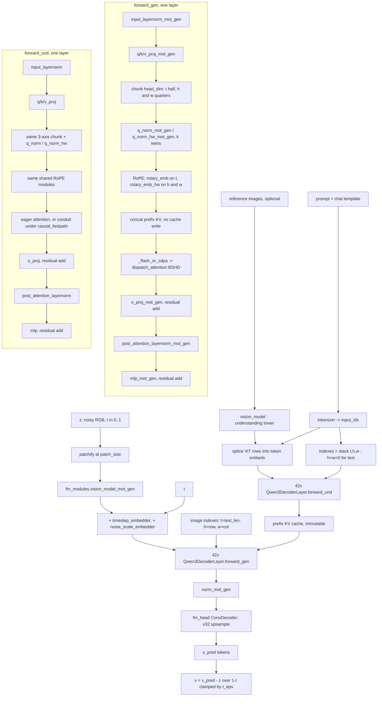

# SenseNova U1.5 (`sensenova`)

Text-to-image flow-matching model in which **the LLM itself is the denoiser**: a dense Qwen3
backbone (`Qwen3ForCausalLM`, vendored under `backend/core/models/sensenova/vendor/`) runs the
diffusion steps, and there is no separate text encoder — the prompt is encoded by the *same*
decoder stack in a prefix pass whose **KV cache** is the conditioning every denoise step reads.
Two structural facts separate it from everything else in this repo: (1) **MoT** — every decoder
layer carries a `_mot_gen`-suffixed twin of its q/k/v/o projections, qk-norms, MLP and both
layernorms, and a per-token boolean `image_gen_indicators` mask selects which half runs
(`Qwen3DecoderLayer.forward_und` / `forward_gen`); the two halves are never mixed (the mixed path
raises). (2) It is **pixel-space and quantization-mandatory** — no VAE (`ConvDecoder` upsamples the
last hidden state straight to RGB) and the only distribution this repo reads is its own weight-only
**int8** conversion; there is no bf16 base to load.

## Components

| Role | Class | Module | Notes |
|---|---|---|---|
| Top-level model | `NEOChatModel` | `core/models/sensenova/vendor/modeling_neo_chat.py` | **Vendored** (`core/models/sensenova/vendor/`); `PreTrainedModel`; the single component the loader returns |
| Config | `NEOChatConfig`, `NEOLLMConfig`, `NEOMoELLMConfig` | `vendor/configuration_neo_chat.py` | Vendored; `NEOLLMConfig` extends `Qwen3Config` with `rope_theta_hw` / `max_position_embeddings_hw` |
| Denoiser backbone | `Qwen3ForCausalLM` → `Qwen3Model` | `vendor/modeling_qwen3.py` | Vendored (**modified**: `_flash_or_sdpa` routes through the conduit). `Qwen3MoeForCausalLM` (`vendor/modeling_qwen3_moe.py`) is vendored unmodified and never instantiated for the dense checkpoint |
| Decoder layer | `Qwen3DecoderLayer` | `vendor/modeling_qwen3.py` | Vendored; holds `mlp` + `mlp_mot_gen`, `input_layernorm(+_mot_gen)`, `post_attention_layernorm(+_mot_gen)` |
| Attention | `Qwen3Attention` | `vendor/modeling_qwen3.py` | Vendored; ONE module instance carries BOTH branches' `{q,k,v,o}_proj` and `*_mot_gen` twins, plus `q_norm`/`k_norm`/`q_norm_hw`/`k_norm_hw` and their twins. Owns `_attn_backend`, `_attn_mode`, `_style_ctx` |
| RoPE | `Qwen3RotaryEmbedding` ×2 (`rotary_emb`, `rotary_emb_hw`) | `vendor/modeling_qwen3.py` | Vendored; **un-suffixed and shared by both MoT halves** — must stay resident under eviction |
| Norm | `Qwen3RMSNorm` | `vendor/modeling_qwen3.py` | Vendored; `Qwen3Model` also carries `norm` and `norm_mot_gen` |
| MLP | `Qwen3MLP` | `vendor/modeling_qwen3.py` | Vendored; `gate_proj`/`up_proj`/`down_proj` |
| Understanding vision tower | `NEOVisionModel` (`transformer.vision_model`) | `vendor/modeling_neo_vit.py` | Vendored; patch-embed only (`NEOVisionEmbeddings`: conv patchify → 2D RoPE → `dense_embedding` merge conv). Reads reference images |
| Generation vision tower | `NEOVisionModel` (`fm_modules["vision_model_mot_gen"]`) | `vendor/modeling_neo_vit.py` | Vendored; same class, separate weights; re-encodes the current noisy image every denoise step |
| Timestep embed | `TimestepEmbedder` (`fm_modules["timestep_embedder"]`) | `vendor/modeling_fm_modules.py` | Vendored; cos-then-sin sinusoid (256) → 2-layer MLP → LLM hidden size |
| Noise-scale embed | `TimestepEmbedder` (`fm_modules["noise_scale_embedder"]`) | `vendor/modeling_fm_modules.py` | Vendored; present only when `config.add_noise_scale_embedding` |
| Pixel head | `ConvDecoder` (`fm_modules["fm_head"]`) | `vendor/modeling_fm_modules.py` | Vendored; PixelShuffle(2) → conv → PixelShuffle(2) → conv(→192) → PixelShuffle(8) ⇒ ×32 upsample to 3 channels. Installed when `config.use_pixel_head` |
| Alternative heads | `FlowMatchingHead`/`SimpleMLPAdaLN` (deep) or `nn.Sequential` (plain) | `vendor/modeling_fm_modules.py`, `NEOChatModel.__init__` | Vendored; selected by `config.fm_head_layers > 2` / `use_pixel_head`. **Not implemented by this repo's training path** (`_assert_pixel_head_fm_decoder`) |
| Chat template | `get_conv_template` | `vendor/conversation.py` | Vendored; drives `_build_t2i_query` |
| Reference preprocessing | `load_image_native`, `SYSTEM_MESSAGE_FOR_GEN` | `vendor/utils.py` | Vendored; smart-resize + ImageNet normalization + patchify |
| Tokenizer | `transformers.AutoTokenizer` | `core/models/sensenova/loader.py::_load_sensenova_tokenizer` | Not vendored; loaded from the checkpoint's sibling tokenizer files |
| Quantized Linear | `Int8Linear` | `core/models/ideogram4/vendor/int8_linear.py` | Vendored under **ideogram4**; SenseNova ships no quant classes of its own |
| Quantized Linear (rotated) | `ConvRotInt8Linear` | `core/models/common/convrot_int8_linear.py` | Subclass of `Int8Linear`; used only for a ConvRot checkpoint |
| VAE | — | — | **None.** Pixel-space (`SENSENOVA_WIRING.latent_channels == 0`) |
| Scheduler | — | — | **None.** `sensenova_ops.load_components` sets `trainer.scheduler = trainer.noise_scheduler = None`; the time grid is built inline (`denoise_loop`) |

`load_sensenova_from_path` returns `{type, transformer, config, tokenizer, metadata, config_dict}`
— **one** module component, all-or-nothing residency.

## Load path

Entry: `core/models/sensenova/loader.py::load_sensenova_from_path(model_path, torch_dtype)`,
reached from `core/model_loader.py::ModelLoader.load_sensenova_from_path`.

Accepted layout — exactly one: **this repo's own single-file / shard-index format**
(`core/models/common/single_file_format.py::read_state_dict` + `strip_prefix`,
`TRANSFORMER_PREFIX = "transformer."`), with sibling tokenizer files and a sibling `config.json`.
`SENSENOVA_SIBLING_FILES` lists what must travel with a checkpoint. There is no upstream
single-file distribution and no diffusers-directory arm; `model_path` must be a file.

Geometry: `_load_sensenova_config` prefers the checkpoint's own `sensenova_config` metadata and
falls back to the sibling `config.json`; both are fed to `NEOChatConfig(**cfg_dict)`. The raw dict
is returned as `config_dict` so an export re-embeds the exact block this load accepted
(`_embeddable_sensenova_config` — `NEOChatConfig.to_dict()` is **not** a fixed point of
`NEOChatConfig(**·)` in this vendor tree, for the two reasons that function documents).

Quantized flavours, decided before anything is installed:

* **Plain weight-only int8** (the distributed checkpoint) — `_swap_sensenova_quantized_linears`
  gates on `is_int8_state_dict` and calls `swap_linears_to_int8`, then
  **`disable_int8_mm`**: W8A8 (`torch._int_mm`) is pinned OFF for this arch, authoritative over
  `SUSHI_INT8_MM` and any per-generation `quantized_gemm_mode="w8a8"`.
* **ConvRot int8** — `_int8_convrot_source_layers` adapts
  `core/models/common/convrot_marker.py::int8_convrot_layers_from_markers` to a materialized state
  dict; validated layers go to `swap_linears_to_convrot_int8`, after
  `require_convrot_int8_runtime()` and `_reshape_convrot_scales` (file `[out, 1]` → `(out,)`).
  `ConvRotInt8Linear.forward` never reads `_allow_int8_mm`, so the W8A8 pin does not reach it.

`_sensenova_quant_dict_views` splits the state dict three ways before the swap — `guard_sd`
(everything except a validated ConvRot layer's own `.comfy_quant`), `plain_sd` (ConvRot layer
prefixes excluded entirely), `sd_for_load` (plain provenance markers dropped, ConvRot markers
kept). `install_sensenova_state_dict` then runs
`refuse_unsupported_quant_semantics` → `quantized_state_dict_report` →
`scaled_quantization_report` → swaps → `verify_quantized_swap` →
`load_state_dict(strict=False, assign=True)`.

Construction happens under `accelerate.init_empty_weights()` (meta device) so an 18.7 GB model is
never materialized in bf16 before the int8 swap; `assign=True` installs the checkpoint's own
tensors with no intermediate cast. Nothing is staged to GPU at load.

Detection (`core/model_loader.py`): `_keys_look_sensenova` delegates to
`loader.is_sensenova_state_dict_keys`, which requires all three of `*q_proj_mot_gen.weight`,
`fm_modules.fm_head.*` and `language_model.model.layers.*` (key names only, so it works on a shard
`weight_map`); metadata `model_type == "sensenova"` short-circuits it.

Refusals: a non-file path (`FileNotFoundError`); a state dict with no `transformer.`-prefixed
tensors; any declared quant semantics other than the accepted ConvRot markers
(`refuse_unsupported_quant_semantics`); a ConvRot marker count that does not match the number of
modules replaced; a swap-count mismatch (`verify_quantized_swap` — an unswapped quantized layer
reaching `assign=True` would install int8 codes as a bf16 parameter); and, on the training path
only, a base that is not uniformly one supported quantized flavour
(`sensenova_ops._assert_supported_quantized_training_base`).

## Denoiser structure

There are two block variants, both dispatched from the same `Qwen3DecoderLayer.forward` by the
`image_gen_indicators` mask, and two phases that use them.



Walk-through. The **prefix phase** builds the conditioning: `NEOChatModel._build_t2i_query`
applies the chat template, `_build_t2i_text_inputs` tokenizes and builds the 3-row `indexes`
tensor plus a block-causal mask (`create_block_causal_mask`), and `_t2i_prefix_forward` (or
`_it2i_prefix_forward` when reference-image embeds were spliced in by `_build_it2i_inputs`) runs
`Qwen3Model.forward` with `use_cache=True`. Every layer takes `forward_und` — the
`_mot_gen` weights are idle — and the returned `past_key_values` is the whole of what the denoiser
consumes; `last_hidden_state` is discarded.

The **denoise phase** repeats per step: `_build_step_context`
(`sensenova_pipeline_ops.py`) patchifies the current pixel estimate twice — once at
`patch_size * merge_size` to get `z`, once at `patch_size` for the generation ViT — runs
`extract_feature(gen_model=True)`, and adds the timestep embedding (plus the noise-scale
embedding when `add_noise_scale_embedding`) to the resulting token embeddings.
`_t2i_predict_v` then calls `Qwen3Model.forward` with an all-ones `image_gen_indicators` and
`update_cache=False`, so every layer takes `forward_gen` against the immutable prefix KV, and the
`norm_mot_gen`-normalized last hidden state goes to `fm_modules["fm_head"]`. On the
`use_pixel_head` path the hidden state is reshaped to `b c h w`, `ConvDecoder` upsamples ×32 to
`b 3 H W`, and the result is re-patchified to token rows. Velocity is derived from the x0-shaped
prediction: `v = (x_pred - z) / (1 - t).clamp_min(config.t_eps)`.

`Qwen3Attention` is a single module instance per layer; the MoT duplication lives in the attribute
names (`q_proj` vs `q_proj_mot_gen`, `mlp` vs `mlp_mot_gen`). Note the asymmetry documented in
`sensenova_lora.py`: for attention the `_mot_gen` suffix is on the **Linear's own** attribute, for
the MLP it is on the **parent** module's attribute.

## Tensor contract

| Property | Value | Source symbol |
|---|---|---|
| Data space | pixel RGB, no VAE | `SENSENOVA_WIRING` (`core/models/components/wiring.py`): `latent_channels=0`, `vae_scale_factor=1`, `vae_norm="identity"` |
| Pixel normalization | `[-1, 1]`, `arr/127.5 - 1`; decode `x*127.5 + 128` | `sensenova_pipeline_ops.image_to_tensor` / `tensor_to_image` |
| Token patch | `patch_size * merge_size`, `merge_size = int(1 / downsample_ratio)` ⇒ **32** for the shipped `patch_size=16`, `downsample_ratio=0.5` | `TOKEN_GRID_ALIGN = 32` (`sensenova_pipeline_ops.py`), `NEOChatModel.__init__`, `SenseNovaArchHandler.pixel_align = 32` |
| Token grid | `token_h = H // 32`, `token_w = W // 32`; raw ViT grid `grid_h = H // patch_size` | `encode_prompt`, `_build_step_context` |
| "Text embedding" | none as a tensor — the conditioning is the prefix **KV cache** at the LLM hidden size (`SENSENOVA_WIRING.te_out_dim = 4096`, `te_seq_packing="llm"`) | `SenseNovaPrefix.cond_past_key_values`, `_t2i_prefix_forward` |
| Pooled / auxiliary cond | none. Timestep and noise-scale embeddings are **added to the image token embeddings**, not carried as a separate vector | `_build_step_context` |
| Reference-image cond | understanding-tower ViT rows spliced into the prompt token embeddings (NOT latents) | `_embed_reference_images`, `_splice_reference_image_tokens`, `NEOChatModel._build_it2i_inputs` |
| Positional encoding | 3-axis RoPE over `indexes = stack([t, h, w])`; `t` gets `head_dim // 2`, `h` and `w` `head_dim // 4` each; `rotate_half` layout | `Qwen3Attention.__init__` (`t_config.head_dim = head_dim//2`, `hw_config.head_dim = head_dim//4`, `hw_config.rope_theta = rope_theta_hw`), `apply_rotary_pos_emb`; mirrored in `SenseNovaMixin._sensenova_style_triple` as `cfg.axes_dims` / `cfg.rope_layout` |
| Text vs image indexes | text: `t = arange(len)`, `h = w = 0`. image: `t = text_len` (constant), `h = idx // token_w`, `w = idx % token_w` | `_build_t2i_text_inputs`, `_build_t2i_image_indexes` |
| Vision-tower RoPE | separate 2D RoPE inside `NEOVisionEmbeddings` over `rope_dim_part = embed_dim // 2` (the tower is patch-embed only and has no attention heads), `rope_theta_vision` | `NEOVisionEmbeddings.__init__`, `precompute_rope_freqs_sincos`, `apply_2d_rotary_pos_emb` |
| Timestep convention | `t ∈ [0, 1]` with **`t = 0` noise, `t = 1` clean** — the opposite of flux2/zimage. Grid `linspace(0, 1, steps+1)`, then shifted | `sensenova_pipeline_ops` module docstring, `denoise_loop`, `NEOChatModel._apply_time_schedule` |
| Time shift | `sigma = 1 - t`; `sigma ← shift*sigma / (1 + (shift-1)*sigma)`; `t ← 1 - sigma`. `timestep_shift` default 3.0 | `_apply_time_schedule`, `SENSENOVA_GENERATION_DEFAULTS["timestep_shift"]` |
| Euler step | `z ← z + (t_next - t) * v` | `_euler_run`, `NEOChatModel._euler_step` |
| Prediction target | x0-parameterized; `v = (x_pred - z) / (1 - t).clamp_min(config.t_eps)` | `NEOChatModel._t2i_predict_v`; label `flow` / `velocity` in `ModelLoader.detect_prediction_config` |
| Init noise scale | resolution-dependent, `sqrt(grid_h*grid_w / merge_size² / base_image_seq_len) * noise_scale`, capped at `noise_scale_max_value`; also fed to `noise_scale_embedder` | `sensenova_pipeline_ops.compute_noise_scale` |
| Forward noising (training) | `z = t*x0 + (1-t)*(randn * noise_scale)` | `sensenova_ops.train_step` |
| Layer count / hidden size / head counts | **checkpoint-declared** (`NEOChatConfig.llm_config`) — not literals in this repo. The repo does encode 42 layers indirectly: `SENSENOVA_BRANCH_LINEAR_COUNTS = {"gen": 294, "und": 294, "both": 588}` (42 × 7 Linears per half), `_SENSENOVA_QUANT_LINEAR_COUNT = 588`, `sensenova_adapter._LAYERS = 42`, and `select_mot_weight_modules`'s hard `layer_count != 42` refusal | `loader.py`, `sensenova_adapter.py`, `mot_weight_selector.py` |
| Parameter count | `_SENSENOVA_BOTH_HALVES_PARAMS = 16_206_790_656` (both MoT halves), read off the real checkpoint header | `core/training/ops/sensenova_ops.py` |
| `t_eps`, `noise_scale`, `fm_head_*`, `use_pixel_head`, `base_shift`/`max_shift`, `time_schedule` | **checkpoint-declared only** — consumed via `NEOChatConfig`'s `**kwargs`, with no defaults in the vendored config class | `NEOChatModel.__init__`, `_t2i_predict_v`, `_apply_time_schedule` |
| `img_start_token_id` | `151670`, hard-coded | `NEOChatModel.__init__` |

## Generation path

Backend: `core/pipeline_backends/sensenova.py::SenseNovaMixin`, over
`PipelineManager.sensenova_components` (`core/pipeline.py` slot
`("sensenova_components", "SenseNova", "is_sensenova_model")`). Three entry points:
`_generate_txt2img_sensenova`, `_generate_img2img_sensenova`, `_generate_inpaint_sensenova`.
Spatial outpaint is refused at the route (`api/routes.py::_reject_if_sensenova_unsupported`).

Two distinct stages per generation:

1. **Prefix pass** — `sensenova_pipeline_ops.encode_prompt` builds one to three
   `SenseNovaPrefix` KV caches, then `_finalize_prefix_caches` batch-expands them and either calls
   the vendored `prepare_flash_kv_cache` (+ `_zero_uninitialized_flash_cache_tail`) or hands them
   to the KV streamer. This is a real multi-second stall, so the backends fire a
   `prefill_callback` with a distinct phase label before it. The prefix is **single-use**
   (`SenseNovaPrefix.consumed`).
2. **Denoise loop** — `denoise_loop` / `denoise_loop_img2img` (SDEdit start at
   `t_start = 1 - denoising_strength`) / `denoise_loop_inpaint` (RePaint: per-step pixel-space pin
   `x = mask*x + (1-mask)*(init*t_next + fixed_noise*(1-t_next))`), all funnelling into
   `_euler_run`.

CFG shape — **one full 42-layer forward per branch per step**, branch-outer / layer-inner:

* no references: `cond` always; `uncond` when `cfg_scale > 1` (upstream's own `needs_cfg` gate,
  applied in `encode_prompt`). Blend `_cfg_combine`: `v_uncond + cfg_scale*(v_cond - v_uncond)`,
  then a `cfg_norm` rescale (`none` / `global` / `channel` / `cfg_zero_star`; default `global`).
* with `ref_images`: up to three branches (`cond`, `img_cond`, `uncond`) chosen by
  `needs_img_cond` / `needs_uncond` from `cfg_scale` and `img_cfg_scale`. Blend
  `_cfg_combine_refs`: `v_uncond + cfg_scale*(v_cond - v_img_cond) + img_cfg_scale*(v_img_cond -
  v_uncond)`, degenerating to `v_img_cond + cfg_scale*(v_cond - v_img_cond)` when there is no
  uncond branch.

Every branch is its own prefix KV cache; the per-step image embeds are built **once** by
`_build_step_context` and reused across branches (`_predict_v_branch` takes them as arguments).
Style-transfer steps add one capture forward per active reference on top
(`_style_capture` / `_style_capture_multi`), and arm injection on every CFG branch when
`inject_all_cfg_branches` is set (SenseNova's default).

## Training path

Arch handler: `core/training/arch/sensenova.py::SenseNovaArchHandler` (`name = "sensenova"`,
`wiring = SENSENOVA_WIRING`, `pixel_align = 32`), registered in `ARCH_REGISTRY`
(`core/training/arch/__init__.py`). All bodies live in
`core/training/ops/sensenova_ops.py`. Adapters:
`core/training/adapters/sensenova_adapter.py::SenseNovaLoRAAdapter` and
`SenseNovaFullParameterAdapter`.

`sensenova_ops.load_components` loads through the same `load_sensenova_from_path`, sets
`text_encoder`/`tokenizer_2`/`vae`/`unet`/`scheduler` to `None`, freezes everything
(`requires_grad_(False)`), stamps `train()` on the whole model and moves it to the device.

**Trainable by default.** Both methods map the two shipped switches onto the MoT halves
(`resolve_full_finetune_branch`): `train_unet` ⇒ the **generation** half, `train_text_encoder` ⇒
the **understanding** half (SenseNova's prompt encoder IS that half of the same LLM).

* LoRA — `apply_lora_to_unet` injects the 294 generation-branch Linears;
  `apply_lora_to_text_encoders` injects the 294 understanding ones **only** when
  `train_text_encoder` is set, registered under `LORA_COMPONENT_TEXT_ENCODER_1` so grad-norm
  reporting separates them. Both vision towers stay frozen.
* Full parameter — `load_components` calls
  `loader.materialize_int8_decoder_linears(branch=…)` to dequantize the selected half's
  `Int8Linear` buffers into real `nn.Parameter` weights (per-Linear, releasing each int8 module
  before the next so the peak is base + materialized + one weight). The adapter then unfreezes
  exactly the enumerated targets. Everything outside the decoder (`fm_head`, the generation ViT,
  the embedders, the `*_norm_mot_gen` norms) stays frozen — the loader does not materialize it.

LoRA target enumeration is **one function for both directions**,
`core/models/sensenova/sensenova_lora.py::iter_sensenova_lora_targets(transformer, branch=…)`,
driven by `_BRANCH_LAYOUT`:

* `gen` — `layers.N.self_attn.{q,k,v,o}_proj_mot_gen` and `layers.N.mlp_mot_gen.{gate,up,down}_proj`
* `und` — `layers.N.self_attn.{q,k,v,o}_proj` and `layers.N.mlp.{gate,up,down}_proj`

`_is_lora_target` accepts `nn.Linear`, `Int8Linear`, `Fp8Linear` and an already-wrapped
`LoRALinearLayer` — a bare `isinstance(m, nn.Linear)` would silently drop every quantized target.

Key naming: **the module path verbatim**, with no `lora_unet_` / `diffusion_model.` wrapper —
unlike every other arch in this repo:

```
language_model.model.layers.{N}.self_attn.q_proj_mot_gen.lora_down.weight
language_model.model.layers.{N}.self_attn.q_proj_mot_gen.lora_up.weight
language_model.model.layers.{N}.self_attn.q_proj_mot_gen.alpha
language_model.model.layers.{N}.mlp_mot_gen.gate_proj.lora_down.weight
```

Metadata carries `tensor_kind: "neo_hf_lora"` and `lora_targets` from
`LORA_TARGET_LABELS` (`generation` / `generation+understanding`), checked against
`EXPECTED_MODULE_COUNTS` (294 / 588) by `check_lora_application`.
`und_gradient_unreachable_paths` names the five last-layer understanding targets a t2i image loss
structurally cannot reach (the prefix discards `last_hidden_state`), so a census can predict them
instead of failing on them.

Training step (`sensenova_ops.train_step`): B1 pixel-space flow matching. Prefix comes in as a
`SenseNovaTrainingPrefix` (`cache` + `text_length`) built by `sensenova_ops.encode_prompt` — under
`no_grad` through the vendor prefix forward by default, or through the differentiable
`forward_und_prefix_layers` (which returns K/V as explicit checkpoint OUTPUTS via the vendored
`return_kv` seam) when `requires_grad`. The generation pass is `forward_gen_decoder_layers`, which
calls `nn.Module.__call__` directly to bypass Transformers' cache-dropping checkpoint wrapper.
Loss is MSE on velocity, with an x0 reconstruction MSE reported for monitoring.
`vae_encode` returns the normalized RGB unchanged.

Refused combinations (all checked before the 17.6 GiB load — `train_runner`'s
`_apply_sensenova_training_contract` plus `sensenova_ops.assert_full_finetune_contract`):

| Refused | Symbol |
|---|---|
| `network.type` other than `lora` / `full_finetune` (incl. ReLoRA, ControlNet) | `_apply_sensenova_training_contract` |
| `batch_size != 1` | `_apply_sensenova_training_contract`, re-checked in `train_step` |
| `blocks_to_swap != 0` | `_apply_sensenova_training_contract`, `sensenova_ops.load_components`, `SenseNovaArchHandler.setup_block_swap` (raises) |
| LoRA with `train_unet=False` (understanding-only LoRA has no consumer) | `_apply_sensenova_training_contract`; `SenseNovaLoRAAdapter.save_checkpoint` refuses to write one |
| Full FT with any optimizer outside `SENSENOVA_FULL_FINETUNE_OPTIMIZERS` (`adafactor`, `adamw8bit_ringbuffer`, `lion8bit_ringbuffer`) | `assert_full_finetune_contract` |
| Ring-buffer optimizers without `optimizer_state_host_resident` | `assert_ringbuffer_host_state` |
| Full FT with `weight_dtype`/`training_dtype` other than bf16 | `assert_full_finetune_contract` |
| Full FT with grad scaler, `use_ema`, `num_optimizer_groups != 0`, or `gradient_accumulation_steps != 1` | `assert_full_finetune_contract` |
| Full FT with `optimizer_stochastic_rounding` off | forced on by `enforce_full_finetune_stochastic_rounding`; an explicit `False` is refused by the runner; attachment verified by `assert_full_finetune_stochastic_rounding_attached` |
| Full FT on a ConvRot base | `materialize_int8_decoder_linears` |
| A base that is not uniformly one supported quantized flavour (incl. a bf16 base) | `_assert_supported_quantized_training_base` |
| A checkpoint whose fm head is not the `use_pixel_head` `ConvDecoder` | `_assert_pixel_head_fm_decoder` |
| Understanding training or full FT with non-zero `attention_dropout` | `assert_understanding_training_supported`, `assert_full_finetune_dropout_free` |
| `train_text_encoder` combined with MoT phase eviction (non-four-phase) | `sensenova_ops.encode_prompt` raises |
| `sensenova_four_phase_eviction` without `train_text_encoder` + `sensenova_mot_phase_eviction` + full FT + fused backward | `assert_four_phase_contract`, `assert_four_phase_fused_backward` |
| `sensenova_four_phase_shared_prefix` without the four-phase split (or without `train_unet`) | `assert_shared_prefix_contract`, `_apply_sensenova_training_contract` |
| Unknown `sensenova_full_finetune_save_format` | `SenseNovaFullParameterAdapter._resolve_save_format` against `SENSENOVA_FULL_FINETUNE_SAVE_FORMATS = ("mixed", "bf16", "int8")` |
| More than `SENSENOVA_MAX_REFERENCE_IMAGES` (5) references per item | `sensenova_ops._load_reference_images` |

Full-FT checkpoints are written by `loader.save_sensenova_full_finetune_checkpoint`, streamed shard
by shard, with a per-format census that refuses a partially-written half
(`_assert_scale_weight_conjunction`, `_assert_config_metadata_reloads`).

## Hook points

| Hook | Owner symbol | Notes |
|---|---|---|
| Attention conduit entry | `vendor/modeling_qwen3.py::_flash_or_sdpa` → `core.attention.dispatch_attention` (layout `BSHD`) | Sole call site is `Qwen3Attention.forward_gen`'s `attention_mask is None` (flash) path. `forward_und` is eager unless `causal_fastpath` proves the mask degenerates (`is_plain_causal_thw_index`), in which case it calls `dispatch_attention` directly and pre-expands K/V for the native backend |
| Attention backend stamping | `sensenova_pipeline_ops.set_attention_backend` → `Qwen3Attention._attn_backend` / `._attn_mode` on every module | Inference: `SenseNovaMixin._sensenova_apply_attention_backend`. Training: `sensenova_ops.setup_attention_backend`, which asserts the stamped count equals the layer count. The vendored module-level `set_attn_backend` is dead for this path |
| GQA handling | `core/attention/registry.py` (`supports_gqa=False` ⇒ sage downgrades to native) and `dispatch.py`'s native pre-expansion | Unequal q/kv head counts |
| Block swap boundary | **Unsupported.** `SenseNovaArchHandler.setup_block_swap` raises; `blocks_to_swap != 0` is refused; `api/arch_capabilities.py` declares `block_swap` unsupported for training | MoT phase eviction is the mechanism offered instead |
| FBCache indicator | **Unsupported.** `api/arch_capabilities.py::_FBCACHE_UNSUPPORTED` includes `sensenova` | Same for Spectrum (`_SPECTRUM_UNSUPPORTED`) |
| Quantized Linear swap | `loader._swap_sensenova_quantized_linears` (`swap_linears_to_int8` + `disable_int8_mm`) and `convrot_int8_linear.swap_linears_to_convrot_int8` | W8A8 pinned off for plain int8; `ConvRotInt8Linear` bypasses the pin by construction. `ARCH_QUANT_POLICY["sensenova"]` records the policy; `QUANTIZED_LINEAR_ARCHS` includes it, `RUNTIME_INT8_ARCHS` does not |
| Quantized dequant ablation | `loader._apply_sensenova_convrot_dequant_ablation`, env `SUSHI_SENSENOVA_CONVROT_DEQUANT` over `_SENSENOVA_CONVROT_ABLATION_GROUPS` | Debug-only backend config, never an API surface |
| Keep-hot residency | **Unsupported.** `core/keep_hot.py` is not imported by `core/pipeline_backends/sensenova.py` | The transformer is the only component; `_sensenova_move("transformer", "cpu")` runs in every generation's `finally` |
| Activation offload / dispatch | Generic: `BaseTrainer._activation_dispatch_begin` / `ActivationDispatcher` | No SenseNova-specific wiring; micro-splitting is moot at the enforced `batch_size=1` |
| Phase notification | `NEOChatModel._notify_layer_offload_phase(phase)` → `transformer._layer_offload_phase_callback` | Fired with `"prefix"` by `encode_prompt` and `"denoise"` by `_finalize_prefix_caches`. This is the ONLY seam the eviction features attach to |
| MoT phase eviction (inference) | `core/models/sensenova/mot_phase_eviction.py::install` / `uninstall`, class `MotPhaseEvictor`; staging by `mot_cpu_staging.stage_modules_to_pinned_cpu`; selection by `mot_weight_selector.select_mot_weight_modules` | Installed AFTER LoRA (LoRA replaces gen-branch Linears in place). `move_non_gen_to_device` replaces the blanket `.to(device)`. `rotary_emb*`, `norm_mot_gen` and `vision_model_mot_gen` are excluded and stay resident |
| MoT phase eviction (training) | `core/training/sensenova_phase_eviction.py::install_training_phase_eviction`, class `SenseNovaTrainingPhaseEvictor`; `trainer.sensenova_phase_evictor` | Consulted by `sensenova_ops.encode_prompt` / `train_step` via `enter_prefix` / `enter_denoise` / `assert_*_resident` |
| Four-phase backward split | `core/training/sensenova_four_phase.py::install_four_phase_backward`, class `SenseNovaFourPhaseBackward`; `trainer.sensenova_four_phase` | `cut()` turns the prefix cache into grad-requiring leaves; phase 3 recomputes the understanding forward |
| KV cache streaming | `core/models/sensenova/kv_cache_streaming.py::install` / `uninstall`, class `SenseNovaKVCacheStreamer` | Installed on `transformer._kv_cache_streamer`; adopted in `_finalize_prefix_caches`; consulted per layer inside `forward_gen` via `past_key_values._kv_cache_streamer` and `begin_branch` in `_predict_v_branch`. Also available for training-time samples (`_maybe_install_sample_kv_streaming`) |
| Reference-style KV injection | `Qwen3Attention._style_ctx` (a **class** attribute), armed in `_style_capture` / `_euler_run`, configured by `SenseNovaMixin._sensenova_style_triple` | Capture stores post-qk-norm, post-RoPE `(q, k, v)` per `layer_idx`; injection concatenates reference K/V after the prefix. `forward_und` raises if it is ever reached while armed (phase-exclusivity tripwire); the eager `forward_gen` fallback raises too |
| VAE / VAE tiling / VAE override | **Unsupported** — pixel-space | `api/arch_capabilities.py` `_add("sensenova", "vae_override"/"vae_tiling", …)` |
| NAG / ControlNet / advanced CFG | **Unsupported** | `api/arch_capabilities.py` `_add("sensenova", …)` entries |

## Constraints

| Constraint | Enforced by |
|---|---|
| Width/height snapped to a multiple of 32 (never refused at the route; the snapped size is written back into `params`) | `sensenova_pipeline_ops.align_to_grid` / `normalize_resolution` via `SenseNovaMixin._sensenova_common_params` |
| `encode_prompt` hard-refuses an unaligned size | `encode_prompt` raises when `height % TOKEN_GRID_ALIGN or width % TOKEN_GRID_ALIGN` |
| Resolution outside ~3–5 MP warns but generates | `_sensenova_common_params` (`sensenova_resolution`) |
| Training images must be BCHW RGB with H and W divisible by 32, batch 1 | `sensenova_ops.vae_encode`, `sensenova_ops.train_step` |
| A prefix is single-use | `SenseNovaPrefix.consumed`, checked at the top of `_euler_run` |
| Denoise `cfg_scale` must match the prefix the branches were built for | `_euler_run`'s `sensenova_cfg_mismatch` warning against `SenseNovaPrefix.encode_cfg_scale` |
| `negative_prompt` has no effect at `cfg_scale <= 1` (no uncond branch is built) | `encode_prompt` (`sensenova_negative_prompt_no_cfg`) |
| `img_cfg_scale` is inert without `ref_images` | `_sensenova_common_params` (`sensenova_img_cfg_scale_no_refs`) |
| ≤ 5 reference images | `SENSENOVA_MAX_REFERENCE_IMAGES` (`core/pipeline_backends/sensenova.py`), enforced at the route and in `sensenova_ops._load_reference_images` |
| `<image>` placeholders may not exceed the supplied reference count | `_splice_reference_image_tokens`; route-level `_reject_if_sensenova_ref_placeholders_exceed_refs` |
| Reference encode capped at 1 MP | `REFERENCE_IMAGE_MAX_PIXELS_CAP` (a sushiUI cost cap, warned as `sensenova_reference_downscaled`) |
| Spatial outpaint refused | `api/routes.py::_reject_if_sensenova_unsupported` |
| Mixed understanding/generation token sequences are not supported | `Qwen3Attention.forward` and `Qwen3DecoderLayer.forward` raise `NotImplementedError` on the mixed path |
| `return_kv` is understanding-branch only | `Qwen3Attention.forward`, `Qwen3DecoderLayer.forward` |
| Style injection only on the `forward_gen` flash path | `Qwen3Attention.forward_gen`'s eager-fallback raise; `forward_und`'s armed-context raise |
| Exactly 42 non-empty, symmetric decoder layers required for eviction | `mot_weight_selector.select_mot_weight_modules` (`require_exact_symmetry`) |
| Inference dtype | `bfloat16` hard-coded in all three `_generate_*_sensenova` entry points; `torch_dtype=torch.bfloat16` in `ModelLoader.load_sensenova_from_path` |
| Only an `int8`-format save is a legal base for a NEW run | `_assert_supported_quantized_training_base` + `_own_save_format_remedy`; resuming is a separate gate — `accept_resume_shaped_base` accepts `mixed` (single-half) / `bf16` (both halves) losslessly, but only for a checkpoint the resume path selected out of that run's own `output_dir` (`_SENSENOVA_RESUME_FORMAT_FOR_BRANCH`) |
