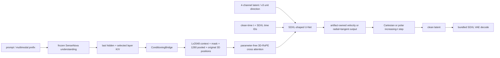

# SenseNova SDXL Chimera (`sensenova_sdxl_chimera`)

Chimera keeps SenseNova U1.5's frozen multimodal understanding branch but
replaces its pixel-space generation branch with an SDXL-shaped four-channel
U-Net and the selected SDXL donor's VAE. A trainable bridge converts the
SenseNova prefix state into the two conditioning tensors the U-Net expects.

## Components

| Role | Class/module | Ownership |
|---|---|---|
| Understanding | `NEOChatModel` loaded by `understanding.load_understanding_only` | External, content-hash-pinned SenseNova checkpoint; frozen |
| Conditioning | `ConditioningBridge` | Bundled, trainable; preserves the native prefix length at width `2048`, emits pooled `1280`, a mask, and per-token positions |
| Denoiser | diffusers `UNet2DConditionModel` | Bundled; v1/v2 equal the donor census, while v3 adds one negligible pooled mid-block radial head |
| Attention | `ChimeraAttnProcessor` | Parameter-free replacement processor with three-axis context RoPE and generation-local K/V cache |
| VAE | diffusers `AutoencoderKL` | Bundled from the same SDXL donor and content-hash-checked |
| Scheduler | `flow.py` / `pipeline_ops.py` | Increasing clean-time Cartesian Euler for v1/v2 or one-NFE polar exponential Euler for v3; no diffusers scheduler object |

The understanding loader removes `fm_modules`, every `_mot_gen` projection,
and `norm_mot_gen` before installing weights. It reads only language/vision
understanding tensors and supports the repository's plain-int8 and ConvRot-int8
SenseNova formats.

## Load path

The model path is a directory with `chimera.json`, `config.json`, and a
`model.safetensors` file or shard index. `preflight_chimera_artifact` validates
the documents, U-Net/VAE config hashes, tensor prefixes, and the external
understanding checkpoint's full content hash before payload loading. The
artifact bundles `condition_bridge.*`, `unet.*`, and `vae.*`; it must not bundle
SenseNova `_mot_gen` tensors.

`ModelLoader.detect_model_type` recognizes the directory metadata before broad
SDXL heuristics. `load_chimera_artifact` reconstructs the three bundled modules
strictly, verifies VAE content identity and U-Net census, and then selectively
loads the pinned understanding branch. Initialization is an explicit
`POST /api/v1/models/sensenova-sdxl-chimera/initialize` or example-script
operation; ordinary load and training never create an artifact implicitly.
For v3, `chimera_warmstart_source` may name a production-loadable v1/v2 Chimera
artifact. This copies its trained bridge and U-Net trunk into a new format-4
artifact, resets `conv_out` and the radial head under the requested seed, drops
the source training state, and still starts optimization at global step zero.

## Denoiser structure

Each selected SenseNova layer owns a K/V projection in the bridge. Zero-initial
gates add those residuals to the projected final hidden state, then token-wise
projections produce one cross-attention row per native prefix row. Masked pooling
produces the pooled conditioning. The original prefix `(t,h,w)` coordinates and
mask pass through without resampling. A separate learned 77-query head exists
only for CLIP-teacher alignment and is never the production U-Net context.
`ChimeraAttnProcessor` applies the declared SenseNova `2:1:1` axis split to
context keys without adding parameters.

## Tensor contract

| Property | Value |
|---|---|
| Latent | `[B,4,H/8,W/8]`, donor VAE shift/scale normalization |
| Context | `[B,L,2048]`, where `L` is the native SenseNova prefix length |
| Context mask | `[B,L]`; ragged batches right-pad to their maximum `L` |
| Pooled conditioning | `[B,1280]` |
| Added conditioning | SDXL original/crop/target time IDs |
| Position encoding | Three-axis `t:h:w = 2:1:1`, crop-aware physical coordinates |
| Time | `t=0` noise, `t=1` clean |
| Prediction | Artifact-owned: v1 direct velocity, v2 endpoint-observable residual/velocity, or v3 radial scalar plus projected tangent field |
| Spatial alignment | Width and height divisible by 8 |

The artifact stores the donor U-Net config verbatim. Builders refuse a tensor
census mismatch instead of partially transplanting weights. The VAE config and
actual extracted weights are stored together; a generic latent scaling default
is never substituted.

## Generation path

`core/pipeline_backends/sensenova_sdxl_chimera.py` owns txt2img, img2img,
inpaint, and understanding-only img2txt dispatch. Prompt conditioning is built
once, then the understanding model and bridge are offloaded before U-Net
sampling. Sequential and batch-concatenated CFG share the same conditioning
contract. Post-RoPE cross-attention K/V caches are scoped to one generation and
cleared on success or exception.

Flow sampling consumes the public timestep shift and CFG-norm controls in both
production generation and training previews. `global` CFG norm caps the guided
velocity norm at the conditional branch norm before each Euler step; `channel`
does so per latent channel. Training previews use the configured shift instead
of the sampler's neutral internal default. Dynamic CFG uses the same convention
as the other image samplers: guidance starts at `cfg_schedule_min` on the noisy
side and rises toward `cfg_schedule_max` (or the ordinary CFG scale) at the clean
side. A scheduled peak above one allocates the negative branch even when the base
CFG value itself is one.

At the exact `t=0` endpoint, v1 sampling advances the first interval with the
known velocity term `-epsilon == -latent` and does not call the U-Net or apply
CFG. Later intervals retain the learned direct-velocity path. This discrete
startup applies equally to production generation and training previews; partial
img2img that starts after `t=0` is unchanged. It prevents an unobservable paired
`x0` estimate from controlling the first Euler update without changing the v1
training target or artifact contract.

Format-4 v3 artifacts instead normalize the centered state into `(rho,n)`. The
U-Net receives unit-RMS `n` plus `log(rho)` conditioning, predicts a scalar
radial speed and a four-channel field, and projects the latter onto `n`'s
tangent space in fp32. Positive/null CFG is applied only to those tangent
fields; the positive branch's radial scalar is used at strength one. Radius is
advanced with a positive exponential update and direction with a spherical
exponential map. v3 deliberately evaluates the U-Net at `t=0` because its
conditional tangent target is nonzero. Dynamic CFG and optional norm capping
can scale only the projected tangent field.

Running training can queue an explicit CFG probe through
`POST /api/v1/training/runs/{run_id}/cfg-probe` and poll its result through the
matching `cfg-probe-queue` endpoint. The probe follows the ordinary configured
sample path and records, per timestep, conditional/unconditional separation,
raw and post-clamp guidance norms, solver update size, clean-endpoint estimates,
and latent magnitude. v3 also reports the selected radial prediction,
tangent-orthogonality error, angular displacement, and angular-cap scale. Its
zero radial-CFG delta is an equal-state guarantee; full guided trajectories may
acquire different later radial predictions after their angular states diverge.
Only bounded scalars leave the trainer process; prompts and tensors are excluded
from the diagnostic result.

Img2img uses deterministic SDEdit in the same increasing-time flow. Inpaint
uses white-as-generate latent masks and re-injects the correspondingly noised
source latent into the preserve region after every Euler step, then composites
the original pixels after VAE decode. Spatial outpaint delegates to that
inpaint route and the architecture-neutral final exact paste. I2t and ti2t end
inside the frozen understanding branch. Reference-image ti2i is structurally
supported by prefix capture but remains unadvertised until a trained checkpoint
passes its independent reference-quality suite.

## Training path

`SenseNovaSDXLChimeraArchHandler`,
`SenseNovaSDXLChimeraFullParameterAdapter`, and
`training/ops/sensenova_sdxl_chimera_ops.py` implement three full-parameter
stages:

| Stage | Trainable | Objective |
|---|---|---|
| `bridge_align` | Bridge only | Normalized hidden, hidden-RMS, and pooled alignment to the selected donor's frozen SDXL CLIP encoders |
| `unet` | Complete U-Net only | Flow-velocity MSE |
| `joint` | Bridge and complete U-Net | Flow-velocity MSE through both trainable components |

For v3, the diffusion-stage objective is the exact orthogonal sum of scalar
radial MSE and projected tangent-field MSE. Metrics retain both components,
target tangent energy, projection error, radius, and singularity counters.
Adaptive timestep is restricted to `off` or `observe` until the noise-end
irreducible tangent floor has been measured; v1/v2 adaptive behavior is
unchanged.

Understanding and VAE always stay frozen. `bridge_align` requires explicit loss
weights because no unmeasured numerical default is accepted. U-Net/joint
training requires `bridge_state="aligned"`; only a scratch U-Net may bypass
that rule through `chimera_allow_unaligned_scratch=true`, and a transplanted
U-Net may never bypass it. Checkpoints are production-loadable Chimera
directories with stage, step, epoch, metrics, and bridge-state provenance.
Debug dumps include VAE-decoded noisy, target, and predicted-x0 WebP previews;
the monitor prefers those over independently normalized latent channels.

`chimera_bridge_align_steps=N` optionally turns an `unet` or `joint` run into a
two-stage run: bridge-only for completed steps `[0,N)`, then the selected target
stage. `N` must align with gradient accumulation. The optimizer owns the union
of the two stage groups from startup, while gradient enablement switches exactly
at the boundary, so resume retains the same optimizer-group structure. This
explicit schedule may proceed from an unaligned scratch artifact but does not
replace the held-out gate for `sdxl_transplant` and does not claim that gate
passed; its status remains separately recorded.

## Hook points

- Attention backend selection is installed through
  `install_chimera_attention_processors`; the checkpoint-fixed positional
  processor remains the owner of three-axis RoPE.
- CFG-null resolution uses the encode-stage empty prompt.
- Gradient checkpointing attaches to the U-Net. Block swap, generation-time
  adapters, ControlNet, NAG, FBCache, spectrum forecasting, VAE override, and
  tiled decode are explicitly refused by the capability table.
- Resident full-parameter runs use fused backward with the supported Adafactor,
  AdamW8bit, and ring-buffer optimizers. This makes
  `fused_grad_clip_factor` active; staged runs register hooks for the union of
  future trainable groups before stage-exact gradient enablement begins.
- Pixel-teacher REPA is available in `unet` and `joint`. It aligns one of the
  donor-shaped U-Net's deepest-down, mid, or first-up spatial maps through the
  shared trainable projector. `bridge_align` is refused because its U-Net is
  frozen, and `latent_stem` remains refused for the bundled donor VAE.
- Directory checkpoint discovery, size accounting, rotation, and resume use
  the shared trainer machinery with Chimera's directory artifact writer.
- Component staging is explicit in the backend; Chimera is not in the generic
  keep-hot path.
- Next-batch prefix prefetch is enabled by default for live-conditioning stages.
  It stores only frozen raw hidden/KV/mask/position tensors and applies the
  current bridge on the main thread, so `bridge_align`/`joint` remain fresh.
  `auto` selects a separate CUDA stream only when off-device weights plus 10 GiB
  headroom fit, else pinned CPU; depth defaults to 1. Cached `unet` training
  skips this redundant worker.
  The released geometry stores about 24 KiB/token; a real RTX 6000 Ada probe
  measured 0.45--0.52 MiB for 19--22-token text prefixes and 88 ms steady-state
  GPU capture after warmup (2026-09-17).
- U-Net and bridge execution use bf16 in the measured configuration, while the
  bundled SDXL VAE executes in fp16. Its artifact tensors are stored in fp32
  and retain their exact identity across training checkpoints; encode/decode
  casts happen only at the runtime boundary.

## Constraints

- Legacy artifact format 2 carries direct-flow-velocity prediction. Format 3
  adds an explicit prediction contract and can carry the v2 endpoint-observable
  residual declaration. Format 4 is exclusively `polar_tangent_flow` and adds
  the radial-head config and artifact-owned polar solver contract. All formats
  accept the dense SenseNova understanding branch only.
- The external understanding file must still match its pinned content hash at
  every preflight; filename and mtime are not identity.
- Only `full_finetune` is supported. LoRA/adapter, Relora, and ControlNet
  training are refused.
- Transplanted diffusion training is illegal before the held-out bridge
  alignment gate has passed and been recorded.
- Held-out threshold registration and reference-ti2i quality remain measured
  gates. Real bootstrap and peak-memory/time measurements are recorded in the
  handoff and model-facts documents. The code does not infer or promote a
  bridge from training loss.

The detailed invariants and acceptance sequence live in
`docs/guides/SENSENOVA_SDXL_CHIMERA_DESIGN.md`; current shipped facts and local
bootstrap status are recorded in `docs/guides/MODEL_FACTS.md` and
`docs/plans/SENSENOVA_SDXL_CHIMERA_HANDOFF.md`. The incompatible v2
endpoint-observable contract is specified separately in
`docs/guides/SENSENOVA_SDXL_CHIMERA_V2_DESIGN.md`. The implemented format-4
polar/tangent-CFG contract and its still-pending measured gates live in
`docs/guides/SENSENOVA_SDXL_CHIMERA_V3_DESIGN.md`. Format-4 artifacts select
either the original terminal-flat cubic angular path or the endpoint-flat,
late-peaking Beta(3,2) path. The latter takes its exact `-noise` first solver
step analytically and begins learned conditioning on the following interval.
