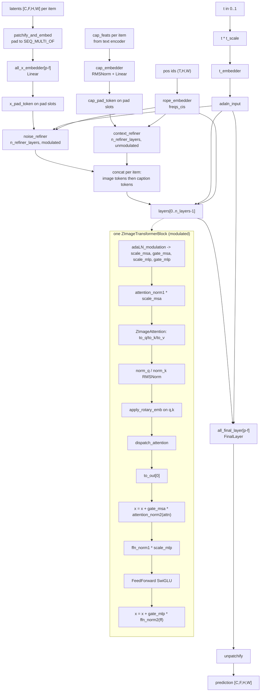

# Z-Image (`zimage`)

Single-stream image DiT (arch key `zimage`, `ModelType` in `backend/core/model_loader.py`). The denoiser
is `core.models.zimage_transformer.ZImageTransformer2DModel`, a plain `nn.Module` (no diffusers
`ConfigMixin`), whose `forward` takes **lists of variable-length tensors**, not a batched tensor, and
concatenates image and caption tokens into ONE unified self-attention sequence with the image tokens as
the **prefix**. Two structural facts separate it from every other image arch in this repo: (1) the
per-item sequences are padded to a multiple of `SEQ_MULTI_OF` and carry a learned pad token
(`x_pad_token` / `cap_pad_token`), and (2) two small pre-refiner stacks (`noise_refiner`,
`context_refiner`) run over image-only and caption-only tokens *before* the joint stack.

## Components

| Role | Class | Module | Notes |
|---|---|---|---|
| Denoiser | `ZImageTransformer2DModel` | `core/models/zimage_transformer.py` | Vendored (standalone re-implementation living directly in `core/models/`, not a package). Block-swap, FBCache, NAG, NegPip and style hooks are baked into its `forward`. |
| Transformer block | `ZImageTransformerBlock` | `core/models/zimage_transformer.py` | Used for `layers`, `noise_refiner` (`modulation=True`) and `context_refiner` (`modulation=False`). |
| Attention | `ZImageAttention` | `core/models/zimage_transformer.py` | `to_q`/`to_k`/`to_v` + `to_out` (a `ModuleList` of length 1). Class attrs `_attention_backend`, `_nag_ctx`, `_negpip_ctx`; instance attrs `_style_ctx`, `block_idx`. |
| Norm / MLP | `RMSNorm`, `FeedForward` | `core/models/zimage_transformer.py` | SwiGLU-style `w2(silu(w1 x) * w3 x)`, `hidden_dim = int(dim / 3 * 8)`. |
| Timestep embed | `TimestepEmbedder` | `core/models/zimage_transformer.py` | Sinusoidal (`FREQUENCY_EMBEDDING_SIZE = 256`, `MAX_PERIOD = 10000`) → 2-layer MLP with `mid_size=1024`. |
| Output head | `FinalLayer` | `core/models/zimage_transformer.py` | `LayerNorm` (no affine) → adaLN scale → `Linear`. One per patch-size key in `all_final_layer`. |
| Positional | `RopeEmbedder` | `core/models/zimage_transformer.py` | 3-axis complex RoPE, `precompute_freqs_cis` cached on the instance. |
| Batching wrapper (training) | `BatchedZImageWrapperOptimized` (subclass of `BatchedZImageWrapper`) | `core/models/batched_zimage_wrapper.py` | Re-implements the whole forward with batched tensors; bypasses `ZImageTransformer2DModel.forward` entirely. Only the `Optimized` subclass is instantiated (`training/ops/zimage_ops.load_components`). |
| Text encoder | resolved by `transformers.AutoModel.from_pretrained(..., trust_remote_code=True)` | `core/model_loader.py` (`load_zimage_from_comfy_safetensors`) | Concrete class comes from the base repo's `text_encoder/config.json`; the code pins no class. Qwen chat template is applied by the callers. |
| Tokenizer | `transformers.AutoTokenizer` | `core/model_loader.py` | Loaded from the base repo's `tokenizer/`, falling back to `text_encoder/`. |
| VAE (16-ch path) | `diffusers.AutoencoderKL` | re-exported by `core/models/zimage_autoencoder.py` | Built field-by-field from the base repo's `vae/config.json`; if absent, from the shared flux1 store via `core.models.common.vae_store.resolve_vae_dir("flux1")`. |
| VAE (4-ch path) | `diffusers.AutoencoderKL` | `core/model_loader.py` | Selected when the checkpoint's `x_embedder` implies `in_channels == 4`; loaded from `madebyollin/sdxl-vae-fp16-fix`. Reported as `vae_type: "sdxl"`. |
| Scheduler | `FlowMatchEulerDiscreteScheduler` | re-exported by `core/models/zimage_scheduler.py` | Constructed from the base repo's `scheduler_config.json`. Per-request substitution in `ZImageMixin._get_zimage_scheduler`. |
| Quantized Linear | `Int8Linear`, `Fp8Linear` | `core/models/ideogram4/vendor/int8_linear.py`, `.../fp8_linear.py` | Vendored under the Ideogram 4 package; Z-Image reuses them via `ModelLoader._swap_zimage_quantized_linears`. |

`core/models/flux_vae_wrapper.py` (`FluxVAEWrapper`) is **not** built by any Z-Image load path — the only
constructor call is its own `get_flux_vae` helper, which nothing calls (elsewhere, only
`PipelineManager._apply_vae_tiling` mentions the type when walking a possible `.vae` attribute).

## Load path

Entry: `ModelLoader.load_zimage_from_comfy_safetensors(file_path, device, torch_dtype, base_model_repo="Tongyi-MAI/Z-Image-Turbo")`.
`ModelLoader.load_zimage_from_diffusers` is a thin front door: given a `.safetensors` file it delegates
here; given a **directory it raises `NotImplementedError`** — there is no diffusers-directory Z-Image
loader. `ModelLoader.load_from_safetensors` routes `model_type == "zimage"` to the same function.

Detection (`ModelLoader.detect_model_type`):
* Shard index (`<stem>.safetensors.index.json`): `metadata["model_type"]` via `_map_model_type_string`
  (accepts `zimage`, `z-image`), else all three of `cap_embedder`, `t_embedder`, `context_refiner` must
  appear as key prefixes in `weight_map`.
* Single `.safetensors`: `metadata["model_type"] == "zimage"` first; otherwise the key-signature
  fallback needs `cap_embedder` + `t_embedder` + `context_refiner` **and** `x_embedder` or
  `all_x_embedder`, and must not have matched the earlier `model.diffusion_model.` (SD/SDXL) probe.
* Directory: `transformer/config.json` containing both `axes_dims` and `rope_theta`. (This branch only
  makes `detect_model_type` answer `"zimage"`; the loader still refuses the directory.)

Accepted key layouts, decided by `ModelLoader._normalize_zimage_state_dict`, which returns
`(transformer_sd, vae_sd, te_sd, layout)`:
* `"comfy"` — fused `attention.qkv.weight`, `.out.weight`, `.q_norm`/`.k_norm`, single-resolution
  `x_embedder.` / `final_layer.`. Rewritten by `ModelLoader._convert_comfy_to_official_state_dict`,
  which chunks qkv into `to_q`/`to_k`/`to_v` by `n_heads`/`n_kv_heads`/`head_dim` and remaps the
  embedders under the fixed resolution key `"2-1"`.
* `"official"` — split `.to_q.weight` and/or `all_x_embedder.` / `all_final_layer.`; what a live
  module's `state_dict()` and every sushiUI save produce. Conversion is skipped.
The function also strips a `model.diffusion_model.` prefix and splits out embedded
`first_stage_model.*` (VAE) and `text_encoders.<name>.*` (TE) sections, which
`ModelLoader._reattach_embedded_weights` re-applies over the downloaded base components.

Sharded files load transparently: the read goes through
`core.models.common.single_file_format.read_state_dict`, which accepts either a plain `.safetensors`
or a `<stem>.safetensors.index.json`.

Geometry: the config is `transformer/config.json` snapshot-downloaded from `base_model_repo`;
`n_layers` is then **re-derived** from the maximum `layers.<i>.` index in the checkpoint (so pruned
depths load), and `in_channels` is re-derived from the `x_embedder` weight shape divided by
`patch_h * patch_w`. Build + load is `ModelLoader._build_zimage_transformer_from_state`, which
constructs on the `meta` device and loads with `strict=True, assign=True`.

Quantized flavours (`core.models.common.quantized_checkpoint_guard`):
* `scaled_quantization_report` non-`None` (int8/e4m3 weights **with** per-row `.weight_scale`) →
  `ModelLoader._swap_zimage_quantized_linears` replaces the matching `nn.Linear`s with `Int8Linear` /
  `Fp8Linear` inside a `meta` device context, then `verify_quantized_swap` refuses the load if the
  swapped count disagrees with the census. INT8 and e4m3 are detected independently because an int8
  artifact is mixed.
* Float8 weights with **no** scales → `cast_float8_tensors` casts to `torch_dtype` before the load
  (mandatory because the load is `assign=True`).

Refusals:
* A quantized checkpoint in the ComfyUI fused-qkv layout raises `RuntimeError` in
  `_build_zimage_transformer_from_state` (the qkv split would slice a per-row `weight_scale`).
* Missing `Int8Linear`/`Fp8Linear` support re-raises rather than silently loading codes as weights.
* A diffusers directory raises `NotImplementedError` (above).

On-disk export layout: `EXPORT_LAYOUTS["zimage"]` in `core/models/common/quantized_export.py` —
module `("transformer", "")`, i.e. **empty prefix**, which is a hard requirement because a
metadata-less ComfyUI file is recognised only by the key-signature fallback and the
`model.diffusion_model.` spelling is claimed earlier by the SD/SDXL branch.

## Denoiser structure

Walk-through. `ZImageTransformer2DModel.forward(x, t, cap_feats, patch_size, f_patch_size)` takes `x`
and `cap_feats` as **lists**. `patchify_and_embed` turns each `[C,F,H,W]` latent into
`[(F/pF)(H/pH)(W/pW), pF*pH*pW*C]` tokens, pads both the image and caption sequences up to a multiple
of `SEQ_MULTI_OF`, and builds the 3-axis position ids: caption ids start at `(1,0,0)` and run along the
first axis over the *padded* caption length (so caption pad slots keep sequential ids); image ids start
at `(cap_padded_len + 1, 0, 0)` and enumerate the `(F,H,W)` token grid, and the image padding slots get
`(0,0,0)`. `all_x_embedder[f"{patch_size}-{f_patch_size}"]` projects image patches to
`dim`; `cap_embedder` (an `RMSNorm` + `Linear` `nn.Sequential`) projects caption features. Pad slots are
overwritten with `x_pad_token` / `cap_pad_token`.

`noise_refiner` blocks are `ZImageTransformerBlock(modulation=True)` and see image tokens only;
`context_refiner` blocks are `modulation=False` and see caption tokens only. The two streams are then
concatenated per item as `[image; caption]` (image first — the style-context stamping block inside
`forward` records `img_start = 0`, `img_end = x_item_seqlens[0]`; there is no `_stamp_style_context`
method on this class, unlike Krea2/Lens/Anima), padded into a batch, and run through `self.layers`.
`FinalLayer` applies `norm_final` scaled by `1 + adaLN_modulation(c)` then a `Linear` back to
`patch*patch*f_patch*out_channels`, and `unpatchify` restores `[C,F,H,W]`. The return is
`(list_of_tensors, {})`.

`BatchedZImageWrapperOptimized.forward` reproduces all of the above on dense batched tensors (its own
`batched_patchify` / `batched_unpatchify`), calling the same submodules (`t_embedder`,
`all_x_embedder`, `rope_embedder`, `noise_refiner`, `cap_embedder`, `context_refiner`, `layers`,
`all_final_layer`) — it does **not** call `ZImageTransformer2DModel.forward`, so the NAG / NegPip /
style / FBCache branches in that forward are unreachable from the training path.

## Tensor contract

| Aspect | Value | Source symbol |
|---|---|---|
| Latent channels | 16 (declared) | `ZIMAGE_WIRING.latent_channels` (defined in `core/models/components/wiring.py`, re-exported by `core/training/components/wiring.py`, consumed via `ZImageArchHandler.wiring`); class default `ZImageTransformer2DModel(in_channels=16)` |
| Latent channels (actual) | re-derived from the `x_embedder` weight shape / `patch_h*patch_w`; `4` selects the SDXL VAE branch | `load_zimage_from_comfy_safetensors` |
| Spatial downscale | VAE `2 ** (len(block_out_channels) - 1)` (8 for both VAEs used), times `patch_size` 2 → 16 px per token | `ZImageMixin._zimage_denoising_loop` (`vae_scale = vae_scale_factor * 2`); `ZImageArchHandler.pixel_align = 16` |
| Temporal | `f_patch_size = 1`; the pipeline adds a singleton frame axis (`unsqueeze(2)`) and the trainer does the same | `ZImageMixin._zimage_denoising_loop`, `training/ops/zimage_ops.train_step` |
| VAE scale/shift | encode `scaling_factor * (sample - shift_factor)`; decode `latents / scaling_factor + shift_factor` | `training/ops/zimage_ops.vae_encode`, `ZImageMixin._zimage_decode_latents`; `ZIMAGE_WIRING.vae_norm = "shift_scale"` (`core/models/components/wiring.py`) |
| Text embedding | penultimate hidden state (`hidden_states[-2]`) of the causal LM. Inference slices by the attention mask so each item keeps only its real tokens (variable length); training returns the padded 512-token embedding plus its mask and the batched wrapper trims by that mask | `ZImageMixin._zimage_encode_single`; `training/ops/zimage_ops.encode_prompt` + `BatchedZImageWrapperOptimized.batched_patchify` |
| Text embedding width | `cap_feat_dim`; the class default is **2560** and the loader passes `transformer_config["cap_feat_dim"]` from the base repo config. The value carried by any real checkpoint is not in this repo. | `ZImageTransformer2DModel.__init__`, `_build_zimage_transformer_from_state` |
| Pooled / auxiliary cond | none — `ZIMAGE_WIRING.te_pooled_dim = None`, `added_cond = None`; the only global conditioning is the timestep embedding | `core/models/components/wiring.py` |
| Positional encoding | 3-axis complex RoPE over `(T, H, W)`; `ROPE_AXES_DIMS = [32, 48, 48]`, `ROPE_AXES_LENS = [1536, 512, 512]`, `ROPE_THETA = 256.0`; applied to q and k only, in `apply_rotary_emb` | `core/models/zimage_transformer.py` module constants, `RopeEmbedder` |
| Head geometry | `head_dim = dim // n_heads`, and `assert head_dim == sum(axes_dims)` — with the class defaults `dim=3840`, `n_heads=n_kv_heads=30` → `head_dim = 128 = 32+48+48` | `ZImageTransformer2DModel.__init__` |
| Timestep (inference) | scheduler timestep `t` in `[0, 1000]`, fed to the model as `(1000 - t) / 1000`, then multiplied by `t_scale = 1000.0` inside `forward` | `ZImageMixin._zimage_denoising_loop`, `ZImageTransformer2DModel.forward` |
| Timestep (training) | `t` sampled directly in `[0, 1]` with `x_t = (1-t)·x_0 + t·noise` (t=0 clean, t=1 noise), passed unmodified | `training/ops/zimage_ops.train_step`, `base_trainer.add_noise_unified` |
| Prediction target | `target = latents - noise` — the **inverted** velocity convention; inference negates the model output (`noise_pred = -noise_pred.squeeze(2)`) before the scheduler step | `training/ops/zimage_ops.train_step`, `ZImageMixin._zimage_denoising_loop` |
| `x_0` reconstruction | training: `x_0 = x_t + t · v`; inference preview: `x_0 = x_t - t_norm · noise_pred` (after the sign flip) | `training/ops/zimage_ops.train_step`, `ZImageMixin._zimage_denoising_loop` |

**INFERRED**: the two timestep expressions above point in opposite directions — the sampling loops
(inference *and* `zimage_ops.generate_sample`, which repeats `(1000 - timestep)/1000`) feed `1 - σ`,
while `train_step` feeds `σ`. Both are read verbatim from code; the consequence is a reasoned reading,
not a measurement.

## Generation path

Backend mixin: `ZImageMixin` in `core/pipeline_backends/zimage.py`, mixed into the pipeline manager.
Entry points `_generate_txt2img_zimage`, `_generate_img2img_zimage`, `_generate_inpaint_zimage`; all
three converge on `ZImageMixin._zimage_denoising_loop`, which is the sampling loop (there is no shared
`custom_sampling_loop` involvement). Decode is `ZImageMixin._zimage_decode_latents`.

Stages, in order: `_zimage_runtime_int8` → `_zimage_encode_prompt` (+ `_zimage_encode_nag_negative`) →
block-swap setup or `move_zimage_transformer_to_gpu` → optional style-reference encode
(`_zimage_style_configs`) → `_zimage_denoising_loop` → `_zimage_decode_latents`. img2img and inpaint
pass `init_latents` / `timesteps_override`, and inpaint additionally passes `mask_latent` +
`original_latents`, which the loop blends after every scheduler step (re-noising the kept region to the
next timestep with flow-matching interpolation).

CFG shape: **batched, one transformer forward per step**. `do_classifier_free_guidance` is
`abs(cfg-1) > 1e-5 and abs(cfg) > 1e-5`; a hard-coded `cfg_truncation = 1.0` drops the effective scale
to 1.0 for `t_norm > cfg_truncation`. The latent batch is repeated and the caption list concatenated:

| Case | latent repeat | caption groups |
|---|---|---|
| CFG on, NAG off | 2× | `[negative, positive]` |
| CFG on, NAG on | 3× | `[negative, positive, nag_negative]` |
| CFG off, NAG off | 1× | `[positive]` |
| CFG off, NAG on | 2× | `[positive, nag_negative]` |

Combination is `pred = neg + scale * (pos - neg)`. NAG is applied inside attention (not as a third CFG
term): `ZImageAttention._nag_ctx`, installed per forward from `transformer._nag_request`. Arch-specific
generation stages: reference-style KV injection (`_zimage_style_step`, which handles both the single-
and multi-reference cases and bypasses the batched CFG path for the active steps) and Spectrum output
forecasting
(`core.inference.spectrum_forecaster.build_output_forecaster`).

## Training path

Adapters: `ZImageLoRAAdapter` and `ZImageFullParameterAdapter` in
`core/training/adapters/zimage_adapter.py`. Arch handler: `ZImageArchHandler`
(`core/training/arch/zimage.py`, registered as `"zimage"` in `core.training.arch.ARCH_REGISTRY`),
whose method bodies live in `core/training/ops/zimage_ops.py`.

Default trainable set:
* LoRA — transformer only. `apply_lora_to_text_encoders` returns 0 unconditionally, so the text encoder
  is frozen even if requested.
* Full FT — transformer when `train_unet`; text encoder when `train_text_encoder`; VAE always frozen
  (`prepare_models_for_training`).

LoRA targets: every module whose class name is `ZImageAttention` — attributes `to_q`, `to_k`, `to_v`
and `to_out[0]`. Wrappability is tested with `is_lora_wrappable_linear` (not `isinstance(nn.Linear)`),
so `Int8Linear` / `Fp8Linear` bases are still wrapped. The layer type is `LoRALinearLayer` from
`core.adapters`.

Saved LoRA key format (`ZImageLoRAAdapter.save_checkpoint`):
`lora_transformer_{module_path_with_dots_replaced_by_underscores}_{attr}.lora_down.weight` / `.lora_up.weight`,
metadata `model_type: "zimage"`. **No `alpha` tensor is written** (unlike the FLUX.2 adapter).

Note a divergence that matters when moving a LoRA between train and inference: the Z-Image *inference*
loader `ZImageMixin._load_lora_zimage` looks up `transformer.{module_path}.{attr}.lora_down.weight`
(dotted, `transformer.` prefix), which is not the spelling `ZImageLoRAAdapter.save_checkpoint` emits.
Both key builders are verbatim in the two files named.

Full-FT save (`ZImageFullParameterAdapter.save_checkpoint`): transformer under
`model.diffusion_model.`, VAE under `first_stage_model.` (only when `resolve_bundle_vae` says so), text
encoder under `text_encoders.qwen3.`; written through
`core.models.common.single_file_format.save_single_file_state` so >10 GB saves auto-shard. No
`transformer_config` JSON is written — `ZImageTransformer2DModel` has no serialisable config.

Refusals / gates:
* `reject_quantized_base(...)` in both `prepare_models_for_training` and `setup_trainable_parameters`
  of the full-parameter adapter — a weight-only quantized base cannot be full-fine-tuned. The guard
  unwraps `BatchedZImageWrapper` first.
* `training/ops/zimage_ops.load_components` raises `ValueError` if `blocks_to_swap > 0` and the
  transformer has no `layers` attribute.
* `ControlNetTrainer` raises `ValueError` for Z-Image ("ControlNet training is only supported for SD1.5
  and SDXL models").
* `disable_scaled_mm` / `disable_int8_mm` are applied to the transformer and text encoder at load, so a
  quantized base trains dequant-only.

## Hook points

| Hook | Owner symbol | Notes |
|---|---|---|
| Attention conduit entry | `core.zimage_utils.dispatch_attention` → `core.attention.dispatch.dispatch_attention` | Called from `ZImageAttention.forward`; layout is `BSHD`. |
| Attention backend selection (inference) | `core.models.zimage_transformer.set_zimage_attention_backend` | Sets `_attention_backend` on **every** live `ZImageAttention` class object (the module exists under both `zimage_transformer` and `core.models.zimage_transformer`). |
| Attention backend selection (training) | `core.training.ops.zimage_ops.setup_attention_backend` | Same dual-module write, via `trainer._resolve_training_backend`. |
| SLA | `core.attention.config._PASSTHROUGH` / `core.attention.dispatch._dispatch_passthrough` | `"sla"` is preserved verbatim by `normalize_backend` and short-circuited before registry resolution, but **no SLA kernel is present in this build** — `_dispatch_passthrough` falls back to native math. There is no `proj_l` module and no SLA-specific Z-Image code. |
| Block swap boundary (inference) | `transformer._block_offloader` consumed inside `ZImageTransformer2DModel.forward` (`wait_for_block(layer_idx)` / `submit_move_blocks_forward(layer_idx)`); built by `core.memory_management.create_block_offloader_for_model` | Detected as `"zimage"` by `memory_management.transformer_registry.detect_transformer_architecture` (a `layers` list whose first element's class name contains `ZImage`). The attribute is never cleared — `_zimage_runtime_int8`'s `precheck` tears down a stale one. |
| Block swap boundary (training) | `core.memory_management.LayerOffloadConductor` over `transformer_original.layers`, wired in `training/ops/zimage_ops.load_components` | Attached as `transformer_original._layer_offload_conductor` and driven by its own `register_hooks()`, NOT through `_block_offloader` — the `_block_offloader` branch in `BatchedZImageWrapperOptimized.forward` is never armed by the training path. `enable_activation_offload=False` is hard-coded there. |
| FBCache indicator | `transformer._fbcache` / `transformer._fbcache_step`, branch inside `ZImageTransformer2DModel.forward`; built by `ZImageMixin._zimage_denoising_loop` from `core.inference.fbcache.build_fbcache` | Indicator = residual of `layers[0]` over the **full unified [image; caption]** hidden state; a hit reuses the cached full residual and skips `layers[1:]`. |
| Quantized Linear swap (load) | `ModelLoader._swap_zimage_quantized_linears` + `verify_quantized_swap` | Int8 and e4m3 detected and swapped independently. |
| Quantized Linear swap (runtime) | `ZImageMixin._zimage_runtime_int8` → `core.vram_optimization.apply_runtime_int8_quantization` | Only `unet_quantization == "int8"`; must run after the LoRA gate and before the block offloader. `zimage` is in `core.models.common.int8_runtime_quantize.RUNTIME_INT8_ARCHS`. |
| FP8 cast path | `core.vram_optimization.move_zimage_transformer_to_gpu` | The `fp8_e4m3fn` / `fp8_e5m2` values; the loop detects the result with `float8_weight_linear_count` and wraps the forward in `torch.autocast`. |
| Keep-hot residency | `core.keep_hot` (`is_resident`, `mark_resident`, `discard_resident`, `should_keep_resident`, `invalidate_if_model_changed`) used in the three `_generate_*_zimage` paths; teardown in `ZImageMixin._zimage_cleanup(gen_succeeded, keep_te, keep_transformer, keep_vae)` | Transformer residency is suppressed when LoRAs or block swap are active. |
| Activation offload / dispatch | `BaseTrainer` (`activation_dispatcher`, `core.memory_management.ActivationDispatcher`, `offload_activations`) | Arch-agnostic — no Z-Image-specific entry; suppressed when a `LayerOffloadConductor` already offloads activations. |
| Gradient checkpointing | `ZImageTransformer2DModel.enable_gradient_checkpointing` (sets `self.gradient_checkpointing`), forwarded by `BatchedZImageWrapper.enable_gradient_checkpointing` | Applied per `layer` via `torch.utils.checkpoint.checkpoint(..., use_reentrant=False)`. |
| NAG | `ZImageAttention._nag_ctx`, installed from `transformer._nag_request` inside `forward`; `core.inference.nag_zimage` | Joint `layers` only — refiners are excluded. |
| NegPip | `ZImageAttention._negpip_ctx`, installed from `transformer._negpip_request`; `core.inference.negpip_zimage` | Signed per-token scaling of the caption portion of `V`, before qk-norm/RoPE. |
| Reference-style KV injection | `ZImageAttention._style_ctx` + `block_idx`, stamped by `ZImageTransformer2DModel` on `self.layers`; `core.inference.reference_style`, driven by `ZImageMixin._zimage_style_step` | Applied strictly after qk-RMSNorm and RoPE; image tokens are the sequence PREFIX here. |
| Arch-specific wrapper | `BatchedZImageWrapperOptimized` (training only) | Replaces the whole forward; the inference-only hooks listed above are bypassed. |

## Constraints

| Constraint | Enforcing symbol |
|---|---|
| `head_dim` must equal `sum(axes_dims)` | `assert head_dim == sum(axes_dims)` in `ZImageTransformer2DModel.__init__` |
| Every per-item image and caption sequence length must be a multiple of `SEQ_MULTI_OF` (32) | `assert all(_ % SEQ_MULTI_OF == 0 ...)` in `ZImageTransformer2DModel.forward`; padding produced by `patchify_and_embed` |
| The batched training wrapper pads to **64**, not 32 | `BatchedZImageWrapperOptimized.__init__` sets `self.SEQ_MULTI_OF = 64` (its own constant, independent of the module-level `SEQ_MULTI_OF = 32`) |
| `patch_size` / `f_patch_size` must be present in `all_patch_size` / `all_f_patch_size` | `assert patch_size in self.all_patch_size` in `forward` |
| `len(all_patch_size) == len(all_f_patch_size)` | `assert` in `__init__` |
| Pixel alignment 16 for training canvases | `ZImageArchHandler.pixel_align = 16`, consumed by `BaseTrainer._arch_pixel_align` / `_assert_item_pixel_align` |
| Latent grid derived as `2 * (size // (vae_scale_factor * 2))` | `ZImageMixin._zimage_denoising_loop` |
| Quantized checkpoint must be in the official (split-qkv) layout | `RuntimeError` in `ModelLoader._build_zimage_transformer_from_state` |
| Diffusers-directory checkpoints unsupported | `NotImplementedError` in `ModelLoader.load_zimage_from_diffusers` |
| Full FT refuses a weight-only quantized base | `reject_quantized_base` in `ZImageFullParameterAdapter` (both methods) |
| ControlNet training unsupported | `ControlNetTrainer` type check (`is_zimage`) |
| FBCache is mutually exclusive with Spectrum, block swap and style transfer | gating block in `ZImageMixin._zimage_denoising_loop` |
| Style transfer bypasses (and is mutually exclusive with) the batched-CFG fast path and Spectrum for its active steps | `style_active_step` branch in `ZImageMixin._zimage_denoising_loop` |
| Block swap requires a `layers` attribute (training) | `ValueError` in `training/ops/zimage_ops.load_components` |
| `blocks_to_swap` clamped to `[0, len(layers) - 1]` | `create_block_offloader_for_model` |
| torchao / tensor-subclass Linear weights are not offloaded by block swap | warning in `create_block_offloader_for_model` |
</content>
</invoke>
